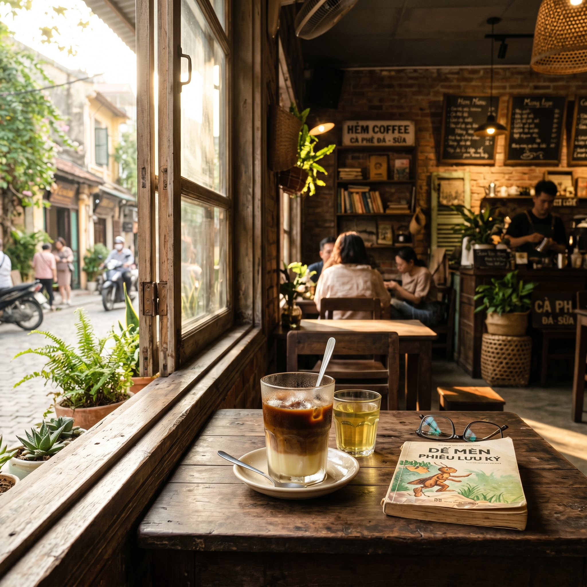
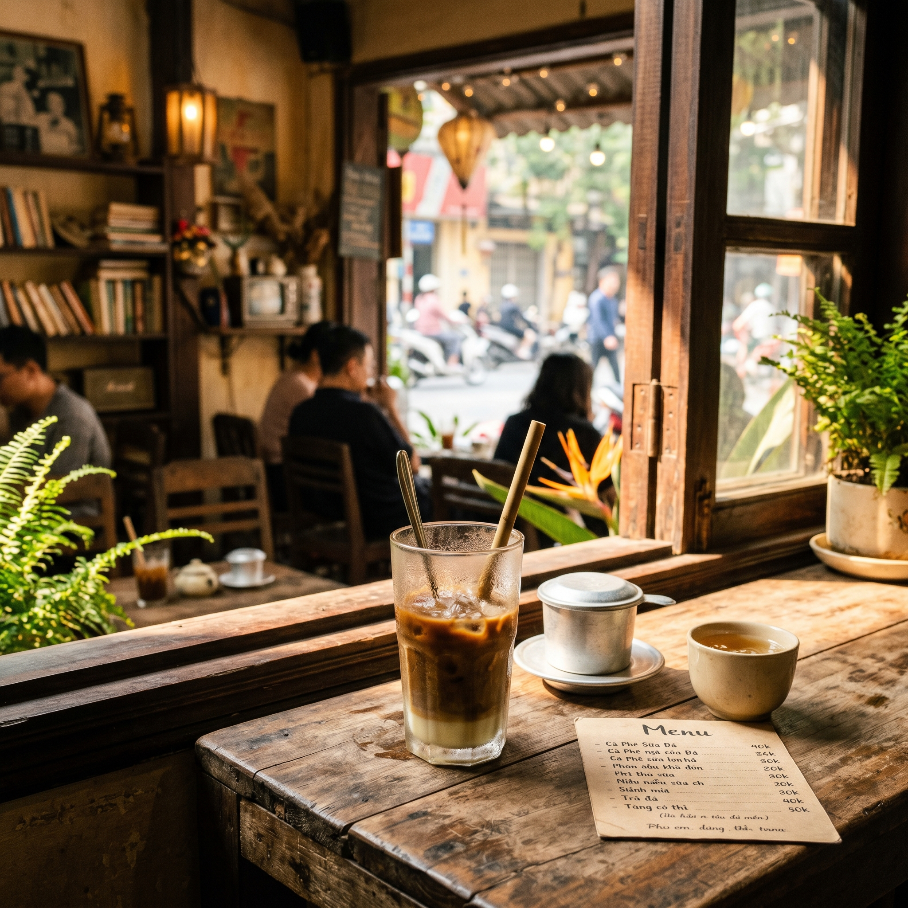
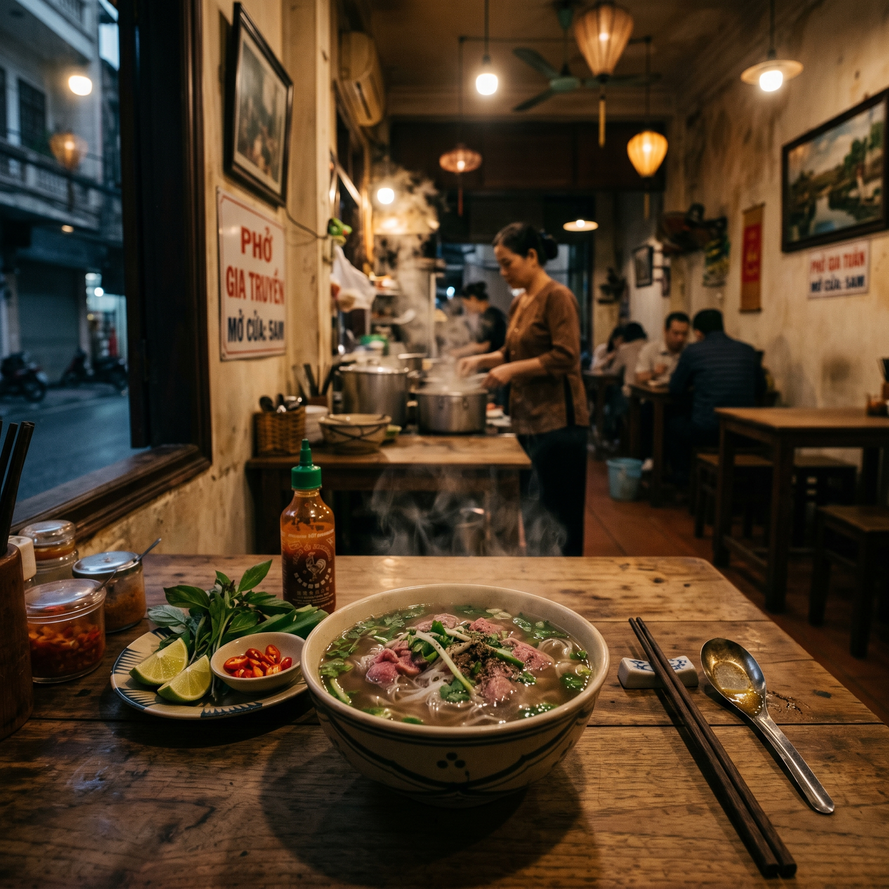
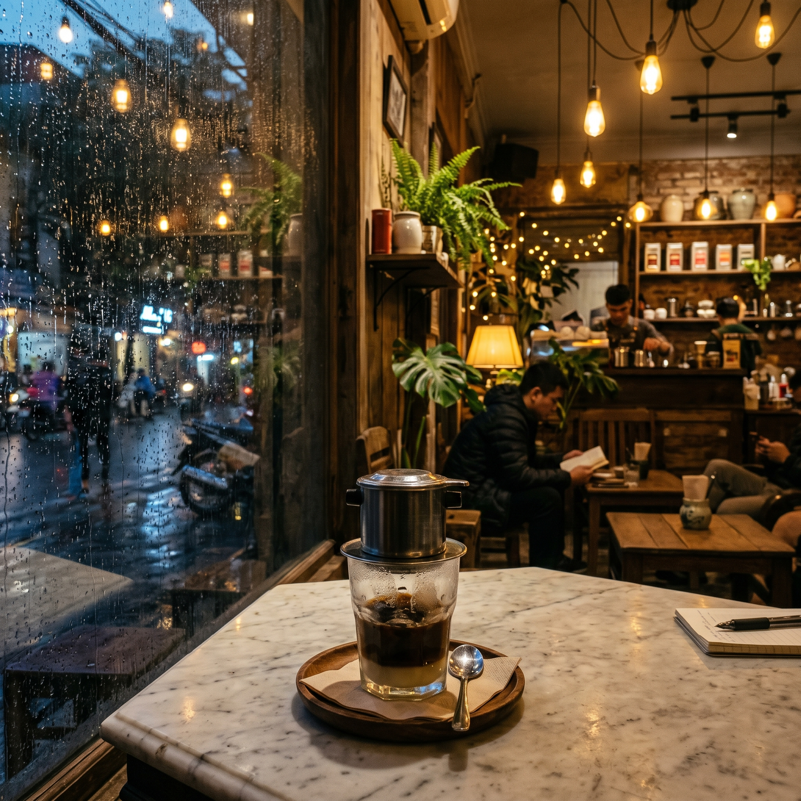

# Day 1 — Giới thiệu 0ai.vn: Vì sao một nền tảng tổng hợp lại tiện hơn?

> 🟢 **Level:** Newbie — không cần biết gì về AI từ trước
> ⏱️ **Thời gian đọc:** 10 phút | **Thực hành:** 20 phút
> 📅 **Ngày 1/30**

---

## 🎯 Mục tiêu hôm nay

Sau bài này, bạn sẽ:
- Hiểu **0ai.vn là gì** và nó khác gì so với việc dùng riêng từng tool AI
- Tạo được **bức ảnh AI đầu tiên** trong vòng 5 phút
- So sánh được **2 model phổ biến**: Nano Banana 2 vs Image 2
- Biết nên **bắt đầu từ đâu** trong 30 ngày tới

---
## 📖 Phần 1 — 0ai.vn là gì?

Hiện nay nếu muốn dùng AI tạo ảnh và video, bạn sẽ gặp một vấn đề: mỗi model nằm ở một chỗ khác nhau.

- Muốn ảnh chân thực? → Flux trên Replicate
- Muốn chỉnh sửa ảnh? → Nano Banana trên Google AI Studio
- Muốn poster có chữ? → Ideogram
- Muốn làm video? → Seedance / Kling / Veo
- Mỗi tool 1 tài khoản, 1 cách trả tiền, 1 giao diện riêng → đau đầu.

**0ai.vn giải quyết điều này:** một nền tảng, một tài khoản, gom tất cả các model phổ biến vào cùng một chỗ. Bạn trả credit chung, dùng giao diện thống nhất, dễ so sánh kết quả giữa các model.

> 💡 **Ví von:** Nếu Flux/Midjourney/Seedance là từng quán ăn riêng, thì 0ai.vn là food court — gọi đủ món tại 1 chỗ.

---

## 📖 Phần 2 — Tạo bức ảnh đầu tiên (5 phút)

### Bước 1: Truy cập và đăng ký
Vào **[0ai.vn](https://0ai.vn)** → đăng ký bằng Google (nhanh nhất).

### Bước 2: Vào mục "Tạo ảnh"
Sau khi đăng nhập, ở menu chính chọn **Tạo ảnh** (Image Generation).

### Bước 3: Chọn model
Mới bắt đầu mình recommend **Nano Banana 2** — model mạnh nhất hiện tại trên 0ai.vn, hiểu prompt cực tốt và xuất ảnh chân thực.

Nếu credit có hạn hoặc muốn tạo nhanh nhiều ảnh để brainstorm → chọn **Image 2** (nhẹ, ổn định, kết quả nhất quán).

### Bước 4: Nhập prompt mẫu
Copy prompt này (đã có trong [`/prompts/day-01.txt`](../prompts/day-01.txt)):

```
A cozy Vietnamese coffee shop in the early morning, warm sunlight 
streaming through the window, a cup of cà phê sữa đá on the wooden 
table, vintage aesthetic, soft bokeh background, photorealistic, 
high detail
```

### Bước 5: Nhấn Generate
Đợi 5-15 giây. Bạn sẽ có ảnh đầu tiên 🎉

---

## 📖 Phần 3 — So sánh Nano Banana 2 vs Image 2

Mình đã test **4 prompt khác nhau** trên cả 2 model, mỗi prompt sinh 4 ảnh và pick ảnh đẹp nhất. Đây là kết quả:

### 🎨 Prompt 1 — Coffee shop tiếng Anh

> *"A cozy Vietnamese coffee shop in the early morning, warm sunlight..."*

| Nano Banana 2 | Image 2 |
|:---:|:---:|
|  |  |

---

### 🎨 Prompt 2 — Quán cà phê tiếng Việt

> *"Quán cà phê Việt Nam ấm cúng vào buổi sáng sớm, ánh nắng ấm chiếu qua cửa sổ..."*

| Nano Banana 2 | Image 2 |
|:---:|:---:|
|  |  |

> 💡 **Phát hiện thú vị:** Cùng 1 ý tưởng nhưng đổi ngôn ngữ → kết quả khác hẳn! Ngày 5 mình sẽ phân tích kỹ hơn về việc dùng tiếng Việt vs tiếng Anh.

---

### 🎨 Prompt 3 — Phở restaurant (variation)

> *"A traditional Vietnamese phở restaurant interior at dawn, steam rising from a bowl of phở bò..."*

| Nano Banana 2 | Image 2 |
|:---:|:---:|
|  |  |

---

### 🎨 Prompt 4 — Coffee evening with rain (variation)

> *"A cozy Vietnamese coffee shop in the late evening, warm yellow lamp light, raindrops on window..."*

| Nano Banana 2 | Image 2 |
|:---:|:---:|
|  |  |

---

## 📊 Bảng so sánh nhanh

| Tiêu chí | Nano Banana 2 | Image 2 |
|----------|:---:|:---:|
| Tốc độ render |2 phút | 1 phút hơn |
| Credit / ảnh | 800 credit | 900 credit |
| Hiểu tiếng Việt | ⭐⭐⭐⭐⭐ | ⭐⭐⭐⭐ |
| Chi tiết ảnh | ⭐⭐⭐⭐⭐ | ⭐⭐⭐⭐ |
| Phù hợp cho | Ảnh thương mại, chân dung, cảnh phức tạp | Brainstorm, tạo nhanh nhiều version |

> 📝 **Mình sẽ update bảng này** với data thực tế sau khi test thêm — bạn cũng nên tự ghi chú khi luyện tập!

---

## ⚡ Thử thách hôm nay

Sau khi test 4 prompt mẫu, **đổi 1 thứ trong prompt** và thử lại trên cả 2 model:

- Đổi `coffee shop` → `bún bò restaurant`
- Đổi `early morning` → `late midnight`
- Đổi `wooden table` → `bamboo mat`

📸 Chụp screenshot kết quả → comment trong [Issues](../../issues) hoặc tag mình trên Facebook.

---

## ❌ Lỗi thường gặp

| Lỗi | Cách fix |
|-----|----------|
| Ảnh bị méo mặt người | Day 1 chưa tạo ảnh người, ngày 8 trở đi sẽ học cách tránh |
| Ảnh không giống prompt | Prompt quá dài hoặc quá mơ hồ — Day 3 sẽ học anatomy of prompt |
| Hết credit nhanh | Đang dùng model mạnh — chuyển về Image 2 hoặc Flux Schnell khi tập luyện |
| Tiếng Việt cho kết quả lạ | Một số model "thích" tiếng Anh hơn — Day 5 sẽ phân tích kỹ |
| 4 ảnh ra giống nhau quá | Tăng `guidance scale` thấp xuống, hoặc đổi seed |

---

## 🤔 FAQ

**Q: 0ai.vn có miễn phí không?**
A: Không miễn phí, nhưng mình khuyên nên nạp thấp nhất 50k để có thể trải nghiệm được hết model AI mới nhất chỉ có trong này

**Q: Mình cần biết tiếng Anh không?**
A: Không bắt buộc. Một số model (như Nano Banana 2) hiểu tiếng Việt khá tốt. Day 5 sẽ test cụ thể.

**Q: Nên dùng Nano Banana 2 hay Image 2?**
A: Quy tắc đơn giản:
- **Cần ảnh xịn để dùng thật** → Nano Banana 2
- **Cần test prompt nhanh, brainstorm ý tưởng** → Image 2
- Day 14 sẽ có cheatsheet đầy đủ cho mọi model.

**Q: Mình đã quen dùng ChatGPT tạo ảnh, có cần chuyển không?**
A: Không cần "chuyển", bổ sung thôi. ChatGPT (DALL-E / GPT-4o image) hợp cho nhanh & nhẹ. 0ai.vn cho bạn nhiều model chuyên dụng hơn.

---

## ➡️ Ngày mai (Day 2)

**Đăng ký, gói credit, navigate giao diện** — đi sâu vào dashboard, hiểu bảng giá, chọn gói credit hợp lý.

📌 **Đừng quên:** ⭐ star repo, bật notification để không bỏ lỡ.

---

**📅 Day 1/30** | [⏪ Quay lại Curriculum](../CURRICULUM.md) | [Day 2 ➡️](./day-02.md)

---

*Tác giả: Linh0AI · #0aiDay01 #AITaoAnh #0aiVN*
