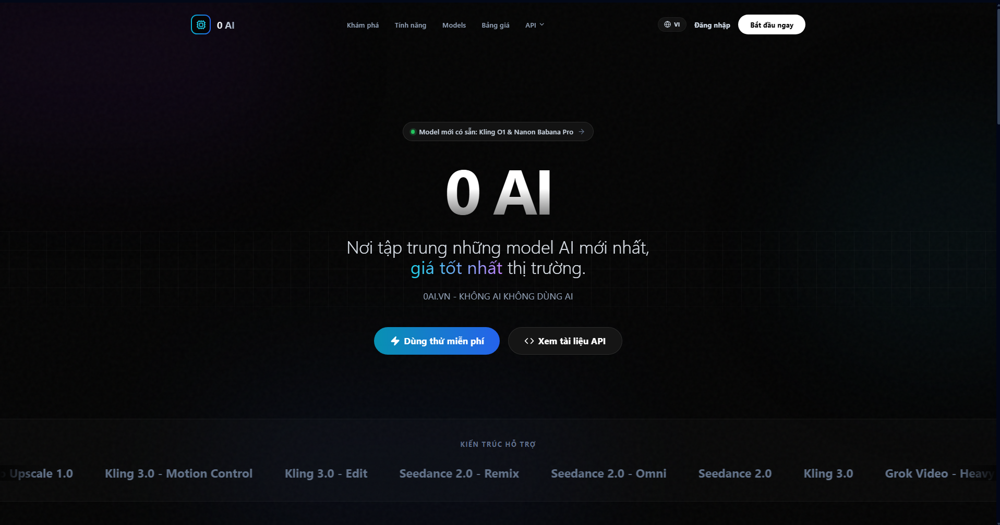
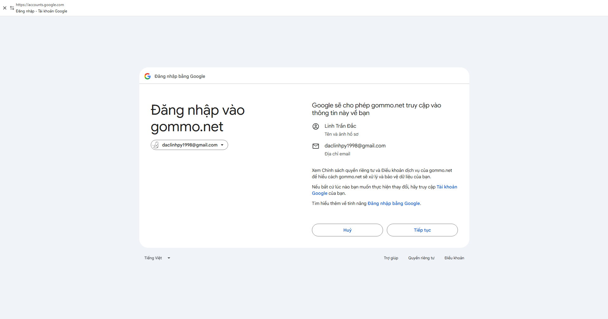
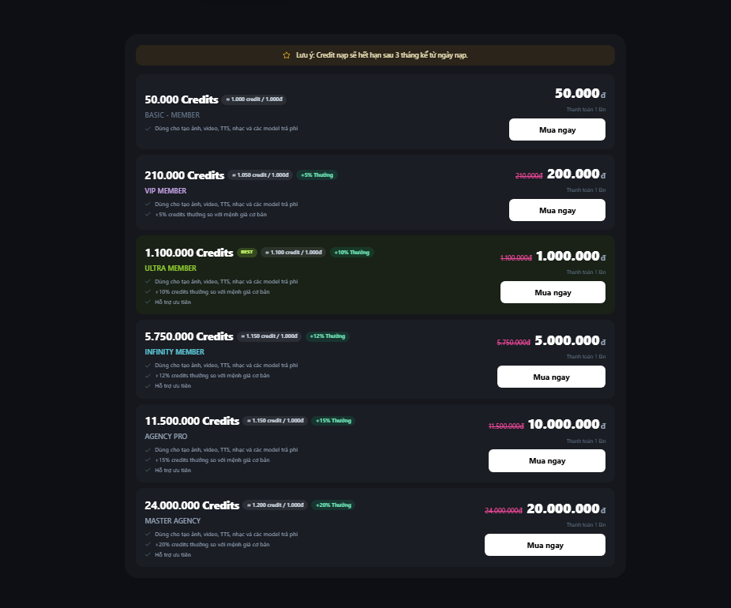
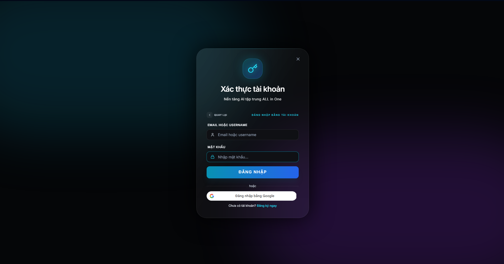
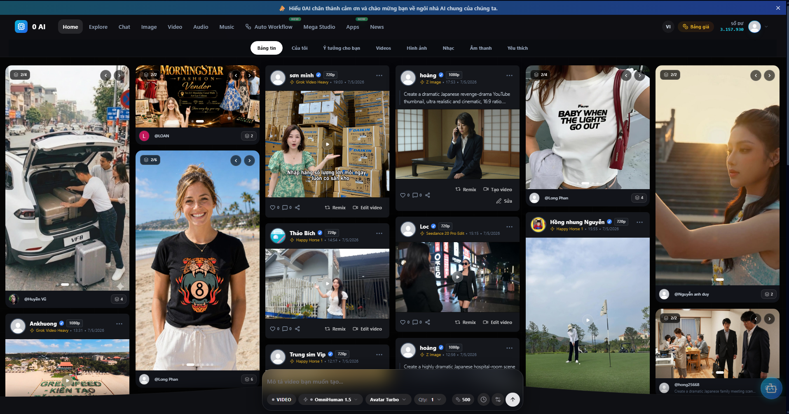
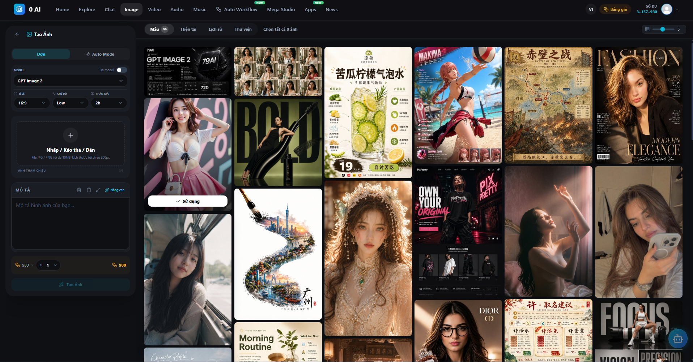
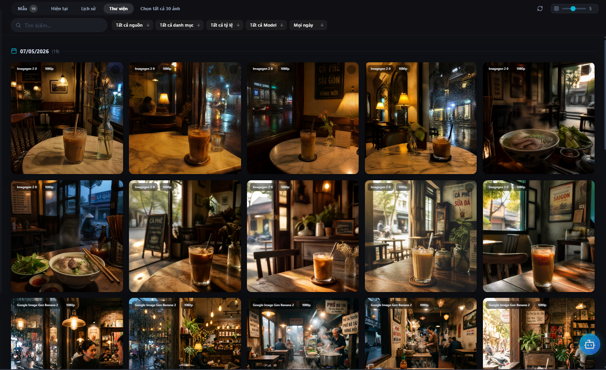
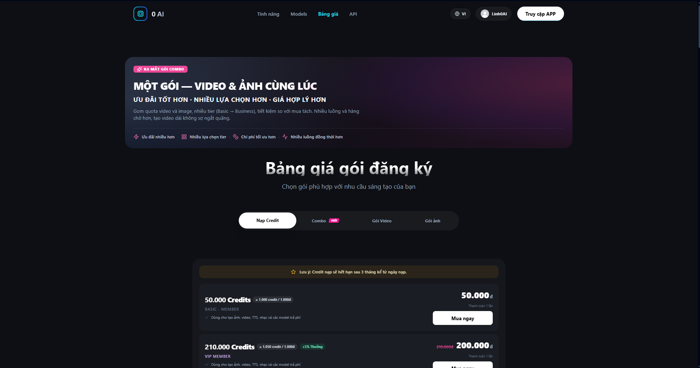
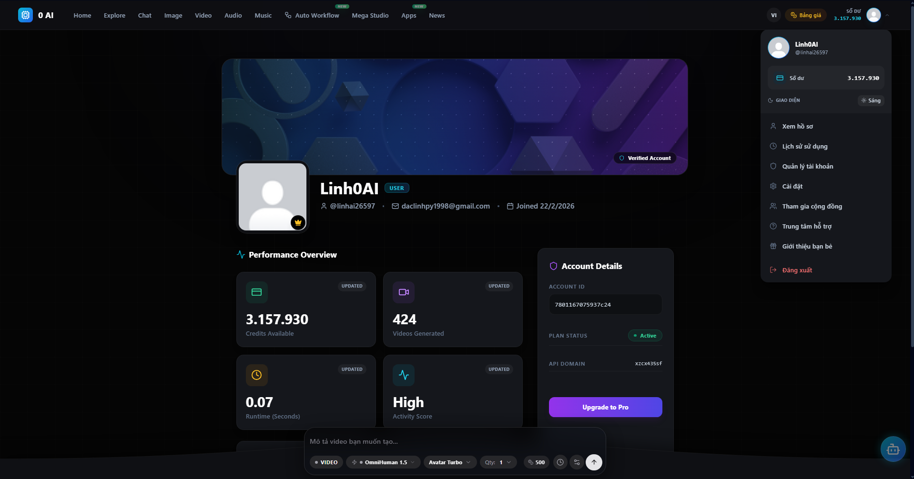

# Day 2 — Đăng Ký 0ai.vn, Chọn Gói & Tour Dashboard

> 🟢 **Level:** Newbie → Intermediate
> ⏱️ **Thời gian đọc:** 10 phút | **Thực hành:** 15 phút
> 📅 **Ngày 2/30**

---

## 🎯 Mục tiêu hôm nay

Sau bài này, bạn sẽ:
- Đăng ký được tài khoản 0ai.vn trong **2 phút**
- Hiểu **2 mô hình tính phí** và biết chọn cái phù hợp với **giai đoạn của bạn**
- Thuộc giao diện dashboard, biết vị trí từng tính năng
- Sẵn sàng bước vào **Day 3 — viết prompt chuẩn**

> 💡 **Spoiler quan trọng:** Nếu bạn đang **học**, đừng vội mua subscription. Có lựa chọn linh hoạt hơn nhiều — đọc Phần 2 để hiểu vì sao.

---

## 📖 Phần 1 — Đăng ký 0ai.vn (2 phút)

### Bước 1: Vào trang chủ
Mở [0ai.vn](https://0ai.vn) → click **"Đăng nhập"** ở góc phải.



### Bước 2: Chọn "Đăng nhập với Google"

Cách nhanh nhất — 1 click là xong.



### Bước 3: Chọn tài khoản Google → Done

Sau khi cho phép, bạn sẽ vào thẳng **Dashboard**. Xong!

> ⚠️ **Lưu ý:** 0ai.vn KHÔNG cho credit miễn phí khi đăng ký. Bạn cần nạp/mua trước khi tạo ảnh được. Đọc Phần 2 để chọn cách rẻ nhất.

---

## 💰 Phần 2 — Strategy: 2 Giai Đoạn Khác Nhau

### 🔑 Insight quan trọng nhất của bài này

**Đừng mua subscription ngay khi mới bắt đầu.** Đây là sai lầm phổ biến. Lý do:
- Bạn chưa biết mình cần gì
- Subscription "khóa" bạn trong 1 nhóm gói cố định
- Có model bạn chưa test, có model bạn không bao giờ dùng — vẫn phải trả tiền

**Strategy đúng:** Chia hành trình thành **2 giai đoạn**, mỗi giai đoạn dùng cách trả tiền khác nhau.

---

### 📚 Giai đoạn 1: ĐANG HỌC (Tuần 1-3) → Mua Credit

**Đây là giai đoạn bạn đang ở.**

Trong 3 tuần đầu, bạn sẽ:
- Test rất nhiều model khác nhau (Nano Banana 2, GPT Image 2, Seedream, Z-Image, Kling, VEO, Grok, Seedance...)
- Mỗi model 1 phong cách — bạn cần thử mới biết cái nào hợp
- Hôm nay test ảnh nhiều, mai test video nhiều — không có pattern cố định

→ **Dùng Credit là tối ưu nhất.** Mua 1 lần, dùng cho mọi loại model.

#### 💎 Recommend cho người mới: **Ultra Member — 1.000.000đ → 1.100.000 Credits**



| Tiêu chí | Chi tiết |
|----------|----------|
| Giá | 1.000.000đ (giảm từ 1.100.000đ) |
| Số credit | **1.100.000 Credits** (tặng +10%) |
| Effective rate | 1.100 credit / 1.000đ |
| Hỗ trợ ưu tiên | ✅ Có |
| Thời hạn | 3 tháng |
| Đánh dấu "BEST" | ✅ |

**Vì sao Ultra Member là sweet spot:**
- ✅ Đủ credit cho **nguyên tháng test thoải mái** (test 8-15 ảnh/ngày)
- ✅ Linh hoạt — dùng được mọi model từ rẻ đến VIP đắt nhất
- ✅ +10% bonus là tier tốt nhất khi tính trên 1tr (Infinity 5tr mới có +12%)
- ✅ Có hỗ trợ ưu tiên — quan trọng cho người mới hay gặp lỗi
- ⏰ 3 tháng đủ cho 30 ngày journey + dư phòng tháng sau

#### 📊 Bảng Credit đầy đủ (6 tier)

| Tier | Credit | Giá | Bonus | Phù hợp với |
|------|--------|-----|-------|-------------|
| Basic Member | 50.000 | 50.000đ | 0% | Test thử 1-2 ngày |
| VIP Member | 210.000 | 200.000đ | +5% | Tuần đầu khám phá |
| **⭐ Ultra Member** | **1.100.000** | **1.000.000đ** | **+10%** | **3 tuần học (recommend)** |
| Infinity Member | 5.750.000 | 5.000.000đ | +12% | Học cùng team |
| Agency Pro | 11.500.000 | 10.000.000đ | +15% | Agency / studio |
| Master Agency | 24.000.000 | 20.000.000đ | +20% | Doanh nghiệp lớn |

> 💡 **Chiến lược tiết kiệm:** Bắt đầu với **VIP Member 200k** trước. Nếu sau 1 tuần bạn xài hết → upgrade Ultra. Nếu xài chưa hết → tiết kiệm 800k!

---

### 🚀 Giai đoạn 2: ĐÃ HIỂU NHU CẦU (Tuần 4+) → Subscription

Sau ~3 tuần dùng Credit, bạn sẽ biết rõ:
- Bạn dùng nhiều ảnh hay nhiều video?
- Model nào bạn dùng 80% thời gian?
- Bạn cần Seedance hay đủ với VEO/Kling?
- Bạn chỉ làm cá nhân hay làm cho khách?

→ Khi đó **upgrade sang Subscription** sẽ rẻ hơn 60-90% so với Credit.

#### 3 gói Subscription phổ biến nhất

| Persona | Gói | Giá/tháng |
|---------|-----|-----------|
| 🌱 Chỉ làm ảnh | **Image Starter** | 200.000đ → 800 ảnh |
| 🎨 Mix ảnh + video (cả Seedance) | **Combo 1 All-in** | 1.000.000đ → 500 ảnh + 560 video |
| 🎬 Tập trung video | **Mini Video** | 500.000đ → 800 video + 800 ảnh |

📚 **Chi tiết 22 gói + 6 mức Credit:** Xem [PRICING.md](../PRICING.md)

---

### 🎯 Tóm tắt strategy

```
Bạn đang ở đâu?
│
├── 🟢 Mới bắt đầu, đang học (giống bạn lúc này)
│   └── Mua Credit Ultra Member 1tr
│       → Test mọi model, mọi loại output
│       → Sau 3 tuần biết rõ nhu cầu
│
└── 🔵 Đã rõ nhu cầu, dùng đều
    └── Upgrade Subscription phù hợp
        → Tiết kiệm 60-90% so với Credit
```

---

## 🗺️ Phần 3 — Tour Dashboard 0ai.vn

### Tổng quan giao diện



Dashboard 0ai.vn chia làm **5 khu vực chính**:

### ① Sidebar / Menu chính (bên trái)



- 🎨 **Tạo ảnh** — nơi work chính, 80% thời gian sẽ ở đây
- 🎬 **Tạo video** — Seedance, Kling, VEO, Grok...
- 🖼️ **Gallery / Lịch sử** — xem lại tác phẩm
- 💰 **Gói / Billing** — quản lý subscription, credit
- ⚙️ **Settings** — cài đặt cá nhân

### ② Khu vực tạo ảnh



4 thành phần chính:

**(a)** Ô nhập prompt
**(b)** Model selector — chọn Nano Banana 2 / Image 2 / Seedream...
**(c)** Settings panel — aspect ratio, số ảnh, chất lượng (1K/2K/4K)
**(d)** Nút Generate

### ③ Gallery — Lịch sử



- **Filter** theo model / theo ngày
- **Tải về** từng ảnh hoặc batch
- **Click ảnh** → xem prompt cũ (= không cần ghi chú riêng)
- **Re-generate** với prompt cũ

### ④ Gói & Billing



- Theo dõi credit/quota còn lại
- Mua thêm credit / nâng cấp gói
- Xem lịch sử dùng

### ⑤ Profile / Settings



Đổi avatar, ngôn ngữ, theme (dark/light), advanced settings.

---

## ⚡ Thử thách hôm nay

### 1. Quyết định giai đoạn của bạn
- Bạn **đang học AI** lần đầu? → Mua Credit (Ultra Member 1tr hoặc VIP 200k)
- Bạn **đã có kinh nghiệm**, biết rõ nhu cầu? → Đọc [PRICING.md](../PRICING.md) chọn subscription

### 2. Mua Credit / Subscription
Nếu chưa sẵn sàng nạp tiền — vẫn theo dõi repo được. Có sẵn 8 ảnh demo + prompt mẫu để **đọc trước, áp dụng sau**.

### 3. Tạo ảnh đầu tiên với prompt CỦA RIÊNG BẠN
Không copy prompt mẫu. Tự nghĩ 1 prompt mô tả gì đó **gần với cuộc sống của bạn** — góc làm việc, món ăn yêu thích, cảnh quê hương...

### 4. Test với 3 model khác nhau
Cùng 1 prompt — chạy trên 3 model khác nhau (vd: Nano Banana 2, Seedream 5, Z-Image). So sánh kết quả → bắt đầu hình thành "gu" model riêng.

📸 Chia sẻ ảnh đầu tiên trong [Issues](../../issues) hoặc tag mình trên Facebook!

---

## ❌ Lỗi thường gặp

| Lỗi | Cách fix |
|-----|----------|
| "Hết credit" / "Hết quota" | Nạp thêm credit hoặc nâng gói |
| Đăng nhập Google bị loop | Xóa cookies trình duyệt |
| Generate ra lỗi 500 | Server bận, đợi 30s |
| "Hàng chờ đầy" | Đợi job đang chạy xong |
| Không thấy tác phẩm cũ | Quá hạn lưu trữ — luôn tải về sau khi tạo |
| Credit hết hạn | Đã quá 3 tháng từ ngày nạp — không hoàn lại |

---

## 🤔 FAQ

**Q: Tại sao không recommend subscription ngay?**
A: Vì subscription "khóa" bạn trong 1 nhóm gói. Khi đang học, bạn cần thử mọi loại — Credit linh hoạt hơn, không lãng phí.

**Q: Mua Credit 1tr xong test 1-2 ngày thấy không hợp thì sao?**
A: Credit không refund được. Đó là lý do mình recommend bắt đầu với **VIP Member 200k** — test 1 tuần, nếu OK mới mua Ultra 1tr.

**Q: Sau 3 tháng credit hết hạn, mình có mất không?**
A: Có, hết hạn = mất. Nhưng nếu dùng đều 1 tháng cũng tiêu hết rồi, không lo.

**Q: Credit và Subscription có chuyển đổi qua lại được không?**
A: Theo logic thông thường thì 2 system riêng biệt. Hỏi support trước khi quyết định nâng cấp/chuyển đổi.

**Q: Discount 39-95% có vĩnh viễn không?**
A: Một số gói có ghi "CHỈ CÒN X GÓI" → có vẻ là **promo có giới hạn**. Nếu định mua, càng sớm càng có giá tốt.

**Q: Mình có thể dùng 0ai.vn miễn phí không?**
A: Không có free tier. Nhưng có thể:
- Test Nano Banana 2 free trên Google AI Studio
- Theo dõi repo này — có sẵn 8 ảnh demo Day 1 + prompt mẫu

---

## 🎯 Recap

Sau Day 2 bạn đã:
- ✅ Có tài khoản 0ai.vn hoạt động
- ✅ Hiểu chiến lược 2 giai đoạn (Credit khi học → Subscription khi đã rõ nhu cầu)
- ✅ Biết Ultra Member 1tr là sweet spot cho 3 tuần học
- ✅ Quen với 5 khu vực dashboard
- ✅ Có reference page [PRICING.md](../PRICING.md) cho deep dive

→ Sẵn sàng cho **Day 3 — Anatomy of a Prompt** 🚀

---

## ➡️ Ngày mai (Day 3)

**Anatomy of a Prompt — 5 thành phần cốt lõi**: Subject + Style + Composition + Lighting + Quality tags. Áp dụng cho mọi model. Phân tích 10 prompt từ dở → tốt.

📌 **Đừng quên:** ⭐ Star repo, follow [Facebook](https://facebook.com/daclinh.tran) / [X](https://x.com/Daclinh0AI).

---

**📅 Day 2/30** | [⏪ Day 1](./day-01.md) | [Curriculum](../CURRICULUM.md) | [📊 Full Pricing](../PRICING.md) | [Day 3 ➡️](./day-03.md)

---

*Tác giả: Linh0AI · #0aiDay02 #AITaoAnh #0aiVN*
