# Day 3 — Anatomy of a Prompt: 5 Thành Phần Cốt Lõi

> 🟢🔵 **Level:** Newbie → Intermediate
> ⏱️ **Thời gian đọc:** 15 phút | **Thực hành:** 30 phút
> 📅 **Ngày 3/30**

---

## 🎯 Mục tiêu hôm nay

Sau bài này, bạn sẽ:
- Hiểu **5 thành phần cốt lõi** của một prompt tốt
- Biết **công thức master** để viết prompt hiệu quả cho mọi model
- Xem được **10 prompt từ dở → tốt** (test trên 2 model: Nano Banana 2 vs Image 2)
- Có **cheatsheet** từ vựng để tham khảo mọi lúc
- Tránh được **5 lỗi phổ biến** mà 90% người mới mắc phải

> 💡 **Sự thật:** Sau Day 3, kỹ năng prompt của bạn sẽ tốt hơn 80% người mới. Vì 80% người chỉ biết viết prompt 1 dòng đơn giản và đổ lỗi cho AI khi ảnh xấu.
> 📋 **Prompts đầy đủ trong bài**: [`prompts/day-03.txt`](../prompts/day-03.txt)
> Copy/download nguyên văn về paste vào 0ai.vn — không phải gõ lại từ trong bài.

---

## 📖 Phần 1 — 5 Thành Phần Cốt Lõi Của Một Prompt

Một prompt tốt giống như một bức tranh — có **5 yếu tố** quan trọng nhất:

### 🎯 1. Subject (Chủ thể) — QUAN TRỌNG NHẤT

**Subject** = thứ chính trong ảnh. Đây là yếu tố model "đọc" đầu tiên.

| Dở | Tốt |
|----|-----|
| `a woman` | `a young Vietnamese woman in her early 20s with long black hair` |
| `a cat` | `a fluffy orange Maine Coon cat with bright green eyes` |
| `a car` | `a classic 1965 Mustang in racing red color` |

**Quy tắc:** Càng cụ thể về Subject, model càng "vẽ" đúng ý bạn.

### 🎨 2. Style (Phong cách)

**Style** = phong cách thị giác bao trùm cả ảnh.

Các style phổ biến:
- `photorealistic` — chân thực như ảnh chụp
- `cinematic` — phong cách điện ảnh
- `anime / manga` — phong cách Nhật
- `watercolor / oil painting` — tranh nghệ thuật
- `3D render` — đồ họa 3D
- `vintage / retro` — cổ điển
- `editorial` — như tạp chí thời trang

**Tip:** Chọn 1 style chính, đừng trộn nhiều quá → AI confused.

### 📐 3. Composition (Bố cục)

**Composition** = cách khung hình được sắp xếp.

| Term | Nghĩa | Khi nào dùng |
|------|-------|--------------|
| `close-up` | Cận cảnh | Chân dung, sản phẩm chi tiết |
| `medium shot` | Trung cảnh (eo trở lên) | Ảnh thời trang, profile |
| `wide shot` | Toàn cảnh | Phong cảnh, kiến trúc |
| `top-down view` | Nhìn từ trên xuống | Food, flat lay |
| `low angle` | Góc thấp lên | Tạo cảm giác hùng vĩ |
| `over the shoulder` | Qua vai | Câu chuyện, narrative |
| `rule of thirds` | Quy tắc 1/3 | Bố cục cân bằng |

### 💡 4. Lighting (Ánh sáng)

**Lighting** = yếu tố tạo "hồn" cho ảnh. Cùng cảnh, đổi ánh sáng → cảm xúc khác hẳn.

| Term | Mood | Use case |
|------|------|----------|
| `golden hour` | Ấm áp, lãng mạn | Chân dung, ngoại cảnh |
| `soft natural lighting` | Dịu, tự nhiên | Hằng ngày, cafe |
| `dramatic lighting` | Mạnh, kịch tính | Editorial, fashion |
| `neon / cyberpunk lighting` | Hiện đại, đô thị | Night scene |
| `studio lighting` | Sạch, chuyên nghiệp | Sản phẩm, profile |
| `backlit / silhouette` | Bí ẩn, nghệ thuật | Concept, art |
| `low key lighting` | Tối, mysterious | Noir, film |

### ⚙️ 5. Quality Tags (Tag chất lượng)

**Quality tags** = "gia vị" cuối cùng để boost chất lượng ảnh.

Các tag thường dùng:
- `4K, 8K, ultra high resolution`
- `sharp focus, ultra detailed`
- `bokeh background, shallow depth of field`
- `professional photography, editorial`
- `masterpiece, best quality`
- `shot on 85mm lens / 50mm lens` (specific cho chân dung)

> ⚠️ **Tránh:** Đừng dùng QUÁ NHIỀU quality tags (>10) → model bị overwhelm và kết quả kém hơn.

---

## 📐 Phần 2 — Công Thức Master

### Cấu trúc chuẩn của 1 prompt tốt:

```
[Composition] + [Subject details] + [Action/Expression] + 
[Setting/Background] + [Style] + [Lighting] + [Quality tags]
```

### Ví dụ áp dụng:

```
Cinematic close-up portrait of [a young Vietnamese woman in her early 20s, 
long flowing black hair, wearing elegant white áo dài], [gentle smile 
looking softly at camera], [sitting by the window of a vintage Hanoi 
coffee shop], [photorealistic editorial style], [warm afternoon golden 
hour light streaming through], [shallow depth of field, bokeh, 85mm lens, 
4K, masterpiece]
```

### 💡 3 quy tắc vàng

1. **Subject đứng trước** → model ưu tiên xử lý
2. **Quality tags đứng cuối** → như "phụ kiện trang điểm"
3. **Phẩy `,` ngăn cách** → mỗi yếu tố là 1 chunk độc lập

---

## 🎬 Phần 3 — DEMO: 10 Prompt Từ DỞ Đến TỐT

Mình test cùng 1 chủ đề (chân dung phụ nữ Việt) qua **10 cấp độ prompt**, mỗi cấp thêm 1 thành phần. Test trên cả 2 model: **Nano Banana 2** và **Image 2**.

### 🔴 Level 1: Quá đơn giản — chỉ 2 từ

**Prompt:**
```
a woman
```

| Nano Banana 2 | Image 2 |
|:---:|:---:|
|  | 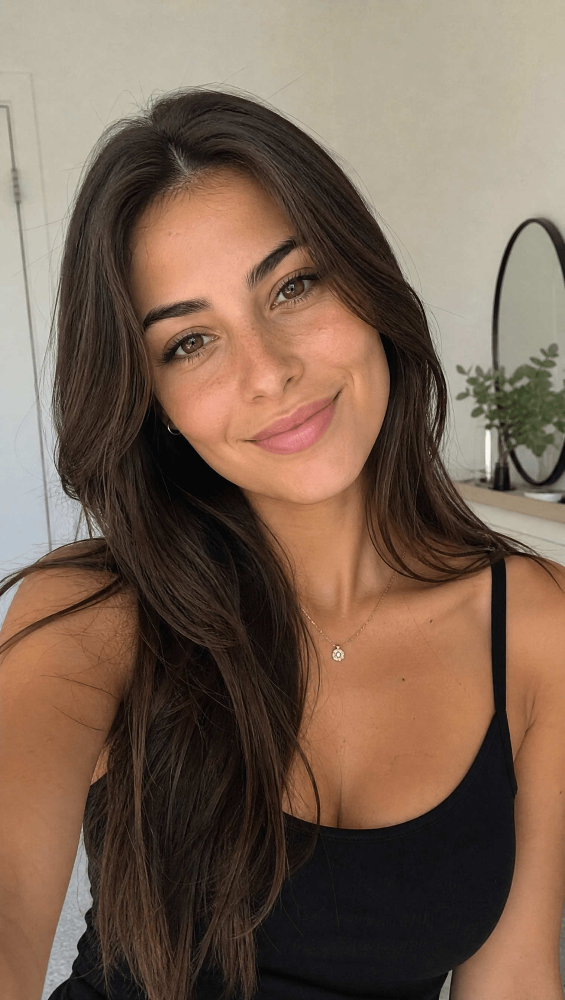 |

**Bài học:** Quá ngắn → AI tự "decide" mọi thứ → kết quả random, không kiểm soát được.

---

### 🟠 Level 2: Có chi tiết hơn nhưng vẫn vague

**Prompt:**
```
a beautiful Vietnamese woman
```

| Nano Banana 2 | Image 2 |
|:---:|:---:|
| 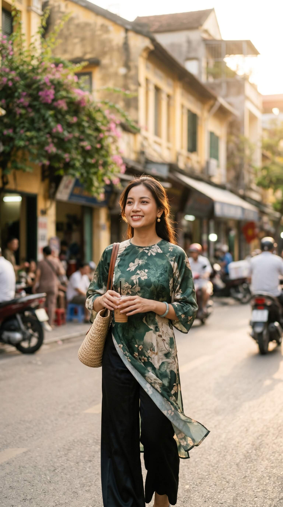 | 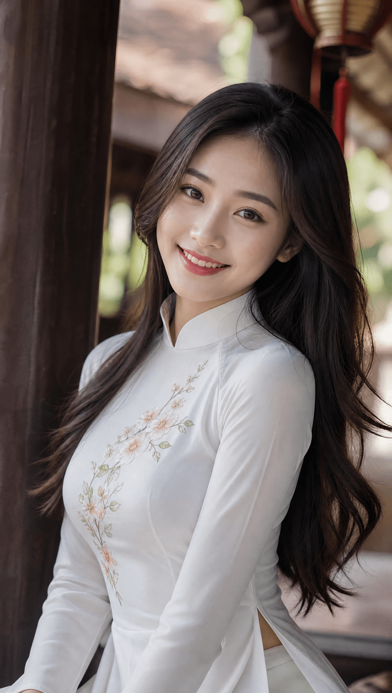 |

**Bài học:** Từ "beautiful" quá chung chung. AI đoán mò vẻ đẹp theo training data → có thể không phải gu của bạn.

---

### 🟡 Level 3: Thêm tuổi và setting

**Prompt:**
```
a Vietnamese woman in her 20s, in a coffee shop
```

| Nano Banana 2 | Image 2 |
|:---:|:---:|
| 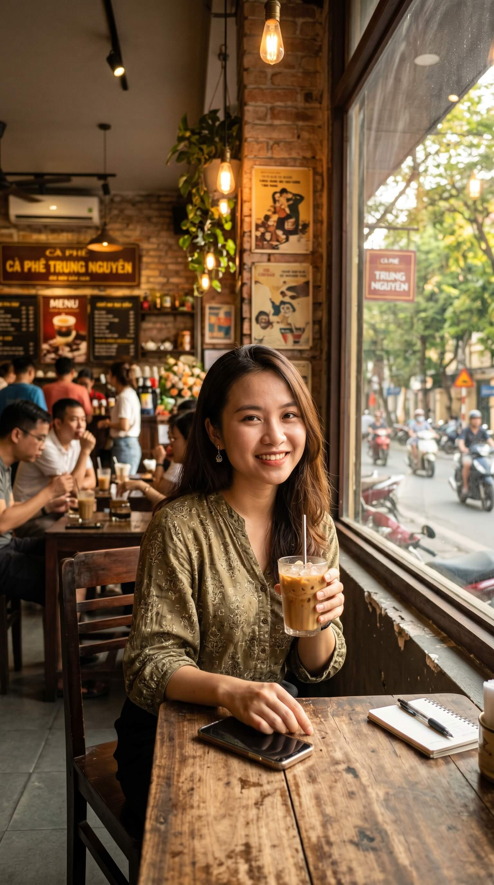 |  |

**Bài học:** Thêm **WHERE** giúp ảnh có context. Tuổi tác tránh AI vẽ quá già/quá trẻ.

---

### 🟢 Level 4: Thêm STYLE

**Prompt:**
```
a Vietnamese woman in her 20s, in a coffee shop, photorealistic
```

| Nano Banana 2 | Image 2 |
|:---:|:---:|
| 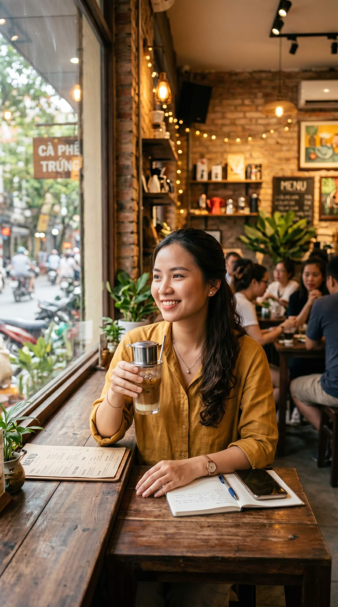 |  |

**Bài học:** **Photorealistic** kéo ảnh từ "AI art" về "ảnh chụp". Đây là 1 từ tạo khác biệt rất lớn.

---

### 🟢 Level 5: Thêm COMPOSITION

**Prompt:**
```
close-up portrait of a Vietnamese woman in her 20s, in a coffee shop, photorealistic
```

| Nano Banana 2 | Image 2 |
|:---:|:---:|
| 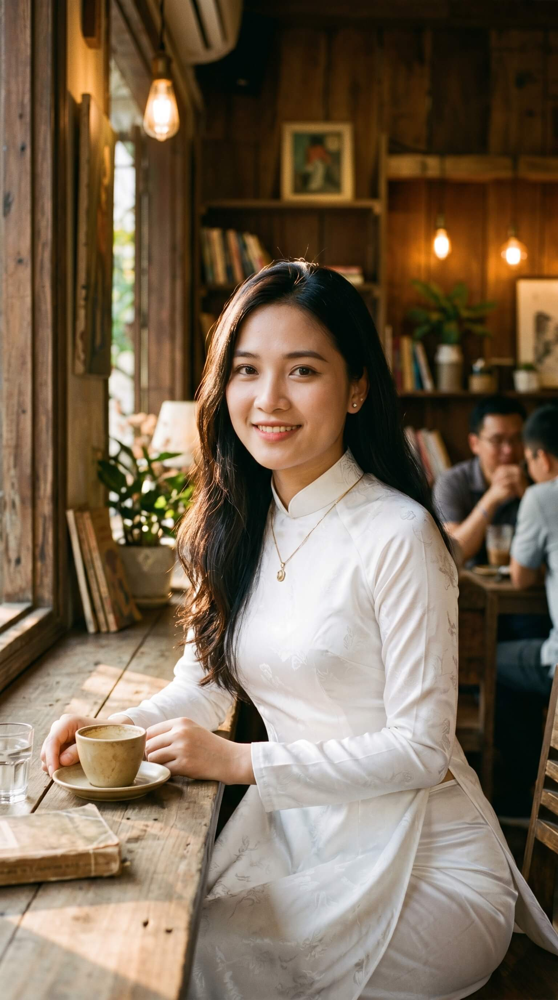 |  |

**Bài học:** **Close-up portrait** quyết định tầm vóc khung hình. Khác hẳn full-body shot.

---

### 🔵 Level 6: Thêm LIGHTING

**Prompt:**
```
close-up portrait of a Vietnamese woman in her 20s, in a coffee shop, photorealistic, golden hour lighting
```

| Nano Banana 2 | Image 2 |
|:---:|:---:|
|  | 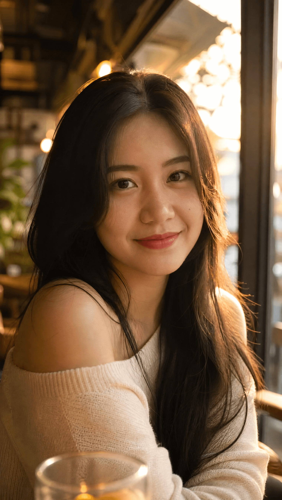 |

**Bài học:** **Ánh sáng = mood**. Golden hour cho ấm áp, lãng mạn. Nếu đổi sang "neon lighting" thì sẽ cyberpunk hẳn.

---

### 🔵 Level 7: Mô tả CHI TIẾT về người

**Prompt:**
```
close-up portrait of a young Vietnamese woman with long black hair, wearing white áo dài, in a vintage coffee shop, photorealistic, golden hour lighting
```

| Nano Banana 2 | Image 2 |
|:---:|:---:|
| 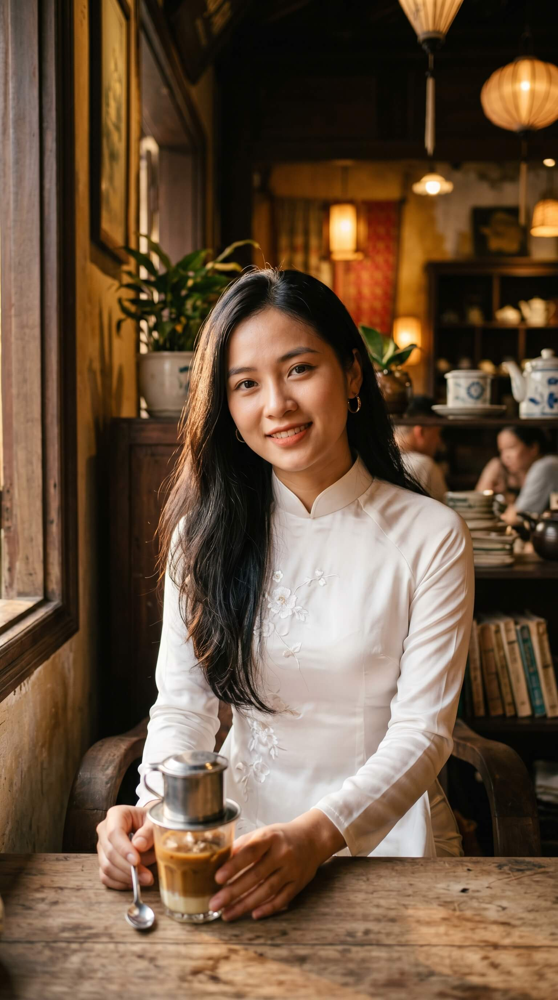 |  |

**Bài học:** **Tóc, trang phục** = nhân vật có "danh tính". Áo dài là chi tiết Việt Nam đậm chất → AI hiểu là người Việt thật, không phải người Á chung chung.

---

### 🟣 Level 8: Thêm BIỂU CẢM (Expression)

**Prompt:**
```
close-up portrait of a young Vietnamese woman with long black hair, wearing white áo dài, gentle smile looking softly at camera, in a vintage coffee shop, photorealistic, golden hour lighting
```

| Nano Banana 2 | Image 2 |
|:---:|:---:|
| 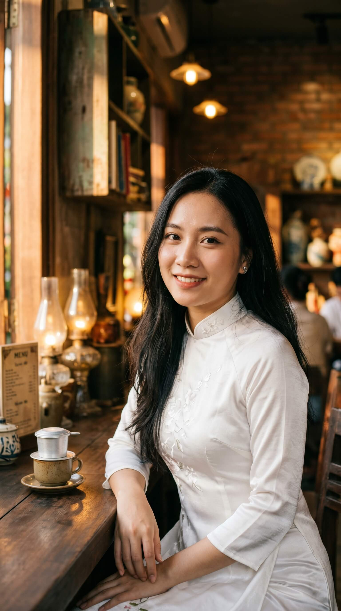 |  |

**Bài học:** **Biểu cảm = HỒN của ảnh chân dung**. Cùng người nhưng "smile" vs "serious" khác nhau hoàn toàn về cảm giác.

---

### 🟣 Level 9: Thêm QUALITY TAGS

**Prompt:**
```
close-up portrait of a young Vietnamese woman with long black hair, wearing white áo dài, gentle smile looking softly at camera, in a vintage coffee shop, photorealistic, golden hour lighting, sharp focus, bokeh background, 4K, professional photography
```

| Nano Banana 2 | Image 2 |
|:---:|:---:|
| 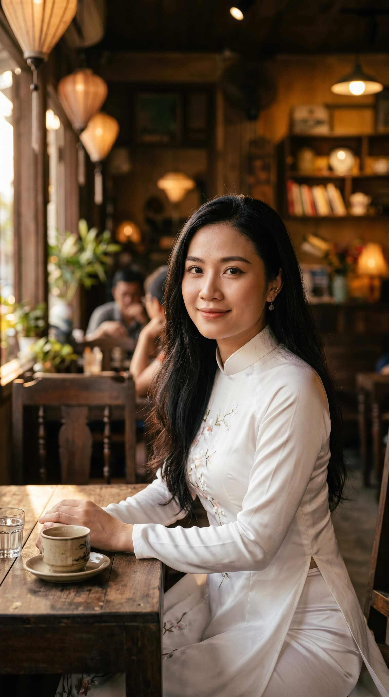 |  |

**Bài học:** **Quality tags** giúp ảnh "boost" lên level cao hơn. Bokeh + sharp focus = nhìn pro hẳn.

---

### 🏆 Level 10: MASTER PROMPT — Tất cả hợp lại

**Prompt:**
```
Cinematic close-up portrait of a young Vietnamese woman in her early 20s, long flowing black hair, wearing elegant white áo dài, gentle smile with eyes looking softly at camera, sitting by the window of a vintage Hanoi coffee shop, warm afternoon golden hour light streaming through window, shallow depth of field with creamy bokeh background, shot on 85mm lens, professional editorial photography, ultra sharp focus, 4K, photorealistic, masterpiece
```

| Nano Banana 2 | Image 2 |
|:---:|:---:|
| 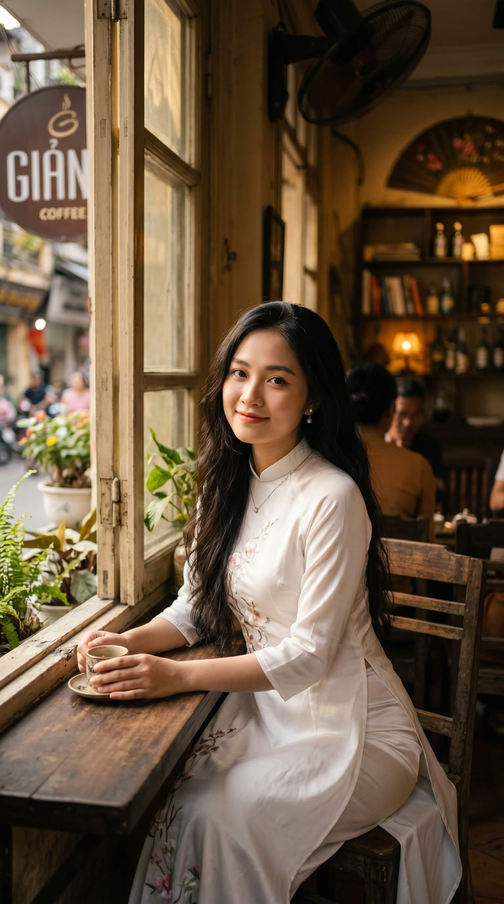 |  |

**Bài học:** Khi đầy đủ **5 thành phần + chi tiết cụ thể + lens + cinematic touch** → bạn có ảnh quality của photographer chuyên nghiệp.

> 💡 **So sánh Level 1 vs Level 10:** Cùng chủ đề "phụ nữ Việt", nhưng kết quả khác hẳn về **độ chuyên nghiệp**, **cảm xúc**, **chi tiết**. Đây là sức mạnh của prompt engineering.

---

## ❌ Phần 4 — 5 Lỗi Prompt Phổ Biến

### Lỗi 1: Quá ngắn (< 5 từ)
```
❌ "girl in red"
✅ "young woman wearing red dress, sitting in cafe, soft lighting"
```

### Lỗi 2: Mâu thuẫn nhau
```
❌ "photorealistic anime character" 
   (photorealistic và anime opposite!)
✅ "anime style character" HOẶC "photorealistic woman"
```

### Lỗi 3: Quá nhiều style
```
❌ "watercolor oil painting digital art photorealistic" 
   (4 style cùng lúc → AI confused)
✅ Chọn 1 style chính: "watercolor painting style"
```

### Lỗi 4: Vague từ chung chung
```
❌ "beautiful nice good amazing photo"
   (toàn từ ý nghĩa mơ hồ)
✅ "professional editorial photography, sharp focus, 4K"
```

### Lỗi 5: Thiếu context Việt Nam khi cần
```
❌ "woman in traditional dress" 
   (AI có thể vẽ Trung Quốc, Nhật, Hàn)
✅ "Vietnamese woman in white áo dài, conical hat nón lá nearby"
```

---

## 📋 Phần 5 — Cheatsheet 1 Trang

### Bảng từ vựng cho từng thành phần

#### 🎯 SUBJECT — Mô tả chi tiết
| Tiêu chí | Từ khóa gợi ý |
|----------|---------------|
| Tuổi | young, middle-aged, in her 20s/30s, elderly |
| Quốc tịch | Vietnamese, Asian, Korean, Western |
| Tóc | long black hair, short curly hair, wavy brown hair |
| Trang phục | wearing áo dài, casual t-shirt, business suit, vintage dress |
| Đặc điểm | freckles, bright eyes, soft skin |

#### 🎨 STYLE
```
photorealistic | cinematic | editorial | vintage | retro | 
anime | manga | watercolor | oil painting | 3D render | 
hyper-realistic | film noir | minimalist | maximalist
```

#### 📐 COMPOSITION
```
close-up | medium shot | wide shot | full body shot |
top-down view | low angle | over the shoulder |
rule of thirds | symmetrical composition | centered subject
```

#### 💡 LIGHTING
```
golden hour | blue hour | soft natural light | hard sunlight |
dramatic lighting | studio lighting | neon lighting |
backlit | side-lit | rim lighting | low key | high key
```

#### ⚙️ QUALITY TAGS (chọn 3-5 tag)
```
4K | 8K | ultra high resolution | sharp focus | ultra detailed |
bokeh | shallow depth of field | shot on 85mm | shot on Sony A7 |
professional photography | editorial | masterpiece | best quality
```

### 🎁 Template Ready-to-Use

#### Template chân dung cơ bản:
```
[composition] portrait of [subject details], [expression], 
[setting], [style], [lighting], [quality tags]
```

#### Template sản phẩm:
```
[composition] product photo of [product details], 
[background], studio lighting, [style], [quality tags]
```

#### Template cảnh quan:
```
[composition] view of [scenery details], [time of day], 
[weather], [style], [quality tags]
```

---

## ⚡ Thử thách hôm nay

### 1. Chọn 1 chủ đề bạn yêu thích
Ví dụ: bản thân, người yêu, thú cưng, món ăn yêu thích...

### 2. Viết 3 phiên bản prompt
- **Dở:** chỉ 2-3 từ
- **Trung bình:** thêm style + composition
- **Tốt:** đủ 5 thành phần

### 3. Test trên 0ai.vn
Tạo 3 ảnh từ 3 prompt → so sánh kết quả

### 4. Share kết quả
Post 3 ảnh vào [Issues](../../issues) hoặc Facebook tag mình → mình tag bạn vào nhóm cùng học!

---

## 🤔 FAQ

**Q: Mình nên viết prompt tiếng Anh hay tiếng Việt?**
A: Tiếng Anh thường tốt hơn vì model train chủ yếu trên data tiếng Anh. Nhưng các model mới (Nano Banana 2, Z-Image) hiểu tiếng Việt khá tốt. **Day 5** mình sẽ deep dive câu này.

**Q: Prompt dài có tốt hơn prompt ngắn không?**
A: **Không phải lúc nào** — prompt 50-150 từ là sweet spot. Quá dài (>200 từ) → AI bỏ qua các phần sau.

**Q: Có cần dùng dấu phẩy hay không?**
A: **Có** — phẩy giúp model "phân tách" các yếu tố. Không dùng phẩy → AI gộp hết thành 1 ý.

**Q: Mình có thể dùng tiếng lóng / từ cá nhân?**
A: Hạn chế. Model hiểu từ "chuẩn" tốt hơn. "Cute girl" OK, "siêu xinh xẻo" có thể không hiểu.

**Q: Prompt có phải copy hệt mỗi lần không?**
A: **Không** — mỗi lần generate cùng 1 prompt sẽ ra ảnh khác (random seed). Nên test 4-6 lần để pick ảnh đẹp nhất.

**Q: Có công cụ giúp viết prompt không?**
A: Có nhiều: ChatGPT, Claude, prompt generator websites. Nhưng tốt nhất là **tự viết để hiểu logic**, sau đó dùng AI để refine.

---

## 🎯 Recap

Sau Day 3 bạn đã:
- ✅ Hiểu 5 thành phần cốt lõi của prompt
- ✅ Biết công thức master cho mọi loại ảnh
- ✅ Xem 10 demo từ dở → tốt với 2 model
- ✅ Có cheatsheet từ vựng cho mọi thành phần
- ✅ Tránh được 5 lỗi prompt phổ biến

→ Sẵn sàng cho **Day 4 — Aspect Ratio & Resolution** 🚀

---

## ➡️ Ngày mai (Day 4)

**Aspect ratio, resolution & các thông số cơ bản** — Khi nào dùng 1:1, 9:16, 16:9, 4:5? Cách chọn đúng cho từng nền tảng (TikTok, Instagram, Facebook, banner web).

📌 **Đừng quên:** ⭐ Star repo, follow [Facebook](https://facebook.com/daclinh.tran) / [X](https://x.com/Daclinh0AI).

---

**📅 Day 3/30** | [⏪ Day 2](./day-02.md) | [Curriculum](../CURRICULUM.md) | [📊 Pricing](../PRICING.md) | [Day 4 ➡️](./day-04.md)

---

*Tác giả: Linh0AI · #0aiDay03 #AITaoAnh #0aiVN #PromptEngineering*
