# Day 4 — Aspect Ratio, Resolution & Settings Cơ Bản

> 🟢 **Level:** Newbie
> ⏱️ **Thời gian đọc:** 12 phút | **Thực hành:** 20 phút
> 📅 **Ngày 4/30**

---

## 🎯 Mục tiêu hôm nay

Sau bài này, bạn sẽ:
- Hiểu **6 aspect ratio** phổ biến và khi nào dùng
- Biết chọn **đúng ratio** cho từng nền tảng (Facebook, Instagram, TikTok, YouTube, web)
- Phân biệt **resolution** 1K / 2K / 4K — khi nào cần, khi nào lãng phí credit
- Có **cheatsheet** để bookmark, dán cạnh máy tính
- Tránh được **3 lỗi đắt tiền** mà newbie hay mắc

> 💡 **Spoiler quan trọng:** Same prompt + đổi ratio = ảnh có "feel" hoàn toàn khác. Đây là kỹ thuật ít người Việt biết tận dụng.

---

## 📐 Phần 1 — 6 Aspect Ratio Cốt Lõi

### Aspect ratio là gì?

**Aspect ratio** = tỷ lệ chiều rộng / chiều cao của ảnh.

```
1:1   = vuông (1280 × 1280)
4:5   = đứng (1080 × 1350) — Instagram feed
9:16  = đứng dài (1080 × 1920) — TikTok, Reels
16:9  = ngang (1920 × 1080) — YouTube
3:2   = ngang nhẹ — Photography classic
21:9  = cinema ultrawide (3440 × 1440)
```

### Tại sao phải quan tâm?

**Sai aspect ratio = mất engagement.** Ví dụ:
- Đăng ảnh **16:9** lên TikTok → ảnh nhỏ tí ở giữa, viewer skip
- Đăng ảnh **9:16** lên YouTube → 2 bên đen thui, looks unprofessional
- Đăng ảnh **1:1** thay vì **4:5** lên Instagram → mất 25% diện tích hiển thị

> ⚠️ **AI tạo ảnh cũng "nhìn" ratio để compose.** Cùng 1 prompt, đổi ratio → AI sắp xếp khung hình **khác hoàn toàn**.

---

## 📊 Phần 2 — Bảng "Đi Chợ" Cho Creator

### Bảng matching nền tảng — aspect ratio

| Nền tảng | Ratio recommend | Lý do |
|----------|:---:|-------|
| **Instagram Feed** | 4:5 | Chiếm nhiều diện tích nhất trên scroll |
| **Instagram Story / Reels** | 9:16 | Full screen mobile |
| **TikTok** | 9:16 | Native vertical |
| **Facebook Feed** | 4:5 hoặc 1:1 | Cân bằng đẹp với newsfeed |
| **Facebook Story** | 9:16 | Full screen |
| **YouTube Shorts** | 9:16 | Vertical mobile |
| **YouTube Video** | 16:9 | Standard horizontal |
| **Banner web (hero)** | 16:9 hoặc 21:9 | Cinematic feel |
| **Twitter/X post** | 16:9 hoặc 1:1 | Crop tốt, không bị cắt |
| **LinkedIn post** | 1.91:1 hoặc 1:1 | Professional |
| **Pinterest** | 2:3 hoặc 9:16 | Vertical thu hút mắt |

### Bảng tóm tắt cho người bận rộn

| Nếu bạn làm... | Dùng ratio này |
|----------------|:---:|
| Content TikTok/Reels | **9:16** |
| Content Instagram | **4:5** (feed) hoặc **9:16** (story) |
| Video YouTube | **16:9** |
| Banner website | **16:9** |
| Ảnh đa năng | **1:1** (an toàn nhất) |

---

## 🎨 Phần 3 — DEMO: Cùng Prompt, 6 Ratio Khác Nhau

Mình test cùng 1 prompt master từ Day 3 (cô gái Việt Nam áo dài) qua **6 aspect ratio**, mỗi ratio test trên cả **Nano Banana 2** và **Image 2**.

### 🎯 Prompt sử dụng:
```
Cinematic close-up portrait of a young Vietnamese woman in her early 20s, 
long flowing black hair, wearing elegant white áo dài, gentle smile with 
eyes looking softly at camera, sitting by the window of a vintage Hanoi 
coffee shop, warm afternoon golden hour light streaming through window, 
shallow depth of field with creamy bokeh background, professional 
editorial photography, ultra sharp focus, 4K, photorealistic, masterpiece
```

---

### 🟦 Ratio 1:1 (Vuông) — 1080×1080

**Use case:** Instagram profile, Facebook profile, ảnh đa năng nhất

| Nano Banana 2 | Image 2 |
|:---:|:---:|
| 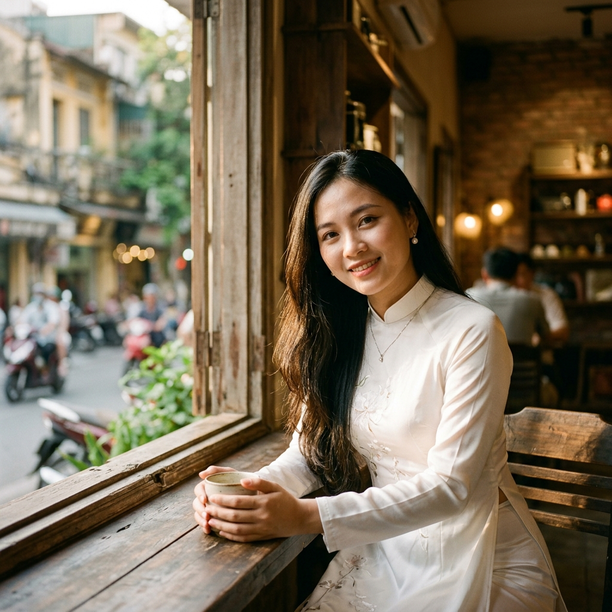 | 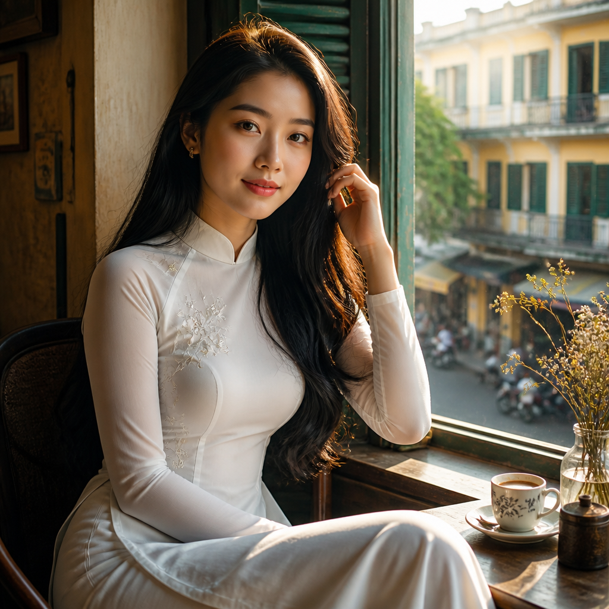 |

**Phân tích:** Ratio vuông → AI tự động zoom vào mặt + vai. Composition cân bằng nhưng "boring" hơn các ratio khác. **Phù hợp khi không biết đăng ở đâu — vuông luôn an toàn.**

---

### 🟪 Ratio 4:5 NBN2 / 4:3 Image 2 (Đứng vừa)

**Use case:** Instagram feed (engagement cao nhất), Facebook feed

| Nano Banana 2 | Image 2 |
|:---:|:---:|
| 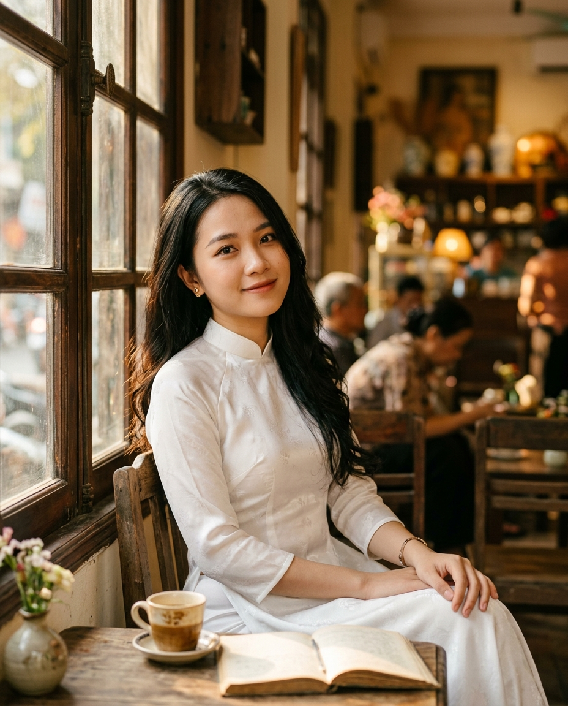 | 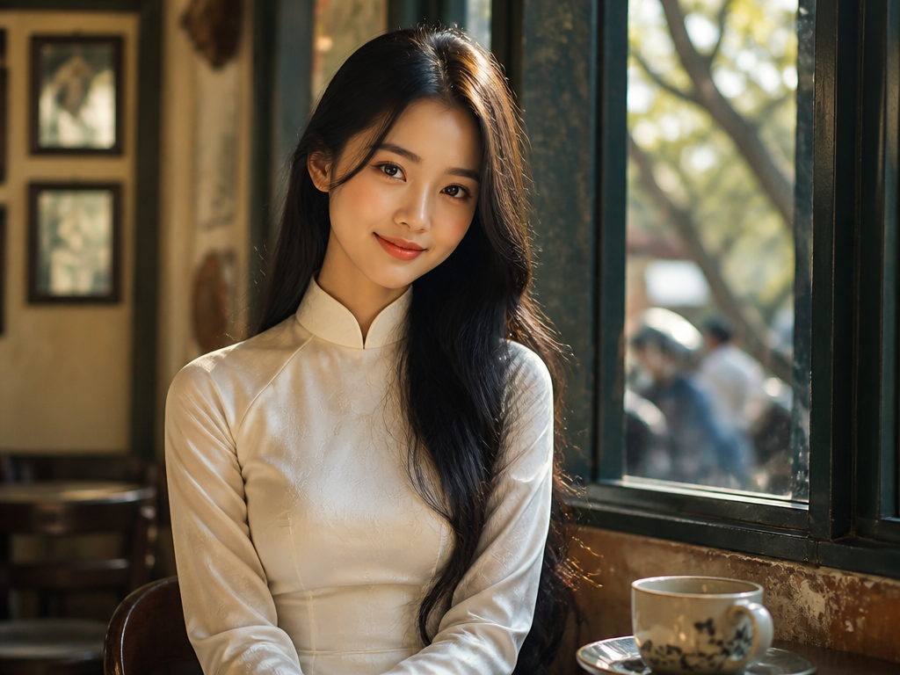 |

**Phân tích:** Đứng vừa phải → có thêm chi tiết áo dài, không quá "cropped". **Đây là ratio bạn nên dùng nhiều nhất** nếu làm content social cá nhân.

> 💡 **Phát hiện thú vị:** Image 2 trên 0ai.vn không hỗ trợ ratio 4:5 — phải dùng **4:3** (gần tương đương). Day 14 sẽ có cheatsheet đầy đủ về ratio support của từng model.

---

### 📱 Ratio 9:16 (Đứng dài) — 1080×1920

**Use case:** TikTok, Instagram Reels, Facebook Stories, YouTube Shorts

| Nano Banana 2 | Image 2 |
|:---:|:---:|
| 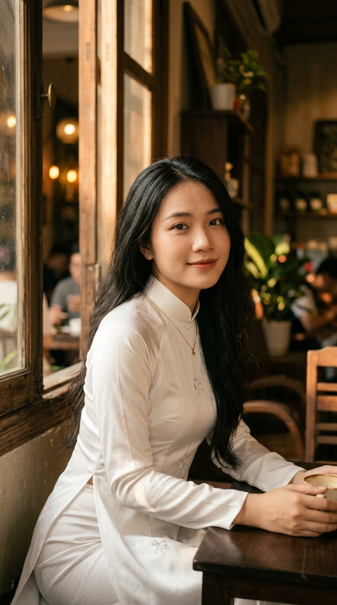 | 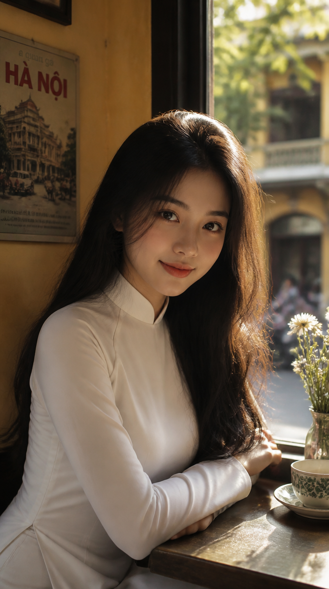 |

**Phân tích:** Đứng dài → AI thêm chi tiết bối cảnh (bàn, ly cà phê, tay). Có cảm giác "cinematic mobile". **Tận dụng full screen điện thoại = engagement cao.**

---

### 🖥️ Ratio 16:9 (Ngang) — 1920×1080

**Use case:** YouTube, banner web, presentation

| Nano Banana 2 | Image 2 |
|:---:|:---:|
| 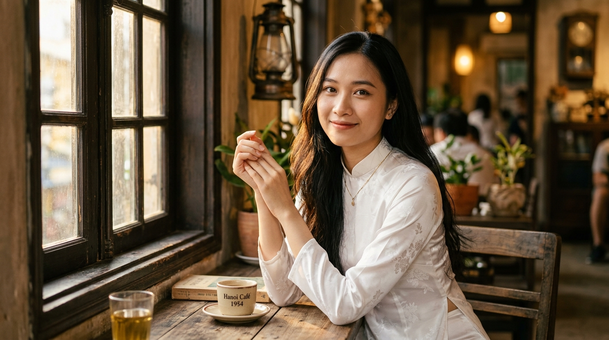 | 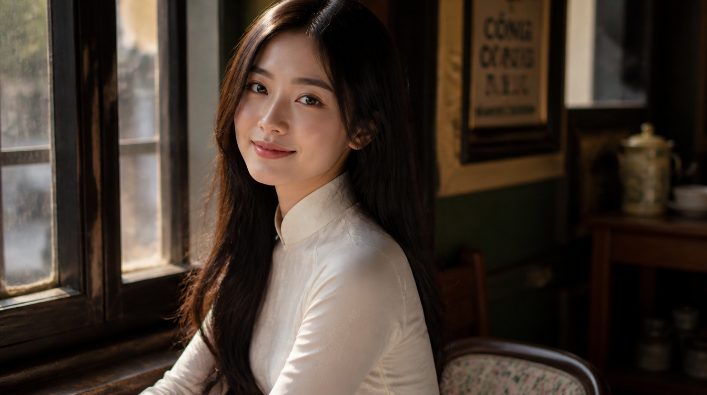 |

**Phân tích:** Ngang → AI thêm context bên cạnh (cửa sổ, ly cà phê). Composition kiểu "magazine cover". **Ratio standard cho mọi thứ horizontal.**

---

### 📷 Ratio 3:2 (Ngang nhẹ) — Photography Classic

**Use case:** Ảnh phong cách "chụp máy ảnh", presentation đẹp

| Nano Banana 2 | Image 2 |
|:---:|:---:|
| 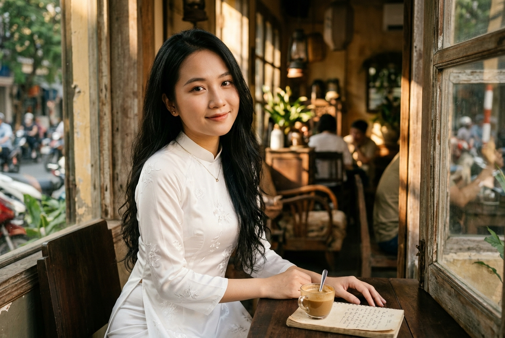 | 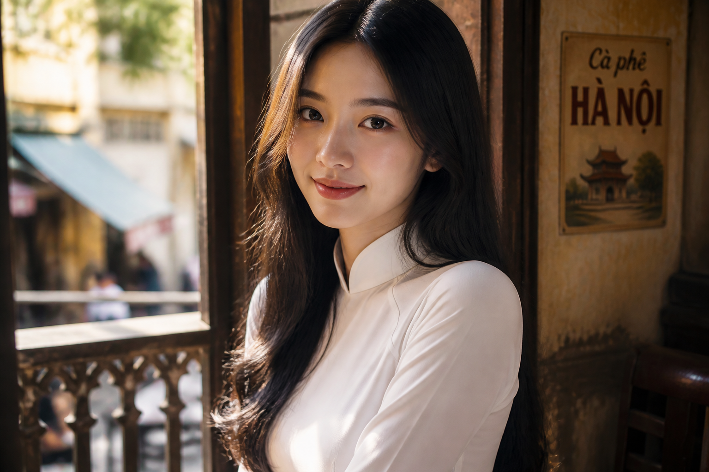 |

**Phân tích:** Ratio cổ điển của máy ảnh DSLR (35mm film). Tỷ lệ "vàng" cho composition. **Dùng khi muốn ảnh trông như chụp pro.**

---

### 🎬 Ratio 21:9 (Cinema Ultrawide) — Bí Mật Của Pro

**Use case:** Banner website, hero section, ảnh "epic"

| Nano Banana 2 | Image 2 |
|:---:|:---:|
|  | 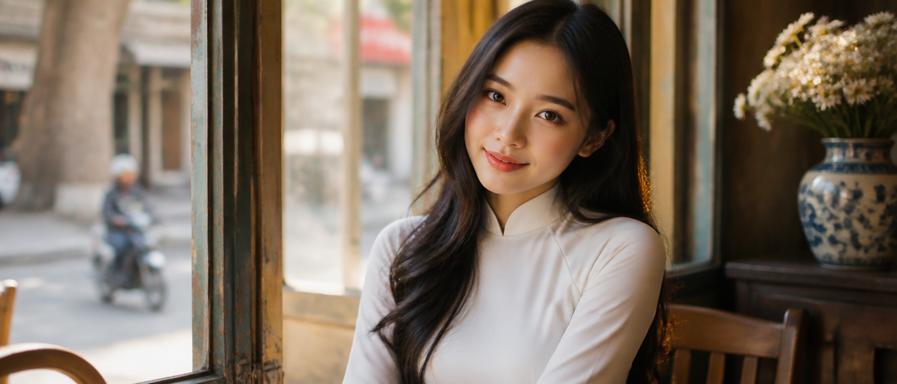 |

**Phân tích:** Cực rộng → AI compose như **frame phim điện ảnh**. Có cảm giác "wow factor" mạnh. **Đây là ratio ít người Việt dùng — bạn dùng = stand out!**

> 💡 **Pro tip:** 21:9 generate xong, có thể crop về 16:9 hoặc 1:1 cho social — **giữ được composition cinematic**, người ta tưởng bạn là photographer chuyên.

---

## 📊 Phần 4 — Resolution: 1K vs 2K vs 4K

### Resolution là gì?

**Resolution** = tổng số pixel của ảnh.

```
1K  ≈ 1024 × 1024   (~1 triệu pixel)
2K  ≈ 2048 × 2048   (~4 triệu pixel)
4K  ≈ 4096 × 4096   (~16 triệu pixel)
```

→ **4K = lớn hơn 1K khoảng 16 lần**, file nặng hơn nhiều.

### Khi nào cần 4K?

✅ **NÊN dùng 4K khi:**
- In ấn (poster, name card, brochure)
- Banner web kích thước lớn (full HD monitor)
- Ảnh sản phẩm thương mại (zoom in xem chi tiết)
- Lưu trữ archive cho tương lai

❌ **KHÔNG cần 4K khi:**
- Đăng social (Facebook, Instagram, TikTok đều compress xuống ~1K)
- Thumbnail YouTube (1280×720 đủ)
- Avatar profile (vài trăm pixel)
- Chia sẻ qua Zalo, Messenger

### So sánh chi phí (theo 0ai.vn)

| Resolution | Credit (~) | Time render | Khi dùng |
|:---:|:---:|:---:|---|
| 1K | 1× | Nhanh nhất | Test, social, web preview |
| 2K | 2-3× | Trung bình | Sweet spot cho creator |
| 4K | 4-8× | Chậm hơn | In ấn, banner lớn |

> ⚠️ **Lỗi đắt tiền:** Newbie hay mặc định dùng 4K cho mọi ảnh → đốt credit gấp 4-8 lần mà không tận dụng được. **Quy tắc: 2K là đủ 90% trường hợp.**

---

## 📋 Phần 5 — Cheatsheet 1 Trang (Bookmark Ngay!)

### 🎯 Quick Reference: Aspect Ratio

```
┌──────────────────────────────────────────┐
│  Tôi muốn đăng ở đâu? → Dùng ratio này   │
├──────────────────────────────────────────┤
│  📱 TikTok, Reels, Stories       → 9:16  │
│  📷 Instagram Feed                → 4:5  │
│  📘 Facebook Feed                 → 4:5  │
│  📺 YouTube Video                → 16:9  │
│  🎬 YouTube Shorts                → 9:16 │
│  💼 LinkedIn                     → 1.91:1│
│  🌐 Banner Web (hero)            → 16:9  │
│  📌 Pinterest                     → 2:3  │
│  ❓ Đa năng (an toàn)            → 1:1   │
│  🎨 Cinematic (stand out)        → 21:9  │
└──────────────────────────────────────────┘
```

### 📊 Quick Reference: Resolution

```
┌──────────────────────────────────────────┐
│  Mục đích?                  → Dùng size  │
├──────────────────────────────────────────┤
│  Test prompt nhanh              → 1K     │
│  Đăng social media              → 2K     │
│  Sweet spot creator             → 2K     │
│  In ấn (poster, card)          → 4K     │
│  Banner web full HD            → 4K     │
│  Avatar / thumbnail            → 1K     │
└──────────────────────────────────────────┘
```

### 🎁 Bonus: Workflow recommend

```
1. Test prompt với 1K (rẻ, nhanh) — pick prompt ngon
2. Generate final với 2K (đẹp + tiết kiệm)
3. Chỉ generate 4K khi thực sự cần (in ấn / banner)
```

→ Tiết kiệm 50-70% credit so với generate 4K mặc định.

---

## ❌ 3 Lỗi Đắt Tiền Cần Tránh

### Lỗi 1: Generate 4K cho ảnh đăng Facebook
**Hậu quả:** Đốt credit 4-8x. Facebook compress xuống ~1K, người xem **không thấy được sự khác biệt**.

**Fix:** Generate 2K cho social, dùng credit dư cho project khác.

---

### Lỗi 2: Dùng 1:1 cho mọi nền tảng
**Hậu quả:** Mất 30-40% engagement so với ratio đúng.

**Fix:** TikTok = 9:16, IG = 4:5, YouTube = 16:9. Match nền tảng → engagement tăng.

---

### Lỗi 3: Quên đổi ratio khi đổi mục đích
**Hậu quả:** Đăng cùng 1 ảnh lên TikTok (9:16) và YouTube (16:9) → 1 trong 2 nơi sẽ bị crop xấu.

**Fix:** Generate 21:9 → crop về 9:16 và 16:9 từ ảnh gốc. Tiết kiệm credit, vẫn đẹp ở cả 2 nơi.

---

## ⚡ Thử thách hôm nay

### 1. Generate prompt yêu thích của bạn ở 3 ratio
Cùng 1 prompt, đổi: 1:1 → 4:5 → 9:16. So sánh composition khác biệt.

### 2. Test ratio 21:9 (cinematic)
Hầu hết người Việt chưa thử. Bạn thử = ảnh nổi bật ngay.

### 3. Tự xây cheatsheet riêng
Save lại cheatsheet ratio + resolution vào điện thoại / máy tính. Bookmark vào nơi dễ thấy.

📸 Share kết quả vào [Issues](../../issues) hoặc Facebook tag mình!

---

## 🤔 FAQ

**Q: Mình đổi ratio sau khi generate được không?**
A: **Có** (crop bằng CapCut, Photoshop, Canva) nhưng:
- Crop từ ảnh lớn → ảnh nhỏ hơn
- Composition có thể bị mất chi tiết quan trọng
- **Tốt nhất:** Generate đúng ratio ngay từ đầu.

**Q: 0ai.vn có bao nhiêu ratio để chọn?**
A: Tùy model, thường có 6-8 preset: 1:1, 4:5, 5:4, 9:16, 16:9, 3:4, 4:3, 21:9, 9:21. Một số model cho phép custom width/height.

**Q: Generate 4K có đẹp hơn 2K nhìn bằng mắt thường không?**
A: **Không** trên màn hình thường (Full HD trở xuống). Chỉ thấy khác biệt khi zoom in 200%+ hoặc in cỡ A2 trở lên.

**Q: Mình lưu ảnh 4K rồi resize xuống 1K có lợi gì không?**
A: **Có** nếu cần độ chi tiết cao. Resize ảnh 4K → 1K cho ảnh sắc nét hơn so với generate trực tiếp 1K. Nhưng tốn 4-8× credit, **chỉ làm khi thực sự quan trọng**.

**Q: Aspect ratio nào "an toàn" nếu không biết đăng ở đâu?**
A: **1:1** — vuông là native cho mọi nền tảng, ít bị crop nhất.

**Q: Có nên generate cùng prompt với 6 ratio như mình test không?**
A: **Không cần**. Chọn 1-2 ratio chính theo nền tảng bạn đăng. Day 4 này chỉ để **so sánh học hỏi**, không phải workflow hằng ngày.

---

## 🎯 Recap

Sau Day 4 bạn đã:
- ✅ Hiểu 6 aspect ratio và khi nào dùng
- ✅ Có bảng matching ratio — nền tảng để tham khảo
- ✅ Biết khi nào cần 4K (hiếm) và khi 2K là đủ (90% trường hợp)
- ✅ Tránh được 3 lỗi đắt tiền của newbie
- ✅ Biết "secret weapon" 21:9 để stand out

→ Sẵn sàng cho **Day 5 — Prompt Tiếng Việt vs Tiếng Anh** 🚀

---

## ➡️ Ngày mai (Day 5)

**Prompt tiếng Việt vs tiếng Anh — khi nào dùng cái nào?** Test thực tế: cùng 1 ý tưởng, 2 ngôn ngữ, kết quả khác nhau ra sao trên từng model.

📌 **Đừng quên:** ⭐ Star repo, follow [Facebook](https://facebook.com/daclinh.tran) / [X](https://x.com/Daclinh0AI).

---

**📅 Day 4/30** | [⏪ Day 3](./day-03.md) | [Curriculum](../CURRICULUM.md) | [📊 Pricing](../PRICING.md) | [Day 5 ➡️](./day-05.md)

---

*Tác giả: Linh0AI · #0aiDay04 #AspectRatio #AITaoAnh #0aiVN*
