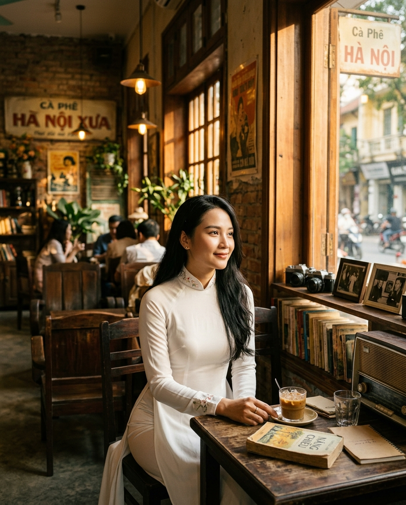
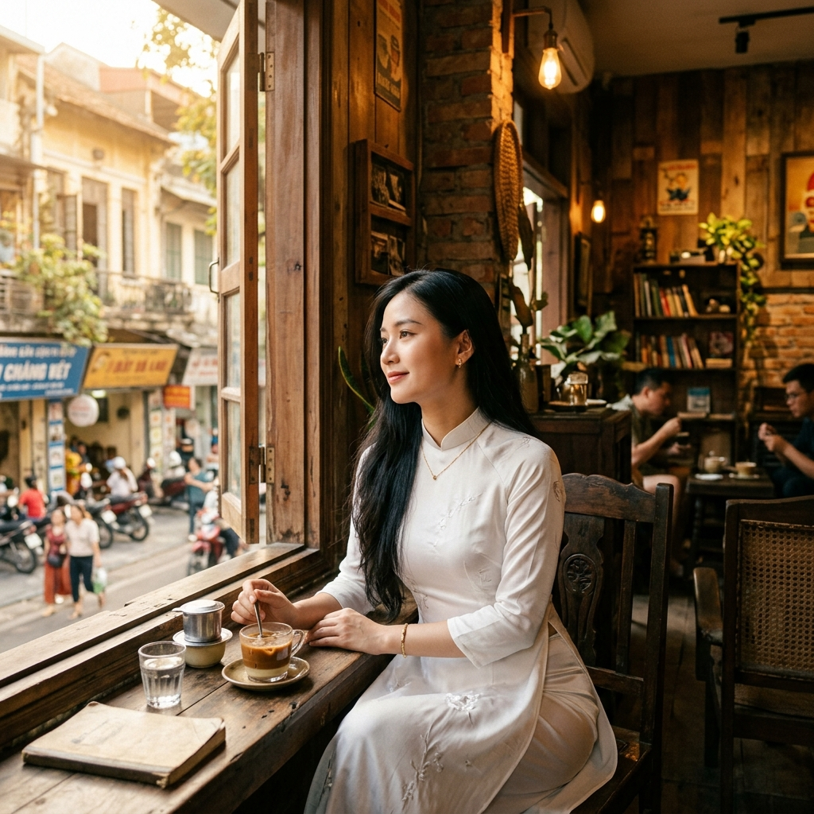
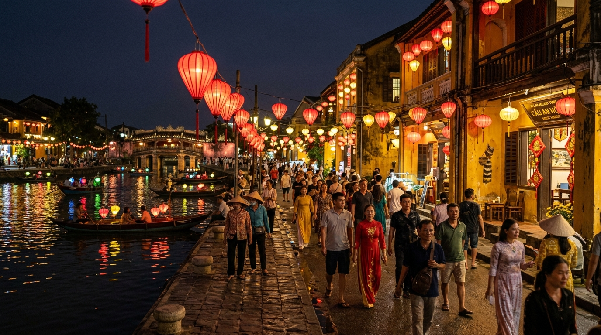
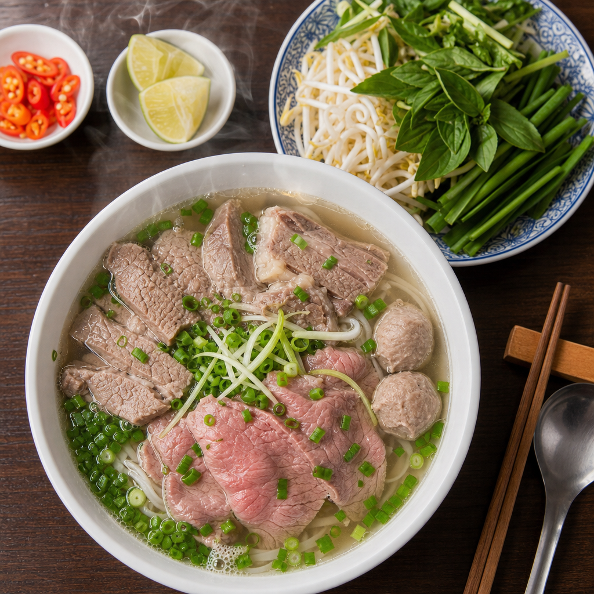
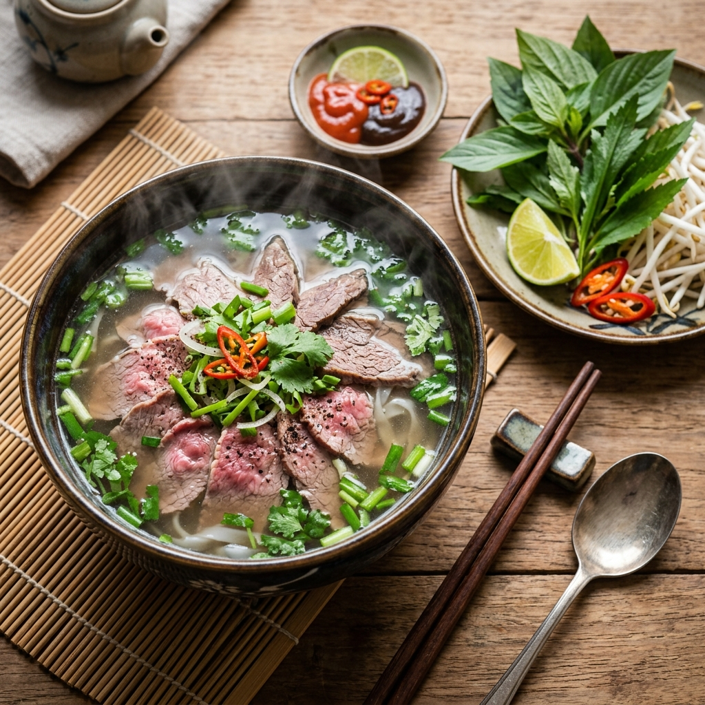
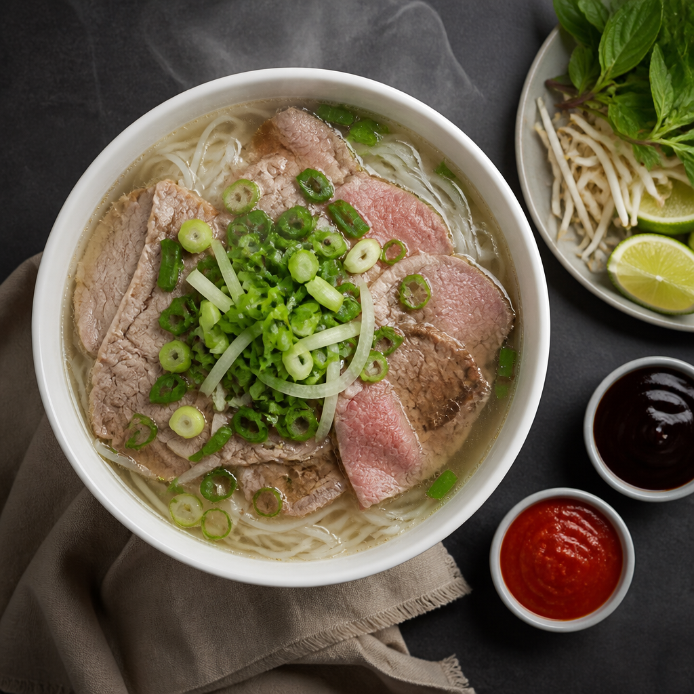

# Day 5 — Prompt Tiếng Việt vs Tiếng Anh: Khi nào dùng cái nào?

> 🔵 **Level:** Intermediate
> ⏱️ **Thời gian đọc:** 15 phút | **Thực hành:** 25 phút
> 📅 **Ngày 5/30**

---

## 🎯 Mục tiêu hôm nay

Sau bài này, bạn sẽ:
- Trả lời được câu hỏi muôn thuở: **"Tiếng Việt có viết prompt được không?"**
- Biết model nào hiểu tiếng Việt **TỐT** và model nào không
- Hiểu **3 trường hợp** PHẢI dùng tiếng Anh
- Biết **3 trường hợp** tiếng Việt cho kết quả TỐT HƠN tiếng Anh
- Có **decision matrix** chọn ngôn ngữ theo tình huống
- Tránh được **lỗi dịch máy nguy hiểm** (Google Translate)

> 💡 **Spoiler:** Câu trả lời không phải "tiếng Anh tốt hơn" hay "tiếng Việt tốt hơn" — mà là **HYBRID**. Đọc tiếp để biết bí kíp.

> 📋 **Prompts đầy đủ trong bài**: [`prompts/day-05.txt`](../prompts/day-05.txt)
> Copy/download nguyên văn về paste vào 0ai.vn — không phải gõ lại từ trong bài.

---
## 📖 Phần 1 — Tại sao có cuộc tranh luận này?

### Quá khứ: AI chỉ hiểu tiếng Anh

Hầu hết model AI tạo ảnh được train chủ yếu trên data tiếng Anh:
- Stable Diffusion: 95% data tiếng Anh
- Midjourney: chủ yếu tiếng Anh
- Flux: tiếng Anh là native

→ Vài năm trước, **prompt tiếng Việt = ảnh xấu**. Cộng đồng quen với tư duy "phải tiếng Anh mới đẹp".

### Hiện tại: Model multilingual mạnh hơn

Năm 2025-2026, các model mới được train trên data đa ngôn ngữ:
- **Nano Banana 2 (Gemini)** — Google đầu tư mạnh cho multilingual
- **Z-Image** — model Trung Quốc, hiểu nhiều ngôn ngữ Á
- **Seedream** — ByteDance, hỗ trợ tiếng Việt khá tốt
- **GPT Image 2 (OpenAI)** — ChatGPT tiếng Việt → ảnh tiếng Việt

→ **Tiếng Việt giờ đã là "first-class citizen"** với nhiều model. Nhưng **không phải mọi trường hợp**.

---

## 🎬 Phần 2 — TEST THỰC TẾ: VI vs EN

Mình test 3 chủ đề × 2 ngôn ngữ × 2 model = **12 ảnh** để so sánh trực quan.

---

### 🎨 Chủ đề 1: CHÂN DUNG NGƯỜI VIỆT

#### 🇻🇳 Prompt tiếng Việt:
```
Phụ nữ Việt 25 tuổi tóc dài đen, mặc áo dài trắng, ngồi trong quán 
cà phê vintage Hà Nội, ánh nắng vàng buổi chiều, phong cách điện ảnh
```

| Nano Banana 2 | Image 2 |
|:---:|:---:|
|  |  |

#### 🇬🇧 Prompt tiếng Anh:
```
25-year-old Vietnamese woman with long black hair, wearing white áo dài, 
sitting in vintage Hanoi coffee shop, golden afternoon light, cinematic style
```

| Nano Banana 2 | Image 2 |
|:---:|:---:|
|  |  |

**Phân tích:**
- **NBN2** xử lý cả 2 ngôn ngữ tốt — ảnh chất lượng tương đương
- **Image 2** với tiếng Anh có vẻ chi tiết hơn → mạnh về tag kỹ thuật tiếng Anh
- **Tiếng Việt** giúp giữ "hồn Việt" tốt hơn (kiểu áo dài đúng truyền thống)

---

### 🌅 Chủ đề 2: CẢNH KIẾN TRÚC VIỆT

#### 🇻🇳 Prompt tiếng Việt:
```
Phố cổ Hội An vào buổi tối, đèn lồng đỏ thắp sáng, người dân địa phương 
đi bộ trên phố, mặt nước phản chiếu ánh đèn, không khí ấm cúng, ảnh chân thực
```

| Nano Banana 2 | Image 2 |
|:---:|:---:|
|  |  |

#### 🇬🇧 Prompt tiếng Anh:
```
Hoi An ancient town at night, red lanterns illuminated, locals walking 
on the street, water reflections of lights, warm atmosphere, photorealistic
```

| Nano Banana 2 | Image 2 |
|:---:|:---:|
|  |  |

**Phân tích:**
- Đây là test thú vị nhất! Cảnh Việt Nam có **đặc trưng văn hóa**
- **Tiếng Việt** thường cho kiến trúc đậm chất Việt hơn (mái ngói, đèn lồng đúng kiểu)
- **Tiếng Anh** đôi khi cho kết quả "Châu Á chung" — có thể nhầm với Trung Quốc/Thái

> 💡 **Insight:** Khi vẽ địa danh Việt Nam, **tiếng Việt thường thắng**.

---

### 🍜 Chủ đề 3: SẢN PHẨM / MÓN ĂN VIỆT

#### 🇻🇳 Prompt tiếng Việt:
```
Bát phở bò đặc biệt Hà Nội, nước dùng trong, thịt bò tươi, hành lá 
cắt nhỏ, hơi nước bốc lên, đĩa rau thơm bên cạnh, chụp từ trên xuống, 
ảnh sản phẩm chuyên nghiệp
```

| Nano Banana 2 | Image 2 |
|:---:|:---:|
|  |  |

#### 🇬🇧 Prompt tiếng Anh:
```
Special Hanoi beef pho bowl, clear broth, fresh beef slices, chopped 
green onions, steam rising, fresh herbs plate on the side, top-down view, 
professional product photography
```

| Nano Banana 2 | Image 2 |
|:---:|:---:|
|  |  |

**Phân tích:**
- **Phở** là test khó — model phải biết "phở" trông như thế nào
- **Tiếng Việt:** thường cho phở đúng chuẩn (bát sứ trắng, sợi bánh phở mỏng, rau thơm Việt)
- **Tiếng Anh:** đôi khi nhầm thành ramen Nhật hoặc mì khác

> 💡 **Quy tắc:** Món ăn / sản phẩm có **tên Việt riêng** → ưu tiên tiếng Việt.

---

## ✅ Phần 3 — 3 Trường Hợp DÙNG TIẾNG ANH

Tiếng Anh **tốt hơn** trong 3 trường hợp này:

### 1. Tag kỹ thuật chuyên ngành nhiếp ảnh

```
✅ Dùng tiếng Anh:
- bokeh, depth of field, shallow DOF
- 85mm lens, 50mm prime, wide angle
- f/1.4 aperture, ISO 100, shutter speed
- chromatic aberration, lens flare
- HDR, color grading, white balance

❌ Đừng dịch sang tiếng Việt:
- "độ sâu trường ảnh nông" → AI không hiểu rõ
- "ống kính 85mm" → ổn nhưng yếu hơn "85mm lens"
```

### 2. Style đặc biệt (đã thành "thương hiệu")

```
✅ Dùng tiếng Anh:
- cinematic, editorial, fashion photography
- hyper-realistic, photorealistic, ultra-detailed
- film noir, vaporwave, cyberpunk, steampunk
- baroque, art nouveau, minimalist
- watercolor, oil painting, gouache

❌ Đừng dịch:
- "phong cách điện ảnh" → ổn nhưng "cinematic" mạnh hơn
- "siêu thực" có thể bị nhầm là "surreal" thay vì "hyper-realistic"
```

### 3. Composition terms (thuật ngữ bố cục)

```
✅ Dùng tiếng Anh:
- close-up, medium shot, wide shot, full body
- top-down view, low angle, over the shoulder
- rule of thirds, golden ratio, leading lines
- symmetrical composition, centered subject

❌ Đừng dịch:
- "góc nhìn từ trên xuống" → "top-down" rõ hơn
- "quy tắc 1/3" → "rule of thirds" universal
```

---

## ✅ Phần 4 — 3 Trường Hợp DÙNG TIẾNG VIỆT (tốt hơn!)

### 1. Văn hóa Việt Nam đặc trưng

```
✅ Dùng tiếng Việt:
- áo dài, áo bà ba, áo tứ thân
- nón lá, nón quai thao, khăn rằn
- đèn lồng (Hội An), đèn ông sao
- cầu Long Biên, cầu vàng Đà Nẵng
- chùa Một Cột, lăng Bác

⚠️ Tiếng Anh có thể bị "Châu Á chung":
- "Vietnamese conical hat" → đôi khi giống Trung Quốc
- "traditional dress" → có thể vẽ kimono Nhật
```

### 2. Địa danh Việt Nam

```
✅ Dùng tiếng Việt:
- Phố cổ Hội An, phố Hàng Bạc Hà Nội
- Hồ Gươm, hồ Tây, hồ Hoàn Kiếm
- Vịnh Hạ Long, đảo Phú Quốc
- Sapa, Đà Lạt, Mộc Châu
- Phố đi bộ Nguyễn Huệ, chợ Bến Thành

⚠️ Tiếng Anh viết sai dấu = AI confused:
- "Halong Bay" → OK
- "Hoi An ancient town" → OK
- Nhưng "Sapa" / "Da Lat" có thể bị xem là tên chung
```

### 3. Món ăn / sản phẩm Việt

```
✅ Dùng tiếng Việt:
- phở bò, phở gà, bún bò Huế
- bánh mì pate, bánh mì thịt nướng
- cà phê sữa đá, cà phê đen
- nem rán, gỏi cuốn, chả giò
- bánh xèo, bánh khọt, bánh canh

⚠️ Tiếng Anh không có tên riêng:
- "Vietnamese rice noodle soup" → AI vẽ ramen
- "Vietnamese coffee" → đôi khi vẽ cappuccino
- "Vietnamese sandwich" → có thể vẽ banh mi sai
```

---

## 🏆 Phần 5 — HYBRID Strategy: Bí Kíp PRO

### Công thức tối ưu:

```
[Subject + Văn hóa Việt: tiếng VIỆT]
+ 
[Style + Composition + Quality: tiếng ANH]
```

### Ví dụ áp dụng:

**❌ Toàn tiếng Việt** (yếu về tag kỹ thuật):
```
Phụ nữ Việt mặc áo dài trắng, ngồi trong quán cà phê, ánh sáng vàng buổi chiều, phong cách điện ảnh, độ phân giải cao
```

**❌ Toàn tiếng Anh** (yếu về văn hóa Việt):
```
Vietnamese woman in white traditional dress, sitting in coffee shop, golden afternoon light, cinematic style, high resolution
```

**✅ HYBRID — TỐT NHẤT:**
```
Phụ nữ Việt 25 tuổi mặc áo dài trắng, ngồi tại quán cà phê vintage Hà Nội, 
cinematic close-up portrait, golden hour lighting, shallow depth of field, 
bokeh background, 85mm lens, professional editorial photography, sharp focus, 
4K, photorealistic, masterpiece
```

→ **Subject + cảm hứng Việt** dùng tiếng Việt → AI hiểu đúng văn hóa
→ **Tag kỹ thuật + style** dùng tiếng Anh → AI hiểu đúng kỹ thuật

> 💡 Đây là cách viết prompt mà **hầu hết creator pro Việt Nam dùng**, nhưng ít ai dạy.

---

## 📊 Phần 6 — Decision Matrix

### Bảng nhanh: Tình huống nào → ngôn ngữ nào?

| Tình huống | Ngôn ngữ | Lý do |
|------------|:---:|-------|
| Chủ thể là người Việt | 🇻🇳 | Giữ "hồn Việt" |
| Trang phục văn hóa (áo dài, nón lá) | 🇻🇳 | Tránh nhầm với Á khác |
| Địa danh Việt Nam | 🇻🇳 | AI biết "Hà Nội" hơn "Hanoi" |
| Món ăn Việt | 🇻🇳 | Không có tên Anh chính xác |
| Sự kiện văn hóa (Tết, Trung Thu) | 🇻🇳 | Đặc thù VN |
| Camera angle / composition | 🇬🇧 | Thuật ngữ chuyên ngành |
| Style nghệ thuật | 🇬🇧 | Đã thành "ngôn ngữ AI" |
| Quality tags | 🇬🇧 | 4K, sharp focus, masterpiece... |
| Lighting types | 🇬🇧 | Golden hour, neon, dramatic... |
| Lens & camera info | 🇬🇧 | 85mm, f/1.4, shot on Sony A7 |
| **Hybrid (recommend)** | 🇻🇳 + 🇬🇧 | Tốt nhất cho mọi trường hợp |

---

## ⚠️ Phần 7 — LỖI NGUY HIỂM: Google Translate

### Tại sao Google Translate hỏng prompt?

Người mới hay dùng Google dịch tiếng Việt sang Anh → paste vào AI. Vấn đề:

```
❌ Tiếng Việt gốc:
"Cô gái mặc áo dài đứng dưới gốc cây phượng vĩ, hoa rụng đầy đất"

❌ Google Translate:
"The girl wearing ao dai standing under the pheonix tree, 
flowers falling on the ground"

⚠️ Vấn đề:
- "phượng vĩ" → "pheonix tree" SAI (phải là "flame tree" hoặc "Royal Poinciana")
- "Cô gái" → "The girl" mất context tuổi
- Dịch word-by-word, mất nghĩa
```

### Cách đúng: Viết tiếng Việt natural HOẶC tiếng Anh natural

**❌ Đừng làm:**
1. Viết tiếng Việt
2. Google dịch sang Anh
3. Paste vào AI

**✅ Nên làm — Cách 1 (tiếng Việt):**
- Viết tiếng Việt natural, đầy đủ
- Test xem model có hiểu không
- Nếu không hiểu → mới chuyển Anh

**✅ Nên làm — Cách 2 (hybrid):**
- Subject văn hóa Việt → tiếng Việt
- Tag kỹ thuật → tiếng Anh
- Trộn natural

**✅ Nên làm — Cách 3 (tiếng Anh chuyên):**
- Tự viết tiếng Anh từ ý tưởng (không dịch)
- Dùng từ vựng cheatsheet Day 3
- Sai cũng OK, AI vẫn hiểu phần lớn

---

## ⚡ Thử thách hôm nay

### 1. Test ý tưởng yêu thích trên 3 cách
Chọn 1 ý tưởng (vd: "Bún bò Huế trong tô đẹp"), viết 3 prompt:
- Toàn tiếng Việt
- Toàn tiếng Anh
- Hybrid (Việt + Anh)

→ So sánh kết quả → bạn sẽ thấy hybrid thường thắng.

### 2. Tạo "danh sách từ vựng cá nhân"
Mỗi ngày, viết xuống 5 từ:
- 3 từ tiếng Việt cho văn hóa/địa danh
- 2 từ tiếng Anh cho tag kỹ thuật

→ Sau 1 tháng có 150 từ riêng — bộ "ngôn ngữ riêng" cho prompt của bạn.

### 3. Sửa prompt cũ
Lấy 1 prompt bạn từng dùng (toàn tiếng Anh hoặc toàn Việt) → sửa thành **hybrid** → so sánh.

📸 Share kết quả vào [Issues](../../issues) hoặc Facebook tag mình!

---

## 🤔 FAQ

**Q: Vậy nếu mình giỏi tiếng Anh thì viết toàn tiếng Anh được không?**
A: Được, nhưng **mất "hồn Việt"** với chủ thể Việt Nam. Hybrid vẫn tối ưu nhất.

**Q: Mình kém tiếng Anh, viết toàn tiếng Việt được không?**
A: Được với NBN2, Z-Image, Seedream. Nhưng **học vài tag tiếng Anh cốt lõi** sẽ tăng chất lượng nhanh:
- `cinematic, photorealistic, 4K, sharp focus, bokeh`
- 5-10 tag tiếng Anh = đủ cho 80% prompt.

**Q: Model nào hiểu tiếng Việt tốt nhất?**
A: Theo test của mình:
- 🥇 **Nano Banana 2** — hiểu tiếng Việt rất tốt
- 🥈 **Z-Image** — tốt cho tiếng Á (sắp test ở Day 13)
- 🥉 **Seedream** — khá ổn
- ❌ **Flux** — yếu với tiếng Việt, nên dùng tiếng Anh

**Q: "áo dài" viết có dấu hay không dấu thì model hiểu hơn?**
A: NBN2 hiểu cả 2. Tốt nhất là **viết có dấu** (đúng tiếng Việt). Một số model cũ chỉ hiểu không dấu — test thử.

**Q: Có nên dùng cả 2 ngôn ngữ trong 1 từ không?**
A: Có! Vd: `phụ nữ Việt wearing áo dài with cinematic lighting` — pha trộn được, AI vẫn hiểu.

**Q: Prompt dài tiếng Việt có làm AI chậm không?**
A: Không. Token tiếng Việt và tiếng Anh xử lý tương đương. **Độ dài** quan trọng hơn ngôn ngữ.

---

## 🎯 Recap

Sau Day 5 bạn đã:
- ✅ Hiểu khi nào dùng tiếng Việt, khi nào dùng tiếng Anh
- ✅ Biết bí kíp HYBRID — kết hợp 2 ngôn ngữ cho kết quả tối ưu
- ✅ Có decision matrix cho mọi tình huống
- ✅ Biết tránh lỗi Google Translate
- ✅ Đã test 3 chủ đề × 2 ngôn ngữ × 2 model = 12 ảnh comparison

→ Sẵn sàng cho **Day 6 — Negative prompt & quality tags** 🚀

---

## ➡️ Ngày mai (Day 6)

**Negative prompt & quality tags** — Bí kíp lọc lỗi và tăng chất lượng. Danh sách negative prompt "đa năng" + quality tags theo style.

📌 **Đừng quên:** ⭐ Star repo, follow [Facebook](https://facebook.com/daclinh.tran) / [X](https://x.com/Daclinh0AI).

---

**📅 Day 5/30** | [⏪ Day 4](./day-04.md) | [Curriculum](../CURRICULUM.md) | [📊 Pricing](../PRICING.md) | [Day 6 ➡️](./day-06.md)

---

*Tác giả: Linh0AI · #0aiDay05 #PromptEngineering #AITaoAnh #0aiVN*
