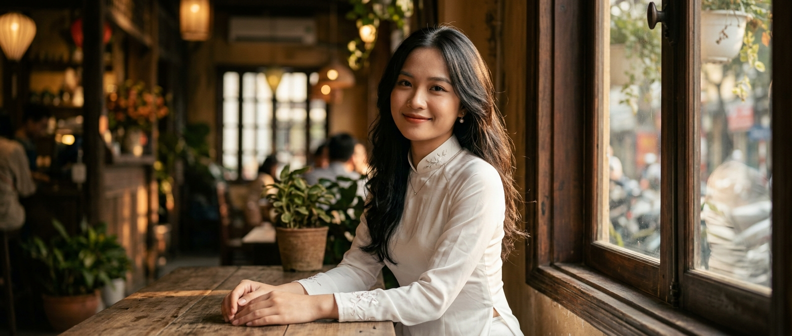
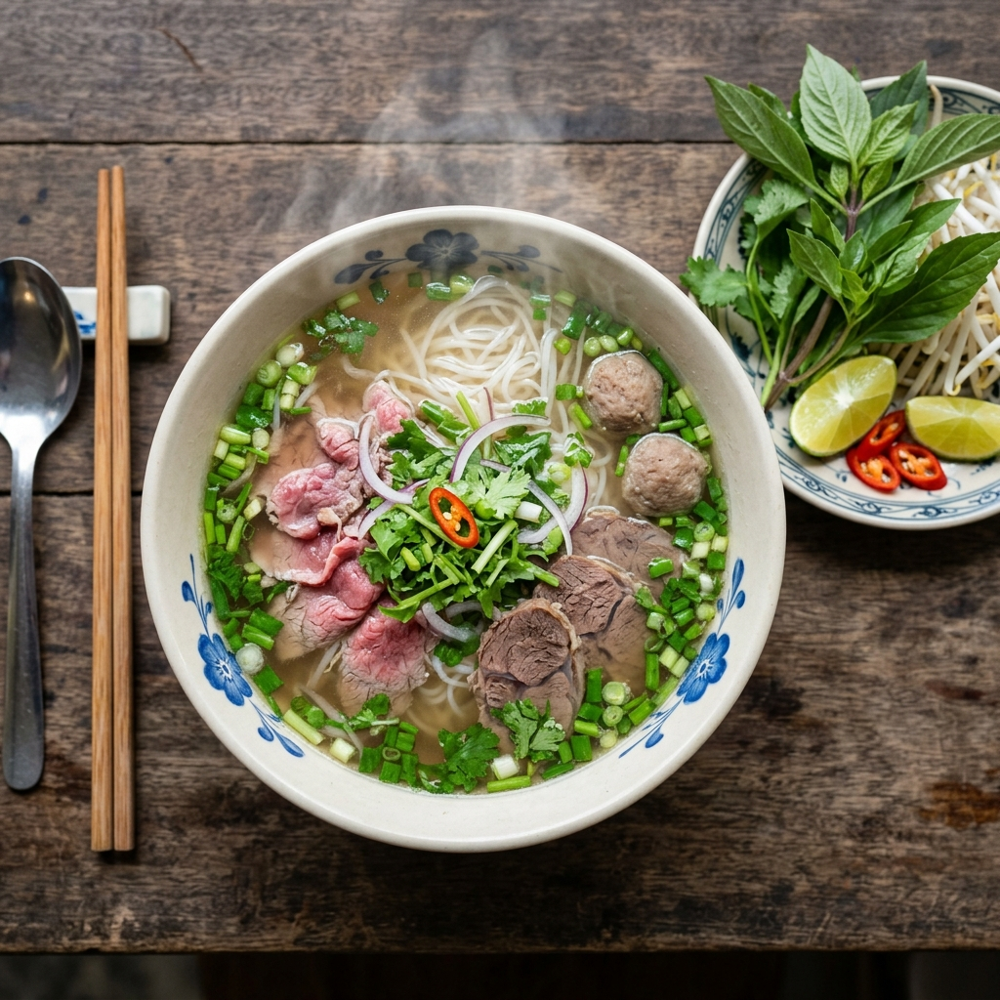
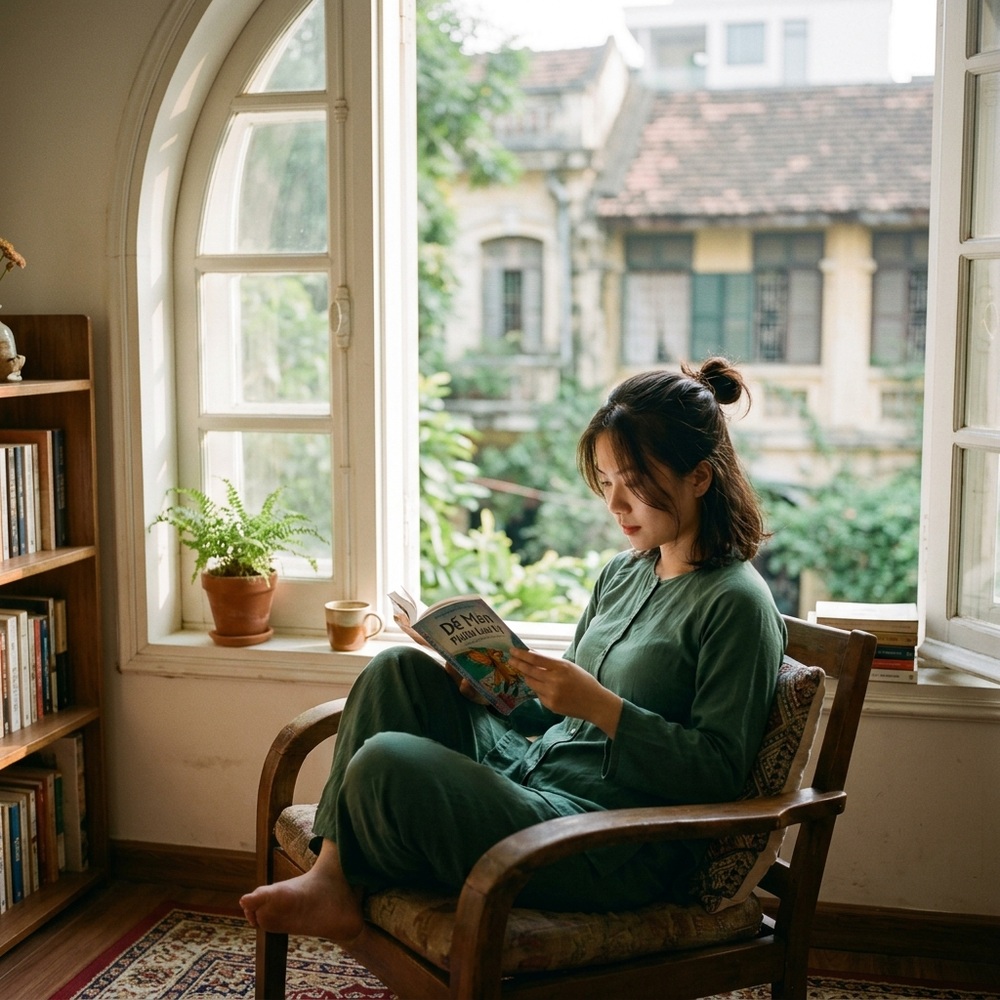

# Day 7 — Tổng Kết Tuần 1 + Mini Challenge

> 🟢🔵 **Level:** All levels — đặc biệt cho ai đã đi qua Day 1-6
> ⏱️ **Thời gian đọc:** 10 phút | **Thực hành:** Mini Challenge — 1-2 tiếng
> 📅 **Ngày 7/30**

---

## 🎉 Mở đầu — Bạn vừa hoàn thành Tuần 1!

Nếu bạn đang đọc đây và đã đi qua Day 1-6, **xin chúc mừng**. Bạn vừa hoàn thành **23% hành trình 30 ngày** với những kiến thức nền tảng quan trọng nhất của AI tạo ảnh.

Hôm nay là ngày **đặc biệt** — không có model mới, không có prompt mới. Hôm nay là ngày **tổng kết, phản tư, và thử thách**.

---

## 🗺️ Phần 1 — Hành Trình Tuần 1

```
Day 1 ─→ Giới thiệu 0ai.vn + So sánh NBN2 vs Image 2
   │
Day 2 ─→ Đăng ký + Credit Strategy + Tour Dashboard
   │
Day 3 ─→ Anatomy of a Prompt — 5 thành phần cốt lõi
   │
Day 4 ─→ Aspect Ratio, Resolution & Settings
   │
Day 5 ─→ Prompt tiếng Việt vs tiếng Anh (Hybrid is king!)
   │
Day 6 ─→ Negative Prompt & Quality Tags
   │
Day 7 ─→ TỔNG KẾT — bạn đang ở đây! 🎯
```

### Stats của bạn (nếu làm hết bài tập):

- 📸 **~85 ảnh** đã tạo
- 🎨 **2 model** đã thử (NBN2 + Image 2)
- 📐 **6 aspect ratio** đã test
- 🌐 **2 ngôn ngữ** đã so sánh
- 🛡️ **1 negative prompt template** đã build
- ⭐ **6 style quality tags** đã hiểu

---

## 💎 Phần 2 — 7 Bài Học LỚN Của Tuần 1

Đây là 7 insight mà mình rút ra sau 6 ngày thực hành — bạn cũng nên ghi lại:

### 1️⃣ AI tạo ảnh không phải "magic" — phải hiểu prompt

Người mới thường nghĩ "AI thông minh, gõ gì cũng hiểu". Sự thật: AI chỉ vẽ những gì bạn **rõ ràng yêu cầu**. Prompt mơ hồ → ảnh random.

### 2️⃣ Mỗi model có "gu" khác nhau — chọn đúng việc

NBN2 mạnh về chân thực. Image 2 nhanh và ổn định. Seedream chân dung tốt. **Không có model "tốt nhất"** — chỉ có model "phù hợp nhất với việc cụ thể".

### 3️⃣ Cấu trúc prompt = công thức 5 thành phần

```
Subject + Style + Composition + Lighting + Quality tags
```

Nhớ công thức này, viết prompt chuyên nghiệp ngay.

### 4️⃣ Aspect ratio quyết định composition

Cùng prompt, đổi ratio → AI compose khung hình **hoàn toàn khác**. 9:16 cho phụ nữ áo dài full-body. 21:9 cho cảnh cinematic.

### 5️⃣ Hybrid prompt > Toàn Việt > Toàn Anh

```
[Văn hóa Việt: tiếng VIỆT] + [Tag kỹ thuật: tiếng ANH]
```

Bí kíp pro mà ít người dạy.

### 6️⃣ Negative prompt fix 30% lỗi ảnh

Chỉ thêm 5 từ: `blurry, distorted, bad anatomy, extra fingers, plastic skin` → ảnh đẹp hơn ngay 30%.

### 7️⃣ Quality tags là "gia vị" — không phải magic

`4K, masterpiece, sharp focus` không tự động làm ảnh đẹp. Quan trọng nhất vẫn là **cấu trúc + nội dung prompt**.

---

## 📸 Phần 3 — 5 Ảnh Tâm Đắc Nhất Của Tuần 1

Mình chọn ra 5 ảnh đẹp nhất từ ~85 ảnh đã tạo trong tuần. Đây là "best of":

### 🥇 #1: Chân dung Master Prompt (Day 3)


**Day:** 3 — Anatomy of a Prompt (Level 10)
**Model:** Nano Banana 2
**Lý do thích:** Đây là **prompt 50+ từ master** với đầy đủ 5 thành phần. Kết quả: ảnh chuyên nghiệp như chụp bằng máy ảnh thật, có "hồn" Việt Nam.

---

### 🥈 #2: Cinematic 21:9 (Day 4)



**Day:** 4 — Aspect Ratio
**Model:** Nano Banana 2
**Lý do thích:** Ratio 21:9 ít người Việt biết tận dụng. Ảnh có cảm giác **frame phim điện ảnh** — wow factor cực mạnh.

---

### 🥉 #3: Phở Việt Hybrid (Day 5)



**Day:** 5 — VI vs EN
**Model:** Nano Banana 2
**Lý do thích:** Tiếng Việt thắng tiếng Anh ở **món ăn Việt**. AI hiểu "phở bò Hà Nội" tốt hơn "Vietnamese beef noodle soup".

---

### 🏅 #4: Sau Negative Prompt (Day 6)



**Day:** 6 — Negative Prompt
**Model:** Nano Banana 2
**Lý do thích:** Đây là phiên bản "ALL-IN" với full negative + quality tags. Mặt người chuẩn, da tự nhiên, không "AI vibe" nữa.

---

### 🌟 #5: So sánh Hai Model (Day 1)


**Day:** 1 — Giới thiệu
**Model:** Nano Banana 2
**Lý do thích:** Đây là ảnh **đầu tiên** mình tạo trên 0ai.vn. Đánh dấu khởi đầu hành trình. "Cộng cà phê" — đậm chất Việt!

---

## 🏆 Phần 4 — MINI CHALLENGE TUẦN 1

### 🎯 Theme: **"Phong cảnh Việt Nam — Quê hương tôi"**

### 📋 Yêu cầu

Tạo **5 ảnh AI** với chủ đề **phong cảnh Việt Nam**, mỗi ảnh thể hiện 1 góc cảnh khác nhau của đất nước.

**Gợi ý chủ đề con:**
- 🏞️ Phố cổ Hà Nội / Hội An
- 🌅 Vịnh Hạ Long / Phú Quốc
- 🍃 Sapa / Mộc Châu / Đà Lạt
- 🌾 Ruộng bậc thang / cánh đồng lúa
- 🏖️ Biển Đà Nẵng / Nha Trang / Mũi Né
- 🛕 Chùa cổ / di tích lịch sử
- 🌃 Sài Gòn về đêm / Hà Nội về đêm

→ Tự do chọn góc cảnh yêu thích của bạn!

### ✅ Tiêu chí áp dụng kiến thức Tuần 1

| # | Yêu cầu | Liên quan đến |
|:---:|---|:---:|
| 1 | Ít nhất **2 model** khác nhau (NBN2 + Image 2 hoặc khác) | Day 1 |
| 2 | Áp dụng **5 thành phần prompt** | Day 3 |
| 3 | Test ít nhất **3 aspect ratio** khác nhau | Day 4 |
| 4 | Có ít nhất **1 ảnh hybrid prompt** (VN + EN) | Day 5 |
| 5 | Tất cả ảnh dùng **negative prompt + quality tags** | Day 6 |

### 📤 Cách nộp bài

#### Cách 1: GitHub Issues (chính thức)

1. Vào tab **[Issues](../../issues)** trên repo
2. Click **"New Issue"**
3. Title format: `[Mini Challenge Tuần 1] - {Tên phong cảnh}`
   - Vd: `[Mini Challenge Tuần 1] - Quê tôi Hội An`
4. Trong issue body, ghi:
   - **5 ảnh** (kéo thả vào)
   - **Prompt** dùng cho mỗi ảnh
   - **Model + ratio** đã chọn
   - **Insight tự rút ra** (ngắn 2-3 câu)

#### Cách 2: Nhóm Zalo (nhanh hơn)

Share 5 ảnh trong nhóm + caption ngắn → mình tag vào bài Day 14.

### 🎁 Phần thưởng

- 🥇 **Top 3** → mention trong bài Day 14 (so sánh model) — exposure cho cộng đồng
- 🌟 **Tất cả participants** → ghi tên trong file `CONTRIBUTORS.md`
- 🎨 **Best prompt** → đưa vào thư viện `prompts/community-best.txt`
- 💬 **Best insight** → mình personally feedback chi tiết về prompt của bạn

### ⏰ Deadline

Trước khi mình ra **Day 14** (Sunday tuần sau, 13/05/2026).

---

## 🤔 Phần 5 — FAQ Tổng Hợp Tuần 1

### Câu hỏi từ Day 1-6

**Q1: Mình mới bắt đầu, nên dùng model nào trước?**
→ **Nano Banana 2** cho chất lượng cao, **Image 2** nếu muốn brainstorm nhanh. (Day 1)

**Q2: 0ai.vn có miễn phí không?**
→ Không có free credit. Recommend mua **Credit Ultra Member 1tr** (1.1M credits) cho 3 tuần đầu học. (Day 2)

**Q3: Prompt phải dài cỡ nào mới tốt?**
→ 50-150 từ là sweet spot. Quá ngắn → vague. Quá dài (200+) → AI bỏ qua phần sau. (Day 3)

**Q4: Aspect ratio nào dùng cho TikTok / Facebook?**
→ TikTok = **9:16**, Facebook = **4:5**, YouTube = **16:9**. (Day 4)

**Q5: Mình kém tiếng Anh, có dùng được AI tạo ảnh không?**
→ Được! NBN2 hiểu tiếng Việt tốt. Học thêm 5-10 tag tiếng Anh cốt lõi (4K, sharp focus, bokeh, masterpiece) là đủ. (Day 5)

**Q6: Tay AI vẽ thường có 6-7 ngón, làm sao fix?**
→ Thêm `mutated hands, extra fingers, deformed fingers` vào negative prompt → giảm 80% lỗi. (Day 6)

**Q7: Mình nên generate 4K cho mọi ảnh?**
→ KHÔNG! 2K đủ 90% trường hợp. 4K chỉ cần khi in ấn. Tiết kiệm credit. (Day 4)

**Q8: Có cần đổi prompt cho mỗi model không?**
→ Cùng prompt master có thể dùng cho mọi model — nhưng kết quả sẽ khác. Tuần 2 sẽ deep dive (Day 8-14).

**Q9: Mình muốn tạo nhân vật xuất hiện ở nhiều ảnh thì sao?**
→ Đây là "character consistency" — sẽ học ở **Day 12** (Nano Banana Pro).

**Q10: Mình tạo xong ảnh đẹp rồi muốn làm video, dùng được không?**
→ Có! **Day 22-28** sẽ học làm video với Seedance 2.0 từ ảnh có sẵn.

---

## 📅 Phần 6 — Roadmap Tuần 2 (Day 8-14)

Tuần tới chúng ta sẽ deep dive vào **các model image phổ biến**:

| Day | Chủ đề | Highlight |
|:---:|---|---|
| **Day 8** | Flux Schnell — model tốc độ | Khi cần generate nhanh hàng loạt |
| **Day 9** | Flux Dev — cân bằng chất lượng & chi phí | Sweet spot cho ảnh hằng ngày |
| **Day 10** | Flux Pro — chất lượng cao thương mại | Khi nào trả thêm credit cho Pro |
| **Day 11** | Nano Banana 2 — deep dive | Bí kíp prompt cho NBN2 |
| **Day 12** | Nano Banana Pro & character consistency | Giữ 1 nhân vật qua nhiều ảnh |
| **Day 13** | Seedream — chân dung & da người | Model thuần Việt mạnh |
| **Day 14** | So sánh 5 model + cheatsheet | Quyết định model cho từng nhu cầu |

→ **Tuần 2 = "Toolkit" — sau khi xong, bạn biết model nào cho việc gì.**

---

## 🌟 Phần 7 — Lời Cảm Ơn

### Cảm ơn early followers!

Bạn là một trong những người đầu tiên đi cùng mình hành trình này. Mỗi ⭐ star, mỗi ❤️ react, mỗi 💬 comment đều là **động lực** để mình duy trì 30 ngày.

### Mình vẫn cần bạn!

- ⭐ **Star repo** nếu chưa
- 📤 **Share** cho 1 người bạn đang học AI
- 💬 **Tham gia [Nhóm Zalo](#)** để cùng học
- 🎯 **Tham gia Mini Challenge** — kể cả 1 ảnh cũng được

### Hành trình còn dài

Tuần 1 chỉ là **nền tảng**. Tuần 2-4 mới là **thực chiến**. Chúng ta sẽ còn:
- 🎨 Test 6+ model image khác nhau
- 🔧 Học inpainting, outpainting, upscale
- 🎬 Làm video AI bằng Seedance 2.0
- 📊 Case study quảng cáo sản phẩm thật

---

## ⚡ Thử thách hôm nay

### Mức 1: Recap (5 phút)
Đọc lại 7 bài học lớn ở Phần 2. Tự đặt câu hỏi: "Bài học nào mình **chưa thực sự áp dụng** trong tuần?"

### Mức 2: Mini Challenge (1-2 tiếng)
Tham gia challenge "Phong cảnh Việt Nam" — tạo bộ 5 ảnh.

### Mức 3 (Bonus): Build Personal Toolkit
Tạo file `my-ai-toolkit.md` riêng cho bạn:
- Prompt template yêu thích
- Negative prompt cá nhân hóa
- Quality tags theo style ưa thích

→ Sau 30 ngày, bạn sẽ có **bộ "vũ khí" riêng** cho AI tạo ảnh.

---

## 🎯 Recap Tuần 1

Sau Tuần 1 bạn đã:
- ✅ Hiểu cách AI tạo ảnh "nghĩ"
- ✅ Biết viết prompt chuyên nghiệp với 5 thành phần
- ✅ Chọn được aspect ratio + resolution phù hợp
- ✅ Áp dụng hybrid VI + EN prompt
- ✅ Có toolkit negative prompt + quality tags
- ✅ So sánh được NBN2 vs Image 2
- ✅ Tự tin tạo ra ~85 ảnh chất lượng cao

→ Sẵn sàng cho **Tuần 2 — Image Models Phần 1** 🚀

---

## ➡️ Tuần 2 bắt đầu (Day 8)

**Day 8: Flux Schnell — Model tốc độ** — Khi cần generate ảnh nhanh hàng loạt. So sánh với NBN2 + Image 2 đã biết.

📌 **Đừng quên:**
- ⭐ Star repo nếu chưa
- 💬 Tham gia [Nhóm Zalo](https://zalo.me/g/umthmp096)
- 🏆 Tham gia [Mini Challenge](../../issues/new)
- 📤 Share repo cho 1 người bạn đang học AI

---

**📅 Day 7/30** | [⏪ Day 6](./day-06.md) | [Curriculum](../CURRICULUM.md) | [📊 Pricing](../PRICING.md) | [Day 8 ➡️](./day-08.md)

---

*Tác giả: Linh0AI · #0aiDay07 #Tuần1HoànThành #AITaoAnh #0aiVN #MiniChallenge*
