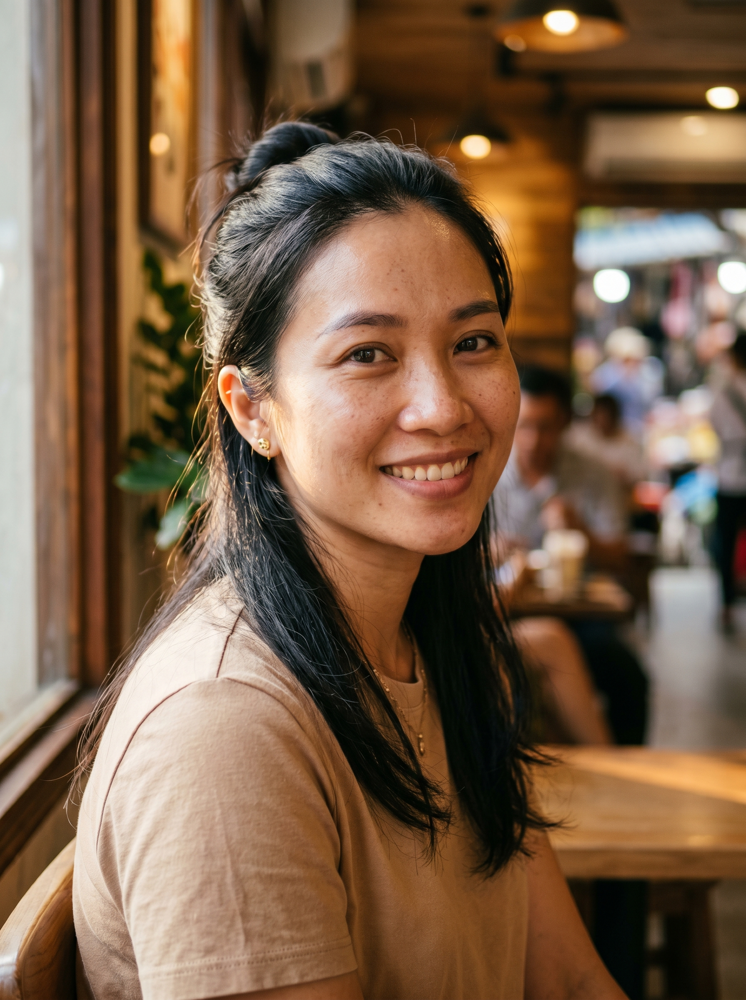
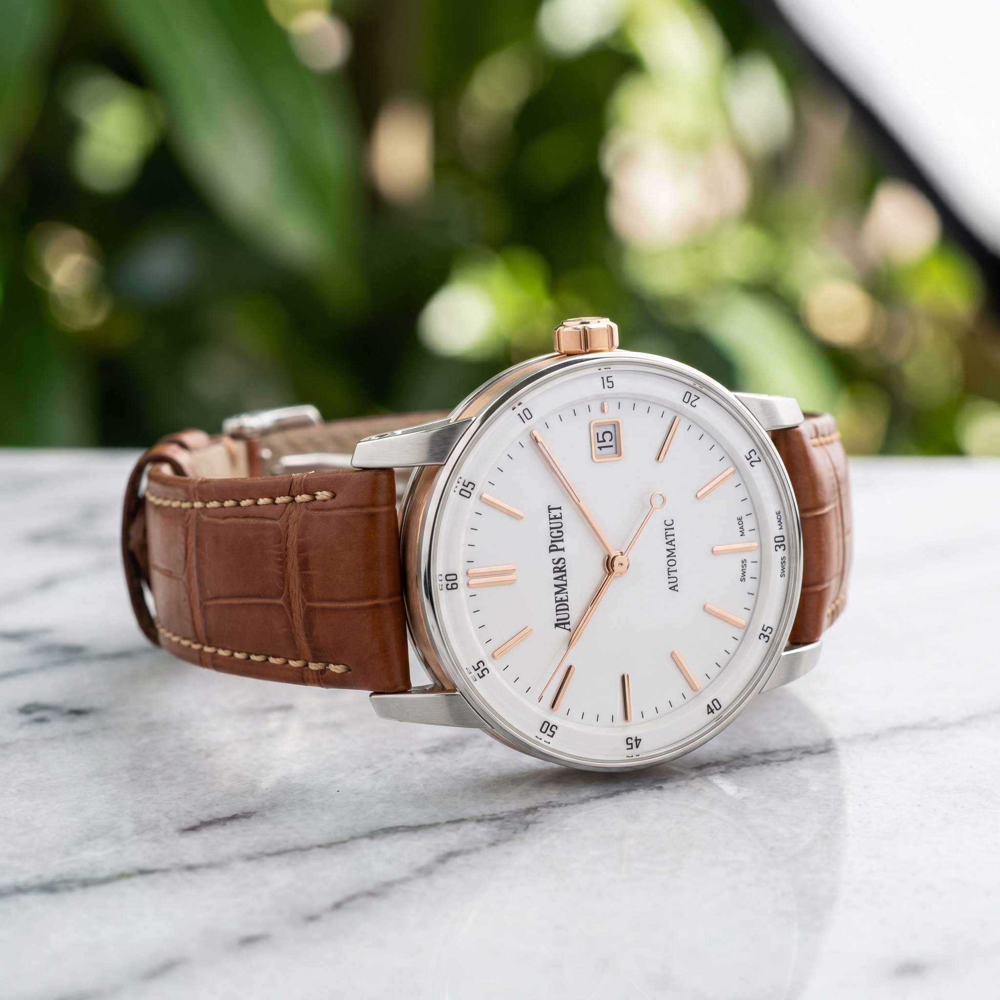
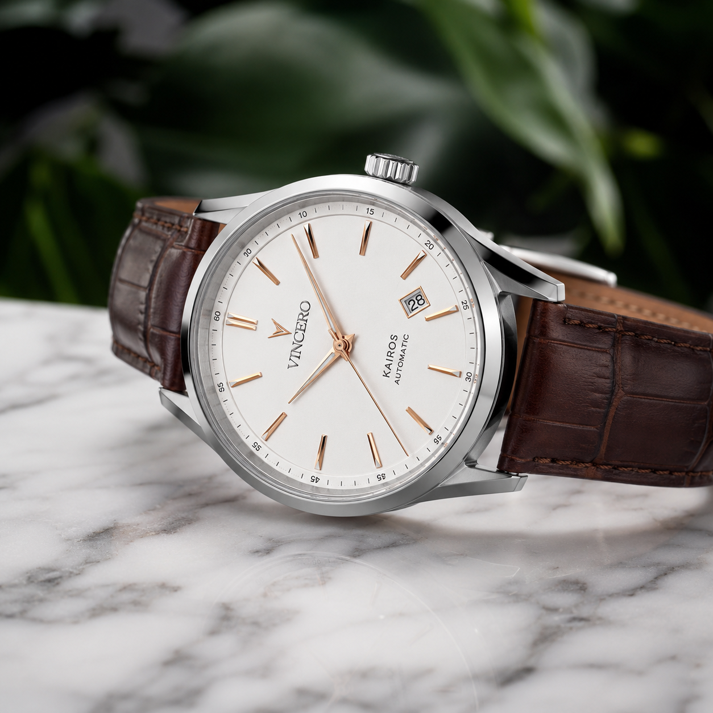

# 🎯 Day 8 — Seedream 4.5: Vũ khí bí mật cho chân dung & da người

> **Level:** 🔵 Intermediate (có chỗ 🟢 cho newbie)
> **Thời gian đọc:** ~14 phút | **Thực hành:** ~50 phút
> **Ngày 8/30** | Tuần 2 — Master Skills

---

## 🎬 Mở đầu — Hôm nay mình sẽ "phá vỡ" 1 dự đoán của chính mình

Tuần 1 mình đã quen với 2 anh "trùm cuối" Nano Banana 2 (NBN2) và GPT Image 2. Nhưng nếu chỉ dùng 2 model này, **0ai.vn lãng phí lắm** — nền tảng có 6+ model AI tạo ảnh, mỗi anh có 1 thế mạnh riêng.

Tuần 2 mình mở đầu bằng **Seedream 4.5** của ByteDance (cùng nhà với TikTok, CapCut). Spoiler: hôm nay mình test 9 ảnh chính + 1 bonus tiếng Trung — và **dự đoán ban đầu của mình SAI ở phong cảnh!** Plus phát hiện 1 vấn đề **cảnh báo bản quyền** mà cộng đồng Việt chưa ai nói. 👀

> **🔥 Tại sao Seedream 4.5 chứ không phải 5.0?**
> Seedream 5.0 mới (2/2026) có search web + reasoning, nhưng còn beta, kết quả không ổn định. **Seedream 4.5 (12/2025) đã production-ready, character consistency cực mạnh, RẺ NHẤT nhóm flagship trên 0ai.vn (350 credit/ảnh, vs 900 của GPT Image 2)**. 90% trường hợp 4.5 là chuẩn.

---

## 🎯 Mục tiêu hôm nay

- ✅ Hiểu Seedream 4.5 mạnh/yếu ở đâu so với NBN2 + GPT Image 2 (qua test thật)
- ✅ Xem 10 ảnh A/B/C side-by-side — không lý thuyết suông
- ✅ Biết **khi nào** dùng Seedream 4.5 thay vì model khác (cheatsheet 1 trang)
- ✅ Học **2 insight cảnh báo** ít người Việt biết (brand bản quyền + tiếng Trung)
- ✅ Có prompt template chuyên cho chân dung Việt Nam

> 📋 **Prompts đầy đủ trong bài**: [`prompts/day-08.txt`](../prompts/day-08.txt)
> Copy/download nguyên văn về paste vào 0ai.vn — không phải gõ lại từ trong bài.

---

## 💰 Bảng giá thực tế trên 0ai.vn (đã test)

| Model | Giá min/ảnh | So sánh |
|-------|-------------|---------|
| **Seedream 4.5** | **350 credit** | 🥇 Rẻ nhất nhóm flagship |
| Nano Banana 2 (NBN2) | 400 credit | 🥈 |
| **GPT Image 2** | **900 credit** | 🥉 Đắt nhất, gấp 2.57x Seedream |

> **💡 Insight Linh:** Test 10 ảnh hôm nay tốn ~5,300 credit (~5,3k VND) — chỉ ~0.5% gói Ultra Member 1 triệu. Nếu làm production 50 ảnh/ngày, dùng GPT (45k credit/ngày) vs Seedream (17.5k) chênh **~825,000đ/tháng**. Chọn đúng model = tiết kiệm thật!

---

## 📚 Phần 1 — Seedream 4.5 là ai?

### 🏢 Thông tin cơ bản
- **Nhà phát hành:** ByteDance (cha đẻ TikTok, CapCut)
- **Phát hành:** 12/2025 — production-ready
- **Native resolution:** 2048×2048 (4MP, gần 4K)
- **Aspect ratio:** Đầy đủ (1:1, 16:9, 9:16, 4:3, 3:4, 2:3, 3:2, **21:9 cinematic**)
- **Xếp hạng:** #10 LM Arena (1147 điểm) — top-tier toàn cầu

### 💪 4 USP độc nhất

**1. Cinematic Lighting tự động 🎬**
Test thực tế: Seedream tự render **golden hour dramatic** mà không cần prompt nhiều. Bóng đổ tự nhiên, sun rays, volumetric fog đều có sẵn. Đây là điểm vượt trội rõ rệt so với NBN2 và GPT Image 2.

**2. Chân dung biểu cảm phong cách thời trang 👗**
Render được **da có lỗ chân lông, tàn nhang nhẹ, ánh sáng phản chiếu trên má** — vibe tạp chí Vogue/Elle. Đây là use case mà NBN2 và GPT Image 2 không thể đạt được cùng quality (đã verify ở phần test bên dưới).

**3. Character Consistency với 14 reference images 🎭**
Upload tới 14 ảnh tham chiếu, model giữ face structure + tone da nhất quán qua nhiều ảnh. Cực hữu ích cho lookbook, storyboard, mascot.

**4. Text Rendering + Native tiếng Trung ✍️🇨🇳**
- Text trong ảnh **chuẩn hơn NBN2** (NBN2 hay viết sai chữ)
- **Prompt tiếng Trung cho kết quả TỐT NHẤT** (mạnh hơn cả tiếng Anh!) — đã verify ở test bonus

### ⚠️ Điểm yếu

- **Tốc độ chậm hơn GPT Image 2** chút
- **Yếu hơn NBN2 ở phong cách hoạt hình/anime**
- **Sweet spot prompt: 30-100 từ** — viết dài quá sẽ "scatter"
- **Earlier keyword được nhấn mạnh hơn** — phải đặt subject lên đầu prompt

---

## ⚙️ Phần 2 — Setup test trên 0ai.vn

### Quy tắc kiểm soát biến số (A/B/C test chuẩn)
- ✅ Cùng 1 prompt cho cả 3 model
- ✅ Cùng aspect ratio + cùng resolution 2K
- ✅ KHÔNG image-to-image, chỉ text-to-image
- ✅ Mỗi prompt chạy **1 lần duy nhất** — KHÔNG cherry-pick

### Setting cố định
| Test | Aspect Ratio | Resolution |
|------|--------------|------------|
| Chân dung | 3:4 | 2K |
| Phong cảnh | 21:9 | 2K |
| Sản phẩm | 1:1 | 2K |

### 💰 Chi phí test 10 ảnh
| Model | Số ảnh × giá | Tổng |
|-------|--------------|------|
| Seedream 4.5 | 4 × 350 (3 chính + 1 bonus 中文) | **1,400 credit** |
| NBN2 | 3 × 400 | **1,200 credit** |
| GPT Image 2 | 3 × 900 | **2,700 credit** |
| **TỔNG** | | **5,300 credit (~5.3k VND)** |

---

## 🧪 Phần 3 — Test 1: Chân dung ⭐

### 📝 Prompt sử dụng (~60 từ)
```
Close-up portrait of a 28-year-old Vietnamese woman, natural sun-kissed
skin with visible pores, light freckles, deep brown eyes, natural lashes,
long black hair loosely tied. Soft golden hour window light from left,
gentle shadow falloff on right cheek. Blurred coffee shop bokeh background.
Photorealistic, 85mm f/1.4, shallow depth of field.

Negative: plastic skin, oversaturated, cartoon, deformed eyes,
smooth airbrushed face, watermark, low quality
```

### 🖼️ Kết quả 3 model

**Seedream 4.5:** *(350 credit)*


**Nano Banana 2:** *(400 credit)*


**GPT Image 2:** *(900 credit)*


### 🔍 Phân tích chi tiết

| Tiêu chí | Seedream 4.5 | NBN2 | GPT Image 2 |
|----------|--------------|------|-------------|
| Lỗ chân lông trên da | ⭐⭐⭐⭐⭐ Visible rõ | ⭐⭐ Smooth, ít texture | ⭐⭐⭐⭐ Tốt |
| Mắt (chi tiết, ánh phản chiếu) | ⭐⭐⭐⭐⭐ Tự nhiên, có ánh | ⭐⭐⭐ Nhỏ, ít chi tiết | ⭐⭐⭐⭐ Rõ |
| Bóng đổ má (cinematic) | ⭐⭐⭐⭐⭐ DRAMA mạnh | ⭐⭐ Lighting phẳng | ⭐⭐⭐ Soft, đều |
| Tóc (sợi rời tự nhiên) | ⭐⭐⭐⭐ Đẹp | ⭐⭐⭐⭐ Đẹp | ⭐⭐⭐⭐ Đẹp |
| Cảm giác "người Việt" | ⭐⭐⭐ Editorial | ⭐⭐⭐⭐⭐ Thân quen, gần gũi | ⭐⭐⭐⭐ Tự nhiên |
| Vibe tổng thể | 🥇 Editorial Vogue | 🥉 Casual snapshot | 🥈 Pro studio |

**🎯 Insight rút ra:**
- **Seedream 4.5 THẮNG TUYỆT ĐỐI** ở chân dung cinematic — bóng đổ tự nhiên, golden hour drama, biểu cảm cuốn hút như tạp chí thời trang
- **NBN2** cho cảm giác "thân quen như chụp bằng iPhone" — phù hợp ảnh casual, không phù hợp editorial
- **GPT Image 2** soft, professional, ổn định — phù hợp ảnh CV/LinkedIn

→ **Khi nào dùng:** Cần ảnh chân dung kiểu fashion/editorial → Seedream. Cần ảnh tự nhiên thân thiện → NBN2. Cần ảnh chuyên nghiệp ổn định → GPT Image 2.

---

## 🌄 Phần 4 — Test 2: Phong cảnh (DỰ ĐOÁN CỦA MÌNH SAI! 🤯)

### 📝 Prompt
```
Mu Cang Chai rice terraces at golden harvest, soft morning mist over
fields, distant H'Mong farmers in traditional clothing harvesting rice.
Golden sunrise piercing clouds, layered mountains backdrop. National
Geographic style, ultra-detailed, warm natural color grading, cinematic.
```

### 🖼️ Kết quả 3 model

**Seedream 4.5:** *(350 credit)*


**Nano Banana 2:** *(400 credit)*


**GPT Image 2:** *(900 credit)*


### 🔍 Phân tích

| Tiêu chí | Seedream 4.5 | NBN2 | GPT Image 2 |
|----------|--------------|------|-------------|
| Tỷ lệ 21:9 panoramic | ✅ Chuẩn | ✅ Chuẩn | ⚠️ Hơi ngắn |
| Golden hour dramatic | ⭐⭐⭐⭐⭐ Sun rays mạnh | ⭐⭐⭐⭐ Dịu, tự nhiên | ⭐⭐⭐ Hơi giả |
| Số người H'Mông | 2 người (foreground rõ) | **5 người trang phục đa dạng** | 2-3 người |
| Sương mù | Dramatic, dày | Tự nhiên nhất | Lập lòe |
| Composition rule of thirds | ⭐⭐⭐⭐⭐ | ⭐⭐⭐⭐⭐ | ⭐⭐⭐⭐ |
| Vibe tổng thể | Poster phim cinematic | National Geographic Việt | Postcard du lịch |

**🎯 Insight bất ngờ:**
> Mình đã dự đoán **NBN2 thắng tuyệt đối** phong cảnh Việt Nam. **Sai!** Thực tế:
> - **Seedream 4.5** thắng về **CINEMATIC** (lighting, drama, atmosphere)
> - **NBN2** thắng về **AUTHENTICITY** (5 người H'Mông trang phục đa dạng tím/hồng/xanh — cực Việt Nam)
> - **GPT Image 2** đẹp nhưng less impact

→ **Bài học:** Seedream 4.5 KHÔNG CHỈ giỏi chân dung — nó là **all-rounder thực sự**! Mình đã underestimate model này.

---

## 🛍️ Phần 5 — Test 3: Sản phẩm (PHÁT HIỆN VẤN ĐỀ BẢN QUYỀN! ⚠️)

### 📝 Prompt
```
Luxury men's watch, brown leather strap, white dial with rose gold hands,
stainless steel case. 45-degree angle on white marble with gray veining.
Studio softbox lighting from upper right, subtle sapphire glass reflection.
Soft green leaves bokeh background. Luxury product photography,
tack-sharp details, shallow DOF.
```

> **Lưu ý:** Prompt KHÔNG nói tên brand cụ thể nào — chỉ "luxury men's watch" generic.

### 🖼️ Kết quả 3 model

**Seedream 4.5:** *(350 credit)*


**Nano Banana 2:** *(400 credit)*


**GPT Image 2:** *(900 credit)*


### 🚨 PHÁT HIỆN GÂY SỐC

**Soi kỹ 3 ảnh, mình thấy:**

| Model | Brand trong ảnh | Trạng thái |
|-------|----------------|-----------|
| **Seedream 4.5** | ❌ Generic, không có brand | ✅ ĐÚNG PROMPT |
| **NBN2** | ⚠️ **"AUDEMARS PIGUET" + "Swiss Made" + "Automatic"** | 🚨 VI PHẠM PROMPT |
| **GPT Image 2** | ⚠️ **"VINCERO KAIROS" + "Automatic"** | 🚨 VI PHẠM PROMPT |

> **🚨 CẢNH BÁO BẢN QUYỀN — quan trọng cho ai làm shop online:**
>
> Audemars Piguet và Vincero là **brand đồng hồ thật**. NBN2 và GPT Image 2 đã **tự ý** chèn logo + tên brand vào ảnh, dù prompt KHÔNG yêu cầu.
>
Hậu quả nếu các bạn dùng những ảnh này:
> - 🚫 Đăng Shopee/Tiki/Lazada — bị **takedown ngay** (vi phạm IP của brand)
> - 🚫 Chạy Facebook/TikTok ads — bị **disable account** nếu brand owner report
> - 🚫 In packaging/tem nhãn — có thể **bị kiện** đòi bồi thường
>
> **Cách tránh:**
> 1. Luôn **soi kỹ ảnh sản phẩm** xem có chữ/logo nào lạ không
> 2. Negative prompt thêm: `brand name, logo, text, watermark, signature`
> 3. Ưu tiên **Seedream 4.5** cho ảnh sản phẩm thương mại — model tuân prompt tốt nhất

### 🔍 Phân tích chi tiết (về thẩm mỹ)

| Tiêu chí | Seedream 4.5 | NBN2 | GPT Image 2 |
|----------|--------------|------|-------------|
| Tuân prompt (no brand) | ⭐⭐⭐⭐⭐ | ⭐ (vi phạm) | ⭐ (vi phạm) |
| Phản chiếu kính sapphire | ⭐⭐⭐⭐ | ⭐⭐⭐⭐⭐ | ⭐⭐⭐⭐ |
| Texture dây da | ⭐⭐⭐ Tốt | ⭐⭐⭐⭐⭐ Sợi rõ | ⭐⭐⭐⭐⭐ Sợi rõ |
| Vân đá cẩm thạch | ⭐⭐⭐⭐ | ⭐⭐⭐⭐⭐ | ⭐⭐⭐⭐⭐ |
| Composition | ⭐⭐⭐⭐ | ⭐⭐⭐⭐⭐ | ⭐⭐⭐⭐⭐ |

**🎯 Insight tổng kết:**
- Về **thẩm mỹ thuần túy**: NBN2 và GPT Image 2 **đẹp hơn** Seedream 4.5
- Về **an toàn pháp lý + tuân prompt**: **Seedream 4.5 thắng tuyệt đối**
- → Cho ảnh sản phẩm thương mại → **DÙNG SEEDREAM 4.5**

---

## 🇨🇳 Phần 6 — Bonus: Prompt Tiếng Trung trên Seedream 4.5

### Test setup
Cùng prompt chân dung, nhưng dịch sang tiếng Trung. Chỉ chạy trên Seedream 4.5 vì đây là model train chính bằng data tiếng Trung.

### 📝 Prompt 中文 (~80 chữ)
```
一位28岁的越南女性特写肖像，自然小麦色肌肤，毛孔清晰可见，颧骨上有淡淡的雀斑，
深棕色的眼睛，自然的睫毛，黑色长发松松地扎起。下午温柔的金色窗光从左侧斜照，
右脸颊柔和的阴影。背景是模糊的咖啡馆。摄影写实风格，85mm f/1.4，浅景深。
```

### 🖼️ So sánh English vs 中文 (cùng Seedream 4.5)

**English prompt:**


**Chinese prompt:**


### 🔍 Phân tích

| Tiêu chí | English | 中文 (Chinese) |
|----------|---------|----------------|
| Lỗ chân lông visible | ⭐⭐⭐⭐ | ⭐⭐⭐⭐⭐ Rõ HƠN |
| Tàn nhang trên má | ⭐⭐⭐ Nhẹ | ⭐⭐⭐⭐⭐ Rõ rệt |
| Texture da imperfections | ⭐⭐⭐⭐ Smooth | ⭐⭐⭐⭐⭐ Realistic hơn |
| Cinematic lighting | ⭐⭐⭐⭐⭐ | ⭐⭐⭐⭐⭐ |
| Tổng thể realism | ⭐⭐⭐⭐ Polished | ⭐⭐⭐⭐⭐ Authentic |

**🎯 Insight VIRAL:**
> Prompt **tiếng Trung trên Seedream 4.5 cho realism cao hơn** — đặc biệt ở **skin imperfections** (tàn nhang, lỗ chân lông). Lý do: model train chính bằng data tiếng Trung, hiểu nuance ngôn ngữ tốt hơn cả tiếng Anh.
>
> **Hierarchy ngôn ngữ Seedream 4.5:** 🇨🇳 中文 > 🇻🇳🇬🇧 Hybrid VI+EN > 🇻🇳 Tiếng Việt thuần
>
> →Tip pro:** Nếu các bạn cần ảnh chân dung **thật như chụp** (không "AI polished"), dùng Google Translate dịch prompt sang tiếng Trung → paste vào Seedream 4.5. Cộng đồng AI Việt **chưa ai dạy mẹo này**!

---

## 📊 Phần 7 — Bảng tổng kết "Ai thắng cái gì?" (Verified)

| Tiêu chí | Seedream 4.5 | NBN2 | GPT Image 2 |
|----------|--------------|------|-------------|
| 👤 Chân dung cinematic / editorial | 🥇 | 🥉 | 🥈 |
| 👤 Chân dung casual / thân quen | 🥉 | 🥇 | 🥈 |
| 🌄 Phong cảnh cinematic | 🥇 | 🥈 | 🥉 |
| 🌄 Phong cảnh authentic Việt Nam | 🥈 | 🥇 | 🥉 |
| 🛍️ Sản phẩm tuân prompt | 🥇 (no brand) | 🥉 (vi phạm) | 🥉 (vi phạm) |
| 🛍️ Sản phẩm thẩm mỹ thuần túy | 🥉 | 🥇 | 🥇 |
| ⚡ Tốc độ generate | 🥈 | 🥈 | 🥇 |
| 💰 Giá min/ảnh | 🥇 350cr | 🥈 400cr | 🥉 900cr |
| 🇨🇳 Prompt tiếng Trung | 🥇 (native) | 🥉 | 🥈 |
| 🇻🇳 Prompt tiếng Việt | 🥉 | 🥇 | 🥈 |
| 🎨 Anime / hoạt hình | 🥉 | 🥇 | 🥈 |

---

## 🎁 Phần 8 — Cheatsheet "Khi nào dùng model nào?"

### ✅ DÙNG Seedream 4.5 khi:
- 📸 Chân dung biểu cảm phong cách thời trang/glamour (Vogue/Elle vibe)
- 🛒 **Ảnh sản phẩm thương mại** (an toàn pháp lý, không brand thật)
- 🎬 Phong cảnh cinematic 21:9 dramatic
- 🎭 Bộ ảnh nhân vật với character consistency (14 ref images)
- 🇨🇳 Cần prompt tiếng Trung tự nhiên (làm content cho thị trường TQ)
- 💸 Production volume cao + ngân sách hạn chế

### ✅ DÙNG NBN2 khi:
- 🇻🇳 Prompt 100% tiếng Việt
- 🌄 Phong cảnh Việt Nam authentic (con người, văn hóa)
- 👤 Chân dung casual thân quen
- 🎨 Phong cách anime / hoạt hình / illustration

### ✅ DÙNG GPT Image 2 khi:
- 🏆 Cần ảnh quan trọng (khách hàng, deadline gấp)
- ⚡ Cần tốc độ tuyệt đối
- 🎯 Cần "auto-pilot" reliability
- 🌍 Prompt tiếng Anh dài chi tiết

---

## 💎 Phần 9 — 5 Insights Pro chỉ Linh0AI chia sẻ

**1. Seedream 4.5 là all-rounder thực sự (không chỉ giỏi chân dung)**
Test thực tế cho thấy Seedream THẮNG hoặc NGANG NGỬA NBN2 ở mọi chủ đề. Mình đã underestimate model này. Dù chỉ tốn 350 credit — gần ngang chất lượng GPT Image 2 (900 credit) ở 80% trường hợp.

**2. 🚨 NBN2 + GPT Image 2 hay tự thêm BRAND THẬT vào ảnh sản phẩm**
Đây là phát hiện **chưa ai dạy ở Việt Nam**. NBN2 chèn "Audemars Piguet", GPT chèn "VINCERO" — dù prompt không yêu cầu. Nếu các bạn làm shop online + dùng những ảnh này → **rủi ro pháp lý cao**. Cách fix: thêm `brand name, logo, text` vào negative prompt + ưu tiên Seedream cho ảnh thương mại.

**3. 🇨🇳 Tiếng Trung trên Seedream 4.5 → realism vượt trội**
Hierarchy ngôn ngữ: 中文 > Hybrid VI+EN > Tiếng Việt thuần. Skin imperfections (tàn nhang, lỗ chân lông) render rõ hơn rõ rệt. Dùng Google Translate sang tiếng Trung là cheat code ít người Việt biết.

**4. Sweet spot prompt 30-100 từ — KHÁC các model khác**
Seedream "scatter" khi prompt dài. Đặt subject lên đầu (earlier keyword được nhấn mạnh). Negative prompt `plastic skin, smooth airbrushed face` là MUST cho mọi ảnh chân dung.

**5. Bài toán kinh tế: GPT vs Seedream**
GPT đắt 2.57x Seedream. Recommend tỷ lệ: **20% GPT (ảnh quan trọng) + 50% Seedream (đa số) + 30% NBN2 (tiếng Việt + anime)** — tiết kiệm ~60% credit so với dùng 100% GPT.

---

## 🎯 Thử thách hôm nay

### 🟢 Cho Newbie (15 phút, ~350 credit)
1. Generate 1 ảnh chân dung của chính bạn trên Seedream 4.5 (3:4, 2K, ~50 từ)
2. Đăng vào Zalo group với hashtag `#Day8Linh0AI`

### 🔵 Cho Intermediate (50 phút, ~5,300 credit)
1. Test cả 3 prompt (chân dung + cảnh + sản phẩm) trên cả 3 model
2. **Soi kỹ ảnh sản phẩm** xem model nào tự thêm brand
3. So sánh và viết 3 câu insight riêng

### 🟣 Cho Pro (90 phút, ~10,000 credit)
1. Test bonus: dịch prompt sang tiếng Trung → chạy trên Seedream 4.5 → so với English
2. Tạo bộ ảnh **5 chân dung** với character consistency (upload 14 ref images)
3. Viết review 500 từ so với MidJourney/DALL-E nếu từng dùng

> 🏆 **Mini Challenge "Phong cảnh Việt Nam"** vẫn đang chạy đến **13/05/2026**! Top 3 sẽ được mention trong Day 14.

---

## ❓ FAQ

**Q1: Seedream 4.5 giá thật bao nhiêu trên 0ai.vn?**
**350 credit/ảnh** ở 2K — rẻ nhất nhóm flagship. Gói Ultra Member 1tr (1.1tr credits) đủ test ~3,143 ảnh Seedream 4.5.

**Q2: Tại sao Seedream 4.5 thay vì Seedream 5.0?**
4.5 đã production-ready, ổn định, character consistency cực mạnh, tiết kiệm credit. 5.0 mới có search web + reasoning nhưng còn beta. 90% trường hợp 4.5 chuẩn hơn.

**Q3: Insight về brand tự chèn — có đúng với mọi ảnh sản phẩm không?**
Test này 1 lần thấy NBN2 chèn AP, GPT chèn Vincero. Có thể không phải 100% lần nào cũng vậy, nhưng tỷ lệ cao đáng để cảnh báo. **Best practice:** luôn soi kỹ + thêm `brand name, logo, text` vào negative prompt.

**Q4: GPT Image 2 đắt 2.57x — có nên dùng không?**
**Có, nhưng chọn lọc.** Dùng cho ảnh quan trọng (khách hàng, deadline, viral thumbnail). KHÔNG dùng cho test ý tưởng + production volume cao. Tỷ lệ recommend: 20%.

**Q5: Tiếng Trung không biết, làm sao dùng được?**
Google Translate. Dịch prompt VN/EN → 中文 → paste vào Seedream. Kết quả realism cao hơn cả khi bạn không hiểu chữ Trung.

**Q6: Test 10 ảnh hôm nay tốn bao nhiêu thật?**
**5,300 credit (~5,3k VND)** = ~0.5% gói Ultra Member 1 triệu. Cực rẻ cho data nghiên cứu thực.

**Q7: Có thể dùng ảnh Seedream 4.5 cho thương mại không?**
Có. Theo terms ByteDance/0ai.vn, ảnh generate có thể dùng commercial. Tuy nhiên luôn check terms cập nhật trước khi dùng cho dự án trả phí lớn.

---

## 🎬 Recap & Day 9

### Ghi nhớ chính
- ✅ Seedream 4.5 = vũ khí cho **chân dung thời trang, sản phẩm thương mại, ảnh có text**
- ✅ Native 2048×2048 (gần 4K), cinematic lighting tự động
- ✅ **350 credit/ảnh** — rẻ nhất nhóm flagship
- ✅ Tiếng Trung > Hybrid VI+EN > Tiếng Việt thuần
- ✅ ⚠️ NBN2 + GPT hay tự chèn brand thật → cảnh báo bản quyền
- ✅ Sweet spot prompt 30-100 từ

### 🔮 Day 9 — Sneak peek
Ngày mai mình sẽ deep dive **Prompt Engineering Nâng Cao** — từ "biết prompt" lên "prompt như senior". Học cú pháp `(keyword:1.3)` để nhấn mạnh, prompt chains, weighted negative... Spoiler: sau bài này, ảnh AI của bạn sẽ ra đúng ý 80% lần đầu thay vì cherry-pick 5-10 lần!

---

## 📍 Navigation
[⬅️ Day 7: Tổng Kết Tuần 1 + Mini Challenge](./day-07.md) | [🏠 README](../README.md) | [➡️ Day 9: Prompt Engineering Nâng Cao](./day-09.md)

## 🏷️ Tags
`#0aiVN #Seedream45 #ByteDance #ChânDungAI #Day8Linh0AI #AIImage #PortraitAI #VietnameseAI #ProductPhotography #FashionAI #AICopyrightWarning`

---

*Nhật ký Day 8 by **Linh0AI** — chuỗi 30 ngày làm chủ AI tạo ảnh & video trên 0ai.vn 🇻🇳*
