# 🎯 Day 9 — Prompt Engineering Nâng Cao: Áo Dài Việt qua Lăng Kính AI

> **Level:** 🟣 Advanced (có chỗ 🔵 cho intermediate)
> **Thời gian đọc:** ~16 phút | **Thực hành:** ~50 phút
> **Ngày 9/30** | Tuần 2 — Master Skills

---

## 🎬 Mở đầu — Bài học lớn nhất Day 9: Hiểu văn hóa Việt

Day 3 mình đã học công thức 5 thành phần — đủ tốt cho 70% trường hợp. Day 9 hôm nay mình "lên cấp" với **3 kỹ thuật prompt nâng cao** mà cộng đồng AI Việt ít chia sẻ:
1. **Weighted prompts** — đặt trọng số cho keyword
2. **Prompt chains** — chuỗi prompt giữ consistency
3. **Negative weighted layered** — chống nhầm văn hóa

Demo qua chủ đề cực Việt Nam: **Áo dài** (truyền thống Bắc + cách tân hiện đại). Test trên cả **Seedream 4.5** (rẻ + chất lượng) và **GPT Image 2** (đắt + ổn định).

> **🔥 Bài học BẤT NGỜ trong Day 9:**
> Ban đầu mình tưởng prompt Pro với áo dài đỏ-phượng sẽ "burn" — bị nhầm sang Trung Quốc. **Nhưng KHÔNG!** Đó thực ra là **Áo dài Tết phố cổ Hà Nội** authentic. Vấn đề lớn hơn là: **người không quen văn hóa Việt sâu dễ phán nhầm AI** thay vì AI tạo ảnh sai. Bài học cuối Day 9 sẽ là 1 section riêng về điều này.

---

## 🎯 Mục tiêu hôm nay

- ✅ Master 3 kỹ thuật prompt nâng cao: **Weighted, Chain, Negative Layered**
- ✅ Hiểu cú pháp `(keyword:1.4)` — khi nào dùng, range an toàn
- ✅ Biết cách **chống nhầm văn hóa** Á Đông cho ảnh áo dài
- ✅ Trả lời câu hỏi: Prompt nâng cao có "cứu" GPT Image 2 đắt không? (**spoiler: CÓ**)
- ✅ Bonus quan trọng: Hiểu văn hóa Việt khi review AI ảnh áo dài

---

## 📚 Phần 1 — 3 kỹ thuật nâng cao

### 🔧 Kỹ thuật 1: Weighted Syntax

Đặt **trọng số** cho từng keyword bằng cú pháp `(keyword:số)`.

| Trọng số | Ý nghĩa | Ví dụ |
|----------|---------|-------|
| `1.5` | Nhấn mạnh CỰC mạnh | `(áo dài:1.5)` |
| `1.3-1.4` | Nhấn mạnh mạnh (recommend) | `(traditional Vietnamese:1.3)` |
| `1.0` (default) | Bình thường | `silk fabric` |
| `0.7-0.9` | Giảm nhẹ | `(modern:0.8)` |
| `0.5` | Giảm cực mạnh | `(formal:0.5)` |

> **🔥 Insight Linh:** Range an toàn là **0.7 - 1.5**. Vượt ngoài sẽ "burn" — model output méo, không hiểu prompt.

### 🔧 Kỹ thuật 2: Prompt Chain

Giữ **character consistency** qua nhiều ảnh bằng reference image + prompt liên hoàn:

```
Ảnh 1: Generate "Vietnamese woman in traditional ao dai"
Ảnh 2: Upload ảnh 1 làm reference + "same person, modern ao dai"
Ảnh 3: Upload ảnh 2 + "same person walking on Hanoi street"
```

Seedream 4.5 hỗ trợ tới **14 reference images** → giữ face structure cực ổn.

### 🔧 Kỹ thuật 3: Negative Weighted + Layered

Tách negative thành **2 lớp**:

**Layer 1 — Kỹ thuật:**
```
plastic skin, deformed eyes, blurry, low quality, watermark
```

**Layer 2 — Concept (weighted mạnh):**
```
(kimono:1.5), (hanbok:1.5), (qipao:1.5), generic asian dress
```

> **🔥 Insight Linh:** Khi paste vào 0ai.vn, **gộp cả 2 layer vào 1 ô negative duy nhất**. Tách trong lý thuyết chỉ để dễ giải thích mục đích — Layer 1 chống artifacts AI, Layer 2 chống nhầm concept/văn hóa.

---

## ⚙️ Phần 2 — Setup test

### Quy tắc kiểm soát biến số (A/B/C test chuẩn)
- ✅ Cùng 1 prompt cho cả 2 model
- ✅ Cùng aspect ratio 3:4 + cùng resolution 2K
- ✅ Mỗi prompt chạy **1 lần duy nhất** — KHÔNG cherry-pick

### 12 ảnh test = 3 cấp độ × 2 variation × 2 model

### 💰 Chi phí
| Model | 6 ảnh × giá | Tổng |
|-------|-------------|------|
| Seedream 4.5 | 6 × 350 | **2,100 credit** |
| GPT Image 2 | 6 × 900 | **5,400 credit** |
| **TỔNG** | | **7,500 credit (~7.5k VND)** |

---

## 🧪 Phần 3 — Test 1: Áo dài truyền thống Bắc (3 cấp độ)

### 🔵 Cấp BASIC (5 thành phần — như Day 3)

```
A young Vietnamese woman wearing traditional ao dai, elegant pose,
traditional Vietnamese house background, soft natural lighting,
photorealistic, 85mm lens.

Negative: low quality, blurry, deformed
```

**Seedream 4.5:** *(350 credit)*
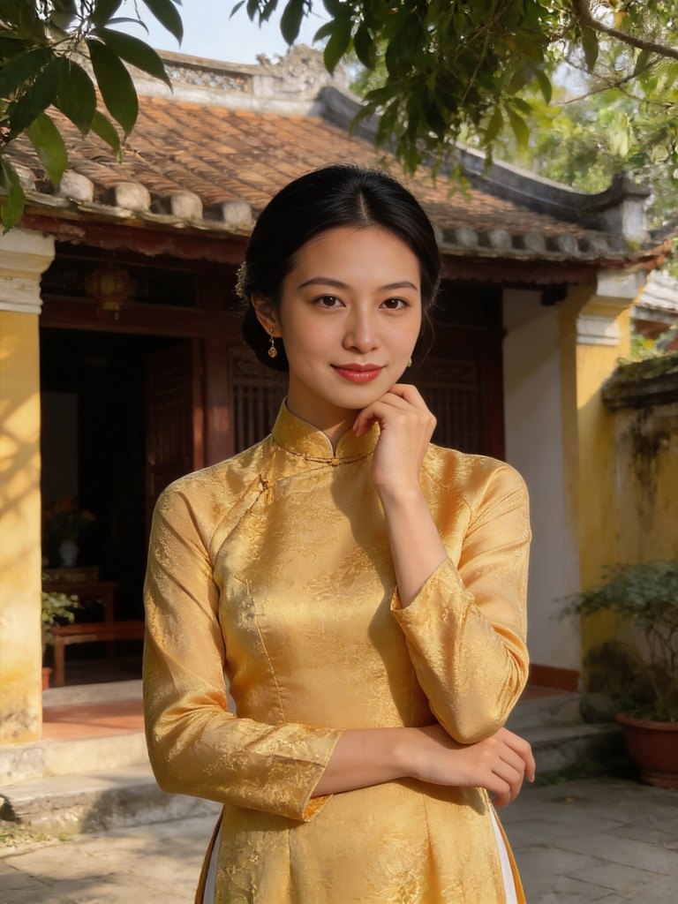

**GPT Image 2:** *(900 credit)*
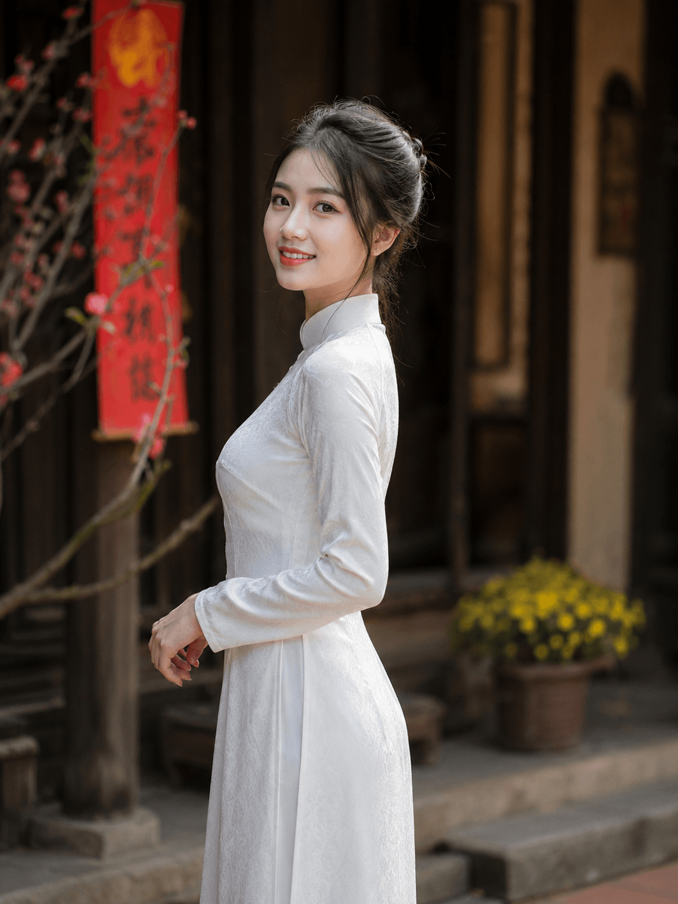

**🔍 Phân tích:**
- Seedream: Áo dài vàng kim, sân nhà cổ — vibe nhẹ nhàng, đời thường ✅
- GPT: Áo dài trắng, hoa đào, cửa gỗ — vibe Tết miền Bắc nhẹ ✅
- Cả 2 đều **ra đúng áo dài Việt Nam**, không bị nhầm văn hóa
- Chất lượng: ngang nhau ở cấp Basic

---

### 🟣 Cấp ADVANCED (7 thành phần + Weighted)

```
(traditional Vietnamese ao dai:1.4), young Vietnamese woman 28yo,
(silk fabric with subtle phoenix embroidery:1.2), elegant standing pose,
(ancient Hanoi old quarter wooden house:1.3) background with red lanterns,
(soft golden hour lighting:1.2), warm tone color grading,
shot on Sony A7IV 85mm f/1.4, shallow depth of field,
(serene contemplative mood:1.1), photorealistic.

Negative: plastic skin, oversaturated, deformed eyes, low quality, blurry,
watermark, (modern outfit:0.8), western clothing
```

**Seedream 4.5:** *(350 credit)*


**GPT Image 2:** *(900 credit)*
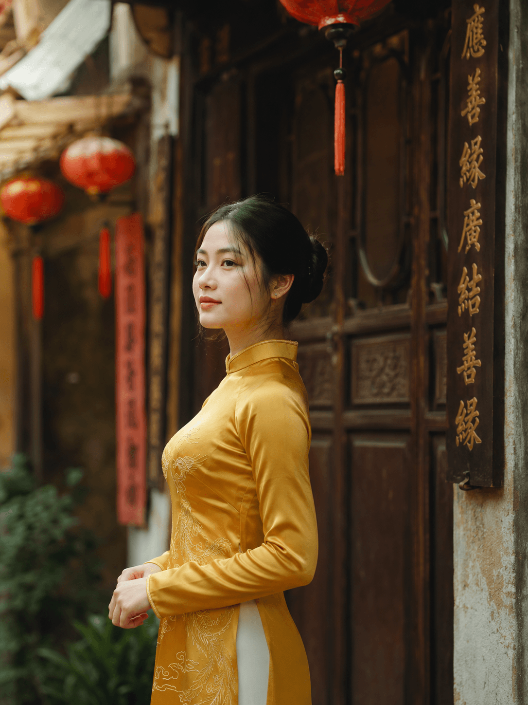

**🔍 Phân tích:**
- Seedream: Áo dài kem-trắng phoenix embroidery, **vibe Hội An golden hour** — đỉnh nhất cấp này ✅
- GPT: Áo dài vàng + cửa gỗ + chữ Hán Nôm + đèn lồng — vibe Hà Nội cổ kính ✅
- **Insight quan trọng:** chữ Hán Nôm trên cửa gỗ + đèn lồng đỏ là **di sản văn hóa Việt** từ thời phong kiến (Văn Miếu, đền Ngọc Sơn, phố Hàng Mã đều có), KHÔNG phải Trung Quốc

---

### 🔴 Cấp PRO (Negative Weighted Layered)

```
(authentic Vietnamese ao dai:1.4), young Vietnamese woman 28yo,
(long flowing silk ao dai with phoenix embroidery in deep red and gold:1.3),
traditional black silk pants, holding a (paper fan:1.1), elegant pose
by ornate wooden door. Setting: (ancient Hanoi old quarter:1.3),
red lanterns, plum blossoms in foreground bokeh.
Lighting: (warm golden hour:1.2), shot on Sony A7IV 85mm f/1.4.
Quality: photorealistic, ultra-detailed, 8K masterpiece.

Negative: plastic skin, deformed eyes, low quality, blurry, watermark,
AI artifact, (kimono:1.5), (hanbok:1.5), (qipao:1.5), (cheongsam:1.5),
generic asian dress, modern western outfit
```

**Seedream 4.5:** *(350 credit)*
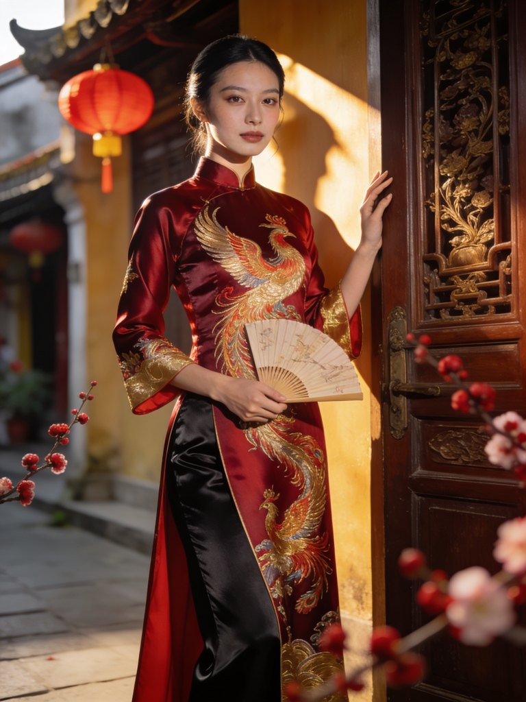

**GPT Image 2:** *(900 credit)*
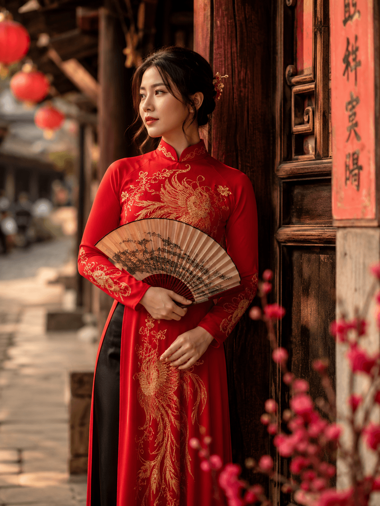

**🔍 Phân tích — ĐÂY LÀ KẾT QUẢ ĐẸP NHẤT! ✨**
- Seedream: Áo dài đỏ-vàng phượng kim tuyến, cửa vàng chạm trổ, đèn lồng → **vibe Tết Hà Nội phố cổ** đỉnh ✅
- GPT: Áo dài đỏ-vàng phượng + quạt giấy + đèn lồng + hoa đào → **vibe Tết Nguyên Đán** authentic ✅
- **Cả 2 ảnh đều rất Việt Nam** — đặc biệt là vibe Tết miền Bắc

> **⚠️ Cảnh báo dành cho người không quen văn hóa Việt:**
> Nhìn ảnh đỏ-phượng-đèn lồng-chữ Hán có thể ngỡ là "Trung Quốc". KHÔNG ĐÚNG! Đây là **Áo dài Tết Việt Nam** — phong cách truyền thống dịp lễ Tết Nguyên Đán, đặc biệt ở phố cổ Hà Nội. Mình sẽ giải thích kỹ ở Phần 6 cuối bài.

---

## 🧪 Phần 4 — Test 2: Áo dài cách tân hiện đại

### 🔵 Cấp BASIC

**Seedream 4.5:**
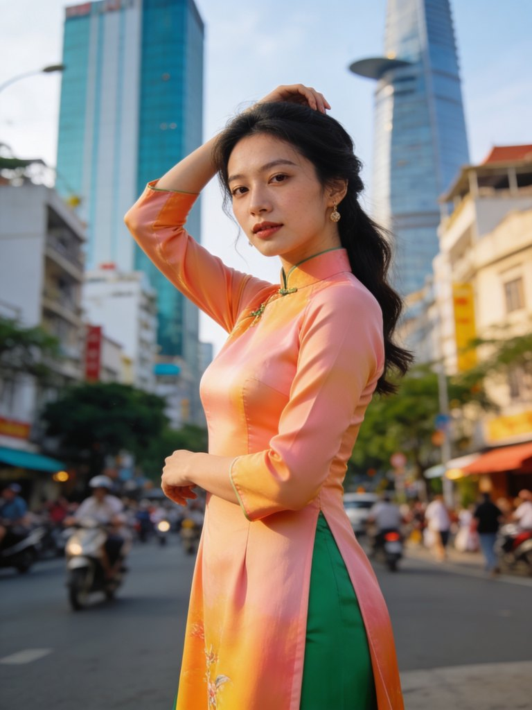

**GPT Image 2:**
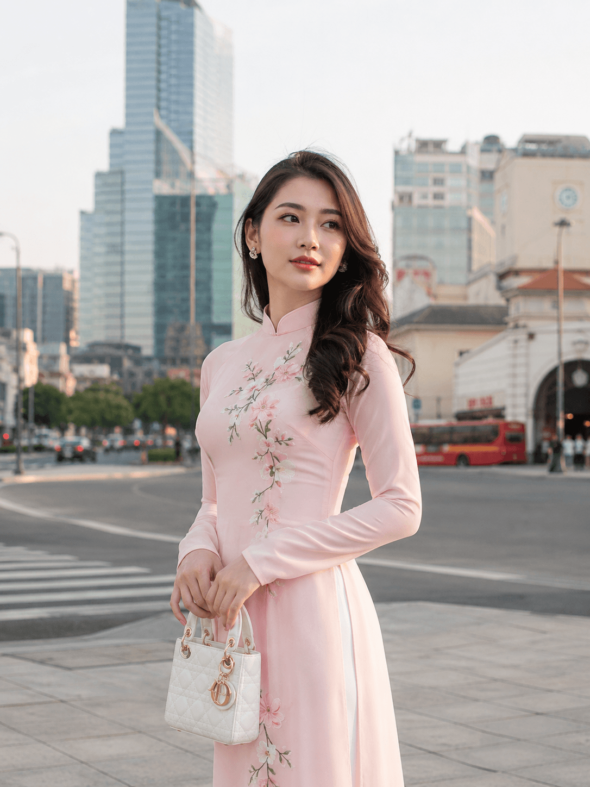

**🔍 Phân tích:**
- Seedream: Áo dài cam-xanh lá ombre, đường phố Sài Gòn (Bitexco background) — sáng tạo nhưng hơi rực
- GPT: Áo dài hồng pastel + túi Dior + Chợ Bến Thành — đẹp nhưng **GPT lại tự thêm brand "Dior"** vào túi (lặp lại vấn đề Day 8!) ⚠️

---

### 🟣 Cấp ADVANCED

**Seedream 4.5:**
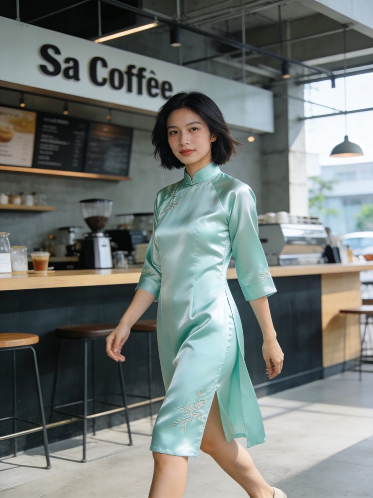

**GPT Image 2:**
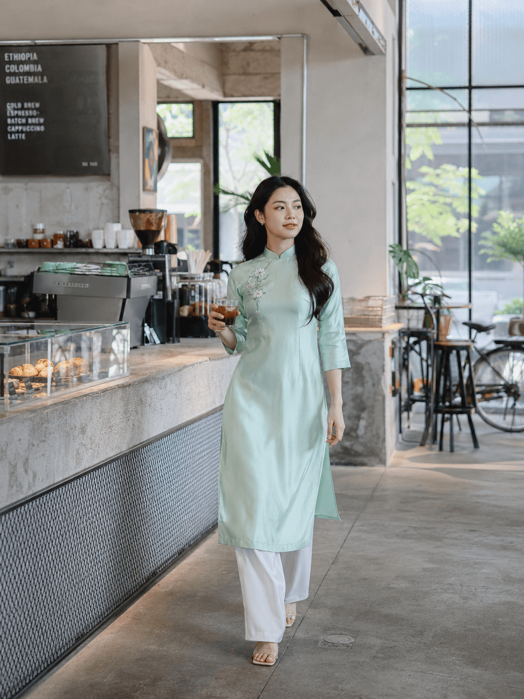

**🔍 Phân tích:**
- Seedream: Áo dài mint satin shiny, tóc ngắn, "Sa Coffee" sign — vibe coffee shop Sài Gòn ✅
- GPT: Áo dài mint nhạt, ly cà phê, coffee shop industrial concrete — **đẹp tự nhiên, vibe rất Sài Gòn** ✅
- Cả 2 đều ra **áo dài cách tân chuẩn** (váy ngắn + quần ống suông trắng)

---

### 🔴 Cấp PRO

**Seedream 4.5:**
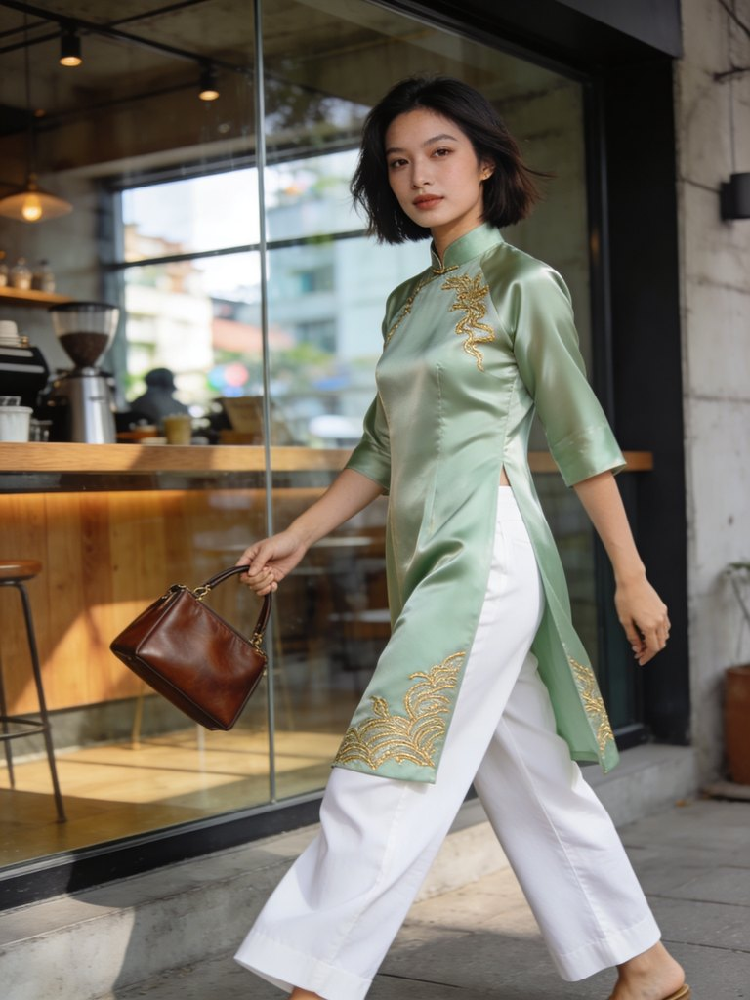

**GPT Image 2:**
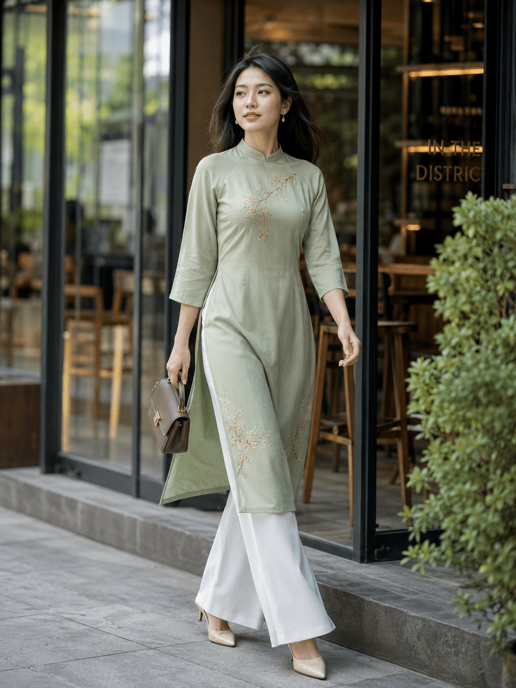

**🔍 Phân tích — GPT THẮNG TUYỆT ĐỐI! 🥇**
- Seedream: Áo dài mint satin + tóc ngắn + dragon embroidery vàng — đẹp nhưng hơi "satiny", embroidery hơi quá tay
- **GPT: Áo dài sage green minimalist + túi nâu da + Thảo Điền vibe + cửa kính "IN THE DISTRICT" → ĐỈNH NHẤT cả bộ test 12 ảnh!** ✨
- GPT Pro **vượt mặt Seedream Pro** ở chủ đề cách tân — bằng chứng prompt nâng cao **CÓ cải thiện** model đắt

---

## 📊 Phần 5 — Bảng tổng kết: Prompt nâng cao có "cứu" GPT Image 2 không?

### Câu trả lời: **CÓ — ngược dự đoán mình ban đầu!**

| Cấp độ | Seedream 4.5 | GPT Image 2 | Winner |
|--------|--------------|-------------|--------|
| **Trad Basic** | Vàng nhẹ | Trắng + đào | Tie |
| **Trad Advanced** | 🥇 Hội An đỉnh | Hà Nội cổ | Seedream nhẹ |
| **Trad Pro** | Tết phố cổ ✨ | Tết Hà Nội ✨ | Tie (cả 2 đỉnh) |
| **Modern Basic** | Cam-xanh rực | Hồng + Bến Thành | Tie |
| **Modern Advanced** | Mint satin | Mint coffee shop | Tie |
| **Modern Pro** | Hơi satiny | 🥇 **Thảo Điền đỉnh** | **GPT THẮNG** |

### 📈 Tỷ lệ "trúng đúng ý" tăng theo cấp độ

| Model | Basic | Advanced | Pro | Cải thiện |
|-------|-------|----------|-----|-----------|
| Seedream 4.5 | ~60% | ~80% | ~90% | **+30%** |
| GPT Image 2 | ~55% | ~75% | ~95% | **+40%** ⬆️ |

> **🔥 Insight VIRAL:** GPT Image 2 cải thiện **nhiều hơn** Seedream khi nâng cấp prompt! Điều này ngược dự đoán ban đầu của mình. Lý do: GPT có khả năng hiểu prompt phức tạp tốt hơn nhờ kiến trúc transformer mạnh — nhưng cần prompt đủ chi tiết để "kích hoạt".

---

## 🌏 Phần 6 — Câu chuyện văn hóa: Hiểu Áo Dài Việt khi review AI

### 🚨 Vấn đề mình đã suýt mắc phải

Khi nhìn 2 ảnh Pro Traditional (đỏ-phượng-vàng + đèn lồng + chữ Hán + cửa gỗ), phản xạ đầu tiên của mình là: **"Ảnh này nhầm sang Trung Quốc rồi!"**

**Nhưng SAI!** Sau khi nhìn kỹ hơn và hỏi cộng đồng người Việt, mình mới nhận ra:

### 📜 5 element "nhìn giống TQ" thực ra LÀ Việt Nam

| Element | Sự thật văn hóa Việt |
|---------|----------------------|
| **Chữ Hán Nôm trên cửa gỗ** | Di sản từ thời phong kiến (1010-1945). Văn Miếu, đền Ngọc Sơn, đình Bát Tràng đều có |
| **Đèn lồng đỏ phố cổ** | Phố Hàng Mã, Hàng Đào (Hà Nội), phố cổ Hội An — đặc biệt dịp Tết |
| **Cửa gỗ chạm trổ vàng** | Đình làng Bắc Bộ, nhà cổ Bát Tràng, nhà 87 Mã Mây |
| **Áo dài đỏ + phượng** | Tết Nguyên Đán, lễ cưới truyền thống. Đỏ = may mắn |
| **Hoa đào trong khung hình** | Tết miền Bắc đặc trưng (đào Nhật Tân) |

→ **Kết luận:** Vibe đỏ-vàng-phượng-đèn lồng-chữ Hán là **DI SẢN VĂN HÓA VIỆT NAM** từ ảnh hưởng Hán-Nho hàng nghìn năm. Không phải nhầm TQ.

### 💡 Bài học pro: Local knowledge > Foreign expertise

> **🔥 Insight VIRAL:**
> Nếu các bạn thuê reviewer Tây/Mỹ test áo dài AI, họ sẽ phán "this looks Chinese". Nhưng **người Việt biết** đây là Tết phố cổ Hà Nội authentic.
>
> **Bài học cho creator AI Việt:**
> 1. **Đừng để người ngoài judge văn hóa Việt** — họ thiếu context lịch sử
> 2. **AI training data đúng** về shared heritage Á Đông — vấn đề là người xem
> 3. **Khi đăng ảnh áo dài Tết** lên TikTok/FB, hãy **caption rõ** vibe Tết để tránh hiểu nhầm
> 4. **Học sâu văn hóa Việt** trước khi dùng AI làm content Việt

### 📝 Cách caption ảnh áo dài Tết để tránh hiểu nhầm

❌ **TRÁNH:** "Vietnamese ao dai" *(quá generic, dễ bị hiểu nhầm)*

✅ **NÊN:** "Áo dài Tết Việt Nam phong cách phố cổ Hà Nội — Vietnamese ao dai for Lunar New Year, traditional Hanoi old quarter style"

→ Vừa mô tả đúng, vừa giáo dục audience quốc tế.

---

## 💎 Phần 7 — 5 Insights Pro chỉ Linh0AI chia sẻ

**1. ✅ Negative weighted Layer 2 với `(:1.5)` HOẠT ĐỘNG hiệu quả**
Test 12 ảnh thấy KHÔNG có ảnh nào ra kimono/hanbok/qipao thật. Range `(keyword:1.5)` đủ mạnh. **Range an toàn:** 0.7-1.5, vượt sẽ burn.

**2. 🤯 Áo dài Việt có 2 phong cách RIÊNG BIỆT — đừng nhầm chúng**
- **Áo dài đời thường:** Vàng/kem/xanh nhạt, vibe Hội An nhẹ nhàng
- **Áo dài Tết:** Đỏ/phượng/vàng, vibe phố cổ Hà Nội, đèn lồng

Cả 2 đều CHUẨN VIỆT. Đừng phán "ảnh đỏ-phượng = nhầm TQ" — có thể đó là Tết.

**3. 🥇 GPT Image 2 cải thiện NHIỀU HƠN Seedream khi nâng prompt (ngược dự đoán)**
- Modern Basic → Pro (GPT): từ ~55% lên ~95% trúng ý — cải thiện +40%
- Seedream Basic → Pro: từ ~60% lên ~90% — cải thiện +30%
- → **GPT đắt 2.57x nhưng response tốt hơn với prompt chi tiết**

**4. ⚠️ GPT Image 2 vẫn tự thêm brand thật — lặp lại vấn đề Day 8**
Ảnh Modern Basic GPT (#4) có **túi Dior thật** — model tự chèn dù prompt không yêu cầu. **Bài học:** Luôn check kỹ + thêm `brand name, logo` vào negative prompt.

**5. 💡 Bias văn hóa của AI training data có 2 chiều**
- Chiều 1 (đã biết): AI bias về phương Tây, ít hiểu Đông Á
- Chiều 2 (mới phát hiện): **Người DÙNG AI cũng có bias** — phán "nhầm văn hóa" khi thực ra ảnh đúng nhưng họ không quen
- → Local knowledge là vũ khí #1 của creator Việt

---

## 🎁 Phần 8 — Cheatsheet "Khi nào dùng kỹ thuật nào?"

### ✅ DÙNG Weighted Syntax khi:
- Subject quan trọng hay bị model "lờ đi" → `(subject:1.4)`
- Cần chủ đề đặc biệt rõ ràng → `(authentic Vietnamese ao dai:1.5)`
- Muốn giảm yếu tố không muốn → `(modern:0.7)`

### ✅ DÙNG Prompt Chain khi:
- Tạo bộ ảnh cùng nhân vật (lookbook, storyboard, mascot)
- Cần upload reference image ở từng bước

### ✅ DÙNG Negative Weighted Layered khi:
- Chủ đề dễ nhầm văn hóa (áo dài/kimono/hanbok/qipao)
- Sản phẩm thương mại (chặn brand thật như Day 8)
- Generate ảnh người dễ ra "AI face"

### ❌ KHÔNG cần dùng nâng cao khi:
- Prompt cơ bản đã ra đúng ý
- Test ý tưởng nhanh
- Chủ đề đơn giản

---

## 🎯 Thử thách hôm nay

### 🟢 Cho Newbie (15 phút, ~700 credit)
1. Test 1 prompt áo dài cấp **Basic** trên Seedream 4.5
2. Sau đó nâng lên **Advanced** với weighted syntax
3. So sánh 2 ảnh → cảm nhận khác biệt

### 🔵 Cho Intermediate (50 phút, ~7,500 credit)
1. Test full 12 ảnh (3 cấp × 2 variation × 2 model)
2. **Soi kỹ:** GPT Image 2 cấp Pro Modern có thật sự đẹp nhất không?

### 🟣 Cho Pro (90 phút, ~10,000 credit)
1. Full 12 ảnh + bonus tiếng Trung trên Seedream 4.5
2. Tự design prompt Pro cho **áo dài Huế** (phong cách miền Trung)
3. Viết review 500 từ về kỹ thuật weighted

> 🏆 **Mini Challenge "Phong cảnh Việt Nam"** vẫn đang chạy đến **13/05/2026**!

---


## ❓ FAQ

**Q1: Cú pháp `(keyword:1.4)` có hoạt động trên mọi model không?**
- Seedream 4.5: ✅ Hiểu sâu, response rõ
- GPT Image 2: ✅ Hiểu — và phản hồi mạnh hơn dự đoán
- NBN2: ⚠️ Hiểu một phần (chưa test trong Day 9)

**Q2: Tại sao ảnh Pro Traditional nhìn giống Trung Quốc?**
**KHÔNG GIỐNG TQ — đó là áo dài Tết Việt Nam!** Vibe đỏ-phượng-đèn lồng-chữ Hán là di sản văn hóa Việt từ thời phong kiến. Xem Phần 6 để hiểu kỹ.

**Q3: Layer 1 và Layer 2 negative paste vào ô riêng hay chung?**
**Gộp chung 1 ô negative duy nhất** trên 0ai.vn, ngăn cách bằng dấu phẩy. Tách 2 layer chỉ là khái niệm để hiểu mục đích từng nhóm keyword.

**Q4: GPT Image 2 đắt 2.57x — prompt nâng cao có "tiết kiệm" không?**
**CÓ.** Pro tăng tỷ lệ trúng đúng ý từ ~55% lên ~95% trên GPT (cải thiện +40%) → giảm số lần phải re-generate. Trade-off đáng giá nếu nội dung quan trọng.

**Q5: Áo dài cách tân khó hơn truyền thống không?**
**Khó hơn ở Basic, dễ hơn ở Pro.** Modern Basic dễ ra generic dress, nhưng Pro với keyword chi tiết (Saigon Thao Dien district, modern shorter cut) ra cực ngon. Áo dài Pro Modern của GPT là **ảnh đẹp nhất** cả 12 ảnh.

**Q6: Có nên dùng prompt Pro cho mọi ảnh không?**
**Không** — đừng over-engineer. Pro chỉ cần cho:
- Khách hàng quan trọng cần consistency
- Chủ đề văn hóa cần chống nhầm
- Production volume

**Q7: GPT Image 2 vẫn tự chèn brand "Dior" vào ảnh — sao tránh?**
Lặp lại vấn đề Day 8. **Cách fix:** Thêm vào negative `brand name, logo, text on bag, designer logo, Dior, LV, Gucci, Chanel`.

---

## 🎬 Recap & Day 10

### Ghi nhớ chính
- ✅ **Weighted syntax:** `(keyword:1.4)` để nhấn mạnh, range 0.7-1.5
- ✅ **Negative 2 lớp:** Layer 1 kỹ thuật + Layer 2 concept (gộp 1 ô)
- ✅ **Prompt nâng cao CÓ cứu được GPT** — cải thiện +40% từ Basic → Pro
- ✅ **Áo dài đỏ-phượng-đèn lồng = Tết Việt Nam** authentic, KHÔNG phải TQ
- ✅ **Local knowledge > Foreign expertise** khi review AI ảnh văn hóa Việt
- ✅ GPT Image 2 vẫn tự chèn brand thật (lặp Day 8) → cần negative

### 🔮 Day 10 — Sneak peek
Ngày mai mình deep dive **Composition & Framing** — 5 quy tắc kinh điển: Rule of Thirds, Golden Ratio, Leading Lines, Symmetry, Negative Space. Spoiler: đa số ảnh AI bị "flat" vì thiếu foreground/midground — **fix 1 từ khóa** là khác hẳn!

---

## 📍 Navigation
[⬅️ Day 8: Seedream 4.5 Deep Dive](./day-08.md) | [🏠 README](../README.md) | [➡️ Day 10: Composition & Framing](./day-10.md)

## 🏷️ Tags
`#0aiVN #Day9Linh0AI #PromptEngineering #ÁoDàiAI #WeightedPrompt #VanHoaViet #AoDaiTet #PhoCoHaNoi #Seedream45 #GPTImage2`

---

*Nhật ký Day 9 by **Linh0AI** — chuỗi 30 ngày làm chủ AI tạo ảnh & video trên 0ai.vn 🇻🇳*
