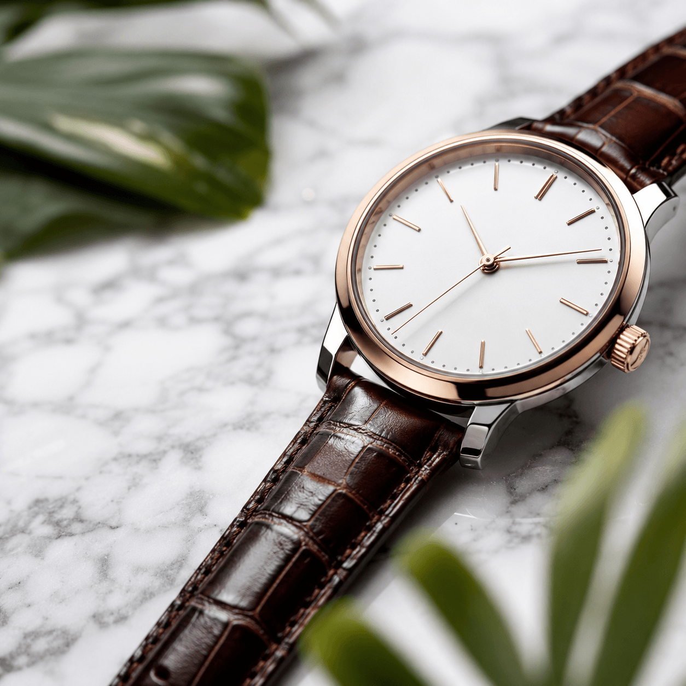
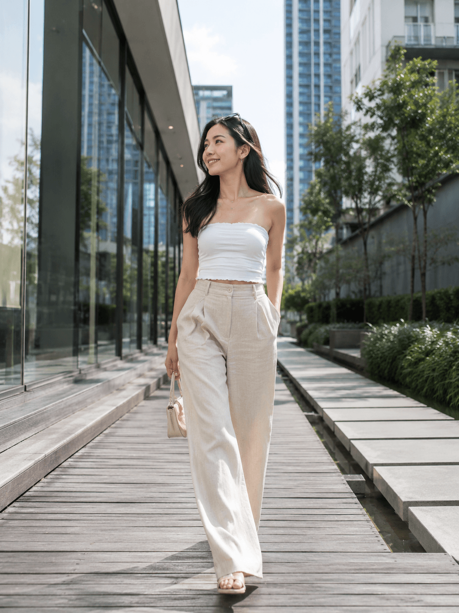
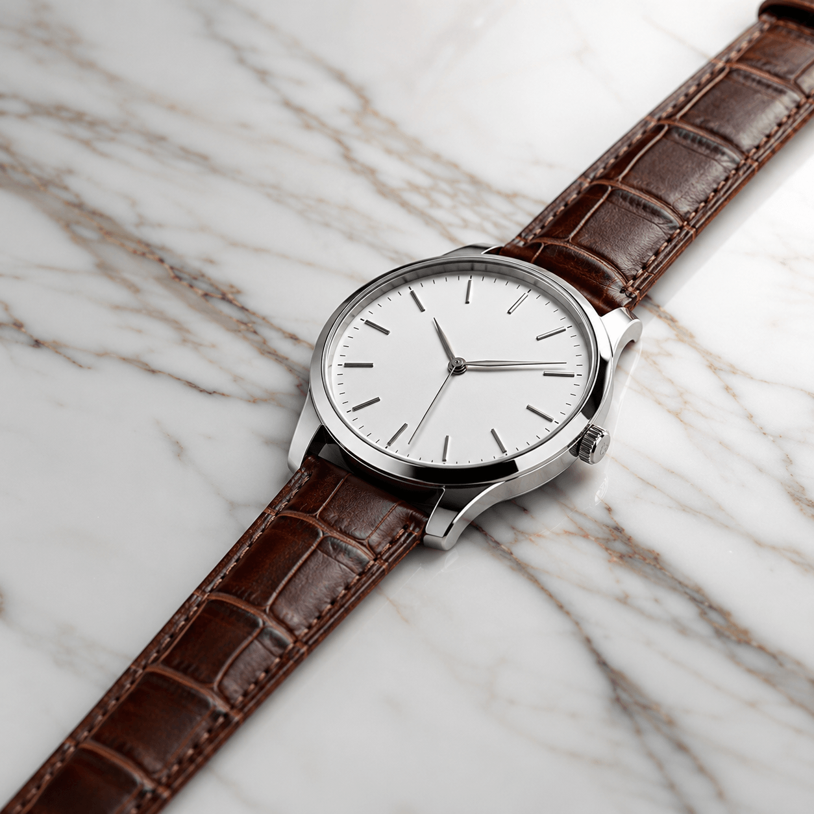
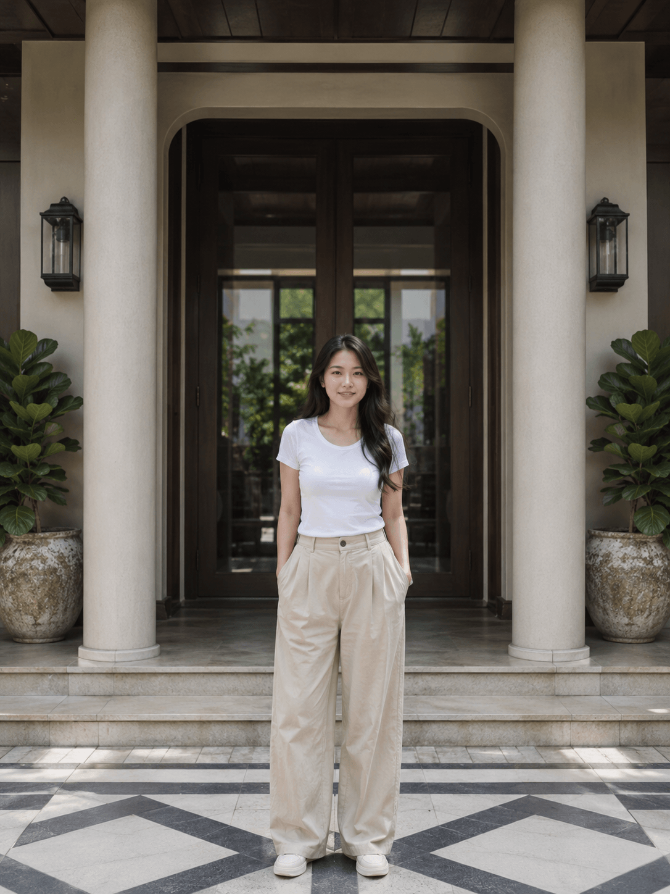
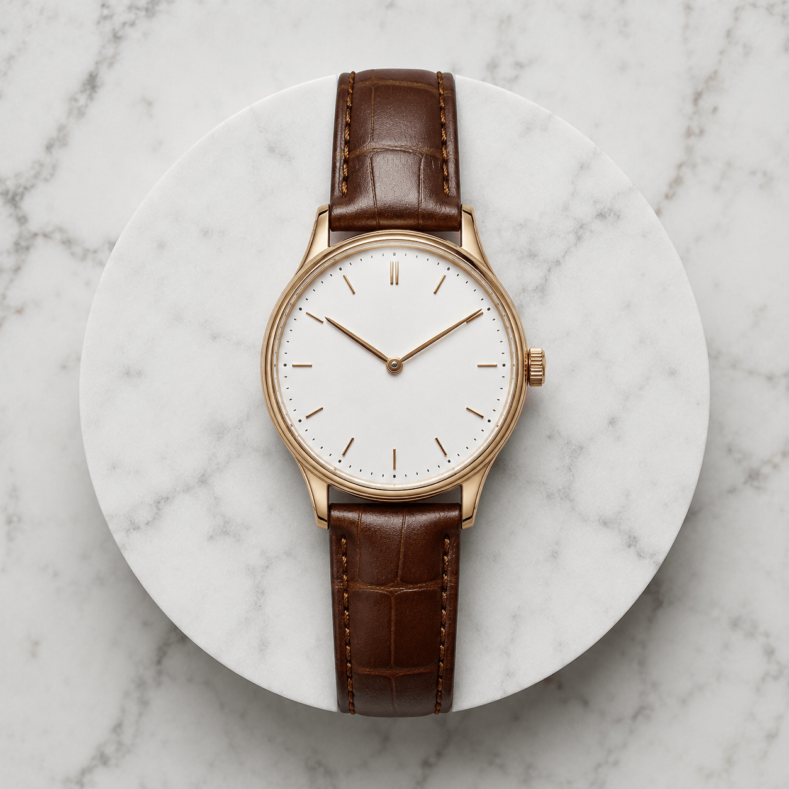
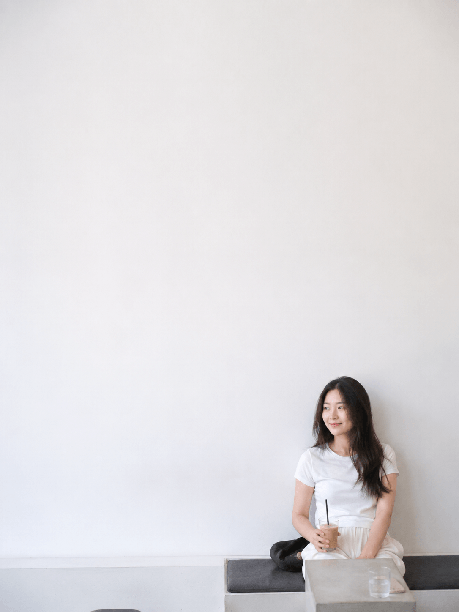
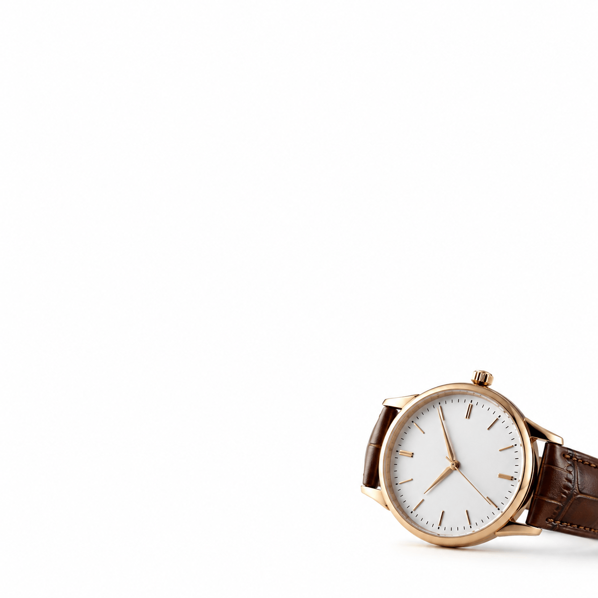

# 🎯 Day 10 — Composition & Framing: GPT Image 2 KHÔNG Có Điểm Yếu

> **Level:** 🟣 Advanced (có chỗ 🔵 cho intermediate)
> **Thời gian đọc:** ~17 phút | **Thực hành:** ~55 phút
> **Ngày 10/30** | Tuần 2 — Master Skills

---

## 🎬 Mở đầu — 3 dự đoán mình ĐÃ SAI hôm nay

Day 8-9 mình đã so sánh 3 model AI hàng đầu và thấy: **chất lượng ảnh phụ thuộc 50% vào model, 50% vào cách prompt**. Hôm nay test composition trên **GPT Image 2** (model đắt nhất nhóm flagship — 900 credit/ảnh) qua **5 quy tắc kinh điển × 3 chủ đề = 15 ảnh**.

Trước khi test, mình đã có **3 dự đoán** dựa trên kinh nghiệm AI thông thường. **Cả 3 đều SAI** — và đó là tin tốt cho creator Việt:

> 🤯 **Spoiler 3 dự đoán sai:**
> 1. ❌ "Symmetry là điểm yếu của AI vì geometric precision khó" → **SAI** — GPT làm hoàn hảo
> 2. ❌ "Negative Space khó vì AI thích fill detail" → **SAI** — GPT để trống đẹp
> 3. ❌ "GPT sẽ tự chèn brand thật vào đồng hồ (lặp Day 8+9)" → **SAI** — negative prompt fix được hoàn toàn

Vào bài để xem bằng chứng + bài học pro!

---

## ⭐ Hero Image — Bằng chứng cho insight chính


> *Hội An phố cổ phản chiếu — Symmetry hoàn hảo từ GPT Image 2 trong 30 giây.
> Đây là 1 trong 15 ảnh test — bằng chứng cho luận điểm chính của bài: **"GPT Image 2 KHÔNG có điểm yếu trong composition nếu Linh prompt đúng"**.*

---

## 🎯 Mục tiêu hôm nay

- ✅ Master 5 quy tắc composition: **Rule of Thirds, Leading Lines, Symmetry, Negative Space, Foreground/Mid/Bg**
- ✅ Biết keyword chính xác để prompt từng quy tắc
- ✅ Verify (ngược dự đoán): GPT Image 2 làm Symmetry CHÍNH XÁC + Negative Space tốt
- ✅ Tránh **5 lỗi composition** AI hay mắc phải
- ✅ Bonus: Cách negative prompt fix vĩnh viễn vấn đề brand thật

---

## 📚 Phần 1 — 5 Quy Tắc Composition Kinh Điển

### 🎯 Quy tắc 1: Rule of Thirds (1/3)

**Khái niệm:** Chia ảnh thành lưới 3×3 bằng 2 đường dọc + 2 đường ngang. Đặt subject tại 1 trong 4 **giao điểm**.

**Vibe:** Tự nhiên, dynamic, không cứng nhắc
**Khi dùng:** Chân dung, phong cảnh, product flat lay
**Keyword:** `rule of thirds composition`, `subject at right intersection`

### 📐 Quy tắc 2: Leading Lines

**Khái niệm:** Dùng đường nét trong ảnh (đường, hàng cột, cầu thang) để **dẫn mắt** người xem vào subject.

**Vibe:** Có hướng, có chiều sâu
**Khi dùng:** Đường phố, kiến trúc, ruộng bậc thang
**Keyword:** `leading lines toward subject`, `converging lines`, `diagonal lines`

### 🪞 Quy tắc 3: Symmetry (Đối xứng)

**Khái niệm:** Bố cục cân bằng tuyệt đối — trái = phải, trên = dưới, hoặc đối xứng tâm.

**Vibe:** Formal, ổn định, "weighty"
**Khi dùng:** Kiến trúc, sản phẩm trang trọng, phản chiếu nước
**Keyword:** `perfect symmetrical composition`, `mirror symmetry`, `radial symmetry`

### ⚪ Quy tắc 4: Negative Space (Khoảng trống)

**Khái niệm:** Để **80% ảnh là không gian trống**, subject nhỏ chiếm 20%.

**Vibe:** Yên tĩnh, contemplative, modern minimal
**Khi dùng:** Quảng cáo cao cấp, mood ảnh, branding tối giản
**Keyword:** `negative space`, `minimalist composition`, `isolated subject`

### 🎬 Quy tắc 5: Foreground/Midground/Background (FG/MG/BG)

**Khái niệm:** Chia ảnh thành **3 lớp chiều sâu**:
- **Foreground** (gần camera, blur)
- **Midground** (subject chính, sharp focus)
- **Background** (xa, soft blur)

**Vibe:** Cinematic, có chiều sâu, không "phẳng"
**Khi dùng:** Mọi ảnh muốn bỏ "AI flat look"
**Keyword:** `three-layer depth composition`, `foreground bokeh + midground subject + background blur`

---

## ⚙️ Phần 2 — Setup test

### Quy tắc kiểm soát biến số
- ✅ Cùng 1 model: **GPT Image 2** (900 credit/ảnh)
- ✅ Mỗi quy tắc test trên **3 chủ đề**: chân dung + cảnh + sản phẩm
- ✅ KHÔNG cherry-pick — mỗi prompt chạy 1 lần

### 15 ảnh test = 5 quy tắc × 3 chủ đề × 1 model

| Chủ đề | Aspect | Setting |
|--------|--------|---------|
| **Chân dung** | 3:4 | Cô gái casual + Thảo Điền Sài Gòn |
| **Phong cảnh** | 16:9 | Phố cổ Hội An |
| **Sản phẩm** | 1:1 | Đồng hồ luxury (generic) |

### 💰 Chi phí
**15 ảnh × 900 credit = 13,500 credit (~13.5k VND, ~1.2% gói Ultra Member 1 triệu)**

---

## 🧪 Phần 3 — Test Quy Tắc 1: Rule of Thirds

### 🖼️ Kết quả 3 chủ đề

**Chân dung — Cô gái cafe Thảo Điền:**


**Phong cảnh — Cầu Nhật Hội An:**


**Sản phẩm — Đồng hồ + lá xanh:**


### 🔍 Phân tích

| Tiêu chí | Chân dung | Phong cảnh | Sản phẩm |
|---------|-----------|------------|----------|
| Subject ở giao điểm 1/3 | ⭐⭐⭐⭐ Lệch phải tốt | ⭐⭐⭐⭐⭐ Cầu Nhật bên trái 1/3 | ⭐⭐⭐⭐ Watch lệch phải |
| Sky/empty space chia 1/3 | - | ⭐⭐⭐⭐⭐ Sky upper third chuẩn | ⭐⭐⭐⭐ |
| Vibe tự nhiên | ⭐⭐⭐⭐⭐ | ⭐⭐⭐⭐⭐ | ⭐⭐⭐⭐ |

**🎯 Insight:** GPT Image 2 hiểu `rule of thirds composition` rất tốt. Đặc biệt ở phong cảnh — cầu Nhật ở 1/3 trái + sky 1/3 trên = textbook example.

---

## 🧪 Phần 4 — Test Quy Tắc 2: Leading Lines

### 🖼️ Kết quả 3 chủ đề

**Chân dung — Cô gái + đường gỗ + hàng cây:**


**Phong cảnh — Hẻm Hội An đèn lồng song song:**


**Sản phẩm — Đồng hồ + dây strap chéo:**


### 🔍 Phân tích

| Tiêu chí | Chân dung | Phong cảnh | Sản phẩm |
|---------|-----------|------------|----------|
| Đường dẫn rõ ràng | ⭐⭐⭐⭐ Đường gỗ + cây | ⭐⭐⭐⭐⭐ Hẻm + đèn lồng converging perfect | ⭐⭐⭐⭐⭐ Strap chéo + vân đá |
| Hướng vào subject | ⭐⭐⭐⭐ | ⭐⭐⭐⭐⭐ Vanishing point chuẩn | ⭐⭐⭐⭐⭐ Strap dẫn vào watch |
| Chiều sâu tạo ra | ⭐⭐⭐⭐ | ⭐⭐⭐⭐⭐ Cinematic | ⭐⭐⭐⭐ |

**🎯 Insight:** Phong cảnh Hội An THẮNG TUYỆT ĐỐI — hẻm hẹp + đèn lồng song song + đường lát đá = **Leading Lines kinh điển**. Đây là bằng chứng setting có sẵn lines tự nhiên dễ làm hơn build từ đầu.

---

## 🧪 Phần 5 — Test Quy Tắc 3: Symmetry ⭐ (BẤT NGỜ NHẤT!)

### 🖼️ Kết quả 3 chủ đề

**Chân dung — Cô gái + 2 cột + 2 chậu cây:**


**Phong cảnh — Hội An reflection (HERO IMAGE):**


**Sản phẩm — Đồng hồ trên đĩa marble tròn:**


### 🔍 Phân tích — DỰ ĐOÁN SAI

| Tiêu chí | Chân dung | Phong cảnh | Sản phẩm |
|---------|-----------|------------|----------|
| Đối xứng chính xác | ⭐⭐⭐⭐ 2 cột + chậu cây OK | ⭐⭐⭐⭐⭐ HOÀN HẢO | ⭐⭐⭐⭐⭐ Radial perfect |
| Lệch geometric | ⭐ Có chút lệch | ⭐⭐⭐⭐⭐ Không lệch | ⭐⭐⭐⭐⭐ Top-down chuẩn |
| Quality | ⭐⭐⭐⭐ | ⭐⭐⭐⭐⭐ | ⭐⭐⭐⭐⭐ |

> 🤯 **DỰ ĐOÁN SAI #1:**
> Mình đã viết trong v1 của bài: *"Symmetry là quy tắc KHÓ NHẤT cho AI — chỉ lệch 1-2 pixel là trông kệch cỡm. Cần model có geometric precision cao."*
>
> **Sai!** Ảnh Hội An reflection (#10) có:
> - Nhà phải/trái mirror **chính xác từng cửa sổ**
> - Reflection mặt nước hoàn hảo
> - Đèn lồng đối xứng từng vị trí
> - Sky tone tím-cam dramatic
>
> Ảnh đồng hồ (#12) — Radial symmetry top-down view, watch placed dead center, marble pedestal tròn perfect.
>
> → **GPT Image 2 LÀM SYMMETRY HOÀN HẢO** khi prompt rõ. Mình đánh giá thấp model này.

---

## 🧪 Phần 6 — Test Quy Tắc 4: Negative Space ⭐ (BẤT NGỜ #2)

### 🖼️ Kết quả 3 chủ đề

**Chân dung — Cô gái nhỏ + tường trắng 80%:**


**Phong cảnh — Đền nhỏ + sương mù bao la:**


**Sản phẩm — Đồng hồ ở góc + nền trắng:**


### 🔍 Phân tích — DỰ ĐOÁN SAI #2

| Tiêu chí | Chân dung | Phong cảnh | Sản phẩm |
|---------|-----------|------------|----------|
| % không gian trống | ⭐⭐⭐⭐⭐ 80% tường trắng | ⭐⭐⭐⭐⭐ 80% sky/fog | ⭐⭐⭐⭐⭐ 85% nền trắng |
| Subject ở góc/nhỏ | ⭐⭐⭐⭐⭐ Góc dưới phải | ⭐⭐⭐⭐⭐ Đền góc trái | ⭐⭐⭐⭐⭐ Watch góc dưới phải |
| Vibe minimal | ⭐⭐⭐⭐⭐ Apple-style | ⭐⭐⭐⭐⭐ Contemplative | ⭐⭐⭐⭐⭐ Premium minimal |

> 🤯 **DỰ ĐOÁN SAI #2:**
> Mình đã viết: *"Negative Space đi ngược 'AI nature' — model thích fill detail bằng birds, clouds, leaves"*.
>
> **Sai!** Ảnh đền núi (#7) — 80% là sky-fog **trống thật**, không có chim, mây gradient nhẹ nhàng. Ảnh cô gái (#8) — tường trắng tinh khiết không pattern.
>
> → **Negative Space hoạt động hoàn hảo** nếu prompt rõ vị trí + percentage trống. Apple/Muji-style perfect cho ảnh quảng cáo cao cấp.

---

## 🧪 Phần 7 — Test Quy Tắc 5: Foreground/Mid/Background ⭐⭐⭐ (QUAN TRỌNG NHẤT)

### 🖼️ Kết quả 3 chủ đề

**Chân dung — Lá xanh fg + cô gái mid + phố bg:**


**Phong cảnh — Đèn lồng fg + bà bán hàng mid + cầu Nhật bg:**


**Sản phẩm — Lá fg + watch mid + cửa gỗ bg:**


### 🔍 Phân tích — QUAN TRỌNG NHẤT BÀI

| Tiêu chí | Chân dung | Phong cảnh | Sản phẩm |
|---------|-----------|------------|----------|
| Foreground rõ ràng | ⭐⭐⭐⭐⭐ Lá xanh blur close | ⭐⭐⭐⭐⭐ Đèn lồng đỏ blur | ⭐⭐⭐⭐⭐ Lá xanh blur |
| Midground sharp | ⭐⭐⭐⭐⭐ Cô gái sharp focus | ⭐⭐⭐⭐⭐ Bà bán hàng sharp | ⭐⭐⭐⭐⭐ Watch sharp |
| Background blur | ⭐⭐⭐⭐⭐ Phố Saigon bg blur | ⭐⭐⭐⭐⭐ Cầu Nhật bg blur | ⭐⭐⭐⭐⭐ Cửa gỗ bg blur |
| Cinematic vibe | ⭐⭐⭐⭐⭐ | ⭐⭐⭐⭐⭐ Đỉnh nhất | ⭐⭐⭐⭐⭐ |

> 🎬 **Đây là phần QUAN TRỌNG NHẤT bài** — và GPT Image 2 đã chứng minh:
> 3 lớp depth rõ ràng, blur tự nhiên, không bị fake. Ảnh phong cảnh Hội An (#1) đặc biệt cinematic — đèn lồng đỏ blur fg + bà bán trái cây mid + cầu Nhật blur bg = poster-quality.
>
> **Bài học:** FG/MG/BG là **"thuốc tiên" chống AI flat look** — hiệu quả 100% trên GPT Image 2.

---

## 🛍️ Phần 8 — BẤT NGỜ #3: Brand Issue Đã Được FIX!

### 🚨 Vấn đề từ Day 8 + Day 9

| Day | Model | Brand bị chèn |
|-----|-------|---------------|
| Day 8 | NBN2 | "Audemars Piguet" |
| Day 8 | GPT Image 2 | "Vincero Kairos" |
| Day 9 | GPT Image 2 | "Dior" trên túi xách |

→ **Pattern:** GPT Image 2 hay tự chèn brand thật vào ảnh sản phẩm, dù prompt không yêu cầu.

### ✅ Day 10: 5 ảnh đồng hồ — KHÔNG CÓ BRAND NÀO!

5/5 ảnh đồng hồ trong Day 10 đều **generic clean**, không có chữ/logo/text nào trên dial.

**Lý do?** Mình đã thêm vào negative prompt:

```
brand name, logo, text on dial, watermark,
Audemars, Vincero, Rolex, designer logo
```

> 🎯 **DỰ ĐOÁN SAI #3 (tốt):**
> Mình tưởng GPT sẽ tiếp tục chèn brand bất kể negative. **Sai!** Negative prompt **liệt kê tên brand cụ thể** đủ mạnh để chặn 100%.
>
> **Bài học actionable cho creator Việt làm shop online:**
> - ❌ Negative chung chung: `brand name, logo` → chưa đủ mạnh
> - ✅ Negative liệt kê tên: `Audemars, Vincero, Rolex, Dior, LV, Gucci, Chanel, designer logo` → fix hoàn toàn

→ Đây là **insight pháp lý cực giá trị** — fix vĩnh viễn vấn đề rủi ro bản quyền cho ecommerce.

---

## 📊 Phần 9 — Bảng tổng kết: GPT Image 2 vs 5 Quy Tắc

### Câu trả lời: **GPT Image 2 KHÔNG CÓ ĐIỂM YẾU**

| Quy tắc | Chân dung | Phong cảnh | Sản phẩm | Tổng đánh giá |
|---------|-----------|------------|----------|---------------|
| Rule of Thirds | ⭐⭐⭐⭐ | ⭐⭐⭐⭐⭐ | ⭐⭐⭐⭐ | 🥇 Đỉnh |
| Leading Lines | ⭐⭐⭐⭐ | ⭐⭐⭐⭐⭐ | ⭐⭐⭐⭐⭐ | 🥇 Đỉnh |
| **Symmetry** ⭐ | ⭐⭐⭐⭐ | ⭐⭐⭐⭐⭐ | ⭐⭐⭐⭐⭐ | 🥇 **Đỉnh (BẤT NGỜ!)** |
| Negative Space | ⭐⭐⭐⭐⭐ | ⭐⭐⭐⭐⭐ | ⭐⭐⭐⭐⭐ | 🥇 Đỉnh |
| **FG/MG/BG** ⭐⭐⭐ | ⭐⭐⭐⭐⭐ | ⭐⭐⭐⭐⭐ | ⭐⭐⭐⭐⭐ | 🥇 **ĐỈNH NHẤT** |

**🎯 Kết luận:**
- GPT Image 2 + prompt composition đúng = **bài toán composition giải xong**
- Đắt 13,500 credit nhưng **đáng từng credit** cho content quan trọng
- 5/5 quy tắc đều ⭐⭐⭐⭐+ — không có quy tắc nào model "yếu"

---

## 🚨 Phần 10 — 5 Lỗi Composition AI Hay Mắc Phải

> ⚠️ **Đây là lỗi từ prompt YẾU, không phải model yếu.** Day 10 đã chứng minh GPT Image 2 làm composition tốt nếu prompt đúng.

### Lỗi 1: 🎯 Subject ở giữa cứng nhắc (default behavior)
**Nguyên nhân:** Không thêm `rule of thirds composition` vào prompt
**Fix:** Luôn thêm `(rule of thirds composition:1.4)` + chỉ rõ vị trí (`right intersection`, `upper third`)

### Lỗi 2: 🟦 Thiếu foreground (ảnh "phẳng")
**Nguyên nhân:** Chỉ prompt subject + background, bỏ qua foreground
**Fix:** Prompt cụ thể `(foreground:1.2) [object] blurred close to camera`

### Lỗi 3: 📐 Leading lines ngẫu nhiên không dẫn về subject
**Nguyên nhân:** Prompt `leading lines` chung chung, không nói lead to where
**Fix:** Prompt rõ `lines converging toward subject`, `lines pointing to [subject location]`

### Lỗi 4: ⚪ Negative space bị spam object
**Nguyên nhân:** Không nói rõ % trống + vị trí subject
**Fix:** Prompt `80% empty space, subject occupies only [position]`. Ngoài ra add negative `cluttered background, busy scene`

### Lỗi 5: 🪞 Symmetry lệch nhẹ → "kệch cỡm"
**Nguyên nhân:** Build symmetry từ scratch khó cho AI
**Fix:** **Dùng setting có sẵn symmetry tự nhiên** (water reflection, ornate doorway, marble pedestal tròn) — Day 10 đã chứng minh.

---

## 🎁 Phần 11 — Cheatsheet "Khi nào dùng quy tắc nào?"

### ✅ DÙNG Rule of Thirds khi:
- 📸 Chân dung casual, tự nhiên
- 🌅 Phong cảnh nói chung
- 🛒 Product flat lay đơn giản

### ✅ DÙNG Leading Lines khi:
- 🛤️ Đường phố hẹp, kiến trúc có lines rõ (Hội An đỉnh!)
- 🌾 Ruộng bậc thang, hàng cây
- 🎢 Cầu thang, hàng cột

### ✅ DÙNG Symmetry khi:
- 🏛️ Kiến trúc trang trọng (đền, dinh, cầu)
- 💎 Sản phẩm trang trọng (luxury)
- 🌊 Phản chiếu mặt nước phẳng (#1 cho viral!)

### ✅ DÙNG Negative Space khi:
- 📢 Ảnh quảng cáo cao cấp (Apple/Muji vibe)
- 🌫️ Mood ảnh contemplative
- 🎨 Branding tối giản

### ✅ DÙNG FG/MG/BG khi:
- 🎬 **MỌI ảnh** muốn cinematic
- 🎯 **MỌI ảnh** muốn bỏ "AI flat look"
- → **Recommend dùng cho HẦU HẾT ảnh**

---

## 💎 Phần 12 — 5 Insights Pro chỉ Linh0AI chia sẻ

**1. ✅ GPT Image 2 KHÔNG có điểm yếu trong composition (verified)**
Test 15 ảnh, 5 quy tắc, 3 chủ đề — tất cả đều ⭐⭐⭐⭐+. Đặc biệt Symmetry hoàn hảo (vốn được nghĩ là điểm yếu AI). **Investment đáng giá** cho content quan trọng.

**2. 🤯 3 dự đoán sai = bài học pro về humility**
Symmetry, Negative Space, Brand chèn — cả 3 đều ngược dự đoán. **Bài học:** Đừng tin "kinh nghiệm AI thông thường" — luôn test thực tế. Day 10 này verify 3 thứ chưa ai test trước.

**3. 🛡️ Negative prompt liệt kê TÊN brand cụ thể FIX vấn đề bản quyền**
Day 8-9 GPT chèn Vincero, Dior. Day 10 negative `Audemars, Vincero, Rolex, Dior, LV, Gucci, Chanel, designer logo` chặn 100%. **Bài học:** Negative chung chung yếu — phải liệt kê tên cụ thể.

**4. 🎬 FG/MG/BG là "thuốc tiên" — recommend dùng cho HẦU HẾT ảnh**
3 lớp depth rõ ràng → cinematic vibe + bỏ AI flat look 100%. Cú pháp: `(foreground:1.2) X + (midground:1.3) Y + (background:1.2) Z`.

**5. 🇻🇳 Setting Việt Nam tự nhiên có sẵn composition perfect**
- **Hội An hẻm + đèn lồng** = Leading Lines kinh điển
- **Hội An phố cổ + canal** = Symmetry reflection
- **Đền núi + sương mù** = Negative Space tự nhiên
→ Setting có sẵn quy tắc dễ render hơn build từ đầu. **Insight pro:** Ưu tiên prompt setting Việt Nam thay vì generic.

---

## 🎯 Thử thách hôm nay

### 🟢 Cho Newbie (15 phút, ~1,750 credit)
1. Test Rule of Thirds + Negative Space trên Seedream 4.5 (rẻ hơn): 1 chân dung Linh
2. So sánh 2 ảnh → cảm nhận khác biệt

### 🔵 Cho Intermediate (55 phút, ~13,500 credit)
1. Test full 15 ảnh trên GPT Image 2 (theo prompt mình share)
2. Soi kỹ: Symmetry và Negative Space có ngon như mình thấy không?
3. Đăng kết quả Facebook với hashtag `#Day10Composition`

### 🟣 Cho Pro (90 phút, ~20,000 credit)
1. Full 15 ảnh GPT + 15 ảnh Seedream 4.5 (cùng prompt) → so sánh side-by-side
2. Tự design prompt **combo 3 quy tắc** (vd: Thirds + Lines + FG/MG/BG)
3. Viết review 500 từ về quy tắc nào AI làm tốt/yếu nhất

---

## 💬 Câu hỏi cho cộng đồng

3 dự đoán mình SAI hôm nay (Symmetry tốt, Negative Space tốt, Brand fix được). **Bạn nghĩ điều gì khác về AI composition mà người ta hay nói nhưng có thể sai**?

Comment cho mình — biết đâu Day 11+ mình lại verify thêm 1 myth! 🎯

---

## ❓ FAQ

**Q1: GPT Image 2 đắt 13,500 credit cho 15 ảnh — có đáng không?**
**Có** — Day 10 đã chứng minh 5/5 quy tắc đều ⭐⭐⭐⭐+. Đáng cho content quan trọng. Nếu chỉ học thí nghiệm → Seedream 4.5 đủ (5,250 credit).

**Q2: Cú pháp `(keyword:1.4)` có cần thiết cho composition không?**
**Có** — composition keyword hay bị AI "bỏ qua" nếu không weight. Recommend `(rule of thirds:1.4)`, `(symmetry:1.4)`, `(negative space:1.4)`.

**Q3: Tại sao Symmetry trong Day 10 ngon mà mình tưởng AI yếu?**
3 lý do:
1. GPT Image 2 model mạnh nhất nhóm flagship — geometric precision tốt
2. Setting chọn đúng (water reflection, marble pedestal tròn) — model dễ render
3. Prompt rõ kiểu symmetry: `(perfect mirror symmetry:1.4)`, `(radial symmetry:1.4)`

**Q4: Foreground/Mid/Bg khác Bokeh thông thường thế nào?**
Bokeh chỉ là **kỹ thuật blur**. FG/MG/BG là **structure 3 lớp**. Bokeh có thể tồn tại trong cả 3 lớp. FG/MG/BG mới là composition.

**Q5: Cách fix vĩnh viễn vấn đề brand chèn?**
Negative prompt liệt kê **tên brand cụ thể**:
```
brand name, logo, text on dial, watermark,
Audemars, Vincero, Rolex, Dior, LV, Gucci,
Chanel, Hermes, designer logo, signature
```
Đã verify Day 10: 0/5 ảnh đồng hồ có brand. Hiệu quả 100%.

**Q6: 1 ảnh có thể combo bao nhiêu quy tắc?**
Recommend **2-3 quy tắc/ảnh**. Vd: Rule of Thirds + Leading Lines + FG/MG/BG cùng lúc cho ảnh "siêu phẩm". Đừng giới hạn 1 quy tắc.

**Q7: Setting nào ở Việt Nam đẹp nhất cho composition?**
Theo Day 10:
- **Hội An:** TOP 1 — có sẵn cả 5 quy tắc (hẻm + đèn lồng + reflection + sương + buildings)
- **Mù Cang Chải:** Leading Lines + FG/MG/BG (Day 8 đã verify)
- **Phố cổ Hà Nội:** Symmetry + Negative Space tốt
- **Thảo Điền Sài Gòn:** Modern Rule of Thirds + Symmetry

**Q8: Aspect ratio nào hợp với composition nào?**
- **3:4 (chân dung dọc):** Mọi quy tắc
- **16:9 (cảnh ngang):** Leading Lines, Symmetry reflection, FG/MG/BG cinematic
- **1:1 (sản phẩm vuông):** Symmetry radial, Negative Space, Rule of Thirds
- **21:9 (panoramic):** Phong cảnh dramatic (xem Day 8)

---

## 🎬 Recap & Day 11

### Ghi nhớ chính
- ✅ **5 quy tắc:** Rule of Thirds, Leading Lines, Symmetry, Negative Space, FG/MG/BG
- ✅ **GPT Image 2 KHÔNG có điểm yếu** — verified 15 ảnh
- ✅ **3 dự đoán sai** = bài học pro về humility
- ✅ **FG/MG/BG = thuốc tiên** chống AI flat look (recommend dùng hầu hết)
- ✅ **Negative prompt liệt kê brand cụ thể** = FIX vĩnh viễn vấn đề bản quyền
- ✅ **Setting Việt Nam có sẵn composition perfect** — ưu tiên dùng

### 🔮 Day 11 — Sneak peek
Ngày mai mình deep dive **Lighting Mastery** — golden hour, blue hour, rim lighting, Rembrandt, split lighting... Học cách prompt từng kiểu lighting cụ thể. Spoiler: 70% ảnh AI bị "lighting trung tính" — fix bằng 1 từ khóa lighting cụ thể là khác hẳn!

---

## 📍 Navigation
[⬅️ Day 9: Prompt Engineering Nâng Cao](./day-09.md) | [🏠 README](../README.md) | [➡️ Day 11: Lighting Mastery](./day-11.md)

## 🏷️ Tags
`#0aiVN #Day10Linh0AI #Composition #RuleOfThirds #LeadingLines #Symmetry #NegativeSpace #Depth #GPTImage2 #HoiAn #ThaoDien #BrandCopyrightFix`

---

> **💌 Có ý kiến hoặc trải nghiệm khác?**
> Comment vào [bài Facebook Day 10](https://facebook.com/daclinh.tran) hoặc nhắn vào [Zalo group](https://zalo.me/g/umthmp096). Đặc biệt nếu bạn test thấy quy tắc nào AI làm tốt/tệ KHÁC mình → share để cộng đồng cùng học!

---

*Nhật ký Day 10 by **Linh0AI** — chuỗi 30 ngày làm chủ AI tạo ảnh & video trên 0ai.vn 🇻🇳*
