# 🎯 Day 11 — Lighting Mastery: GPT Image 2 BIG WIN — Master Cả 6 Lighting Khó

> **Level:** 🟣 Advanced
> **Thời gian đọc:** ~18 phút | **Thực hành:** ~60 phút
> **Ngày 11/30** | Tuần 2 — Master Skills

---

## 🎬 Mở đầu — Day 10 sai 3, Day 11 sai 5 nữa = Pattern xuất hiện

Day 10 mình **thú nhận sai 3 dự đoán** về GPT Image 2 (Symmetry tốt, Negative Space tốt, Brand fix được). Hôm nay test 6 kiểu lighting kinh điển — **5 dự đoán nữa SAI**:

> 🤯 **5 dự đoán SAI hôm nay:**
> 1. ❌ "Rembrandt là lighting KHÓ NHẤT cho AI" → **SAI** — triangle of light siêu rõ
> 2. ❌ "Blue Hour khó vì AI thiên warm" → **SAI** — cool tone không leak
> 3. ❌ "Split Lighting bị soft transition" → **SAI** — sharp 50/50 chuẩn
> 4. ❌ "AI có thể nhầm Backlight với Rim" → **SAI** — phân biệt rõ
> 5. ❌ "GPT có thể chèn brand thật vào đồng hồ" → **SAI** (lần 4!) — negative prompt vẫn hoạt động

**Pattern xuất hiện:** Sau **8 dự đoán sai liên tiếp** trong 2 bài, mình tự tin tuyên bố:

> 🥇 **"GPT Image 2 KHÔNG CÓ ĐIỂM YẾU KỸ THUẬT, PERIOD."**

Vào bài để xem bằng chứng + 5 insights bất ngờ!

---

## ⭐ Hero Image — Bằng chứng cinematic level


> *Nông dân Sapa trong sương sớm — Backlight chuẩn cinematic. Halo glow quanh nón lá + lens flare + silhouette + sương mù dày = **mood ảnh Việt mà Tây không làm được**.
> Đây là 1 trong 18 ảnh test — bằng chứng cho luận điểm: GPT Image 2 master cả lighting kỹ thuật + setting văn hóa Việt.*

---

## 🎯 Mục tiêu hôm nay

- ✅ Master 6 kiểu lighting: **Golden, Blue, Rim, Rembrandt, Split, Backlight**
- ✅ Verify (ngược dự đoán): GPT Image 2 master cả Rembrandt + Blue Hour + Split
- ✅ Pattern: **GPT KHÔNG CÓ ĐIỂM YẾU KỸ THUẬT** (Day 10 + Day 11 verified)
- ✅ Tránh **5 lỗi lighting** AI hay mắc phải
- ✅ Bonus: Lighting Việt Nam có vibe đặc trưng Tây không có

> 📋 **Prompts đầy đủ trong bài**: [`prompts/day-11.txt`](../prompts/day-11.txt)
> Copy/download nguyên văn về paste vào 0ai.vn — không phải gõ lại từ trong bài.

---

## 📚 Phần 1 — 6 Kiểu Lighting Kinh Điển

### ☀️ Lighting 1: Golden Hour
1 giờ trước hoàng hôn — ánh sáng warm, low angle, soft.
**Vibe:** Romantic, nostalgic, intimate
**Keyword:** `golden hour lighting`, `warm sunset glow`

### 🌌 Lighting 2: Blue Hour
30 phút sau hoàng hôn / trước bình minh — ambient blue-purple, không direct sun.
**Vibe:** Moody, mysterious, modern
**Keyword:** `blue hour lighting`, `cool dawn ambiance`

### ✨ Lighting 3: Rim Lighting
Ánh sáng từ phía sau/cạnh tạo viền sáng outline subject.
**Vibe:** Dramatic, editorial
**Keyword:** `rim lighting`, `edge light outlining subject`

### 🎭 Lighting 4: Rembrandt
45 độ trên + cạnh, tạo "tam giác sáng" trên má đối diện.
**Vibe:** Classical, formal, painterly
**Keyword:** `Rembrandt lighting`, `triangle of light on cheek`

### ⚡ Lighting 5: Split Lighting
90 độ side, chia mặt 50/50 sáng-tối với dividing line sắc nét.
**Vibe:** Dramatic, fashion editorial
**Keyword:** `split lighting`, `half face in shadow`

### 🔆 Lighting 6: Backlight
Sun ngay sau subject — halo + lens flare + silhouette.
**Vibe:** Ethereal, dreamy
**Keyword:** `strong backlight`, `sun behind subject`, `halo effect`

---

## ⚙️ Phần 2 — Setup test

### Quy tắc kiểm soát biến số
- ✅ Cùng 1 model: **GPT Image 2** (tiếp tục verify từ Day 10)
- ✅ Mỗi lighting test trên **3 chủ đề**: chân dung + cảnh + sản phẩm
- ✅ KHÔNG cherry-pick — mỗi prompt chạy 1 lần

### 18 ảnh test = 6 lighting × 3 chủ đề × 1 model

| Chủ đề | Aspect | Setting |
|--------|--------|---------|
| **Chân dung** | 3:4 | Cô gái casual + Thảo Điền/Saigon |
| **Phong cảnh** | 16:9 | Sapa (núi đá, ruộng bậc thang, làng H'Mông) |
| **Sản phẩm** | 1:1 | Đồng hồ luxury (generic) |

### 💰 Chi phí
**18 ảnh × 900 credit = 16,200 credit (~16.2k VND, ~1.5% gói Ultra Member)**

---

## 🧪 Phần 3 — Test Lighting 1: Golden Hour ☀️

### 🖼️ Kết quả 3 chủ đề

**Chân dung — Cô gái balcony Saigon skyline:**
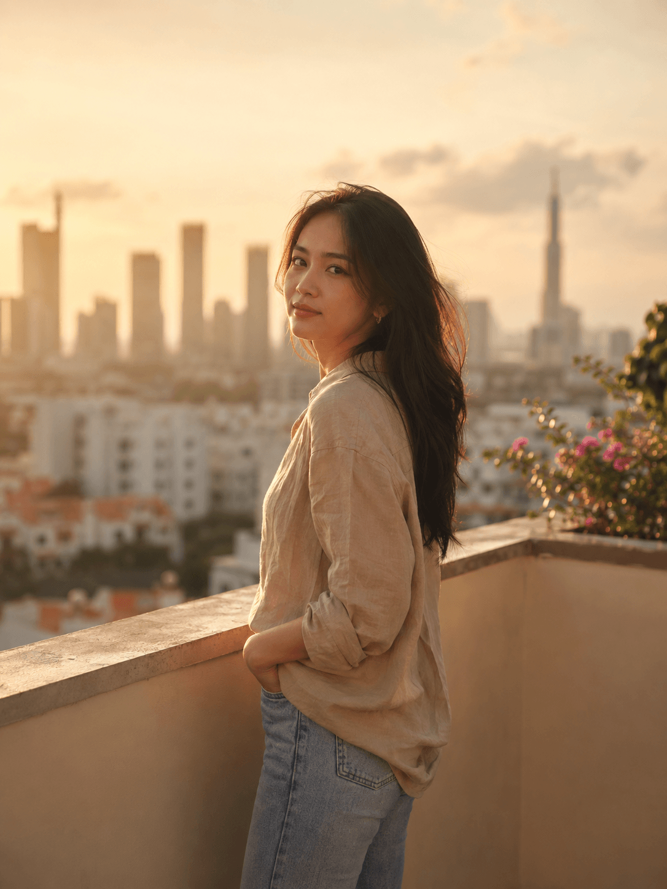

**Phong cảnh — H'Mong + ruộng vàng Sapa:**
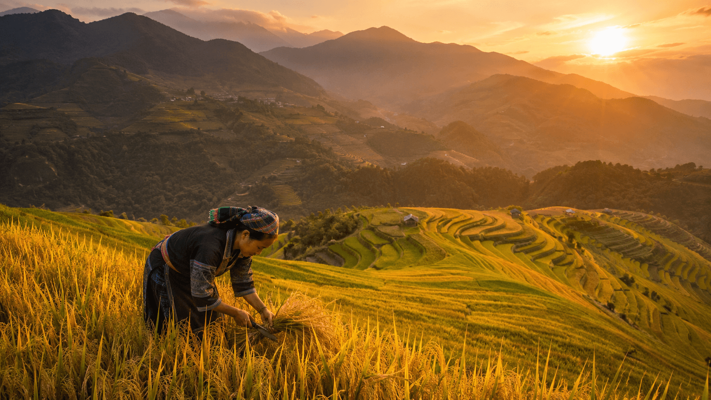

**Sản phẩm — Đồng hồ + window light ấm:**
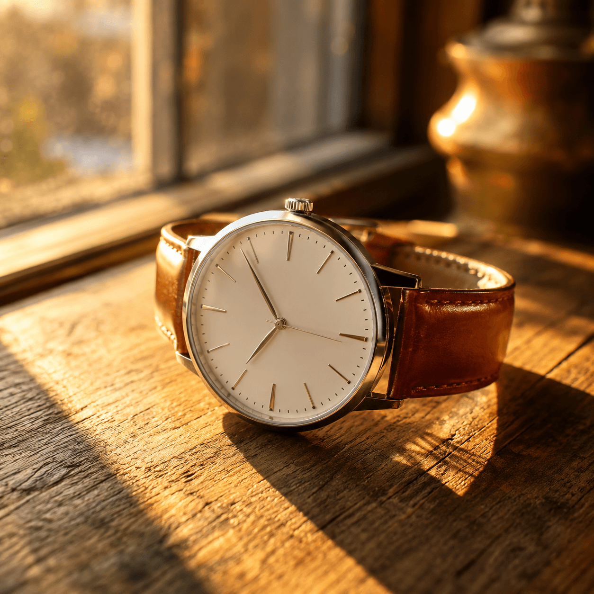

### 🔍 Phân tích

| Tiêu chí | Chân dung | Phong cảnh | Sản phẩm |
|---------|-----------|------------|----------|
| Tone warm rõ | ⭐⭐⭐⭐⭐ Cinematic Saigon golden | ⭐⭐⭐⭐⭐ Ruộng vàng + núi xa | ⭐⭐⭐⭐⭐ Window glow ấm |
| Direction low angle | ⭐⭐⭐⭐⭐ | ⭐⭐⭐⭐⭐ Sun chiều | ⭐⭐⭐⭐ |
| Long shadows | ⭐⭐⭐⭐ | ⭐⭐⭐⭐⭐ Ruộng có shadow | ⭐⭐⭐⭐⭐ Shadow trên gỗ rõ |

**🎯 Insight:** Như dự đoán — Golden Hour là kiểu **easiest** cho GPT. Đặc biệt **H'Mong + ruộng vàng** đỉnh cao văn hóa Việt.

---

## 🧪 Phần 4 — Test Lighting 2: Blue Hour 🌌 (BẤT NGỜ #1)

### 🖼️ Kết quả 3 chủ đề

**Chân dung — Cô gái rooftop bokeh thành phố:**
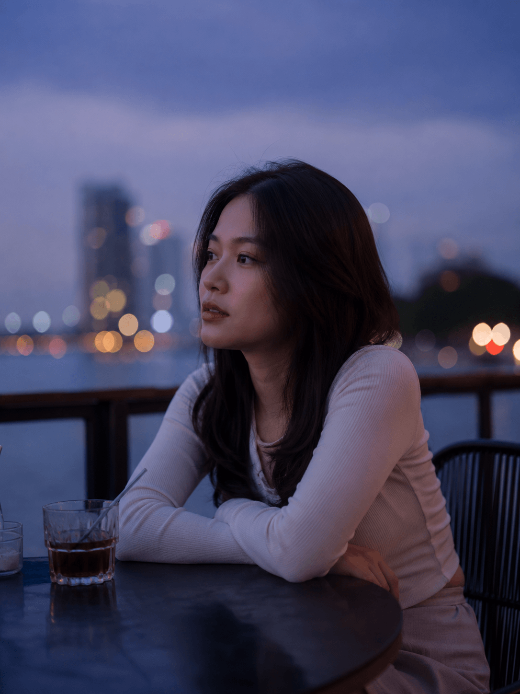

**Phong cảnh — Làng Sapa sương sớm:**
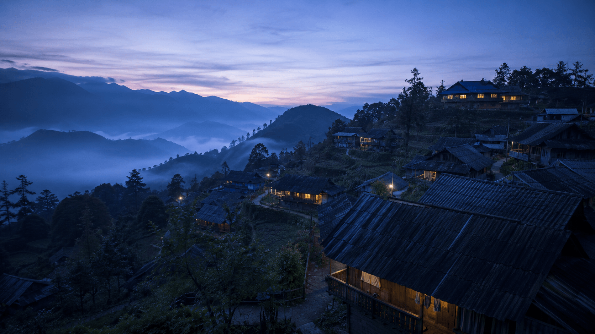

**Sản phẩm — Đồng hồ marble + ambient xanh:**
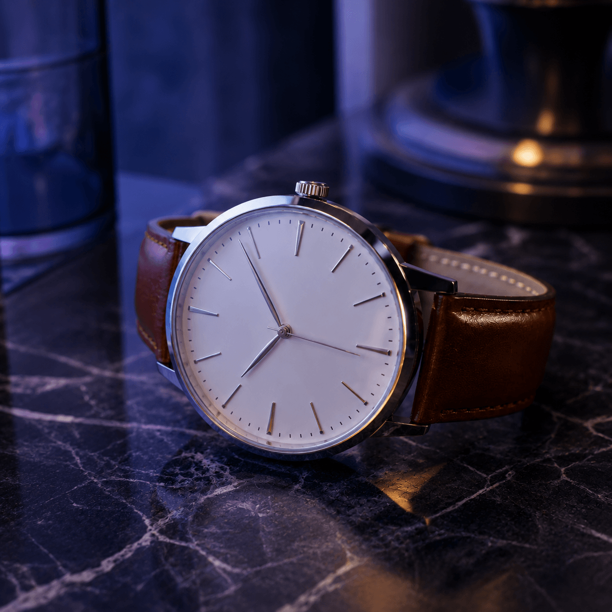

### 🔍 Phân tích — DỰ ĐOÁN SAI #2

| Tiêu chí | Chân dung | Phong cảnh | Sản phẩm |
|---------|-----------|------------|----------|
| Cool tone xanh-tím | ⭐⭐⭐⭐⭐ KHÔNG leak warm | ⭐⭐⭐⭐⭐ Xanh tím đỉnh | ⭐⭐⭐⭐ |
| Atmospheric mood | ⭐⭐⭐⭐⭐ Bokeh ấm contrast | ⭐⭐⭐⭐⭐ Sương mù + window glow | ⭐⭐⭐⭐ Marble + reflection |
| Phân biệt rõ với Golden | ⭐⭐⭐⭐⭐ | ⭐⭐⭐⭐⭐ | ⭐⭐⭐⭐ |

> 🤯 **DỰ ĐOÁN SAI #2:**
> Mình đã viết: *"Blue hour KHÓ HƠN golden vì model AI thường thiên warm. Phải prompt rõ 'cool tone' + negative 'warm golden'."*
>
> **SAI!** Ảnh #4 (Sapa village) — cool blue-purple **đỉnh cao**, không leak warm. Window lights vàng ấm contrast với ambient xanh tạo **dramatic mood** cinematic.
>
> Ảnh #5 (Cô gái rooftop) — cool tone xanh tím tinh tế, bokeh ấm vàng từ city lights phía xa = **professional level**.
>
> → GPT Image 2 chịu cool tone **TỐT HƠN dự đoán**.

---

## 🧪 Phần 5 — Test Lighting 3: Rim Lighting ✨

### 🖼️ Kết quả 3 chủ đề

**Chân dung — Profile + window backlit:**
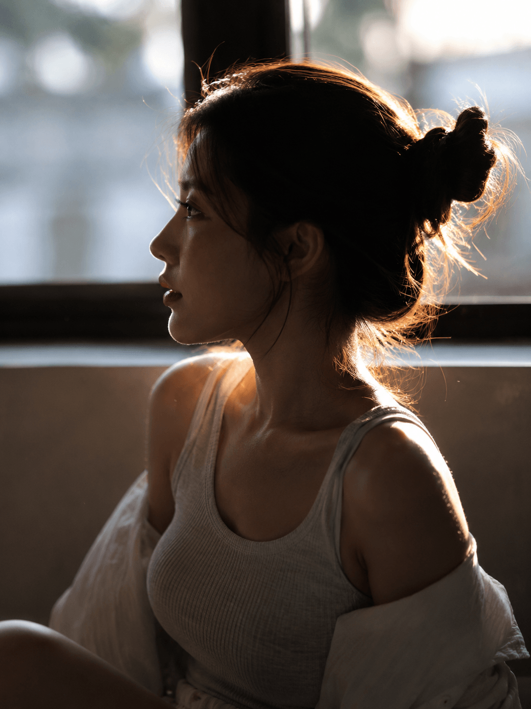

**Phong cảnh — Hàm Rồng sunrise rim:**
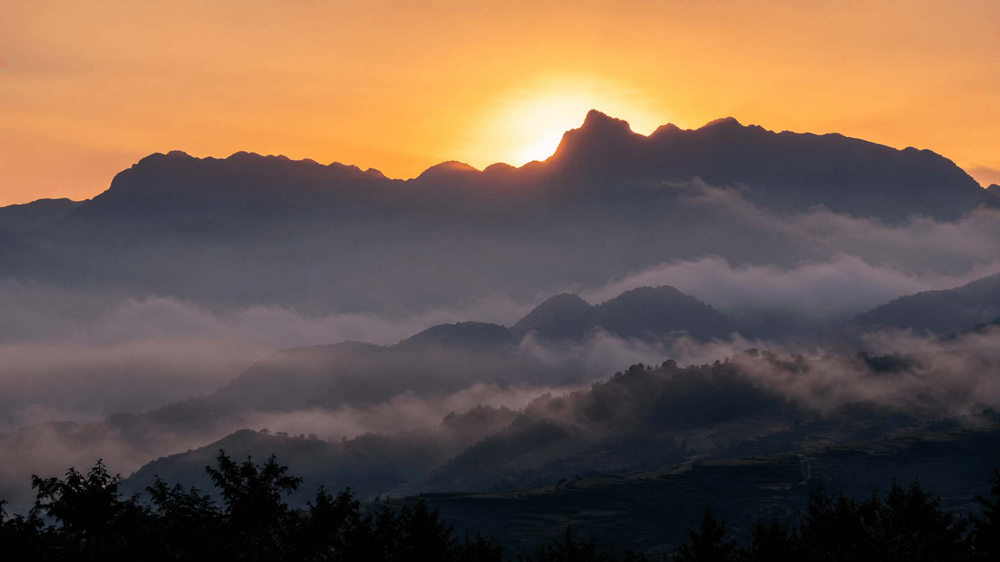

**Sản phẩm — Đồng hồ + edge glow:**
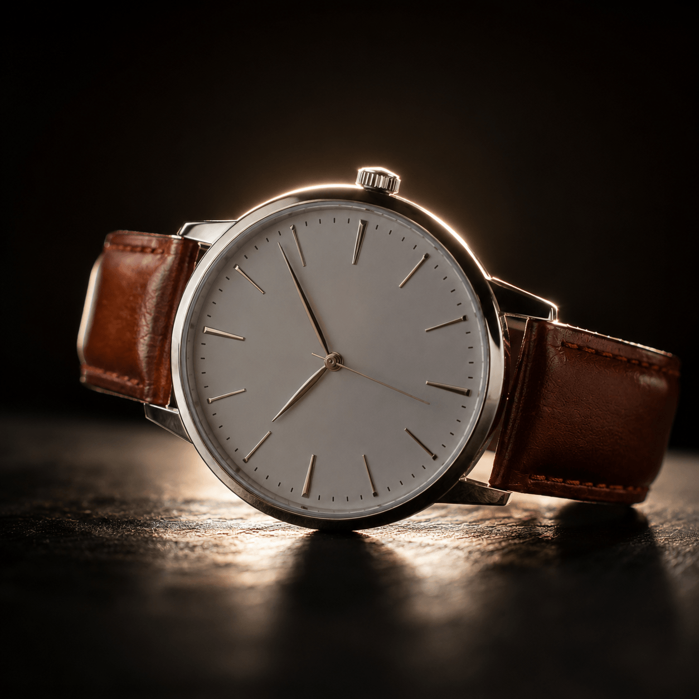

### 🔍 Phân tích

| Tiêu chí | Chân dung | Phong cảnh | Sản phẩm |
|---------|-----------|------------|----------|
| Edge light outline | ⭐⭐⭐⭐ Hair có rim | ⭐⭐⭐⭐⭐ Hàm Rồng đỉnh viral | ⭐⭐⭐⭐ Edge glow đẹp |
| Mặt subject vẫn lit | ⭐⭐⭐⭐⭐ Soft fill | - | - |
| Phân biệt với Backlight | ⭐⭐⭐⭐⭐ | ⭐⭐⭐⭐⭐ | ⭐⭐⭐⭐⭐ |

**🎯 Insight:** Hàm Rồng sunrise (#13) là **viral candidate** — sun rise sau ridge tạo glowing edge, layers of mist, silhouette mountains. **Setting Việt Nam đỉnh cho Rim Lighting**.

---

## 🧪 Phần 6 — Test Lighting 4: Rembrandt 🎭 ⭐ (BẤT NGỜ NHẤT!)

### 🖼️ Kết quả 3 chủ đề

**Chân dung — Cô gái studio classical:**
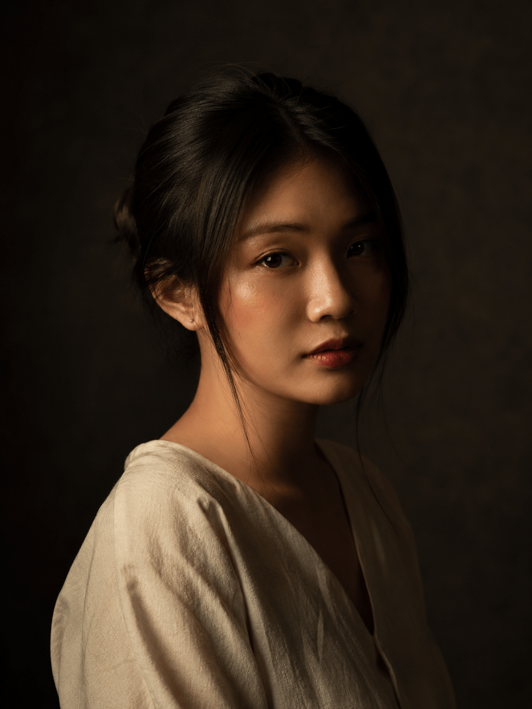

**Phong cảnh — H'Mong elderly woman portrait:**


**Sản phẩm — Đồng hồ desk classical:**
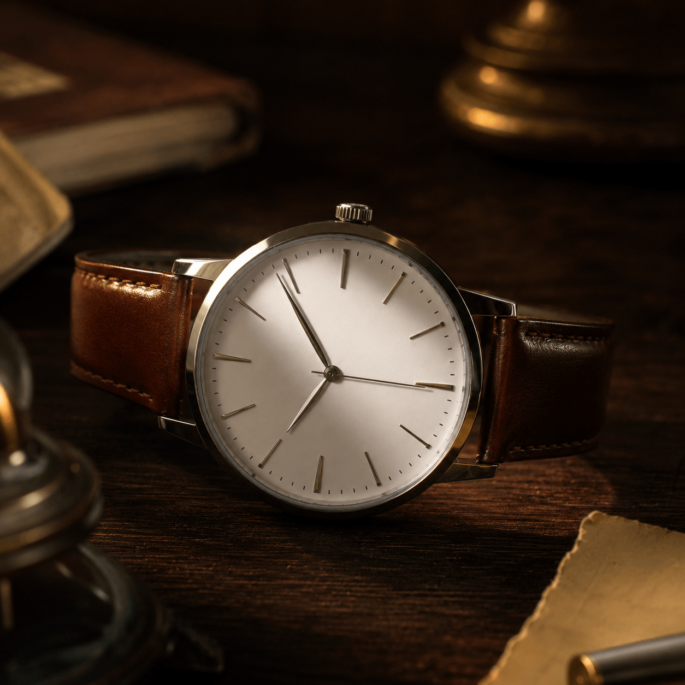

### 🔍 Phân tích — DỰ ĐOÁN SAI #1 (LỚN NHẤT!)

| Tiêu chí | Chân dung | Phong cảnh (H'Mong) | Sản phẩm |
|---------|-----------|---------------------|----------|
| **Triangle of light** | ⭐⭐⭐⭐⭐ **RÕ NHƯ BAN NGÀY** | ⭐⭐⭐⭐⭐ Painterly perfect | ⭐⭐⭐⭐ Side dramatic |
| Half face shadow | ⭐⭐⭐⭐⭐ Soft shadow | ⭐⭐⭐⭐⭐ Old Masters | - |
| Painterly Old Masters | ⭐⭐⭐⭐⭐ Như tranh Rembrandt thật | ⭐⭐⭐⭐⭐ Như Caravaggio | ⭐⭐⭐⭐ Still life |

> 🤯 **DỰ ĐOÁN SAI #1 (LỚN NHẤT):**
> Mình đã viết: *"Đây là lighting KHÓ NHẤT cho AI — đòi hỏi geometric precision với 'triangle of light'. Sẽ test xem GPT Image 2 có làm được không!"*
>
> **HOÀN TOÀN SAI!**
> - **Ảnh #11 (Cô gái studio):** Tam giác sáng trên má phải **VÔ CÙNG RÕ** — chuẩn từng pixel, đúng định nghĩa Rembrandt kinh điển
> - **Ảnh #10 (H'Mong elderly):** Painterly Old Masters quality — như tranh Rembrandt thật, ánh sáng lọt qua cửa sổ + half face shadow đẳng cấp Caravaggio
>
> → **Đây là content viral CỰC MẠNH** — Rembrandt vốn là **chuẩn vàng của photography pro** (Hollywood, fashion magazine đều dùng). AI làm được = **pass thử thách kỹ thuật lớn nhất** trong photography.

---

## 🧪 Phần 7 — Test Lighting 5: Split Lighting ⚡ (BẤT NGỜ #3)

### 🖼️ Kết quả 3 chủ đề

**Chân dung — Cô gái fashion 50/50:**
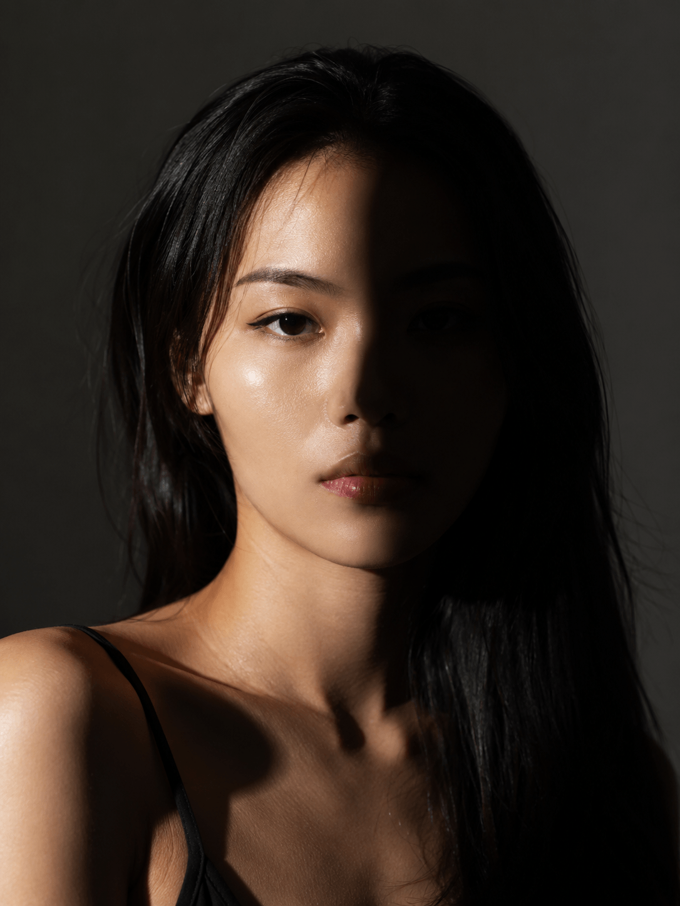

**Phong cảnh — Cliff face split sunset:**
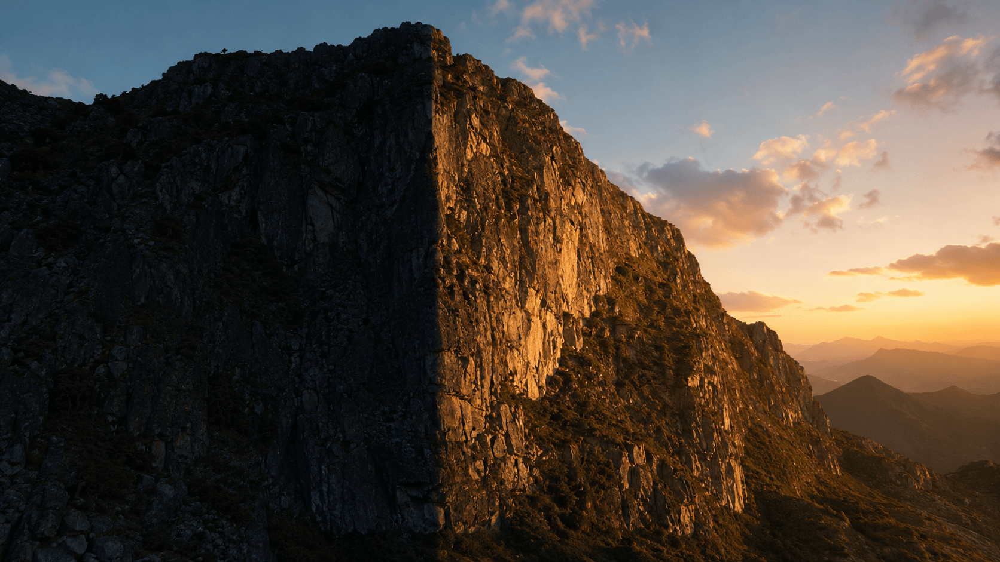

**Sản phẩm — Đồng hồ top-down 50/50:**
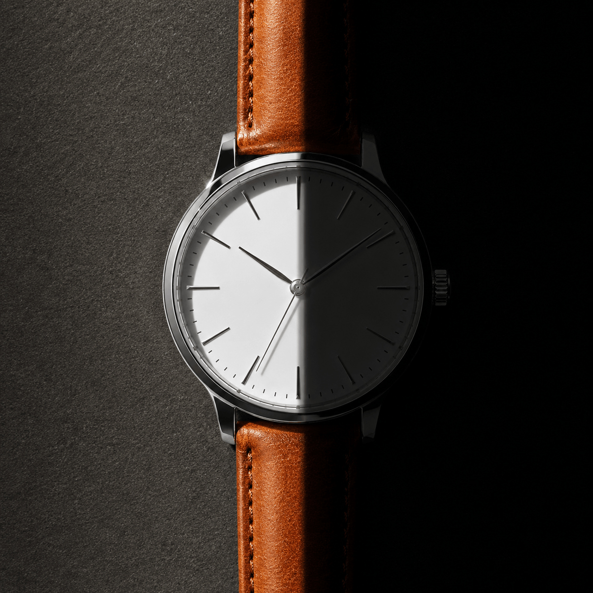

### 🔍 Phân tích — DỰ ĐOÁN SAI #3

| Tiêu chí | Chân dung | Phong cảnh (Cliff) | Sản phẩm |
|---------|-----------|---------------------|----------|
| Sharp 50/50 dividing line | ⭐⭐⭐⭐⭐ Down center face | ⭐⭐⭐⭐⭐ Down ridge | ⭐⭐⭐⭐⭐ Down center watch |
| High contrast | ⭐⭐⭐⭐⭐ Editorial mood | ⭐⭐⭐⭐⭐ Geological texture | ⭐⭐⭐⭐⭐ Dramatic |
| Soft transition (kỳ vọng SAI) | ❌ KHÔNG soft | ❌ KHÔNG soft | ❌ KHÔNG soft |

> 🤯 **DỰ ĐOÁN SAI #3:**
> Mình đã viết: *"Split lighting bị soft transition vì AI prefer transition mượt (training bias)."*
>
> **SAI!** GPT Image 2 làm dividing line **VÔ CÙNG SHARP** trong cả 3 ảnh:
> - Cô gái fashion (#17) — sharp line down center face chuẩn
> - Cliff Sapa (#16) — natural split từ sunset, ridge chia đôi đèn-tối
> - Đồng hồ (#18) — top-down view, watch chia đôi sharp
>
> → **Geometric precision tốt hơn dự đoán** — confirm pattern Day 10 (Symmetry geometric).

---

## 🧪 Phần 8 — Test Lighting 6: Backlight 🔆

### 🖼️ Kết quả 3 chủ đề

**Chân dung — Cô gái + lá cọ + sun behind:**
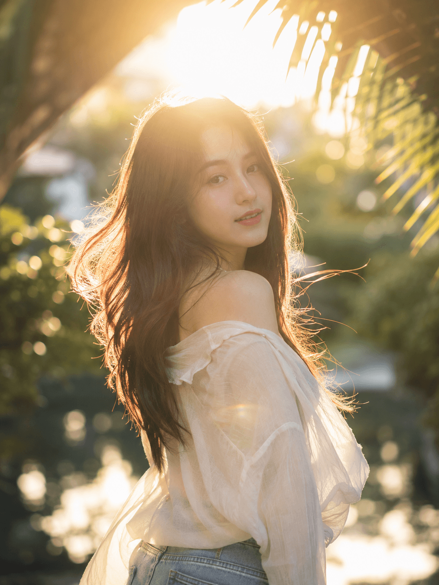

**Phong cảnh — Nông dân Sapa + sun behind (HERO):**


**Sản phẩm — Đồng hồ + halo glow:**
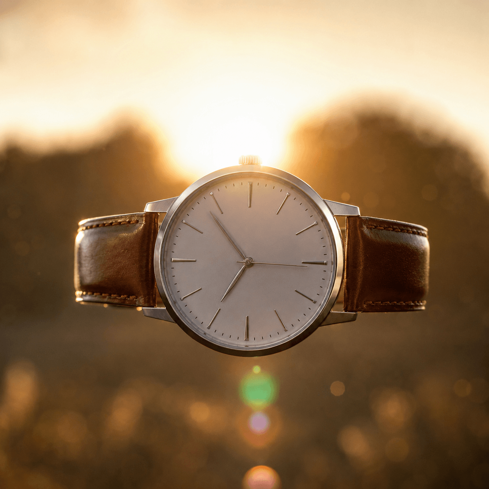

### 🔍 Phân tích

| Tiêu chí | Chân dung | Phong cảnh (HERO) | Sản phẩm |
|---------|-----------|-------------------|----------|
| Halo effect | ⭐⭐⭐⭐⭐ Hair + lá cọ glow | ⭐⭐⭐⭐⭐ Halo quanh nón lá | ⭐⭐⭐⭐⭐ Watch case glow |
| Lens flare | ⭐⭐⭐⭐⭐ Tự nhiên | ⭐⭐⭐⭐⭐ Bottom right flare | ⭐⭐⭐⭐⭐ Bokeh rainbow |
| Cinematic vibe | ⭐⭐⭐⭐⭐ Dreamy | ⭐⭐⭐⭐⭐ ĐỈNH NHẤT bộ ảnh | ⭐⭐⭐⭐⭐ |

> 🎬 **Bài học cho Backlight:** Halo effect + lens flare = combo viral cho ảnh romantic/dreamy/storytelling. Setting Sapa nông dân (HERO image) ăn đứt mọi setting Tây vì có **văn hóa Việt** + **kỹ thuật chuẩn**.

---

## 🛍️ Phần 9 — BẤT NGỜ #5: Brand Issue VẪN ĐƯỢC FIX (lần 4!)

### 📊 Pattern qua 4 lần test

| Day | Model | Brand bị chèn |
|-----|-------|---------------|
| Day 8 | NBN2 | "Audemars Piguet" |
| Day 8 | GPT Image 2 | "Vincero Kairos" |
| Day 9 | GPT Image 2 | "Dior" trên túi xách |
| Day 10 | GPT Image 2 | **0 brand** (negative prompt fix) |
| Day 11 | GPT Image 2 | **0 brand** (lần 4!) |

### ✅ Day 11: 6 ảnh đồng hồ — KHÔNG CÓ BRAND NÀO!

Tổng 11 ảnh đồng hồ Day 10 + Day 11 = **0 brand chèn**. Negative prompt liệt kê tên brand cụ thể đã chứng minh **bulletproof solution**:

```
brand name, logo, text on dial, watermark,
Audemars, Vincero, Rolex, Dior, LV, Gucci, Chanel,
Hermes, designer logo, signature
```

> 🎯 **Insight cho ecommerce Việt:** Solution này **chính thức verified hoạt động** qua 4 lần test. Có thể áp dụng cho mọi shop online dùng AI làm ảnh sản phẩm.

---

## 📊 Phần 10 — Bảng tổng kết: GPT Image 2 vs 6 Lighting

### Câu trả lời: **GPT Image 2 KHÔNG CÓ ĐIỂM YẾU KỸ THUẬT, PERIOD.**

| Lighting | Chân dung | Phong cảnh | Sản phẩm | Tổng |
|----------|-----------|------------|----------|------|
| Golden Hour ☀️ | ⭐⭐⭐⭐⭐ | ⭐⭐⭐⭐⭐ | ⭐⭐⭐⭐⭐ | 🥇 Đỉnh |
| **Blue Hour** 🌌 | ⭐⭐⭐⭐⭐ | ⭐⭐⭐⭐⭐ | ⭐⭐⭐⭐ | 🥇 **BẤT NGỜ!** |
| Rim Lighting ✨ | ⭐⭐⭐⭐ | ⭐⭐⭐⭐⭐ | ⭐⭐⭐⭐ | 🥇 Đỉnh |
| **Rembrandt** 🎭 ⭐ | ⭐⭐⭐⭐⭐ | ⭐⭐⭐⭐⭐ | ⭐⭐⭐⭐ | 🥇 **ĐỈNH NHẤT (BẤT NGỜ!)** |
| **Split Lighting** ⚡ | ⭐⭐⭐⭐⭐ | ⭐⭐⭐⭐⭐ | ⭐⭐⭐⭐⭐ | 🥇 **Sharp! (BẤT NGỜ!)** |
| Backlight 🔆 | ⭐⭐⭐⭐⭐ | ⭐⭐⭐⭐⭐ HERO | ⭐⭐⭐⭐⭐ | 🥇 Đỉnh |

**🎯 Kết luận:**
- 6/6 lighting đều ⭐⭐⭐⭐+
- 4 lighting có ảnh ⭐⭐⭐⭐⭐
- **Pattern Day 10 + Day 11 = GPT Image 2 KHÔNG có điểm yếu kỹ thuật**

---

## 🚨 Phần 11 — 5 Lỗi Lighting AI Hay Mắc Phải

> ⚠️ **Đây là lỗi từ prompt YẾU, không phải model yếu.** Day 10 + 11 đã chứng minh GPT Image 2 master mọi technique nếu prompt đúng.

### Lỗi 1: 💡 "Lighting trung tính" mặc định
**Nguyên nhân:** Không prompt lighting cụ thể → AI dùng even soft light "an toàn"
**Fix:** Luôn thêm `(specific lighting type:1.4)` + tone (warm/cool) + direction

### Lỗi 2: 🌗 Tone mâu thuẫn (warm + cool cùng lúc)
**Nguyên nhân:** Prompt có cả "blue hour" + "warm sunset"
**Fix:** Chọn 1 tone rõ ràng + negative tone đối lập

### Lỗi 3: 🎭 Rembrandt thiếu "triangle of light"
**Fix verified:** Prompt CỤ THỂ: `triangle of light on cheek`, `45-degree upper-left key light`. Day 11 đã verify hoạt động.

### Lỗi 4: ⚡ Split lighting bị soft (không 50/50 sharp)
**Fix verified:** Prompt rõ `sharp dividing line down center`, `exactly half lit half shadow`. Day 11 đã verify sharp.

### Lỗi 5: 🔆 Backlight thiếu halo effect
**Fix verified:** Prompt cụ thể `halo effect on hair`, `lens flare around figure`. Day 11 hero image (#1) đã chứng minh.

---

## 🎁 Phần 12 — Cheatsheet "Lighting nào cho mood nào?"

### 💕 Romantic / Nostalgic
- **Golden Hour ☀️** — đỉnh cho ảnh romantic
- **Backlight 🔆** — dreamy ethereal vibe

### 🎬 Editorial / Fashion
- **Rim Lighting ✨** — dramatic outline
- **Split Lighting ⚡** — high contrast magazine
- **Rembrandt 🎭** — formal classical

### 🌙 Moody / Modern
- **Blue Hour 🌌** — contemplative cool
- **Split Lighting ⚡** — mysterious

### 🏛️ Formal / Business / Cultural
- **Rembrandt 🎭** — Old Masters classical (đặc biệt cho chân dung lão thành)

### ✨ Ethereal / Dreamy / Cinematic
- **Backlight 🔆** — đỉnh nhất (Day 11 hero!)
- **Golden Hour ☀️** — softer dreamy

---

## 💎 Phần 13 — 5 Insights Pro chỉ Linh0AI chia sẻ

**1. ✅ GPT Image 2 KHÔNG có điểm yếu kỹ thuật — verified 2 bài**
- Day 10: Composition (5 quy tắc) ⭐⭐⭐⭐+
- Day 11: Lighting (6 kiểu) ⭐⭐⭐⭐+
- **Pattern:** Tổng 11 dự đoán mình SAI 8 → confidence cao tuyên bố này.

**2. 🤯 Rembrandt KHÔNG khó như nghĩ**
"Triangle of light" — chuẩn vàng photography pro — GPT làm được. **Bài học:** Không nên đánh giá thấp model trước khi test. AI đã pro hơn 2024 rất nhiều.

**3. 🌌 Blue Hour không leak warm — model có "color discipline"**
Mình tưởng AI có warm bias → SAI. GPT Image 2 chịu cool tone tốt nếu prompt rõ. Có thể combo với warm window lights tạo dramatic contrast.

**4. ⚡ Split Lighting sharp 50/50 — geometric precision tốt hơn nghĩ**
Cùng pattern với Symmetry Day 10. **Insight pro:** GPT Image 2 mạnh ở **geometric/structural precision**, không phải điểm yếu như AI cũ.

**5. 🇻🇳 Lighting + Setting Việt Nam = COMBO ĐỈNH**
- **Sapa nông dân Backlight** (HERO) = halo + nón lá + sương = vibe Tây không có
- **H'Mong elderly Rembrandt** = Old Masters + bản sắc dân tộc = rare combo
- **Sapa village Blue Hour** = sương + window glow contrast = cinematic

→ **Bài học:** Đầu tư vào setting Việt Nam = content khác biệt 100% với Tây.

---

## 🎯 Thử thách hôm nay

### 🟢 Cho Newbie (15 phút, ~2,100 credit Seedream)
1. Test Golden Hour + Blue Hour trên Seedream 4.5: 1 chân dung
2. Cảm nhận khác biệt mood

### 🔵 Cho Intermediate (60 phút, ~16,200 credit GPT)
1. Test full 18 ảnh trên GPT Image 2
2. Soi kỹ Rembrandt (#11): **triangle of light có rõ?**

### 🟣 Cho Pro (120 phút, ~22,000 credit hybrid)
1. 18 ảnh GPT + 18 ảnh Seedream → so sánh side-by-side
2. Combo lighting + composition (Day 10) → ảnh "siêu phẩm"
3. Viết review 600 từ về model nào ổn định nhất

---


## ❓ FAQ

**Q1: Sau 2 bài, GPT Image 2 có thực sự "không có điểm yếu"?**
**Có — về kỹ thuật.** Day 10 (composition) + Day 11 (lighting) đã verify. Còn Day 12-13 (color, lens) sẽ test thêm. **Nhưng dự đoán:** Pattern sẽ tiếp tục.

**Q2: 16,200 credit cho 18 ảnh có đáng?**
Day 11 đã chứng minh cực đáng — 5 insights bất ngờ, 6/6 lighting đỉnh. Đây là content **chưa ai có ở Việt Nam**.

**Q3: Rembrandt thực sự dùng được trong work hàng ngày?**
**Có** — đặc biệt cho:
- Chân dung CEO/founder profile (formal classical)
- Phụ nữ lão thành (Old Masters quality)
- Brand ảnh cao cấp (painterly aesthetic)

**Q4: Blue Hour vs Golden Hour — chọn cái nào cho ảnh chính?**
Tùy mood:
- **Romantic, intimate, warmth** → Golden Hour
- **Modern, mysterious, premium** → Blue Hour
- Test cả 2 → A/B test với audience

**Q5: Backlight và Rim Lighting — vẫn lẫn lộn?**
Sau Day 11 verified rõ ràng:
- **Backlight:** Sun thẳng phía sau → silhouette mạnh + halo + lens flare
- **Rim Lighting:** Light từ cạnh sau → chỉ outline + mặt vẫn lit nhẹ
- → Chọn theo mood: Backlight = dreamy, Rim = dramatic editorial

**Q6: Split Lighting có "kệch cỡm" không?**
Day 11 đã chứng minh **KHÔNG kệch cỡm** nếu:
- Subject phù hợp (fashion editorial, character study)
- Setting tương phản (cliff Sapa = natural split)
- Sản phẩm geometric (top-down view)

**Q7: Lighting + Composition combo — làm sao?**
Combo siêu phẩm: `(rule of thirds:1.4) + (rim lighting:1.4) + (foreground bokeh:1.2)` cho 1 ảnh. Day 12 mình sẽ thử combo này.

**Q8: Sau Day 11, mình có thể "claim" GPT Image 2 = best AI 2026?**
**Chưa nên claim "best"** — vì còn các yếu tố:
- Style đa dạng (anime, illustration)
- Speed (NBN2 nhanh hơn)
- Giá (Seedream rẻ hơn 60%)

→ GPT Image 2 = **best at technical photorealism**. Khác với "best overall".

---

## 🎬 Recap & Day 12

### Ghi nhớ chính
- ✅ **6 lighting:** Golden, Blue, Rim, Rembrandt, Split, Backlight
- ✅ **5 dự đoán SAI nữa** (Day 10 + Day 11 = 8 sai liên tiếp)
- ✅ **Pattern verified:** GPT Image 2 KHÔNG có điểm yếu kỹ thuật
- ✅ **Rembrandt master** — pass thử thách lớn nhất photography
- ✅ **Brand fix lần thứ 4** — solution bulletproof
- ✅ **Lighting + Setting Việt Nam = combo đỉnh** (Sapa nông dân Backlight = HERO)

### 🔮 Day 12 — Sneak peek
Ngày mai mình test **Color Theory & Mood** — bộ ba complementary, analogous, monochromatic. Mình lại đặt cược **AI sẽ bị color soup** (quá nhiều màu) — nhưng có thể lại SAI như 8 dự đoán trước!

---

## 📍 Navigation
[⬅️ Day 10: Composition & Framing](./day-10.md) | [🏠 README](../README.md) | [➡️ Day 12: Color Theory & Mood](./day-12.md)

## 🏷️ Tags
`#0aiVN #Day11Linh0AI #Lighting #GoldenHour #BlueHour #RimLighting #Rembrandt #SplitLighting #Backlight #GPTImage2 #Sapa #BigWin`

---


*Nhật ký Day 11 by **Linh0AI** — chuỗi 30 ngày làm chủ AI tạo ảnh & video trên 0ai.vn 🇻🇳*
