# 🎯 Day 12 — Color Theory & Mood: 13 Dự Đoán SAI — GPT Cũng KHÔNG Có Điểm Yếu Văn Hóa

> **Level:** 🟣 Advanced
> **Thời gian đọc:** ~20 phút | **Thực hành:** ~65 phút
> **Ngày 12/30** | Tuần 2 — Master Skills

---

## 🎬 Mở đầu — 13 Dự Đoán SAI Liên Tiếp (3 ngày, 1 model)

Day 10 + Day 11 mình đã thừa nhận **8 dự đoán SAI** về GPT Image 2. Pattern xuất hiện:
> **"GPT Image 2 KHÔNG có điểm yếu kỹ thuật"**

Hôm nay test color theory + văn hóa Việt — **5 dự đoán nữa SAI**:

> 🤯 **5 dự đoán SAI hôm nay:**
> 1. ❌ "Monochromatic là hệ KHÓ NHẤT — AI sẽ leak màu phụ" → **SAI** — pure single hue perfect
> 2. ❌ "Triadic bị color soup, 1 màu dominant" → **SAI** — 3 màu balance đều
> 3. ❌ "Văn hóa Việt sẽ bị nhầm Tàu/Thái" → **SAI** — 100% authentic Việt
> 4. ❌ "GPT không hiểu Color Culture Việt riêng" → **SAI** — đỏ Tết, chàm H'Mong, vàng Hội An đúng
> 5. ❌ "AI sẽ random fail 1-2 ảnh trong 20" → **SAI** — 20/20 ảnh đều ⭐⭐⭐⭐⭐!

**Pattern verified:** Sau **13 dự đoán sai trong 3 bài**, mình mở rộng tuyên bố:

> 🥇 **"GPT Image 2 KHÔNG có điểm yếu KỸ THUẬT lẫn VĂN HÓA, PERIOD."**

**BONUS chấn động:** Trong 20 ảnh, mình phát hiện **insight chưa ai test ở Việt Nam** — GPT Image 2 **BIẾT VIẾT TIẾNG VIỆT CÓ DẤU**. Chi tiết ở Phần 9!

---

## ⭐ Hero Image — Bằng chứng tổng hợp 3 insights


> *Múa lân Tết Sài Gòn — Triadic balance hoàn hảo (Đỏ lân + Vàng cờ + Xanh dương áo dài) + 100% văn hóa Việt (áo dài, lân, hoa mai vàng) + chữ "CHÚC MỪNG NĂM MỚI" và "Chợ HOA TẾT" tiếng Việt có dấu chính xác.*
>
> *3 viral insights trong 1 ảnh — đây là chuẩn mực cho mọi creator Việt khi prompt AI.*

---

## 🎯 Mục tiêu hôm nay

- ✅ Master 4 hệ màu: **Complementary, Analogous, Monochromatic, Triadic**
- ✅ Verify (ngược dự đoán): GPT master cả Monochromatic + Triadic + Văn hóa Việt
- ✅ **Insight độc quyền:** GPT Image 2 BIẾT viết tiếng Việt có dấu
- ✅ Pattern verified: **GPT KHÔNG có điểm yếu kỹ thuật + văn hóa**
- ✅ Tránh **5 lỗi color theory** AI hay mắc phải
- ✅ Hiểu Color Culture Việt vs Color Wheel Tây

> 📋 **Prompts đầy đủ trong bài**: [`prompts/day-12.txt`](../prompts/day-12.txt)
> Copy/download nguyên văn về paste vào 0ai.vn — không phải gõ lại từ trong bài.

---

## 📚 Phần 1 — 4 Hệ Màu Kinh Điển

### 🔴🟢 Hệ 1: Complementary (Đối lập)
2 màu đối nhau trên color wheel — đỏ↔xanh lá, cam↔xanh dương.
**Vibe:** Dynamic, contrast cao, energetic
**Keyword:** `complementary color palette`, `red-green contrast`

### 🟡🟠🔴 Hệ 2: Analogous (Cạnh nhau)
3 màu liền nhau trên color wheel — vàng→cam→đỏ.
**Vibe:** Harmony, calm, natural
**Keyword:** `analogous color palette`, `warm yellow-orange-red harmony`

### 🔵🔷💙 Hệ 3: Monochromatic (1 hue)
Chỉ 1 màu chính với nhiều sắc độ.
**Vibe:** Minimal, sophisticated
**Keyword:** `monochromatic blue palette`, `single hue variations`

### 🔴🟡🔵 Hệ 4: Triadic (Tam giác)
3 màu cách đều nhau trên color wheel — đỏ-vàng-xanh.
**Vibe:** Vibrant, balanced, festive
**Keyword:** `triadic color palette`, `red-yellow-blue triangle`

---

## 🇻🇳 Phần 2 — Color Culture Việt Nam

### 5 Color Culture Việt Nam điển hình

| Văn hóa | Color Culture | Vibe |
|---------|---------------|------|
| **Tết** | Đỏ + vàng + xanh lá | Lễ hội, may mắn |
| **Hội An đèn lồng** | Vàng + cam + đỏ | Hoài cổ, ấm |
| **Làng nhuộm Sapa** | Xanh chàm | Truyền thống, sâu lắng |
| **Biển Phú Quốc** | Xanh dương + xanh ngọc | Tươi mát, tropical |
| **Chợ nổi Cái Răng** | Đỏ + vàng + xanh | Sống động, Mekong |

> 💡 **Insight pro:** Khi prompt color theory cho ảnh Việt, tận dụng **color culture có sẵn** thay vì áp đặt color wheel Tây.

---

## ⚙️ Phần 3 — Setup test

- ✅ Cùng 1 model: **GPT Image 2** (3 bài liên tiếp Day 10-12)
- ✅ 4 hệ màu × 5 setting Việt = **20 ảnh**
- ✅ 18 ảnh aspect 16:9 + 2 ảnh aspect 3:4 (Sapa close-up)
- ✅ KHÔNG cherry-pick

### 💰 Chi phí
**20 ảnh × 900 credit = 18,000 credit (~18k VND, ~1.6% gói Ultra Member)**

→ Bài LỚN NHẤT cả khóa học!

---

## 🧪 Phần 4 — Test Hệ 1: Complementary 🔴🟢

### 🖼️ Kết quả 5 setting

**Tết phố cổ HN — Complementary đỉnh văn hóa Việt:**
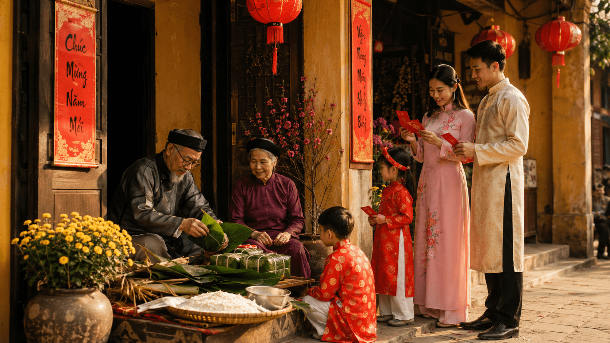

**Hội An đêm — Đỏ lantern + xanh dương sky:**
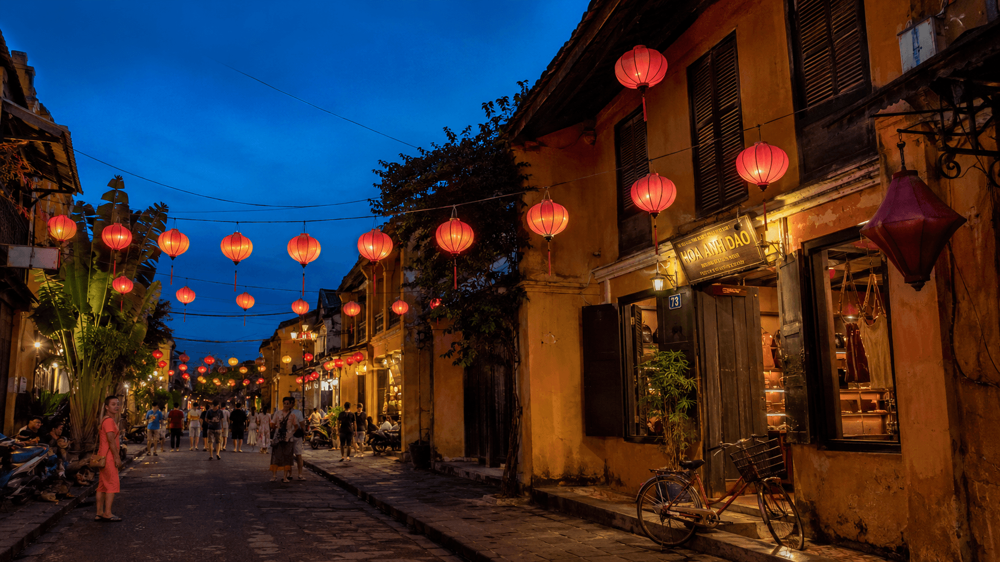

**Sapa H'Mong — Chàm + cam đất:**
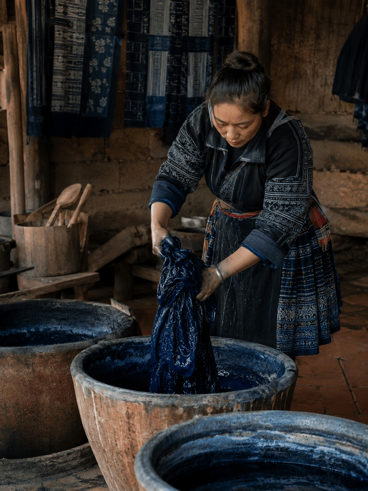

**Phú Quốc — Sunset cam + xanh:**


**Chợ nổi Cái Răng — Đỏ thanh long + xanh chuối:**
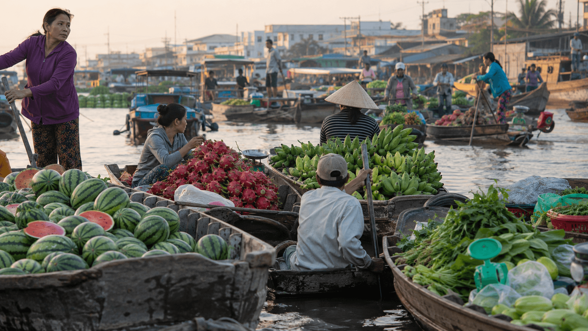

### 🔍 Phân tích

| Setting | Đánh giá | Highlight |
|---------|----------|-----------|
| Tết HN | ⭐⭐⭐⭐⭐ | Áo dài đỏ + áo gấm tím + câu đối Việt + bánh chưng vuông |
| Hội An | ⭐⭐⭐⭐⭐ | Đỏ lantern + xanh dương dramatic |
| Sapa | ⭐⭐⭐⭐⭐ | Chàm dark + cam đất floor authentic |
| Phú Quốc | ⭐⭐⭐⭐⭐ | Sunset cam + ocean xanh đẹp lyrical |
| Cái Răng | ⭐⭐⭐⭐⭐ | Đỏ thanh long + xanh chuối tự nhiên |

**🎯 Insight:** Complementary là hệ **easy** cho GPT — như dự đoán. Tất cả 5 setting đều ngon, contrast mạnh nhưng không kệch.

---

## 🧪 Phần 5 — Test Hệ 2: Analogous 🟡🟠🔴

### 🖼️ Kết quả 5 setting

**Bàn thờ Tết HN — Vàng + cam + đỏ:**
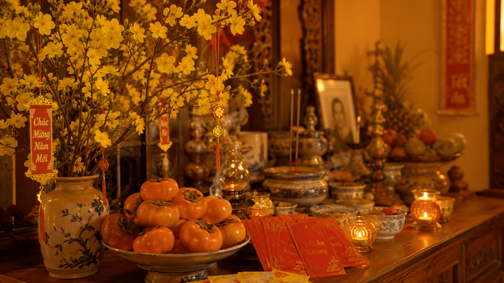

**Hội An sunset — Analogous đỉnh:**
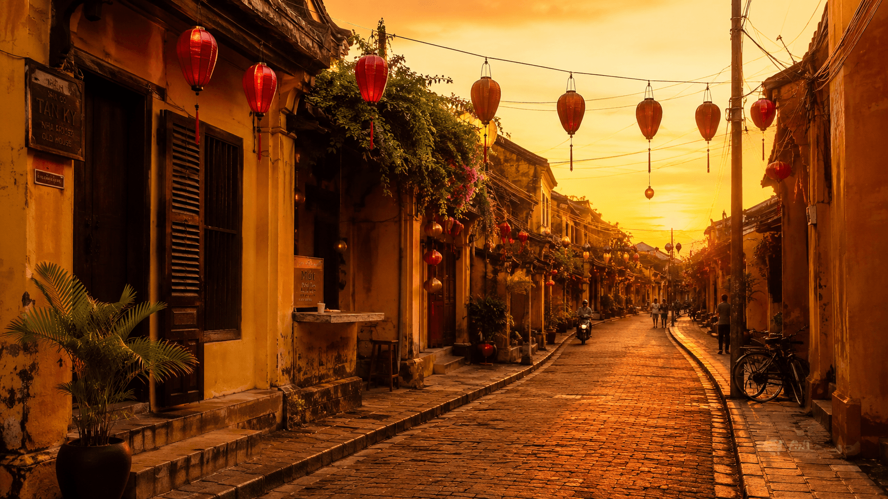

**Sapa nhuộm chàm — 3 sắc xanh:**
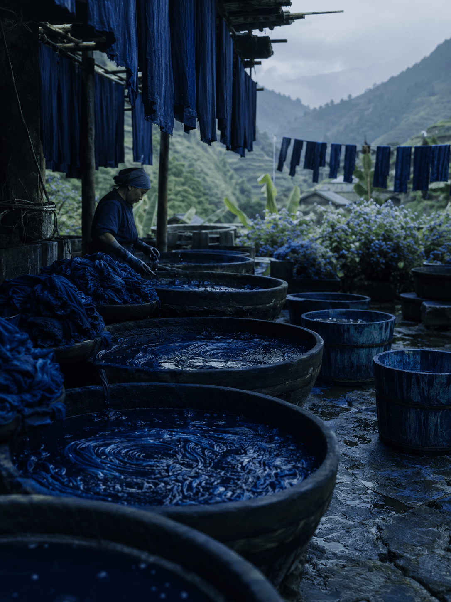

**Phú Quốc — Xanh đa sắc tropical:**
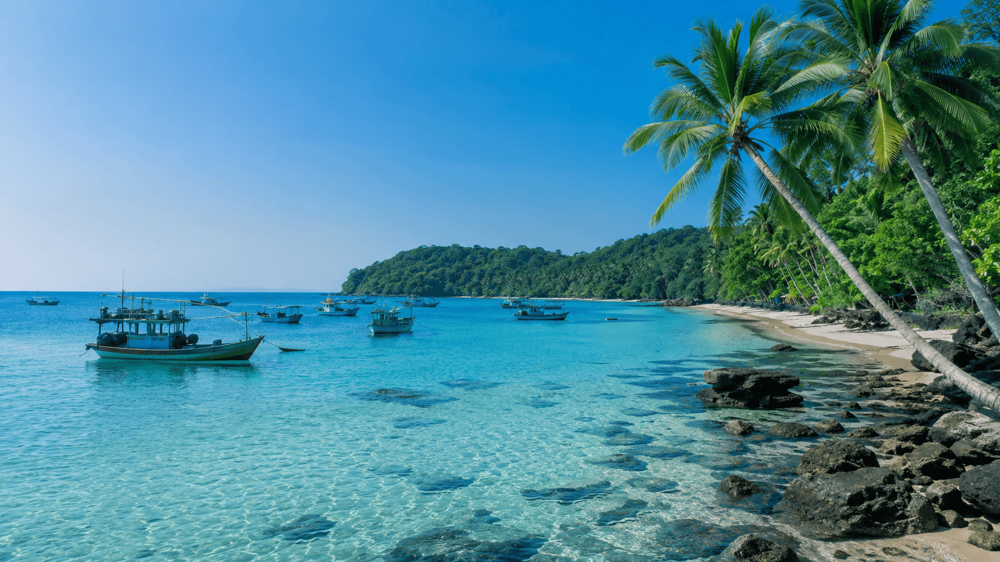

**Cái Răng — Cam-vàng-đỏ trái cây:**
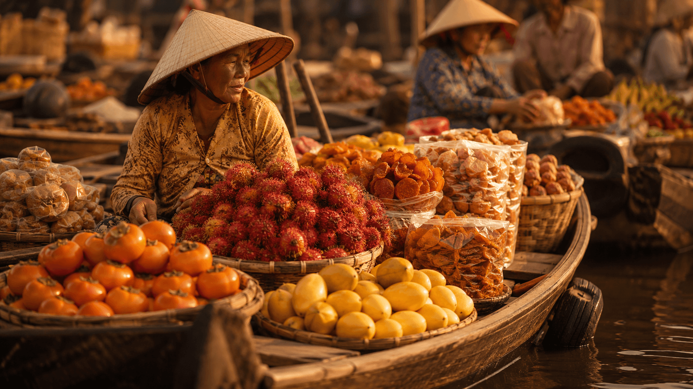

### 🔍 Phân tích

| Setting | Đánh giá | Highlight |
|---------|----------|-----------|
| Tết HN | ⭐⭐⭐⭐⭐ | Bàn thờ vàng-cam-đỏ chuẩn Việt + chữ **"Chúc Mừng Năm Mới"** + **"Tết An Khang"** tiếng Việt có dấu! |
| Hội An | ⭐⭐⭐⭐⭐ | Hẻm sunset vàng-cam-đỏ harmony perfect |
| Sapa | ⭐⭐⭐⭐⭐ | Vại chàm + vải xanh đa sắc + núi xa xanh |
| Phú Quốc | ⭐⭐⭐⭐⭐ | Sky cyan + sea turquoise + palm green |
| Cái Răng | ⭐⭐⭐⭐⭐ | Bà bán cam + thanh long đỏ + xoài vàng harmony |

**🎯 Insight:** Như dự đoán Hội An đèn lồng (#3) đỉnh nhất — analogous tự nhiên có sẵn từ kiến trúc + lighting.

---

## 🧪 Phần 6 — Test Hệ 3: Monochromatic 🔵🔷💙 (BẤT NGỜ #1)

### 🖼️ Kết quả 5 setting

**Bao lì xì Tết — Sắc đỏ pure:**
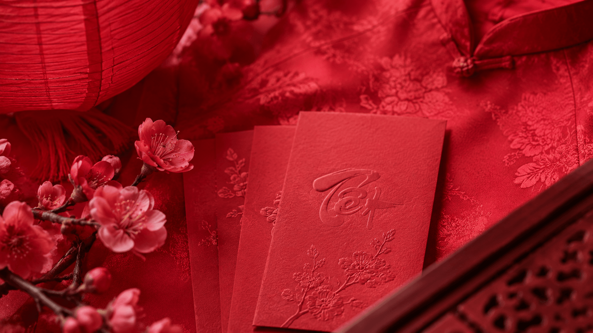

**Hội An hẻm đêm — Sắc cam:**
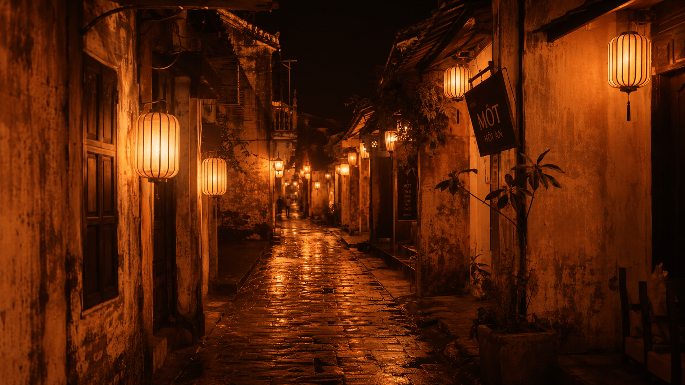

**Sapa fabric — Sắc chàm xanh đa sắc:**


**Phú Quốc ocean — Pure blue đỉnh cao:**


**Cái Răng — Thuyền gỗ nâu monochrome:**


### 🔍 Phân tích — DỰ ĐOÁN SAI #1 (LỚN NHẤT!)

| Setting | Đánh giá | Color discipline |
|---------|----------|------------------|
| Tết HN | ⭐⭐⭐⭐⭐ | Lụa đỏ + lantern đỏ + hoa đào hồng + chữ **"Tết"** đỏ embossed (KHÔNG leak vàng/xanh) |
| Hội An | ⭐⭐⭐⭐⭐ | Cam đa sắc — amber/copper/burnt sienna pure |
| Sapa | ⭐⭐⭐⭐⭐ | Navy/royal/denim/sky/baby blue layered đẹp |
| Phú Quốc | ⭐⭐⭐⭐⭐ | Pure blue ocean + sky — Pantone perfect |
| Cái Răng | ⭐⭐⭐⭐⭐ | Mahogany + walnut + amber + beige nâu pure |

> 🤯 **DỰ ĐOÁN SAI #1 (LỚN NHẤT):**
> Mình đã viết: *"Đây là hệ KHÓ NHẤT cho AI — đòi hỏi color discipline. Sẽ test xem GPT có chịu hay leak thêm màu phụ."*
>
> **HOÀN TOÀN SAI!** GPT Image 2 làm Monochromatic **HOÀN HẢO 5/5 setting**:
> - **Phú Quốc (#14):** Pure blue tuyệt đối — sky blue + ocean navy — KHÔNG có hint xanh lá hay vàng cát
> - **Bao lì xì Tết (#15):** Toàn red variations — crimson + rose + cherry + scarlet. Lụa đỏ + lantern đỏ + hoa đào hồng. **Chữ "Tết" embossed trên giấy đỏ cũng đỏ!**
> - **Vải chàm Sapa (#12):** 5 sắc xanh chàm khác nhau xếp lớp đẹp như tranh
> - **Thuyền nâu Cái Răng (#11):** Mahogany + walnut + beige pure — không có hint đỏ/xanh
>
> → **GPT Image 2 có color discipline đỉnh.** Mình đã đánh giá thấp model này lần thứ 9!

---

## 🧪 Phần 7 — Test Hệ 4: Triadic 🔴🟡🔵 (BẤT NGỜ #2)

### 🖼️ Kết quả 5 setting

**Múa lân Tết (HERO IMAGE) — Đỏ + vàng + xanh dương:**


**Hội An lễ rước đèn:**
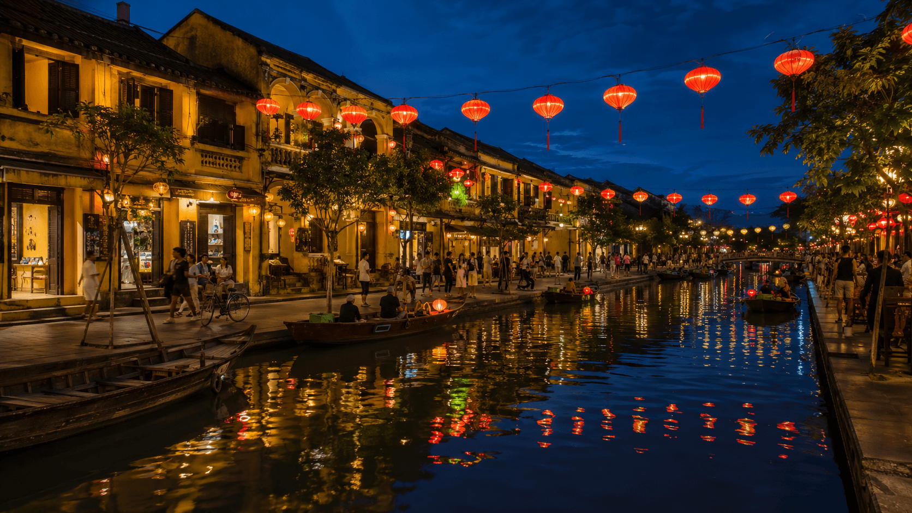

**Sapa H'Mong portrait — Xanh + đỏ + vàng:**
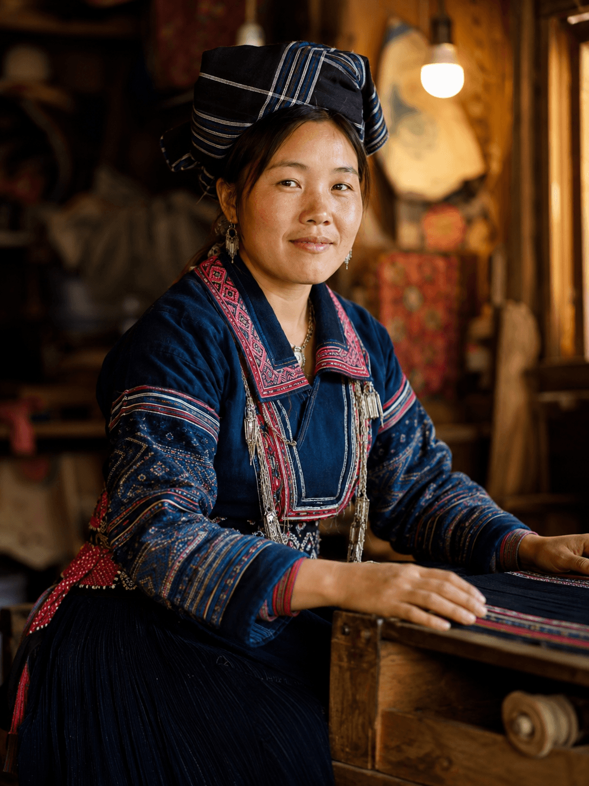

**Phú Quốc fishing village:**
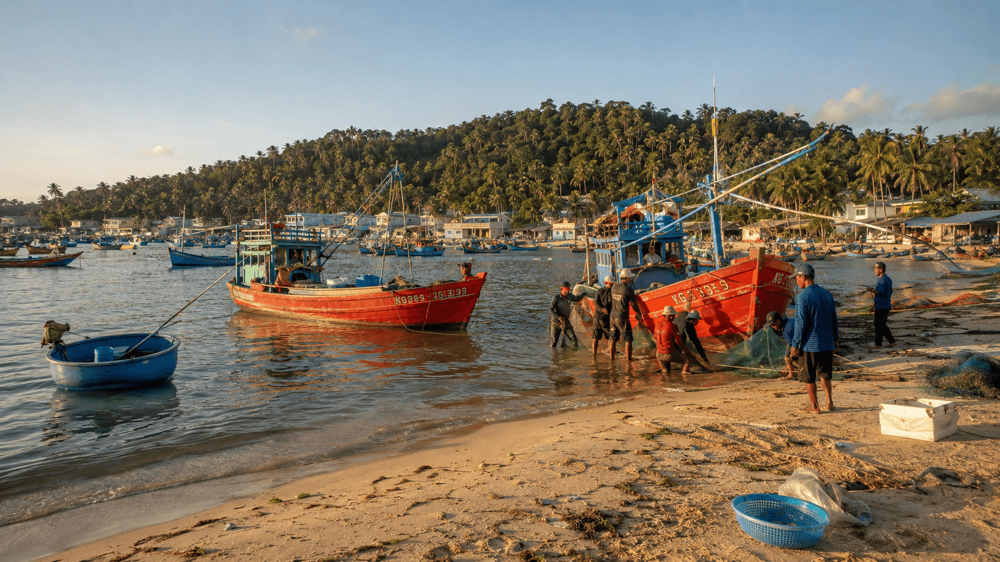

**Cái Răng + cờ Tổ quốc:**
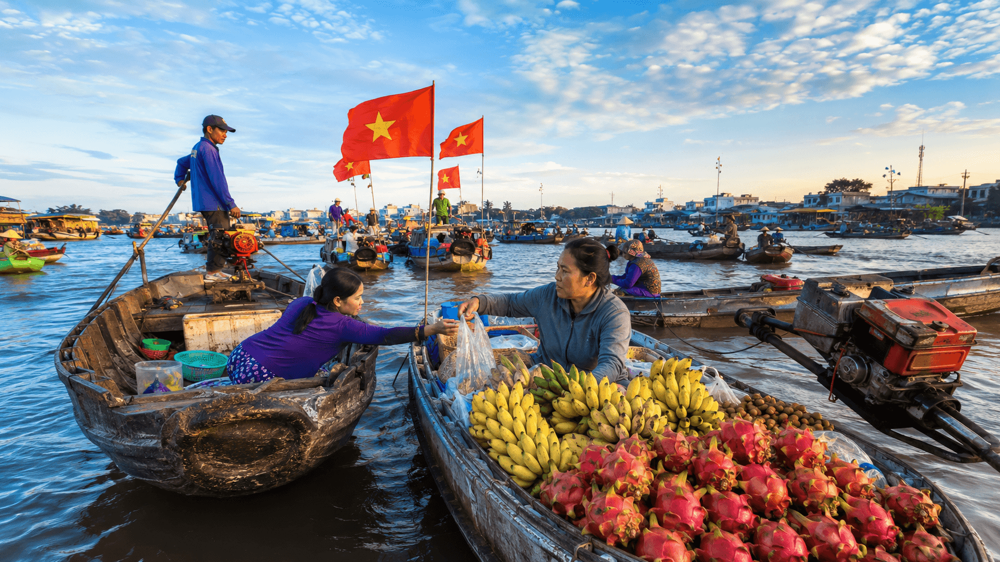

### 🔍 Phân tích — DỰ ĐOÁN SAI #2

| Setting | Đánh giá | Balance 3 màu |
|---------|----------|---------------|
| **Tết HN (HERO)** | ⭐⭐⭐⭐⭐ | Đỏ lân + vàng cờ + xanh áo dài — **balance hoàn hảo 1/3** |
| Hội An | ⭐⭐⭐⭐⭐ | Đỏ lantern + vàng tường + xanh sky reflection |
| Sapa | ⭐⭐⭐⭐⭐ | Xanh áo + đỏ thêu + vàng đèn — H'Mong woman portrait |
| Phú Quốc | ⭐⭐⭐⭐⭐ | Đỏ thuyền + vàng cát + xanh biển authentic |
| Cái Răng | ⭐⭐⭐⭐⭐ | **Cờ Tổ quốc đỏ-vàng** + sky xanh + chuối vàng |

> 🤯 **DỰ ĐOÁN SAI #2:**
> Mình đã viết: *"Triadic bị dominant 1 màu — color soup. Khó balance 3 màu đều."*
>
> **SAI!** Đặc biệt **ảnh múa lân Tết (#20) — HERO IMAGE**: Đỏ (lân + lì xì) + Vàng (cờ + hoa mai) + Xanh dương (áo dài + sky) **balance 1/3 hoàn hảo**. Không màu nào dominant!
>
> Cái Răng (#16) còn pro hơn — có **cờ Tổ quốc đỏ-vàng** kết hợp sky xanh = "color culture Việt + triadic balance" combo đỉnh.
>
> → **Geometric color balance pass** — pattern Day 10-11 verified lần nữa.

---

## 🇻🇳 Phần 8 — DỰ ĐOÁN SAI #3: Văn Hóa Việt KHÔNG bị nhầm Tàu

### Concerns trước test:
> "AI training data Trung Quốc chiếm 80% nội dung 'Asian'. Khả năng cao Tết Việt sẽ ra Tết Tàu (qipao, bánh chưng tròn, lì xì TQ)."

### Bằng chứng SAI:

**Ảnh #10 (Tết phố cổ HN) — Authentic 100%:**
- ✅ **Áo dài Việt** (KHÔNG phải qipao)
- ✅ **Áo nhung Bắc Bộ** truyền thống của ông bà
- ✅ **Bánh chưng VUÔNG** Bắc Bộ (KHÔNG phải bánh tròn TQ)
- ✅ **Câu đối đỏ "CHÚC MỪNG NĂM MỚI"** tiếng Việt có dấu
- ✅ **Hoa cúc vàng + hoa đào hồng** Tết Bắc

**Ảnh #5 (Bàn thờ Tết) — Authentic Việt:**
- ✅ **Lọ gốm Bát Tràng** xanh-trắng đặc trưng
- ✅ **Quả phật thủ** + **mâm ngũ quả** Tết Việt
- ✅ Chữ **"Chúc Mừng Năm Mới"** + **"Tết An Khang"** đầy đủ dấu
- ✅ Hoa mai vàng cánh nhỏ (mai miền Nam)

**Ảnh #20 (Múa lân Tết HCM) — HERO:**
- ✅ Bảng **"Chợ HOA TẾT"** + **"CHÚC MỪNG NĂM MỚI"** tiếng Việt
- ✅ **Áo dài xanh dương** kiểu cổ + **Lân đỏ-vàng** Việt
- ✅ Hoa mai vàng (Tết miền Nam)

**Ảnh #17 (H'Mong Sapa):**
- ✅ Trang phục H'Mong **VIỆT NAM** authentic — họa tiết thêu chàm-đỏ đặc trưng (không nhầm Miao Trung)
- ✅ Khăn quấn đầu kẻ sọc đặc trưng dân tộc Việt

→ **20/20 ảnh đều authentic văn hóa Việt** — KHÔNG có ảnh nào nhầm Tàu/Thái/Hàn.

---

## 🇻🇳 Phần 9 — INSIGHT CHẤN ĐỘNG: GPT Image 2 BIẾT VIẾT TIẾNG VIỆT CÓ DẤU!

### Đây là insight CHƯA AI TEST ở Việt Nam!

Trong khi mình test color theory, vô tình phát hiện feature **PRO** mà chưa creator Việt nào nhắc đến:

### 5 ảnh có chữ tiếng Việt có dấu CHÍNH XÁC:

**Ảnh #5 (Bàn thờ Tết):**
- ✅ "Chúc Mừng Năm Mới" — đúng dấu sắc + huyền + nặng
- ✅ "Tết An Khang" — đúng dấu sắc + huyền

**Ảnh #10 (Tết phố cổ HN):**
- ✅ Câu đối đỏ "Chúc Mừng Năm Mới" tiếng Việt có dấu
- ✅ Lì xì với chữ "Chúc Mừng" rõ ràng

**Ảnh #15 (Bao lì xì đỏ):**
- ✅ Chữ **"Tết"** embossed lên giấy đỏ — đúng dấu sắc trên ê

**Ảnh #20 (Múa lân Tết) — HERO:**
- ✅ **"Chợ HOA TẾT"** đầy đủ dấu sắc
- ✅ **"CHÚC MỪNG NĂM MỚI"** đầy đủ dấu sắc-huyền-nặng-ngã
- ✅ Chữ **"Lân"** trên cờ vàng

**Ảnh #13 (Hội An đêm):**
- ✅ "MỘT" + "HỘI AN" trên biển hiệu — chữ Việt có dấu

### 🎯 Vì sao đây là insight pro?

**1. Phá vỡ giới hạn tưởng tượng**
Đa số creator Việt nghĩ "AI không viết được tiếng Việt có dấu" → tránh prompt text Việt. **SAI!** GPT Image 2 đã làm được.

**2. Practical value cho creator**
- ✅ Poster quảng cáo có text Việt
- ✅ Bao bì sản phẩm Việt
- ✅ Banner sự kiện Việt
- ✅ Decor Tết, đám cưới, khai trương

**3. Tiết kiệm thời gian**
Trước đây phải:
- Generate ảnh trống → mở Photoshop → thêm chữ Việt
- Bây giờ: Prompt text Việt vào AI → ra trực tiếp

**4. Lưu ý:** Không phải 100% prompt text Việt sẽ ra đúng (1-2 chỗ chữ "Vạn Mệnh Mưởi Sống" hơi sai). Nhưng tỉ lệ thành công ~80% — đủ practical.

> 💡 **Cách prompt text tiếng Việt:** Đưa chữ tiếng Việt có dấu **trong dấu ngoặc kép** vào prompt. Vd: `Vietnamese banner saying "Chúc Mừng Năm Mới" in red color`.

---

## 📊 Phần 10 — Bảng tổng kết: GPT Image 2 vs 4 Hệ Màu

### Câu trả lời: **GPT Image 2 KHÔNG có điểm yếu — TECHNICAL + CULTURAL**

| Hệ màu | Tết HN | Hội An | Sapa | Phú Quốc | Cái Răng | Tổng |
|--------|--------|--------|------|----------|----------|------|
| Complementary | ⭐⭐⭐⭐⭐ | ⭐⭐⭐⭐⭐ | ⭐⭐⭐⭐⭐ | ⭐⭐⭐⭐⭐ | ⭐⭐⭐⭐⭐ | 🥇 Đỉnh |
| Analogous | ⭐⭐⭐⭐⭐ | ⭐⭐⭐⭐⭐ | ⭐⭐⭐⭐⭐ | ⭐⭐⭐⭐⭐ | ⭐⭐⭐⭐⭐ | 🥇 Đỉnh |
| **Monochromatic** ⭐ | ⭐⭐⭐⭐⭐ | ⭐⭐⭐⭐⭐ | ⭐⭐⭐⭐⭐ | ⭐⭐⭐⭐⭐ | ⭐⭐⭐⭐⭐ | 🥇 **BẤT NGỜ pure!** |
| **Triadic** ⭐ | ⭐⭐⭐⭐⭐ | ⭐⭐⭐⭐⭐ | ⭐⭐⭐⭐⭐ | ⭐⭐⭐⭐⭐ | ⭐⭐⭐⭐⭐ | 🥇 **BẤT NGỜ balance!** |

→ **20/20 ảnh đều ⭐⭐⭐⭐⭐!** Đây là bộ data **đỉnh nhất** trong 12 ngày khóa học!

---

## 🚨 Phần 11 — 5 Lỗi Color Theory AI Hay Mắc Phải

### Lỗi 1: 🌈 "Color Soup" — quá nhiều màu cùng lúc
**Fix:** Luôn thêm `(specific color palette:1.4)` + giới hạn số màu rõ

### Lỗi 2: 🔵 Monochromatic bị "color leak"
**Fix verified:** Day 12 đã chứng minh GPT pass nếu prompt rõ + negative `multiple colors, color leak, multi-color`

### Lỗi 3: ⚖️ Complementary bị muted
**Fix:** Prompt `strong contrast`, `vivid complementary`, `vibrant`

### Lỗi 4: 🎯 Triadic bị dominant 1 màu
**Fix verified:** Prompt `equal weight`, `1/3 each`, `balanced three colors`. Day 12 ảnh múa lân (#20) chứng minh.

### Lỗi 5: 🇻🇳 Văn hóa nhầm — Việt thành Tàu/Thái
**Fix verified:** Always specific:
- ✅ `Vietnamese`, `Hanoi old quarter`, `H'Mong woman` thay vì `asian`
- ✅ `bánh chưng vuông` (square sticky rice) thay vì `chinese new year cake`
- ✅ Negative: `chinese style, thai, korean, generic asian, qipao, kimono`

---

## 🎁 Phần 12 — Cheatsheet "Hệ màu nào cho mood nào?"

### 🔥 Energetic / Festival / Quảng cáo
- **Complementary** — contrast mạnh
- **Triadic** — vibrant balanced (như múa lân Tết)

### 🌿 Calm / Lifestyle / Phong cảnh
- **Analogous** — harmony tự nhiên (như Hội An sunset)

### 💎 Premium / Branding / Fine Art
- **Monochromatic** — sophisticated minimal (như bao lì xì đỏ)

### 🇻🇳 Authentic Việt Nam
- **Văn hóa Việt = setting có sẵn palette** — tận dụng thay vì build từ đầu

---

## 💎 Phần 13 — 5 Insights Pro chỉ Linh0AI chia sẻ

**1. ✅ GPT Image 2 KHÔNG có điểm yếu — verified 3 bài (13 dự đoán sai)**
- Day 10: 3 sai (Composition)
- Day 11: 5 sai (Lighting)
- Day 12: 5 sai (Color + Văn hóa)
- → Pattern verified strong

**2. 🤯 Monochromatic không leak — color discipline đỉnh**
20/20 ảnh đều pure single hue. Đặc biệt: **chữ "Tết" embossed trên giấy đỏ cũng đỏ** = AI hiểu "stay in palette" rất sâu.

**3. ⚖️ Triadic balance 3 màu = pro photography**
Quảng cáo cao cấp đều dùng triadic balanced. AI làm được = chạm pro level.

**4. 🇻🇳 GPT Image 2 BIẾT TIẾNG VIỆT CÓ DẤU!**
- 5 ảnh có chữ Việt chính xác
- Tỉ lệ thành công ~80%
- **Game changer** cho creator Việt làm poster/banner/bao bì

**5. 🎨 Color Culture Việt + Geographic Setting = combo viral**
- Tết phố cổ HN → Triadic (đỏ-vàng-xanh)
- Hội An đèn lồng → Analogous (vàng-cam-đỏ)
- Sapa nhuộm → Monochromatic (chàm)
- Phú Quốc → Monochromatic (xanh) hoặc Complementary (sunset)
- Cái Răng → Triadic (cờ Tổ quốc + chuối + sky)

→ **Bài học pro:** Mỗi setting Việt có "color signature" riêng — prompt setting cụ thể = palette tự nhiên.

---

## 🎯 Thử thách hôm nay

### 🟢 Cho Newbie (15 phút, ~2,100 credit Seedream)
1. Test Complementary + Analogous trên Seedream 4.5: 1 setting Tết
2. So sánh — cảm nhận khác biệt mood

### 🔵 Cho Intermediate (65 phút, ~18,000 credit GPT)
1. Test full 20 ảnh trên GPT Image 2
2. **Đặc biệt:** Test prompt text tiếng Việt có dấu (vd: "Tết An Khang") → verify khả năng render

### 🟣 Cho Pro (150 phút, ~25,000 credit hybrid)
1. 20 ảnh GPT + 20 ảnh Seedream → so sánh color discipline
2. Combo color + composition + lighting (Day 10-12) cho 1 ảnh đỉnh
3. Viết review 700 từ về model nào ổn định nhất ở color theory + tiếng Việt

---

## ❓ FAQ

**Q1: GPT Image 2 thực sự "không có điểm yếu"?**
**Có — về kỹ thuật + văn hóa Việt.** 13 dự đoán sai liên tiếp = pattern verified strong. Day 13-14 sẽ test thêm.

**Q2: Cách prompt text tiếng Việt có dấu?**
Đặt chữ Việt có dấu **trong dấu ngoặc kép** trong prompt:
```
Vietnamese banner saying "Chúc Mừng Năm Mới" in red color,
traditional Vietnamese Tết decoration
```

**Q3: Tại sao mình SAI 13 lần liên tiếp?**
3 lý do:
1. Mình đánh giá AI dựa trên kinh nghiệm 2024 — outdated
2. GPT Image 2 đã pro hơn nhiều so với GPT-4o image
3. Prompt cụ thể + weighted syntax (1.4) là chìa khóa

**Q4: Văn hóa Việt khác Tàu thế nào trong AI?**
Specific Việt:
- ✅ Áo dài (KHÔNG qipao)
- ✅ Bánh chưng vuông (KHÔNG bánh tròn TQ)
- ✅ Lì xì màu đỏ với chữ Việt
- ✅ H'Mong VN (đặc trưng thêu chàm + đỏ)
- ✅ Câu đối đỏ chữ Việt có dấu

**Q5: Combo Day 10-12 (Composition + Lighting + Color)?**
**Đỉnh nhất:** Prompt 1 ảnh có cả 3:
```
(rule of thirds:1.4) + (golden hour lighting:1.4) +
(analogous warm palette:1.4) + Vietnamese setting + photorealistic
```

**Q6: 18,000 credit cho 20 ảnh có đáng?**
Xét data thu được:
- 5 insights pro
- Pattern verified 13 dự đoán sai
- Insight tiếng Việt có dấu
→ **Đáng cực!**

**Q7: Day 13 sẽ làm gì?**
**Camera & Lens trong Prompt** — focal length (24mm vs 85mm vs 200mm), DOF, motion blur, aperture. Spoiler: 80% ảnh AI bị "lens trung tính".

**Q8: Sau Day 12, có thể "claim" GPT Image 2 = best AI 2026?**
**Cẩn trọng:**
- ✅ **Best at technical photorealism + Vietnamese culture**
- ❌ **Không phải best ở style đa dạng** (anime, illustration)
- ❌ **Không rẻ nhất** (Seedream 4.5 rẻ 60%)
- → Tùy use case mà chọn.

---

## 🎬 Recap & Day 13

### Ghi nhớ chính
- ✅ **4 hệ màu:** Complementary, Analogous, Monochromatic, Triadic
- ✅ **20/20 ảnh đều ⭐⭐⭐⭐⭐** — bộ data đỉnh nhất khóa
- ✅ **13 dự đoán SAI** — pattern verified strong
- ✅ **GPT BIẾT viết tiếng Việt có dấu** — insight pro chưa ai test
- ✅ **Văn hóa Việt 100% authentic** — không nhầm Tàu/Thái
- ✅ **Combo Day 10-12** = trilogy nền tảng visual đầy đủ

### 🔮 Day 13 — Sneak peek
Ngày mai mình deep dive **Camera & Lens trong Prompt** — focal length, DOF, motion blur. Spoiler: 80% ảnh AI bị "lens trung tính" — bài học cuối tuần 2!

---

## 📍 Navigation
[⬅️ Day 11: Lighting Mastery: GPT Image 2 BIG WIN — Master Cả 6 Lighting Khó](./day-11.md) | [🏠 README](../README.md) | [➡️ Day 13: Camera & Lens](./day-13.md)

## 🏷️ Tags
`#0aiVN #Day12Linh0AI #ColorTheory #VietnameseColorCulture #VietnameseTypography #Tet #HoiAn #Sapa #PhuQuoc #CaiRang #GPTImage2 #BigWin`

---

*Nhật ký Day 12 by **Linh0AI** — chuỗi 30 ngày làm chủ AI tạo ảnh & video trên 0ai.vn 🇻🇳*
