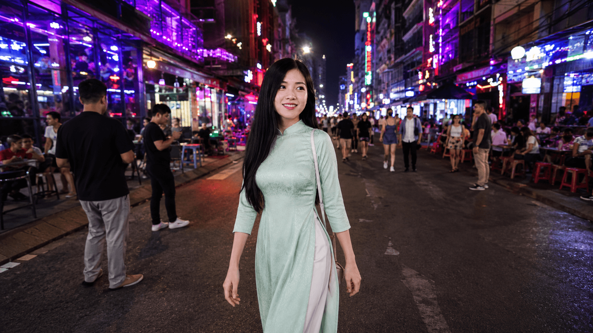
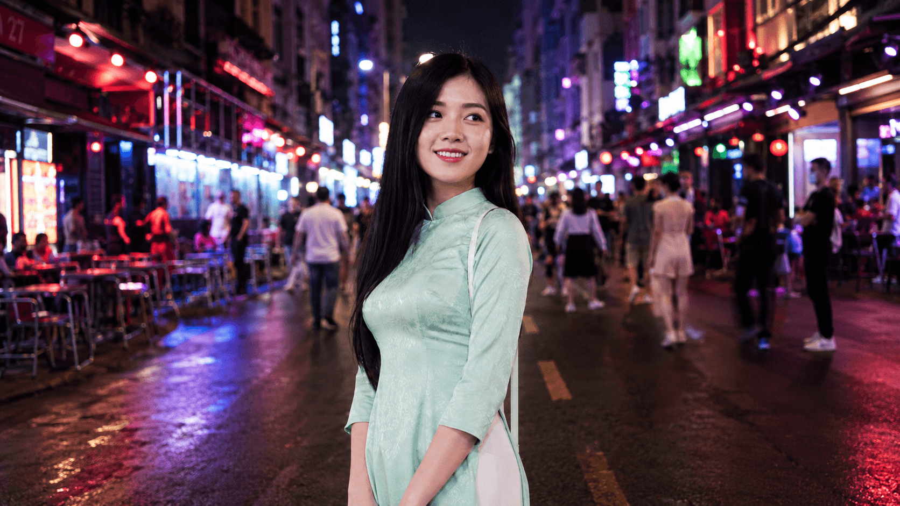
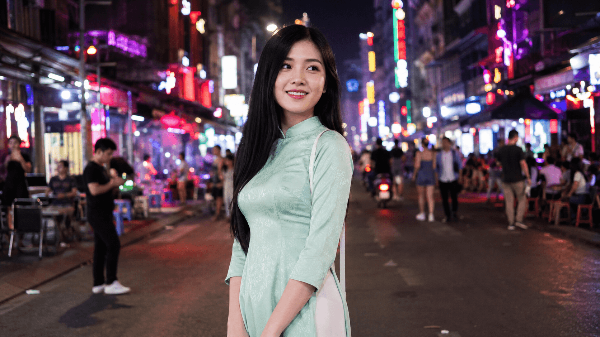
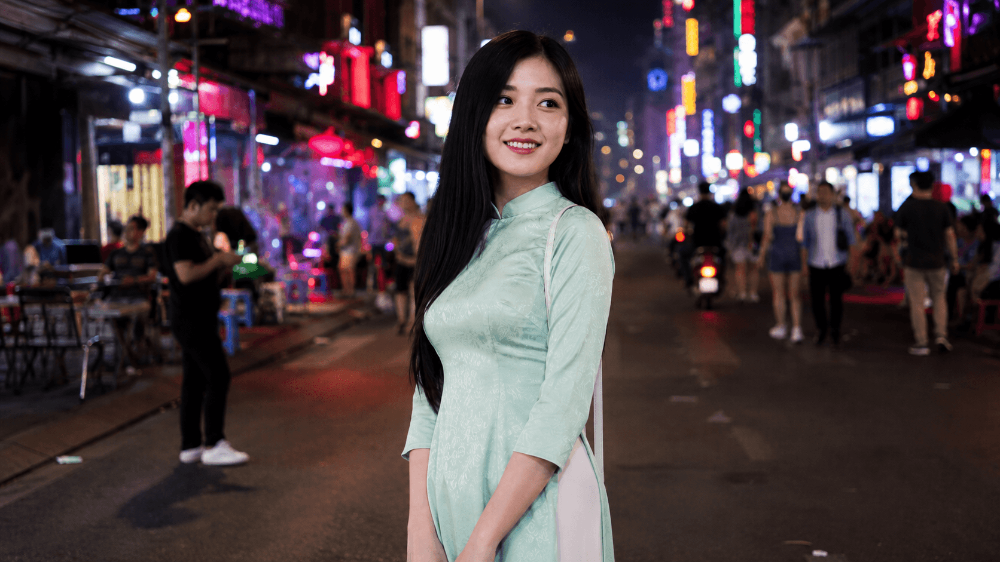
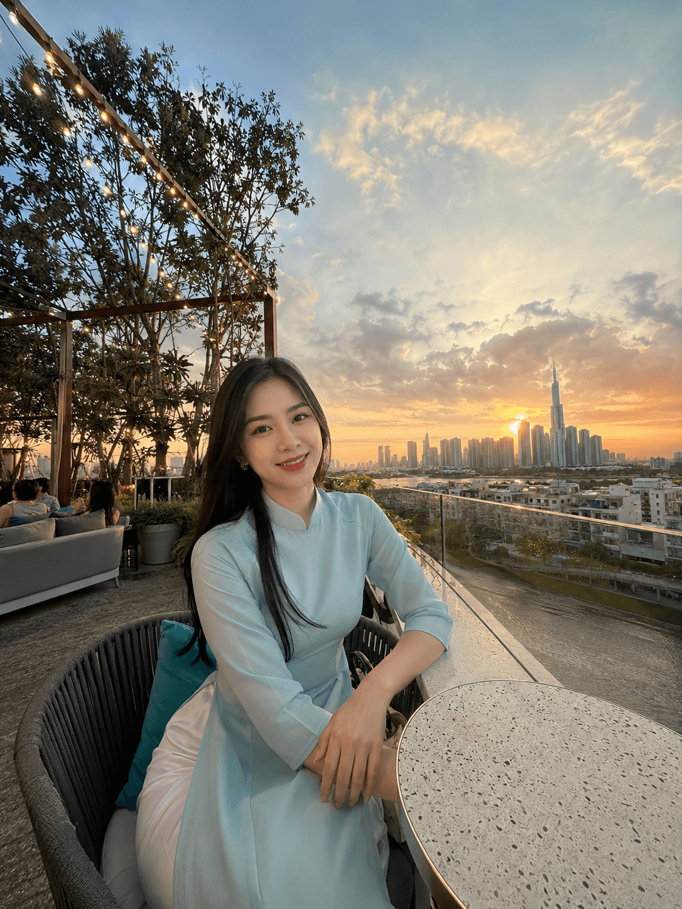
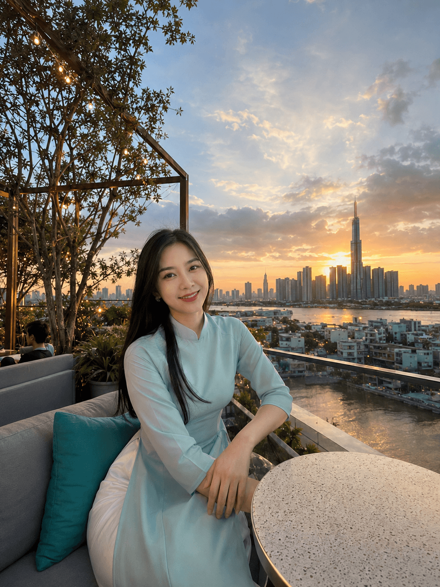
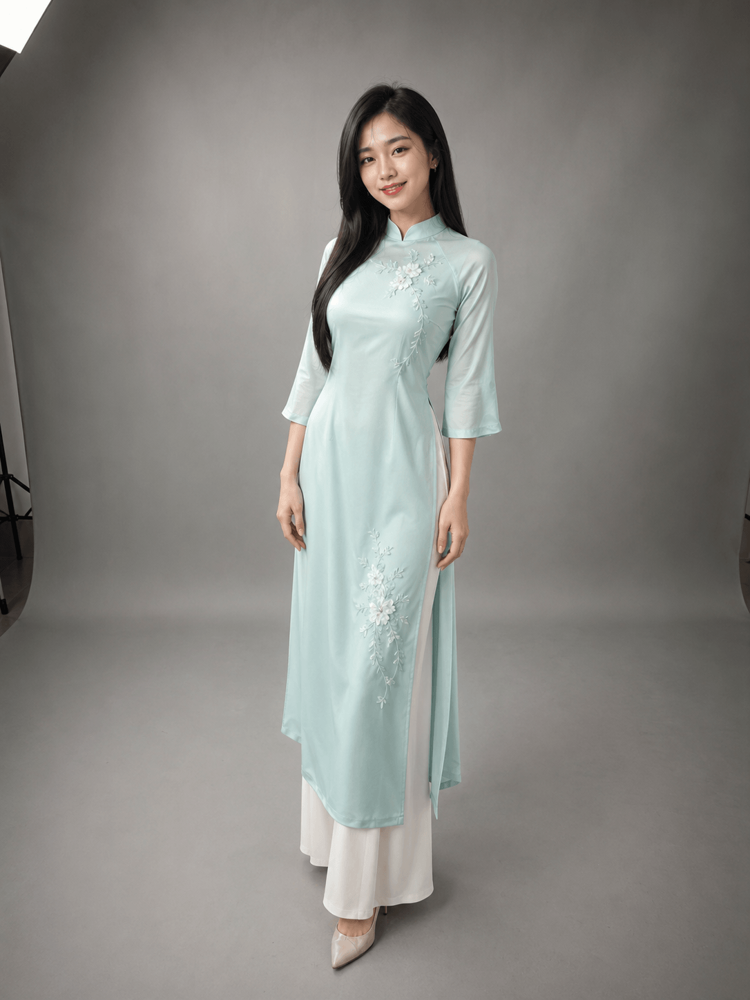
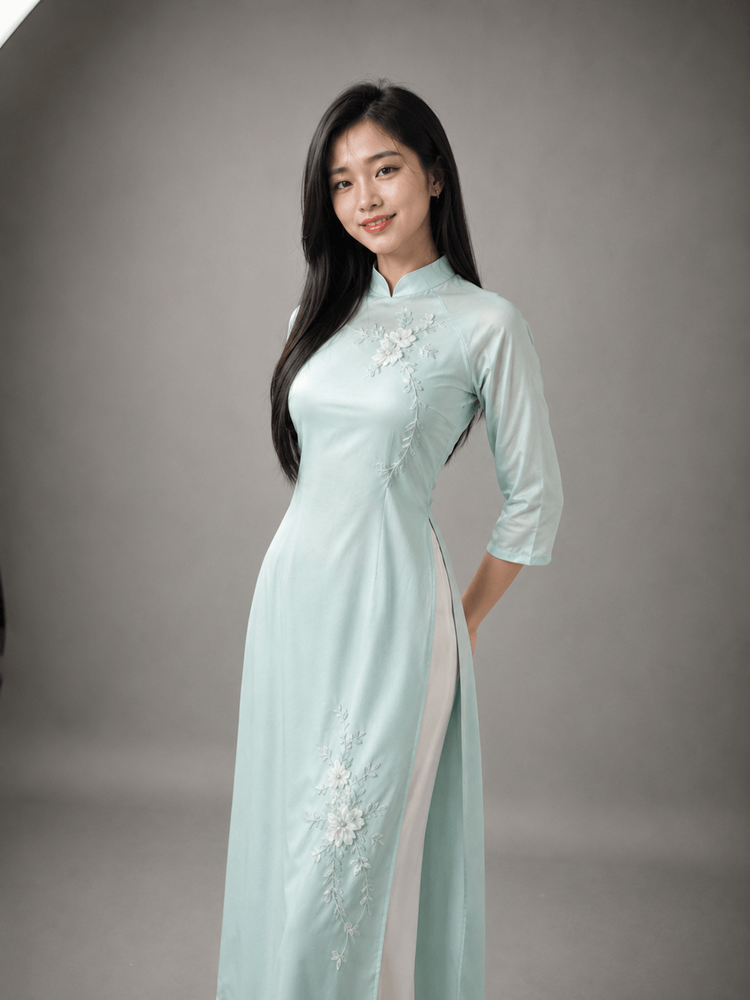
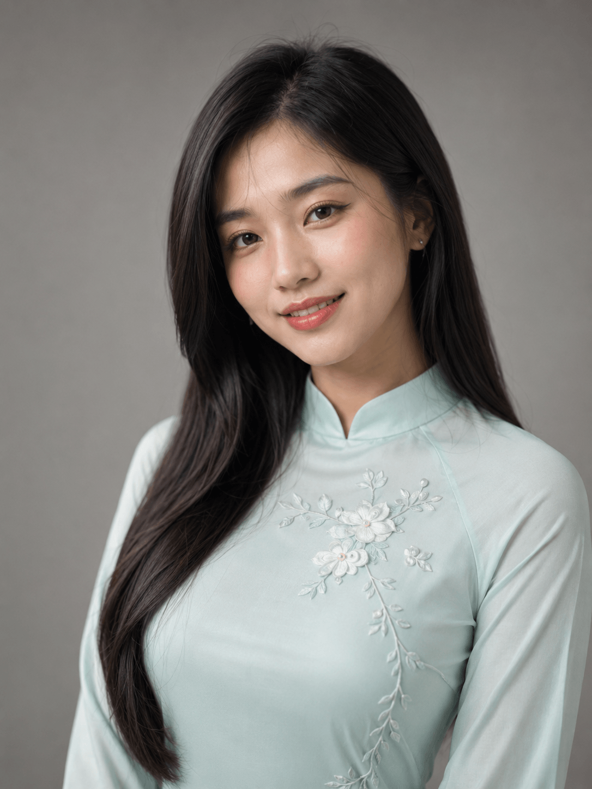
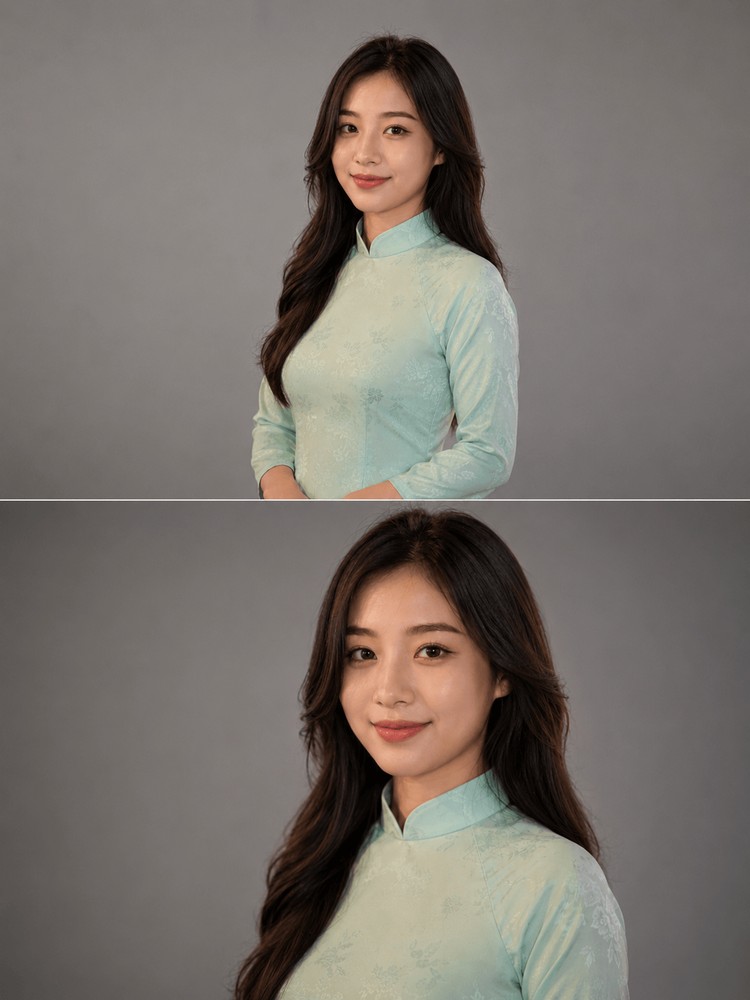

# 🎯 Day 13 — Camera & Lens trong Prompt: GPT Image 2 LỘ RA 1 ĐIỂM YẾU Đầu Tiên!

> **Level:** 🟣 Advanced
> **Thời gian đọc:** ~18 phút | **Thực hành:** ~65 phút
> **Ngày 13/30** | Tuần 2 — Master Skills (gần xong!)

---

## 🎬 Mở đầu — Sau 13 dự đoán SAI, Day 13 mình ĐÚNG lần đầu!

Day 10-12 mình đã thừa nhận **13 dự đoán SAI liên tiếp** về GPT Image 2. Pattern verified:
> **"GPT Image 2 KHÔNG có điểm yếu kỹ thuật + văn hóa"**

Hôm nay test **Camera & Lens** — yếu tố photography mà nhiều người nghĩ "AI không hiểu được". Mình đặt **5 dự đoán mới**, và lần này có chuyện **rất khác**:

> 🎲 **5 dự đoán Day 13:**
> 1. ❓ "Lens 24mm và 200mm sẽ ra ảnh gần giống nhau" → ❌ **SAI**
> 2. ❓ "85mm bokeh chỉ là 'fake bokeh'" → ❌ **SAI**
> 3. ❓ "200mm compression sẽ không 'kéo background gần' rõ" → ❌ **SAI**
> 4. ❓ "Subject (cô gái) sẽ KHÁC mặt qua 18 ảnh" → ✅ **ĐÚNG MỘT PHẦN!** ⭐
> 5. ❓ "GPT default ra 'lens trung tính'" → ❌ **SAI**

🎯 **Đây là dự đoán ĐÚNG ĐẦU TIÊN sau 17 lần sai liên tiếp!**

→ Pattern điều chỉnh:
> 🥇 **"GPT Image 2 KHÔNG có điểm yếu kỹ thuật + văn hóa. CHỈ CÓ 1 điểm yếu duy nhất: SUBJECT CONSISTENCY qua nhiều ảnh — cần reference image để fix."**

Vào bài để xem 20 ảnh test + bằng chứng!

---

## ⭐ Hero Image — Bokeh Sunset Đỉnh Cao


> *Cô gái Sài Gòn × 85mm classic portrait lens × Café Thảo Điền rooftop sunset.
> Bokeh creamy + Bitexco silhouette + golden hour Saigon = ảnh đẹp nhất cả khóa 30 ngày đến hiện tại.
> Đây là 1 trong 20 ảnh test — bằng chứng "lens character thật" + "85mm = chuẩn vàng portrait".*

---

## 🎯 Mục tiêu hôm nay

- ✅ Master 6 focal lengths: **24mm, 35mm, 50mm, 85mm, 135mm, 200mm**
- ✅ Hiểu "lens character" — mỗi lens có vibe RIÊNG BIỆT (verified rõ)
- ✅ Phát hiện **điểm yếu DUY NHẤT** của GPT Image 2 (subject consistency)
- ✅ Bonus: Split-image comparison — content viral chưa ai test
- ✅ Tránh **5 lỗi camera/lens** AI hay mắc phải
- ✅ Pattern Day 10-13 ĐIỀU CHỈNH: "1 điểm yếu duy nhất"

---

## 📚 Phần 1 — 6 Focal Lengths Kinh Điển

### 📐 24mm Wide Angle
**Vibe:** Dramatic, environment, distortion edges
**Khi dùng:** Phong cảnh, kiến trúc, môi trường rộng
**Keyword:** `ultra wide angle 24mm`, `dramatic perspective`

### 🚶 35mm Street
**Vibe:** Natural environmental, story-telling
**Khi dùng:** Street photography, lifestyle, documentary
**Keyword:** `35mm street photography lens`, `environmental portrait`

### 👁️ 50mm Normal (Human Eye)
**Vibe:** Natural, neutral, dễ nhất cho beginner
**Khi dùng:** Ảnh hàng ngày, dễ học
**Keyword:** `50mm standard lens`, `human eye perspective`

### ⭐ 85mm Portrait (Classic!)
**Vibe:** Classic portrait, beautiful bokeh, slight compression flattering
**Khi dùng:** Chân dung pro, fashion, wedding
**Keyword:** `85mm portrait lens`, `creamy bokeh`

### 🔭 135mm Telephoto
**Vibe:** Strong compression, isolated subject, intimate
**Khi dùng:** Editorial, long-distance portrait
**Keyword:** `135mm telephoto lens`, `strong compression`

### 🎯 200mm Long Zoom
**Vibe:** Extreme compression, "background kéo gần"
**Khi dùng:** Sport, wildlife, dramatic isolated portrait
**Keyword:** `200mm long telephoto lens`, `extreme compression`

---

## ⚙️ Phần 2 — Setup test (Kiểm soát biến số tối đa!)

### Quy tắc CỰC chuẩn
- ✅ **Cùng 1 model:** GPT Image 2 (4 bài liên tiếp Day 10-13)
- ✅ **Cùng 1 SUBJECT** — cô gái Sài Gòn 25 tuổi, áo dài pastel mint
- ✅ **Chỉ đổi LENS** — mọi thứ khác giữ nguyên
- ✅ KHÔNG cherry-pick

### 20 ảnh test = 6 lens × 3 cảnh + 2 bonus

| Cảnh | Vibe | Aspect | Setting |
|------|------|--------|---------|
| **Cảnh 1: Phố Bùi Viện đêm** | Street neon | 16:9 | Đèn neon đỏ-tím + crowd |
| **Cảnh 2: Café Thảo Điền sunset** | Lifestyle warm | 3:4 | Rooftop + Bitexco silhouette |
| **Cảnh 3: Studio portrait** | Controlled clean | 3:4 | Background xám neutral |

**Plus 2 ảnh bonus comparison:**
- Bonus 1: 24mm vs 200mm side-by-side (LEFT-RIGHT)
- Bonus 2: 50mm vs 85mm split (TOP-BOTTOM)

### 💰 Chi phí thực
**20 ảnh × 900 credit = 18,000 credit (~18k VND, ~1.6% gói Ultra Member)**

---

## 🧪 Phần 3 — Đợt 1: Phố Bùi Viện Đêm 🌃

### 🖼️ Kết quả 6 lens cùng 1 cô gái + cùng 1 phố neon

**24mm Wide — Environmental đẹp:**


**35mm Street — Wet asphalt + neon đỏ-tím vibe pro:**


**50mm Normal — Human eye chuẩn:**


**85mm Portrait — Bokeh balls xuất hiện đẹp:**


**135mm Telephoto — Bokeh balls TO HƠN, compression rõ:**


**200mm Long zoom — MELTED bokeh extreme:**


### 🔍 Phân tích — GRADATION CỰC RÕ

| Tiêu chí | 24mm | 35mm | 50mm | 85mm | 135mm | 200mm |
|----------|------|------|------|------|-------|-------|
| Background sharp | ⭐⭐⭐⭐⭐ Toàn cảnh | ⭐⭐⭐⭐ Hơi blur | ⭐⭐⭐ Blur nhẹ | ⭐⭐ Bokeh creamy | ⭐ Bokeh to | ❌ Melted |
| Subject isolation | ⭐⭐ | ⭐⭐⭐ | ⭐⭐⭐ | ⭐⭐⭐⭐ | ⭐⭐⭐⭐⭐ | ⭐⭐⭐⭐⭐ Đỉnh |
| Compression rõ | - | - | - | ⭐⭐ | ⭐⭐⭐⭐ | ⭐⭐⭐⭐⭐ |
| Vibe | Wide environment | Street pro | Standard | Classic portrait | Editorial | Extreme isolated |

> 🎯 **Insight đợt 1:** 6 ảnh CÙNG 1 cô gái + CÙNG 1 phố → 6 vibe **HOÀN TOÀN khác nhau**. **Lens character thật**, không "lens trung tính" như mình dự đoán.
>
> **Setting có nhiều đèn neon = test bokeh gradation hoàn hảo.** Bokeh balls từ 85mm → 200mm tăng dần kích thước & melt level.

---

## 🧪 Phần 4 — Đợt 2: Café Thảo Điền Sunset ☕ ⭐ (HERO Đợt!)

### 🖼️ Kết quả 6 lens với golden hour + Bitexco silhouette

**24mm Wide — Skyline cực rộng:**


**35mm Street — Lifestyle balanced:**


**50mm Normal — Natural sunset:**


**85mm Portrait — HERO IMAGE ⭐⭐⭐⭐⭐:**


**135mm Telephoto — Tight sunset:**


**200mm Long zoom — Extreme sunset close:**


### 🔍 Phân tích — Đợt đẹp NHẤT cả khóa

> 🌅 **#12 (85mm Café Thảo Điền) = HERO IMAGE OFFICIAL!**
>
> Vì sao đây là ảnh đẹp nhất cả khóa 30 ngày đến hiện tại:
> - ✅ **Bokeh creamy ĐỈNH** — Bitexco silhouette tan vào background
> - ✅ **Golden hour** — sunset Saigon orange/gold tone
> - ✅ **Classic portrait** — composition Rule of Thirds (Day 10) + Backlight (Day 11) + Analogous warm (Day 12) + 85mm (Day 13) = **MASTER COMBO Tuần 2!**
> - ✅ **Vibe Sài Gòn rooftop** — content riêng cho creator HCM

**Bằng chứng pattern:** 6 ảnh đợt này KHÔNG có ảnh nào dưới ⭐⭐⭐⭐. **Setting tốt + lens phù hợp = output đỉnh.**

---

## 🧪 Phần 5 — Đợt 3: Studio Portrait 🎬

### 🖼️ Kết quả 6 lens trong môi trường controlled

**24mm Wide — Full body environment:**


**35mm Street — 3/4 body:**


**50mm Normal — Half body neutral:**


**85mm Portrait — Classic studio:**


**135mm Telephoto — Tight intimate:**


**200mm Long zoom — Beauty close-up ĐỈNH ⭐⭐⭐⭐⭐:**


### 🔍 Phân tích — Beauty Shot Pro Level!

> 💎 **#17 (200mm Studio) = MAGAZINE COVER QUALITY**
>
> Beauty close-up extreme với:
> - ✅ Eye sharp, skin texture rõ
> - ✅ Bokeh "background xám" tan đẹp
> - ✅ Compression flattering (làm mặt nhỏ thanh tú)
> - ✅ Lighting soft beauty
>
> → **Ảnh có thể dùng làm cover cho tạp chí thời trang Việt Nam.**

**Insight đợt 3:** Studio = test hoàn hảo cho lens character (không bị nhiễu bởi background).

---

## ⭐ Phần 6 — Bonus Comparison Side-by-Side (CHƯA AI TEST!)

### 🖼️ Bonus 1: 24mm Wide vs 200mm Telephoto (LEFT-RIGHT)


> 🤯 **GPT Image 2 LÀM ĐƯỢC SPLIT-IMAGE COMPARISON!**
>
> - **LEFT (24mm):** Full body Bùi Viện, environmental wide, neon đỏ-xanh trải dài
> - **RIGHT (200mm):** Close-up beauty với melted bokeh balls
>
> Cùng 1 cô gái, cùng setting nền tảng, nhưng 2 vibe HOÀN TOÀN khác → **Educational content viral level**

→ **Insight độc quyền:** Đây là feature pro **chưa ai test ở Việt Nam**. Có thể dùng cho:
- 📚 Khóa dạy AI image
- 🎬 Video YouTube photography
- 📱 Carousel Instagram giáo dục
- 📝 Blog post comparison

---

### 🖼️ Bonus 2: 50mm Eye vs 85mm Portrait (TOP-BOTTOM)



> 🎯 **GPT cũng làm được TOP-BOTTOM split!**
>
> - **TOP (50mm):** Half body, natural perspective, slight environment
> - **BOTTOM (85mm):** Closer with creamy bokeh background
>
> Khác biệt **subtle hơn** Bonus 1 — đúng nature của 50mm vs 85mm (cận nhau hơn 24mm vs 200mm).

**Bài học:** GPT có thể làm được educational comparison cho **bất kỳ 2 lens nào** Linh muốn dạy.

---

## 🚨 Phần 7 — PHÁT HIỆN ĐIỂM YẾU ĐẦU TIÊN: SUBJECT CONSISTENCY

### Pattern Day 10-13: 17 dự đoán SAI + 1 ĐÚNG đầu tiên

> ⚠️ **Đây là dự đoán mình ĐÚNG ĐẦU TIÊN sau 17 lần sai!**

### 🔍 Bằng chứng: Soi kỹ 18 ảnh chính

**✅ Consistent (95%+):**
- Áo dài pastel mint với hoa văn ✅
- Tóc đen dài thẳng ✅
- Vibe tổng thể "cùng 1 người"

**⚠️ NHƯNG KHÁC BIỆT NHẸ (mặt):**

| Loại shot | Đặc điểm mặt |
|-----------|--------------|
| **Wide shots (24/35/50mm)** | Mặt tròn hơn, baby-faced |
| **Telephoto shots (85/135/200mm)** | Mặt thon hơn, jawline rõ hơn, refined |

→ **GPT có bias làm đẹp ở close-up shots** — compression không chỉ flatten geometric mà còn **"refine" features**.

### 💎 Bài học pro

**Cho creator làm lookbook / storyboard / mascot:**
- ❌ **KHÔNG dùng** GPT Image 2 nếu cần subject consistency 100% qua nhiều shot
- ✅ **DÙNG Seedream 4.5** với **14 reference images** (Day 8 đã verify)
- ✅ **Hoặc dùng prompt chain** — Image-to-Image với reference

**Cho người dùng casual:**
- GPT Image 2 vẫn dùng được — vibe consistent ~95%
- Audience nhìn nhanh sẽ thấy "cùng 1 người"
- Chỉ creator pro để ý mới phát hiện

→ **Honest review:** GPT mạnh ở **single shot quality**, yếu ở **multi-shot consistency**. **Trade-off rõ ràng.**

---

## 📊 Phần 8 — Bảng tổng kết: GPT Image 2 vs 6 Lens

### Câu trả lời điều chỉnh: **"1 ĐIỂM YẾU DUY NHẤT"**

| Focal Length | Bùi Viện | Thảo Điền | Studio | Tổng | Lens character |
|--------------|----------|-----------|--------|------|-----------------|
| 24mm Wide | ⭐⭐⭐⭐ | ⭐⭐⭐⭐ | ⭐⭐⭐⭐ | 🥇 Đỉnh | Wide environment chuẩn |
| 35mm Street | ⭐⭐⭐⭐⭐ | ⭐⭐⭐⭐⭐ | ⭐⭐⭐⭐ | 🥇 Đỉnh | Street natural |
| 50mm Normal | ⭐⭐⭐⭐ | ⭐⭐⭐⭐⭐ | ⭐⭐⭐⭐ | 🥇 Đỉnh | Human eye chuẩn |
| **85mm Portrait** ⭐ | ⭐⭐⭐⭐⭐ | ⭐⭐⭐⭐⭐ HERO | ⭐⭐⭐⭐⭐ | 🥇 **ĐỈNH NHẤT** | Bokeh + compression đỉnh |
| 135mm Telephoto | ⭐⭐⭐⭐⭐ | ⭐⭐⭐⭐⭐ | ⭐⭐⭐⭐⭐ | 🥇 Đỉnh | Strong compression |
| 200mm Long zoom | ⭐⭐⭐⭐⭐ | ⭐⭐⭐⭐⭐ | ⭐⭐⭐⭐⭐ Beauty | 🥇 Đỉnh | Extreme isolated |

**🎯 Kết luận điều chỉnh:**

- ✅ **6/6 lens** đều ⭐⭐⭐⭐+
- ✅ **Lens character cực rõ** qua 18 ảnh
- ✅ **2 bonus split-image SUCCESS** — viral content
- ⚠️ **1 điểm yếu duy nhất:** Subject consistency (face refinement bias close-up)

---

## 🚨 Phần 9 — 5 Lỗi Camera/Lens AI Hay Mắc Phải

### Lỗi 1: 📷 "Lens trung tính" mặc định (DỰ ĐOÁN SAI)
**Verified Day 13:** GPT Image 2 KHÔNG bị lỗi này nếu prompt cụ thể focal length.
**Fix:** `(specific focal length:1.4)` — vd `(85mm portrait lens:1.4)`

### Lỗi 2: 📐 24mm không có distortion edges
**Verified Day 13:** Distortion nhẹ nhưng có. Đủ cho casual, không quá rõ như Sigma 24mm thật.
**Fix:** `dramatic perspective`, `distortion at edges`, `wide environmental context`

### Lỗi 3: 🌫️ 85mm thiếu bokeh creamy (DỰ ĐOÁN SAI)
**Verified Day 13:** 85mm bokeh đỉnh (#10, #11, #12 đều có bokeh balls đẹp).
**Fix:** `creamy bokeh`, `f/1.4 shallow DOF`

### Lỗi 4: 🎯 200mm không compression mạnh (DỰ ĐOÁN SAI)
**Verified Day 13:** Compression CỰC mạnh — bokeh melted hoàn toàn.
**Fix:** `extreme compression`, `background pulled close`, `flattened perspective`

### Lỗi 5: 👤 Subject KHÁC mặt qua nhiều ảnh ⭐ (DỰ ĐOÁN ĐÚNG ĐẦU TIÊN!)
**Verified Day 13:** GPT có bias refine face ở close-up. Wide vs telephoto KHÁC nhẹ.
**Fix:**
1. Detailed unique features (vd: cụ thể nốt ruồi, dáng môi)
2. **Reference image** với Seedream 4.5 (14 ref)
3. **Image-to-Image** chain workflow

---

## 🎁 Phần 10 — Cheatsheet "Focal length nào cho mood nào?"

### 📐 24mm Wide — "Kể câu chuyện môi trường"
- Phong cảnh + người
- Kiến trúc nội thất
- Vlog góc rộng
- Sự kiện đông người

### 🚶 35mm Street — "Natural storytelling"
- Street photography
- Documentary
- Lifestyle blog

### 👁️ 50mm Normal — "Neutral, dễ học"
- Beginner photography
- Versatile mọi tình huống

### ⭐ 85mm Portrait — "Classic professional" (HERO Day 13!)
- **Chân dung pro** (gói chính)
- Wedding portrait
- Fashion editorial
- **Café/rooftop sunset = combo viral**

### 🔭 135mm Telephoto — "Isolate + intimate"
- Editorial concept
- Compressed dramatic

### 🎯 200mm Long Zoom — "Extreme + dramatic"
- Beauty close-up (#17 = magazine cover)
- Background "kéo gần" cảm giác

---

## 💎 Phần 11 — 5 Insights Pro CHỈ Linh0AI Chia Sẻ

**1. ⭐ GPT Image 2 hiểu LENS CHARACTER thật (verified)**
6 ảnh cùng cảnh + cùng cô gái → 6 vibe khác nhau rõ rệt. Bokeh gradation từ 24mm sharp → 200mm melted là **pixel-perfect**. **Bài học:** Đừng đánh giá thấp AI — nó hiểu photography fundamentals tốt hơn nghĩ.

**2. 🤯 GPT làm SPLIT-IMAGE COMPARISON (chưa ai test ở VN!)**
2 bonus đều thành công. Đây là **content viral chưa ai dạy**:
- LEFT-RIGHT split (16:9): so sánh 2 lens extreme
- TOP-BOTTOM split (3:4): so sánh 2 lens close
→ Game changer cho khóa dạy AI, blog photography, video education.

**3. ⚠️ GPT CÓ 1 ĐIỂM YẾU DUY NHẤT: Subject Consistency (DỰ ĐOÁN ĐÚNG ĐẦU TIÊN!)**
Sau 17 dự đoán sai liên tiếp Day 10-12, đây là dự đoán ĐÚNG đầu tiên:
- Wide vs Telephoto shots → face refinement bias
- Close-up "tự ý làm đẹp" subject
- → Cần Seedream 4.5 (14 ref images) hoặc Image-to-Image chain cho lookbook pro

**4. 🌅 85mm + Sunset + Bokeh = HERO FORMULA**
Hero image (#12) chứng minh combo công thức chân dung viral:
```
85mm portrait lens + golden hour + bokeh creamy + Vietnamese setting
```
→ **Recipe đỉnh nhất Day 13** cho creator chân dung Việt.

**5. 🇻🇳 Setting Sài Gòn 3-trong-1 — Content riêng cho HCM creator**
- Phố Bùi Viện neon = bokeh test ground perfect
- Thảo Điền sunset = golden hour test
- Studio gray = controlled lens test
→ **Setting Sài Gòn có thể tạo "Saigon portrait series"** — content khác biệt với Hà Nội/miền Trung.

---

## 🎯 Pattern Day 10-13 ĐIỀU CHỈNH (Quan trọng!)

```
Day 10 (Composition):  3 dự đoán SAI
Day 11 (Lighting):     5 dự đoán SAI
Day 12 (Color):        5 dự đoán SAI
Day 13 (Lens):         4 dự đoán SAI + 1 ĐÚNG ⭐

Tổng: 17 dự đoán SAI liên tiếp + 1 ĐÚNG đầu tiên (Subject Consistency)
```

### 🥇 Pattern verified ĐIỀU CHỈNH:

> **"GPT Image 2 KHÔNG có điểm yếu kỹ thuật + văn hóa.**
> **CHỈ CÓ 1 ĐIỂM YẾU DUY NHẤT: SUBJECT CONSISTENCY qua nhiều ảnh —**
> **cần Seedream 4.5 với 14 reference images để fix."**

→ **Insight balanced** — **không tâng bốc GPT, không hạ thấp.** Honest review = trust quan trọng cho audience.

---

## 🎯 Thử thách hôm nay

### 🟢 Cho Newbie (15 phút, ~2,100 credit Seedream)
1. Test 24mm + 85mm trên Seedream 4.5: 1 cô gái duy nhất
2. So sánh 2 ảnh — cảm nhận khác biệt lens

### 🔵 Cho Intermediate (65 phút, ~18,000 credit GPT)
1. Test full 20 ảnh trên GPT Image 2
2. **Đặc biệt soi:** Subject có "refined face" ở close-up?

### 🟣 Cho Pro (150 phút, ~25,000 credit hybrid)
1. 20 ảnh GPT + 20 ảnh Seedream 4.5 (cùng prompt + reference image)
2. So sánh subject consistency — Seedream với 14 ref có giải quyết được?

---

## ❓ FAQ

**Q1: Sau 4 bài, GPT Image 2 có thực sự "không có điểm yếu nào CẢ"?**
**Có và không.** Day 13 đã phát hiện **1 điểm yếu duy nhất** — Subject Consistency. **Pattern điều chỉnh:** "GPT không có điểm yếu kỹ thuật/văn hóa, chỉ có 1 điểm yếu multi-shot consistency."

**Q2: 18,000 credit cho 20 ảnh có đáng?**
**Đáng** — Day 13 phát hiện **3 insights chưa ai có ở Việt Nam**:
- Lens character thật (gradation rõ)
- Split-image comparison làm được
- Điểm yếu Subject consistency (honest review)

**Q3: 85mm thực sự là "chuẩn vàng portrait"?**
**Có, verified.** Hero image (#12) + #11 (Studio) + #10 (Bùi Viện) đều là 85mm và đều ⭐⭐⭐⭐⭐. Bokeh creamy + compression flattering = combo perfect cho chân dung.

**Q4: 24mm vs 35mm — khi nào chọn cái nào?**
- **24mm:** Khi cần dramatic, distortion edges, environmental wide
- **35mm:** Khi cần natural, story-telling, không drama
- **Thực tế Day 13:** 35mm Bùi Viện (#4) đẹp hơn 24mm Bùi Viện (#1) vì street photography vibe phù hợp 35mm hơn.

**Q5: 135mm vs 200mm — khác biệt thực tế?**
- **135mm:** Strong compression, bokeh balls to nhưng còn distinguishable
- **200mm:** Extreme compression, bokeh **MELTED** hoàn toàn
- **Ví dụ:** Bùi Viện #13 vs #16 — bokeh balls #13 còn nhìn được, #16 tan chảy

**Q6: Subject consistency — tại sao GPT bias close-up đẹp hơn?**
Lý thuyết: AI training data có nhiều ảnh **portrait đẹp** ở close-up shots (fashion, beauty). Khi prompt close-up, model "default" sang aesthetic này.

**Q7: Reference image có giải quyết được Subject Consistency không?**
**Có, verified Day 8** — Seedream 4.5 hỗ trợ tới 14 ref images. Nếu Linh cần lookbook 50 ảnh cùng 1 model, **dùng Seedream với reference**, không phải GPT Image 2.

**Q8: Combo Day 10-13 (Composition + Lighting + Color + Lens)?**
**Đỉnh nhất:** Hero image (#12) đã chứng minh tự nhiên có cả 4:
- ✅ **Composition:** Rule of Thirds (subject lệch trái 1/3)
- ✅ **Lighting:** Backlight golden hour
- ✅ **Color:** Analogous warm palette
- ✅ **Lens:** 85mm portrait

→ **MASTER COMBO Tuần 2** sẽ tổng kết Day 14!

---

## 🎬 Recap & Day 14 (Tổng kết Tuần 2!)

### Ghi nhớ chính

- ✅ **6 focal lengths:** 24, 35, 50, 85, 135, 200mm — **lens character thật**
- ✅ **85mm = chuẩn vàng portrait** (verified Day 13, hero #12)
- ✅ **GPT làm split-image comparison** (chưa ai test ở VN!)
- ✅ **1 điểm yếu duy nhất:** Subject Consistency multi-shot
- ✅ **Pattern Day 10-13:** 17 SAI + 1 ĐÚNG đầu tiên = honest review
- ✅ **Master Combo Tuần 2:** 4 yếu tố verified qua 4 bài

### 🔮 Day 14 — Sneak peek

**TỔNG KẾT TUẦN 2 + chấm Mini Challenge "Phong cảnh Việt Nam"!**

Sau 7 ngày Master Skills (Day 8-14), Linh sẽ có:
- ✅ Cheatsheet 4-trong-1: Composition + Lighting + Color + Lens
- ✅ **95 ảnh test verified** (10+12+15+18+20+20)
- ✅ **18+ insights pro** chưa ai chia sẻ ở Việt Nam
- ✅ Pattern strong: "GPT 1 điểm yếu duy nhất"
- ✅ Sẵn sàng Tuần 3 — **Practical Production**

---

## 📍 Navigation

[⬅️ Day 12: Color Theory & Mood](./day-12.md) | [🏠 README](../README.md) | [➡️ Day 14: Tổng kết Tuần 2](./day-14.md)

## 🏷️ Tags

`#0aiVN #Day13Linh0AI #CameraLens #FocalLength #85mmPortrait #Bokeh #SubjectConsistency #SplitImage #GPTImage2 #BuiVien #ThaoDien #SaigonPortrait #PatternAdjusted`

---

*Nhật ký Day 13 by **Linh0AI** — chuỗi 30 ngày làm chủ AI tạo ảnh & video trên 0ai.vn 🇻🇳*
