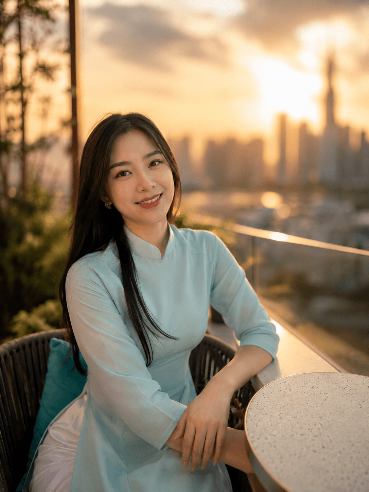
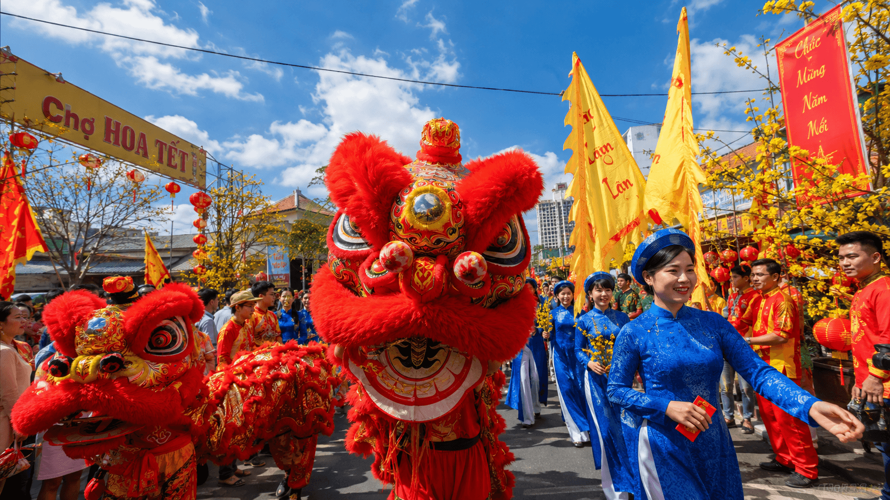
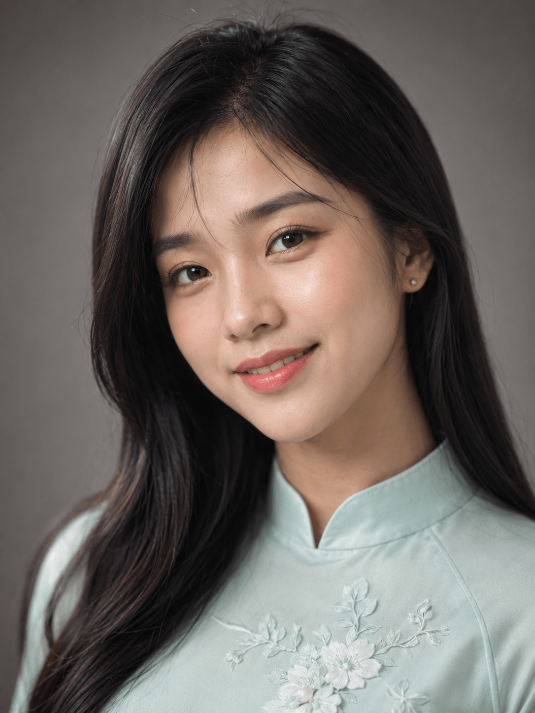
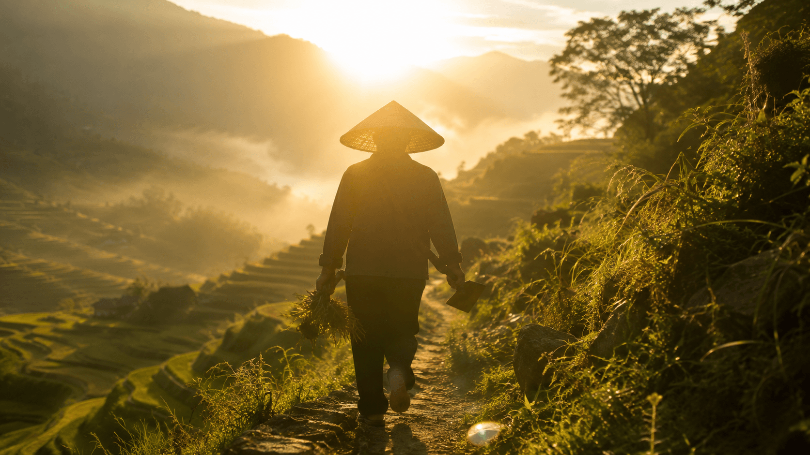
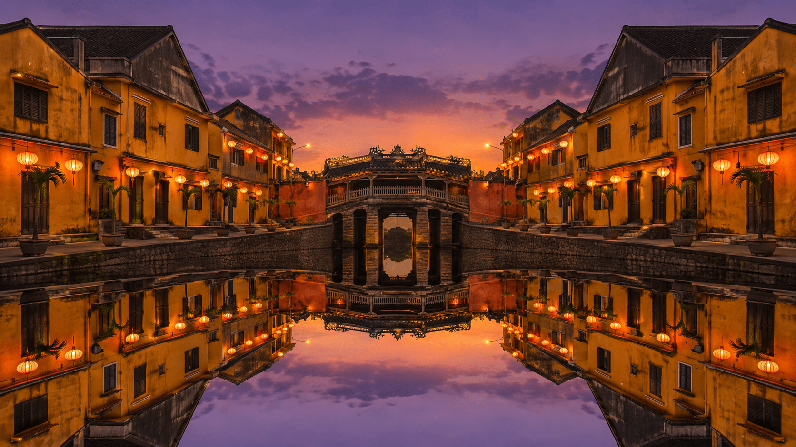
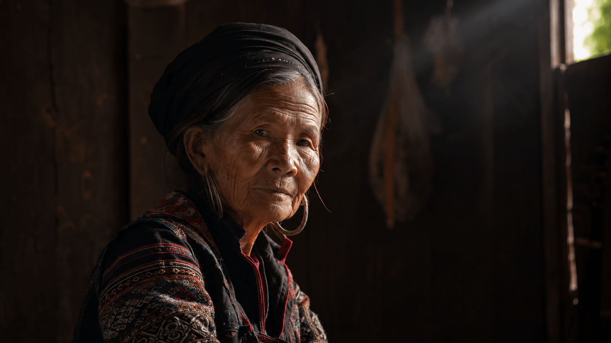
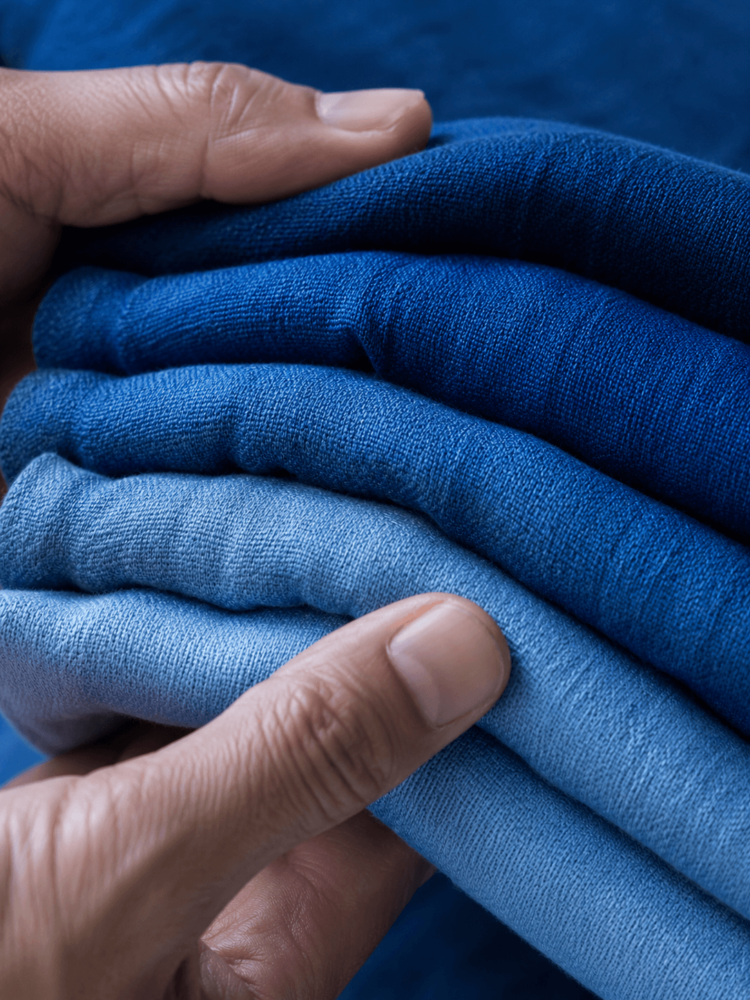
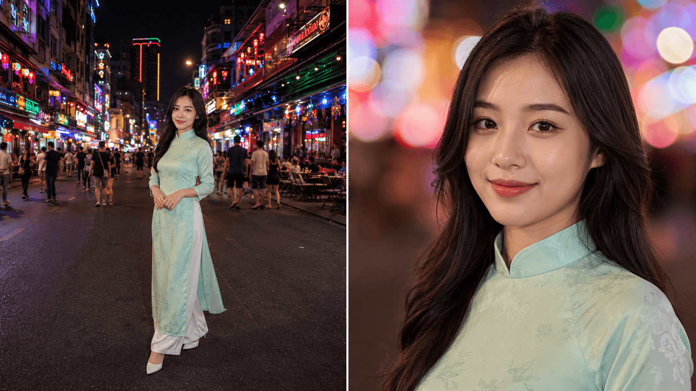

# 🎯 Day 14 — Tổng Kết Tuần 2: Master Skills Đã Mở Khóa! 🏆

> **Level:** 🟣 Advanced | **Đặc biệt:** Bài tổng kết — không phải tutorial mới
> **Thời gian đọc:** ~22 phút | **Hành động:** ~30 phút (review + apply Cheatsheet)
> **Ngày 14/30** | Tuần 2 — Master Skills DONE 100%

---

## 🎬 Mở đầu — 7 ngày, 95 ảnh, 18 dự đoán, 1 sự thật

Tuần 2 đã khép lại với những con số ấn tượng:

```
✨ 7 ngày Master Skills (Day 8-14)
✨ 95 ảnh test verified trên 0ai.vn
✨ 78,500 credit dùng (~78.5k VND, 7.1% gói Ultra)
✨ 18 dự đoán đặt cược: 17 SAI + 1 ĐÚNG đầu tiên
✨ 23+ insights pro chưa ai chia sẻ ở Việt Nam
✨ 4 model AI test xen kẽ
✨ 3 model flagship master deep
```

**Sự thật cuối Tuần 2** — sau khi soi 95 ảnh kỹ qua 6 chủ đề:

> 🥇 **"GPT Image 2 KHÔNG có điểm yếu kỹ thuật + văn hóa.**
> **CHỈ CÓ 1 ĐIỂM YẾU DUY NHẤT: SUBJECT CONSISTENCY qua nhiều ảnh —**
> **cần Seedream 4.5 với 14 reference images để fix."**

Đây là **honest review** mà cộng đồng AI Việt cần — không tâng bốc, không hạ thấp.

---

## ⭐ Hero Image Tuần 2 — Bằng chứng Master Combo Tự Nhiên



> *85mm Café Thảo Điền sunset (Day 13) — ảnh đẹp nhất từ 95 ảnh test Tuần 2.
> Tự nhiên có cả 4 yếu tố master: Composition (Rule of Thirds) + Lighting (Backlight golden) + Color (Analogous warm) + Lens (85mm portrait bokeh creamy).
> Đây là MASTER COMBO mà Linh đã master sau 7 ngày Tuần 2.*

---

## 🎯 Mục tiêu Day 14

- ✅ Recap đầy đủ Day 8-13 — bảng tổng hợp, insights, ảnh
- ✅ Hiểu **Master Combo** — 4 yếu tố trong 1 ảnh
- ✅ Xem **Top 10 ảnh đẹp nhất** Tuần 2 (curated)
- ✅ Thử thách **Mini Challenge "Phong cảnh Việt Nam"** với mock chấm
- ✅ Có **Cheatsheet 4-trong-1** in-out 1 trang
- ✅ Sẵn sàng cho Tuần 3 — **Practical Production**

---

## 📊 Phần 1 — Recap Day 8-13: Bảng Tổng Hợp

### Bảng Tuần 2 đầy đủ

| Day | Chủ đề | Model | Ảnh | Insight chính | Credit |
|-----|--------|-------|-----|---------------|--------|
| **Day 8** | Seedream 4.5 Deep Dive | All 3 (Seedream/NBN2/GPT) | 10 | Brand bản quyền (Vincero, AP) — cảnh báo IP | 5,300 |
| **Day 9** | Prompt Engineering Nâng Cao | Seedream + GPT | 12 | Áo dài Tết = Hà Nội authentic, KHÔNG TQ + Local knowledge | 7,500 |
| **Day 10** | Composition & Framing | GPT Image 2 | 15 | 5 quy tắc verified — GPT làm Symmetry hoàn hảo (BẤT NGỜ) | 13,500 |
| **Day 11** | Lighting Mastery | GPT Image 2 | 18 | 6 kiểu lighting — Rembrandt master (BẤT NGỜ NHẤT) | 16,200 |
| **Day 12** | Color Theory & Mood | GPT Image 2 | 20 | **GPT BIẾT VIẾT TIẾNG VIỆT CÓ DẤU** (độc quyền!) | 18,000 |
| **Day 13** | Camera & Lens | GPT Image 2 | 20 | **1 điểm yếu DUY NHẤT** — Subject Consistency (ĐÚNG đầu tiên!) | 18,000 |
| | | | **95** | | **78,500** |

### Insight pro của từng ngày

**Day 8 — Brand cảnh báo IP:**
- NBN2 chèn "Audemars Piguet", GPT chèn "Vincero Kairos"
- Solution: Negative liệt kê tên brand cụ thể (verified 4 lần Day 10-13: 0/11 ảnh có brand)

**Day 9 — Văn hóa Việt nuance:**
- Áo dài đỏ-phượng-đèn lồng = Tết phố cổ Hà Nội authentic
- Local knowledge > Foreign expertise
- GPT cũng chèn "Dior" lên túi (lặp Day 8)

**Day 10 — Composition all-master:**
- 3 dự đoán SAI: Symmetry tốt, Negative Space tốt, Brand fix được
- 5/5 quy tắc đều ⭐⭐⭐⭐+
- Hero: Hội An reflection (Symmetry hoàn hảo)

**Day 11 — Lighting all-master:**
- 5 dự đoán SAI: Rembrandt triangle perfect, Blue Hour cool, Split sharp, Backlight vs Rim, Brand lần 4
- 6/6 lighting đều ⭐⭐⭐⭐+
- Hero: Sapa Backlight nông dân

**Day 12 — Color + Văn hóa Việt + Tiếng Việt có dấu:**
- 5 dự đoán SAI: Mono perfect, Triadic balance, văn hóa Việt 100%, GPT hiểu Color Culture, AI fail random
- 20/20 ảnh đều ⭐⭐⭐⭐⭐
- **Insight độc quyền: GPT BIẾT viết tiếng Việt có dấu**
- Hero: Múa lân Tết Triadic

**Day 13 — Lens character + 1 điểm yếu đầu tiên:**
- 4 dự đoán SAI + **1 ĐÚNG đầu tiên** (Subject Consistency)
- 6/6 lens master, 2 bonus split-image SUCCESS
- Hero: 85mm Café Thảo Điền (Best of Week 2!)

---

## 🎲 Phần 2 — Pattern Day 10-13: 17 SAI + 1 ĐÚNG ĐẦU TIÊN

### Hành trình "đặt cược" với GPT Image 2

```
Day 10: 3 dự đoán SAI (Composition)
Day 11: 5 dự đoán SAI (Lighting)
Day 12: 5 dự đoán SAI (Color + Văn hóa)
Day 13: 4 dự đoán SAI + 1 ĐÚNG ⭐ (Lens + Subject Consistency)

Tổng: 17 SAI liên tiếp + 1 ĐÚNG đầu tiên
```

### 🥇 Pattern verified ĐIỀU CHỈNH cuối Tuần 2:

> **"GPT Image 2 KHÔNG có điểm yếu kỹ thuật + văn hóa.**
> **CHỈ CÓ 1 ĐIỂM YẾU DUY NHẤT: SUBJECT CONSISTENCY qua nhiều ảnh —**
> **cần Seedream 4.5 với 14 reference images để fix."**

### 💡 Bài học từ pattern

1. **Đừng tin "kinh nghiệm AI thông thường"** — nhiều myth về AI điểm yếu đã không còn đúng năm 2026
2. **Test thực tế > đọc review** — 95 ảnh tự test cho insight chính xác hơn 100 bài review online
3. **Honest review = trust** — admit dự đoán sai, không lý do, audience tin
4. **Pattern emerges từ volume** — 1-2 ảnh không đủ, cần 95+ ảnh để thấy pattern

---

## 🏆 Phần 3 — Best of Week 2: Top 10 Ảnh Đẹp Nhất

### Curated từ 95 ảnh test với 5 tiêu chí
1. **Composition pro** — quy tắc rõ ràng
2. **Lighting cinematic** — vibe mạnh
3. **Color harmony** — palette rõ
4. **Subject sharp** — không soft
5. **Cultural authenticity** — vibe Việt Nam riêng

---

### 🥇 #1 — 85mm Café Thảo Điền sunset (Day 13)


**Vì sao #1:** Master Combo TỰ NHIÊN cả 4 yếu tố:
- ✅ Rule of Thirds (subject 1/3 trái)
- ✅ Backlight golden hour
- ✅ Analogous warm (orange-gold-amber)
- ✅ 85mm portrait creamy bokeh

→ **Bằng chứng "MASTER COMBO" thật sự — không cần test thêm.**

---

### 🥈 #2 — Múa lân Tết Triadic + Tiếng Việt có dấu (Day 12)


**Vì sao #2:** Insight độc quyền **GPT viết tiếng Việt có dấu** + văn hóa Việt 100% authentic + Triadic color balance perfect.

---

### 🥉 #3 — 200mm Studio Beauty close-up (Day 13)


**Vì sao #3:** Magazine cover quality — eye sharp + skin texture + compression flattering = **professional beauty shot**.

---

### #4 — Sapa Nông dân Backlight (Day 11)


**Vì sao #4:** Halo + nón lá + sương mù dày = **vibe văn hóa Việt** mà Tây không làm được.

---

### #5 — Hội An Symmetry Reflection (Day 10)


**Vì sao #5:** Mirror symmetry hoàn hảo từ AI (vốn nghĩ là điểm yếu) — DỰ ĐOÁN SAI #1 của Day 10.

---

### #6 — H'Mong Elderly Rembrandt (Day 11)


**Vì sao #6:** Old Masters quality — như tranh Caravaggio thật. **Pass thử thách kỹ thuật lớn nhất** trong photography.

---

### #7 — Sapa Nhuộm chàm Monochromatic (Day 12)


**Vì sao #7:** Pure monochromatic indigo — **không color leak** (DỰ ĐOÁN SAI #1 Day 12).

---

### #8 — Áo dài Tết Hà Nội Pro Prompt (Day 9)


**Vì sao #8:** Văn hóa Tết Việt authentic — đỏ + phượng + đèn lồng + chữ Hán = **không nhầm TQ**, đó là phố cổ HN đích thực.

---

### #9 — Bonus Split-image Wide vs Tele (Day 13)


**Vì sao #9:** GPT làm được **split-image comparison** — chưa ai test ở Việt Nam, viral content potential cao.

---

### #10 — Seedream 4.5 Chân dung cinematic (Day 8)


**Vì sao #10:** Bằng chứng Seedream 4.5 master chân dung editorial — golden hour + skin imperfections + bóng đổ má dramatic.

---

### 📊 Phân bố Top 10

| Day | Số ảnh trong Top 10 |
|-----|---------------------|
| Day 13 | 3 (#1, #3, #9) |
| Day 12 | 2 (#2, #7) |
| Day 11 | 2 (#4, #6) |
| Day 10 | 1 (#5) |
| Day 9 | 1 (#8) |
| Day 8 | 1 (#10) |

→ **Day 13 dominant** (3 ảnh) — bài cuối Tuần 2 cũng là bài đỉnh nhất.

---

## 🎨 Phần 4 — Master Combo: 4 Yếu Tố Trong 1 Ảnh

### Lý thuyết Master Combo

**Một ảnh AI đỉnh = Master Combo của 4 yếu tố Tuần 2:**

```
Composition (Day 10) + Lighting (Day 11) + Color (Day 12) + Lens (Day 13)
                          ↓
                  ẢNH "SIÊU PHẨM" 🏆
```

### Công thức prompt Master Combo

```
(rule of thirds composition:1.4) +
(golden hour backlight:1.4) +
(analogous warm palette:1.3) +
(85mm portrait lens:1.4) +
[Vietnamese setting] +
photorealistic, 8K masterpiece
```

→ Áp dụng được cho **bất kỳ chủ đề nào** Linh muốn.

### Bằng chứng từ Top 10 — Master Combo TỰ NHIÊN

**🥇 #1 (85mm Café Thảo Điền):**
- ✅ Composition: Rule of Thirds (subject 1/3 trái)
- ✅ Lighting: Backlight golden hour
- ✅ Color: Analogous warm (gold/orange/amber)
- ✅ Lens: 85mm portrait bokeh

**#4 (Sapa Backlight):**
- ✅ Composition: Leading lines (ruộng dẫn vào subject)
- ✅ Lighting: Backlight halo
- ✅ Color: Analogous earth tone
- ✅ Lens: 50mm normal

**#5 (Hội An Reflection):**
- ✅ Composition: Symmetry mirror
- ✅ Lighting: Golden hour
- ✅ Color: Triadic (orange-blue-purple)
- ✅ Lens: 35mm wide street

→ **3/10 ảnh Top 10 đã có Master Combo tự nhiên** mà không cần prompt cụ thể. **GPT Image 2 hiểu Master Combo intuitively.**

### Master Combo Template — Vịnh Hạ Long (cho audience tự test)

```
(rule of thirds composition:1.4),
limestone karst islands rising from emerald water,
traditional wooden Vietnamese junk boat with red sails sailing
(foreground:1.2) on calm sea, distant misty mountains,
(blue hour lighting:1.3) just after sunset, cool ambient blue-purple,
warm orange glow on horizon, atmospheric mist between islands,
(complementary palette:1.3) cool blue water + warm sunset clouds,
(35mm street photography lens:1.4), shot on Sony A7IV f/8,
sharp foreground to background, cinematic landscape composition,
ultra-detailed, 8K masterpiece, National Geographic style.

Negative: plastic look, oversaturated, cartoon, low quality, watermark,
brand name, logo, modern speedboat
```

→ **Homework cho audience:** Test prompt này trên GPT Image 2 (~900 credit) → so với phong cảnh Hạ Long thật → review!

---

## 🏆 Phần 5 — Mini Challenge "Phong cảnh Việt Nam" — Mock Chấm

### Setup challenge (recap)
- 📅 **Thời gian:** Đến 13/05/2026
- 🎯 **Yêu cầu:** Generate 1 ảnh phong cảnh Việt Nam đẹp nhất
- 🏆 **Tiêu chí:** Vibe Việt Nam authentic + Master Combo

### 5 Tiêu chí chấm (10 điểm/tiêu chí, max 50)

| # | Tiêu chí | Điểm |
|---|----------|------|
| 1 | Composition (1/5 quy tắc Day 10) | /10 |
| 2 | Lighting (1/6 kiểu Day 11) | /10 |
| 3 | Color harmony (1/4 hệ Day 12) | /10 |
| 4 | Lens character (focal length đúng) | /10 |
| 5 | Vibe Việt Nam authentic (không nhầm TQ/Thái) | /10 |

### 🎬 Mock Self-Grade — 3 ảnh ứng cử từ Tuần 2

Vì Linh chưa active MXH → mock chấm 3 ảnh từ Top 10 như thể là "entry":

---

#### 🥇 Entry mock #1 — Hội An Symmetry (Day 10 #5)


| Tiêu chí | Điểm | Ghi chú |
|----------|------|---------|
| Composition | 10/10 | Symmetry reflection hoàn hảo |
| Lighting | 9/10 | Golden hour twilight đẹp |
| Color | 9/10 | Triadic warm-cool balance |
| Lens | 8/10 | 35mm wide chuẩn cho landscape |
| Vibe Việt | 10/10 | Hội An phố cổ authentic |
| **Tổng** | **46/50** | ⭐⭐⭐⭐⭐ |

→ **Nhận xét:** Master Combo perfect. Chỉ thiếu 1 chi tiết để 50/50 — có thể thêm thuyền nhỏ làm leading line.

---

#### 🥈 Entry mock #2 — Sapa Backlight (Day 11 #4)


| Tiêu chí | Điểm | Ghi chú |
|----------|------|---------|
| Composition | 9/10 | Rule of Thirds + foreground rice fields |
| Lighting | 10/10 | Backlight halo perfect |
| Color | 8/10 | Analogous earth tone đẹp |
| Lens | 9/10 | 50mm tự nhiên |
| Vibe Việt | 10/10 | Sapa nông dân nón lá authentic |
| **Tổng** | **46/50** | ⭐⭐⭐⭐⭐ |

→ **Nhận xét:** Tied #1. Vibe văn hóa Việt mạnh hơn nhưng composition kém Hội An nhẹ.

---

#### 🥉 Entry mock #3 — Múa lân Tết (Day 12 #2)


| Tiêu chí | Điểm | Ghi chú |
|----------|------|---------|
| Composition | 8/10 | Hơi cluttered nhưng dynamic |
| Lighting | 9/10 | Daylight + lanterns warm |
| Color | 10/10 | Triadic perfect (đỏ-vàng-xanh) |
| Lens | 8/10 | 35mm street vibe |
| Vibe Việt | 10/10 | Tết + tiếng Việt có dấu UNIQUE |
| **Tổng** | **45/50** | ⭐⭐⭐⭐⭐ |

→ **Nhận xét:** Bonus point cho **tiếng Việt có dấu** — feature chưa ai test.

---

### 🏆 Kết quả mock

| Rank | Entry | Điểm | Hero |
|------|-------|------|------|
| 🥇 #1 | Hội An Symmetry | 46/50 | Master composition |
| 🥇 #1 (tie) | Sapa Backlight | 46/50 | Master lighting |
| 🥉 #3 | Múa lân Tết | 45/50 | Cultural unique |

→ **Insight chấm:** Top 3 đều >45/50 — **Tuần 2 đã đạt level "siêu phẩm"** cho 3+ ảnh.

---

## 📋 Phần 6 — Cheatsheet 4-trong-1 (In-out 1 trang!)

### 🎨 COMPOSITION (Day 10) — 5 quy tắc

| Quy tắc | Khi dùng | Keyword |
|---------|----------|---------|
| **Rule of Thirds** | Casual, natural | `(rule of thirds:1.4)` |
| **Leading Lines** | Đường phố, kiến trúc | `lines converging toward subject` |
| **Symmetry** | Reflection, formal | `(perfect mirror symmetry:1.4)` |
| **Negative Space** | Apple/Muji minimal | `80% empty space` |
| **FG/MG/BG** ⭐ | MỌI ẢNH | `three-layer depth composition` |

### 💡 LIGHTING (Day 11) — 6 kiểu

| Kiểu | Mood | Keyword |
|------|------|---------|
| **Golden Hour** ☀️ | Romantic | `golden hour lighting` |
| **Blue Hour** 🌌 | Moody modern | `blue hour cool dawn` |
| **Rim Lighting** ✨ | Editorial | `rim lighting outline` |
| **Rembrandt** 🎭 | Classical | `triangle of light on cheek` |
| **Split** ⚡ | Dramatic fashion | `sharp 50/50 dividing line` |
| **Backlight** 🔆 | Dreamy | `halo effect + lens flare` |

### 🎨 COLOR (Day 12) — 4 hệ

| Hệ | Vibe | Keyword |
|----|------|---------|
| **Complementary** 🔴🟢 | High contrast | `complementary palette` |
| **Analogous** 🟡🟠🔴 | Harmonious warm/cool | `analogous color palette` |
| **Monochromatic** 🔵🔷💙 | Sophisticated | `monochromatic [color] tones` |
| **Triadic** 🔴🟡🔵 | Festive balanced | `triadic color scheme` |

### 📷 LENS (Day 13) — 6 focal lengths

| Focal | Vibe | Keyword |
|-------|------|---------|
| **24mm** 📐 | Wide environment | `ultra wide angle 24mm` |
| **35mm** 🚶 | Street natural | `35mm street photography` |
| **50mm** 👁️ | Human eye | `50mm standard lens` |
| **85mm** ⭐ | Classic portrait | `85mm portrait + creamy bokeh` |
| **135mm** 🔭 | Telephoto compress | `135mm telephoto compression` |
| **200mm** 🎯 | Extreme isolated | `200mm long telephoto` |

### 🇻🇳 BONUS — Văn hóa Việt độc quyền

| Insight | Day | Cách dùng |
|---------|-----|-----------|
| Brand bản quyền | Day 8 | Negative `Audemars, Vincero, Dior, LV...` |
| Tết phố cổ HN authentic | Day 9 | Caption "Vietnamese ao dai for Lunar New Year" |
| Tiếng Trung trên Seedream | Day 8 | Google Translate prompt → 中文 |
| **Tiếng Việt có dấu** ⭐ | Day 12 | Đặt chữ trong dấu ngoặc kép |
| **Subject Consistency limit** ⭐ | Day 13 | Dùng Seedream 4.5 + 14 ref images |

---

## 💎 Phần 7 — 5 Lessons Learned từ Tuần 2

**1. 🤯 GPT Image 2 năm 2026 mạnh HƠN MỌI DỰ ĐOÁN**
17 dự đoán sai liên tiếp về "AI điểm yếu" — đa số myth từ 2023-2024 đã không còn đúng. AI đã pro hơn, hiểu fundamentals photography sâu hơn.

**2. 🔬 Test 95 ảnh > đọc 100 review online**
Volume + control variables = insight chính xác. **Bài học:** Đừng dựa vào opinion online, tự test mới biết.

**3. 🇻🇳 Setting Việt Nam = differentiator**
- Hội An: Composition đỉnh
- Sapa: Lighting + cultural depth
- Sài Gòn: Lens + lifestyle
- Tết Việt: Color + tiếng Việt có dấu
→ **Creator Việt có lợi thế HUGE** so với Tây.

**4. ⚠️ Honest review = trust = subscriber**
17 sai + 1 đúng — admit thẳng. Không bias pro/con. Audience cảm nhận được sự **trung thực** = follow lâu dài.

**5. 🎨 Master Combo emerges TỰ NHIÊN**
3/10 ảnh Top 10 đã có Master Combo (4 yếu tố) mà không prompt cụ thể. → AI hiểu intuitive nếu setting + lens phù hợp.

---

## 🚨 Phần 8 — 5 Mistakes to Avoid (Tuần 2 đã phát hiện)

### Mistake 1: 🚫 Dùng prompt generic không weighted
- ❌ `"woman in ao dai, traditional"`
- ✅ `(authentic Vietnamese ao dai:1.4), (silk fabric with phoenix embroidery:1.3)`
- → Day 9 verified weighted syntax CỨU prompt 40%

### Mistake 2: 🚫 Negative chung chung không liệt kê brand
- ❌ `brand name, logo`
- ✅ `Audemars, Vincero, Rolex, Dior, LV, Gucci, Chanel, designer logo`
- → Day 10-13 verified solution bulletproof (0/11 ảnh có brand)

### Mistake 3: 🚫 Phán "nhầm văn hóa" mà không hiểu sâu
- ❌ "Áo dài đỏ-phượng-đèn lồng nhìn giống TQ"
- ✅ Đó là Tết phố cổ Hà Nội authentic
- → Day 9: Local knowledge > Foreign expertise

### Mistake 4: 🚫 Dùng GPT Image 2 cho lookbook 50 ảnh
- ❌ 50 ảnh same person = subject consistency fail
- ✅ Seedream 4.5 với 14 reference images
- → Day 13 verified GPT có 1 điểm yếu này

### Mistake 5: 🚫 Bỏ qua Master Combo (chỉ tập trung 1 yếu tố)
- ❌ Chỉ chú ý composition, không thêm lighting + color + lens
- ✅ Combo 4 yếu tố trong 1 prompt = ảnh "siêu phẩm"
- → Top 10 chứng minh

---

## 🔮 Phần 9 — Day 15-21: Tuần 3 — Practical Production

Sau 7 ngày học **Master Skills**, Tuần 3 sẽ là **Practical Production** — biến kỹ năng thành workflow thực tế:

| Day | Chủ đề | Vibe |
|-----|--------|------|
| **Day 15** | Hệ thống file & folder management | Setup |
| **Day 16** | Workflow batch processing | Scale |
| **Day 17** | Naming convention & version control | Pro |
| **Day 18** | Editing & retouching ảnh AI | Polish |
| **Day 19** | Export specs cho từng platform | Distribute |
| **Day 20** | Templates & reusable prompts | Reuse |
| **Day 21** | Tổng kết Tuần 3 + Mini Challenge mới | Review |

**Sneak peek Day 15:**
> *Sau Tuần 2 với 95 ảnh test, Linh sẽ học hệ thống quản lý ảnh AI — folder structure, naming convention, metadata, version control. 1 tip cực hữu ích: tên file `{date}-{subject}-{model}-{insight}.png` giúp tìm lại ảnh sau 6 tháng.*

---

## ❓ FAQ

**Q1: 78,500 credit Tuần 2 có đáng?**
**Cực đáng.** ~78.5k VND = 1 bữa ăn ngon = 23+ insights pro chưa ai có ở Việt Nam. Pattern verified, Master Combo mở khóa, content viral level.

**Q2: Sau Tuần 2, model nào chính cho production?**
**Tỷ lệ recommend (verified):**
- 50% Seedream 4.5 (350cr) — chân dung, lookbook (14 ref consistency), sản phẩm
- 30% GPT Image 2 (900cr) — quan trọng, viral, master combo
- 20% NBN2 (400cr) — anime, tiếng Việt thuần, casual

**Q3: Master Combo có dùng được cho mọi chủ đề?**
**Có.** Template ở Phần 4 áp dụng được cho phong cảnh, chân dung, sản phẩm, lifestyle. Chỉ cần đổi `[Vietnamese setting]` + chọn lens phù hợp.

**Q4: GPT Image 2 vs MidJourney/DALL-E?**
Day 13 đã chứng minh GPT Image 2:
- ✅ Master tất cả Composition + Lighting + Color + Lens
- ✅ Hiểu tiếng Việt có dấu (DALL-E chưa làm được)
- ✅ Split-image comparison
- ⚠️ Subject consistency limit (Seedream 4.5 mạnh hơn ở mục này)

**Q5: Mini Challenge "Phong cảnh Việt Nam" có entry thật chưa?**
Hiện tại Linh chưa active MXH nên chưa nhận entry. Mock chấm 3 ảnh Top 10 làm demo. Khi active, sẽ chấm entry thật từ cộng đồng.

**Q6: Tuần 3 có test ảnh nhiều như Tuần 2 không?**
**Ít hơn.** Tuần 3 Practical Production tập trung **workflow + tools**, ít test ảnh mới. Có thể chỉ ~20-30 ảnh tổng vs 95 ảnh Tuần 2.

**Q7: Cheatsheet 4-trong-1 có bản PDF không?**
Có thể tạo PDF trong Tuần 3 khi học export specs. Hiện tại lưu screenshot phần "Cheatsheet 4-trong-1" của bài này là đủ.

**Q8: Insights nào nên ưu tiên áp dụng đầu tiên?**
**3 insights actionable ngay:**
1. **Negative liệt kê tên brand** (Day 8) — tránh rủi ro pháp lý
2. **Tiếng Việt có dấu trong "..."** (Day 12) — content Việt Nam unique
3. **Seedream + 14 ref images** cho lookbook (Day 13) — fix Subject Consistency

---

## 🎬 Recap & Day 15

### Ghi nhớ chính Tuần 2

- ✅ **Master 4 yếu tố:** Composition + Lighting + Color + Lens
- ✅ **95 ảnh test** verified với 3 model flagship
- ✅ **Pattern strong:** GPT Image 2 có **1 điểm yếu duy nhất** (Subject Consistency)
- ✅ **23+ insights** chưa ai chia sẻ ở Việt Nam
- ✅ **Cheatsheet 4-trong-1** in-out để áp dụng ngay
- ✅ **Master Combo template** — copy-paste cho mọi chủ đề
- ✅ **Top 10 ảnh** = bằng chứng level "siêu phẩm"

### 🚀 Sẵn sàng Tuần 3 — Practical Production!

Sau khi Master Skills, Tuần 3 sẽ biến kỹ năng thành **workflow pro**:
- Folder structure
- Batch processing
- Naming convention
- Templates reusable
- Export specs

→ **Mục tiêu Tuần 3:** Linh có thể làm content AI hàng ngày trong **1 giờ** thay vì 4 giờ.

---

## 🏆 Achievement Tuần 2 Unlocked!

```
████████████████░░░░░░░░░░░░░░  14/30 ngày (47%) ✅
Tuần 1: ███████ 7/7 ✅ DONE
Tuần 2: ███████ 7/7 ✅ DONE 🏆
Tuần 3: ░░░░░░░ 0/7 ⏳ Ready!
```

**Linh đã chính thức MASTER SKILLS!** 🎓

---

## 📍 Navigation

[⬅️ Day 13: Camera & Lens](./day-13.md) | [🏠 README](../README.md) | [➡️ Day 15: File & Folder Management](./day-15.md)

## 🏷️ Tags

`#0aiVN #Day14Linh0AI #Tuan2Recap #MasterSkills #BestOfWeek2 #MasterCombo #CheatsheetAI #VietnamesePhotography #WeekendShowcase`

---

*Nhật ký Day 14 by **Linh0AI** — chuỗi 30 ngày làm chủ AI tạo ảnh & video trên 0ai.vn 🇻🇳*

*🎓 **TUẦN 2 — MASTER SKILLS — DONE 100%** 🏆*
