# 🚀 Day 16 — Workflow Batch Processing

> **Tuần 3 — Practical Production | Bài 2/7**
> *Re-create 5 ảnh viral từ cộng đồng AI Việt + Test prompt tiếng Việt thuần trên GPT Image 2*

---

## 🎯 Mục tiêu Day 16

Sau bài này, các bạn sẽ:

- Có **workflow batch 4-phase** scale 15+ ảnh trong **70-90 phút** (thay vì 4-5 giờ)
- Biết được **GPT Image 2 hiểu prompt tiếng Việt thuần đến đâu** (spoiler: tốt hơn ta tưởng)
- Có **kỹ năng reverse engineer** ảnh viral để học prompt structure
- Có **3 mức độ prompt** (Basic / Enhanced / Pro) để chọn theo use case
- Biết khi nào nên đầu tư Pro, khi nào Basic là đủ

---

## 😤 3 nỗi đau của người làm content AI hàng ngày

> **1. "Mỗi prompt mất 30 phút viết, 1 ngày làm được 5 ảnh là tối đa"**
> *(4 giờ làm 5 ảnh = 1 ngày làm việc đã hết)*

> **2. "Nhìn ảnh viral của người khác đẹp quá nhưng không biết cách làm"**
> *(Reverse engineer hoặc bỏ cuộc)*

> **3. "Có nên gõ prompt tiếng Việt hay phải dịch sang tiếng Anh?"**
> *(Không biết → mất thời gian dịch, mất ý)*

→ Day 16 mình giải quyết cả 3 nỗi đau bằng **1 batch test 15 ảnh trên GPT Image 2 với prompt tiếng Việt THUẦN**.

---

## 📋 Setup test Day 16

| Hạng mục | Chi tiết |
|----------|----------|
| **Concept** | Re-create 5 ảnh viral từ cộng đồng AI Việt |
| **Model** | GPT Image 2 only (900 credit/ảnh) |
| **Ngôn ngữ prompt** | Tiếng Việt THUẦN (không hybrid VI+EN) |
| **Số ảnh test** | 15 (5 concepts × 3 variants) |
| **Tổng credit** | 13,500 (~13.5k VND) |
| **Thời gian thực tế** | ~70-90 phút |

### 5 Concepts được chọn

| # | Concept | Use case | Độ khó typography |
|---|---------|----------|-------------------|
| C1 | Personal Brand Poster | Speaker, KOL, freelancer branding | ⭐⭐⭐ |
| C2 | Affiliate Product Poster | E-commerce Shopee/Lazada | ⭐⭐⭐⭐⭐ (50+ phrases Việt) |
| C3 | Cinema-noir Poster | Music release, podcast cover | ⭐⭐ |
| C4 | Vietnamese Country Portrait | Photoreal authentic Việt | ⭐ (no text) |
| C5 | K-Fashion Magazine | Magazine layout, fashion content | ⭐⭐⭐⭐ |

### 3 Variants — 3 mức độ prompt

| Variant | Số từ | Mô tả | Đại diện |
|---------|-------|-------|----------|
| 🟢 **Basic** | 50-80 | Tiếng Việt như nói chuyện | "Người mới gõ prompt" |
| 🟡 **Enhanced** | 100-150 | Có weighted syntax `(keyword:1.4)` | Day 9-11 mastery |
| 🔴 **Pro** | 200-290 | Full structure + negative 2 layers | Day 9-12 full apply |

> 💡 **Câu hỏi nghiên cứu:** *Prompt tiếng Việt thuần trên GPT Image 2 cần độ phức tạp nào để re-create được ảnh viral?*

---

## 🎯 5 Dự Đoán Trước Test (mình ghi RA TRƯỚC khi xem 15 ảnh)

Để giữ tinh thần honest review của Linh0AI, mình ghi 5 dự đoán **TRƯỚC** khi nhìn kết quả:

| # | Dự đoán của mình | Logic phía sau |
|---|------------------|----------------|
| 1 | Variant C (Pro) sẽ thắng 4-5/5 concepts về độ chi tiết | Nhiều thông tin → output detailed hơn |
| 2 | C2 (Affiliate ĐTHT) khó nhất, A fail B borderline C win | 50+ phrases Việt dày đặc → typography fail |
| 3 | Vietnamese typography đúng ~70-80% | Day 12 đã verify ngắn, dài chắc khó |
| 4 | C4 (Miền Tây) — Variant Basic đủ tốt | Portrait đơn giản không cần Pro |
| 5 | C5 sẽ có ít nhất 1 lỗi text "WHEN HOT BOY SAYS NO" | Magazine layout phức tạp → AI dễ fail |

**Spoiler:** dự đoán mình **SAI 4/5** 🤯. Sẽ check chi tiết ở phần Pattern.

---

## 📊 Bảng Star Rating 15 Ảnh

| # | Concept | Variant | ⭐ | Highlight |
|---|---------|---------|------|-----------|
| 1 | C1 Personal Brand | 🟢 Basic | ⭐⭐⭐⭐ | Đẹp, thiếu subtitle "ĐỊNH DANH" |
| 2 | C1 Personal Brand | 🟡 Enhanced | ⭐⭐⭐⭐⭐ | Quote tiếng Việt 4 dòng tự sinh |
| 3 | **C1 Personal Brand** | **🔴 Pro** | **⭐⭐⭐⭐⭐** | **🏆 HERO Day 16 — Stats + 5 sách Vietnamese full** |
| 4 | C2 Affiliate ĐTHT | 🟢 Basic | ⭐⭐⭐⭐⭐ | 6 callouts Việt + footer slogan |
| 5 | C2 Affiliate ĐTHT | 🟡 Enhanced | ⭐⭐⭐⭐⭐ | OCOP + Shopee/Lazada + mascot |
| 6 | C2 Affiliate ĐTHT | 🔴 Pro | ⭐⭐⭐⭐⭐ | Gần identical viral original |
| 7 | C3 Cinema-noir | 🟢 Basic | ⭐⭐⭐⭐⭐ | Tự sinh "NGHI LỄ BÍ TRUYỀN" |
| 8 | C3 Cinema-noir | 🟡 Enhanced | ⭐⭐⭐⭐⭐ | Mặt nạ tribal carved chi tiết |
| 9 | C3 Cinema-noir | 🔴 Pro | ⭐⭐⭐⭐⭐ | "II Mandiéo" signature + ring detail |
| 10 | C4 Miền Tây | 🟢 Basic | ⭐⭐⭐⭐⭐ | Vibe Việt 100%, không sexualized |
| 11 | C4 Miền Tây | 🟡 Enhanced | ⭐⭐⭐⭐⭐ | Biển "BÁNH TRÁNG" viết tay |
| 12 | C4 Miền Tây | 🔴 Pro | ⭐⭐⭐⭐⭐ | 2 biển + props chuẩn miền Tây |
| 13 | C5 K-Fashion | 🟢 Basic | ⭐⭐⭐⭐⭐ | Tự sinh phụ đề "Some rules are meant to be broken" |
| 14 | C5 K-Fashion | 🟡 Enhanced | ⭐⭐⭐⭐⭐ | Vietnamese sub + polaroid bottom |
| 15 | C5 K-Fashion | 🔴 Pro | ⭐⭐⭐⭐⭐ | "KODAK PORTRA 400" film frame extra |

**📈 Tổng: 14/15 ảnh 5⭐ + 1 ảnh 4⭐ → Average 4.93/5**

→ **Batch test có rating cao nhất từ đầu khóa**, vượt cả Day 13 (4.7/5).

---

## 📸 Gallery 15 Ảnh — Test Day 16

### Concept 1 — Personal Brand Poster


*🟢 Variant Basic (~70 từ): "GIÁ TRỊ" gold + watercolor splash + cityscape Saigon — ⭐⭐⭐⭐*


*🟡 Variant Enhanced (~135 từ): + Quote tiếng Việt 4 dòng tự sinh + 4 cuốn sách Vietnamese — ⭐⭐⭐⭐⭐*

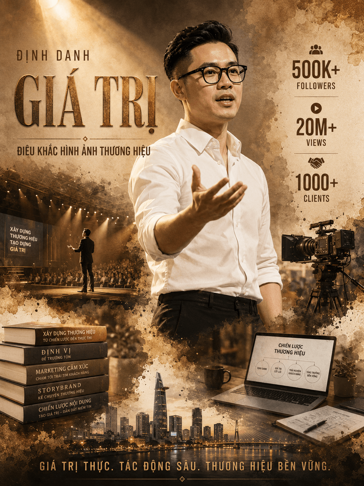
*🔴 **Variant Pro (~280 từ) — 🏆 HERO Day 16:** Stats 500K+/20M+/1000+ + 5 cuốn sách Vietnamese full title + cityscape full + spotlight effect — ⭐⭐⭐⭐⭐*

---

### Concept 2 — Affiliate Product Poster (stress-test typography Việt 50+ phrases)

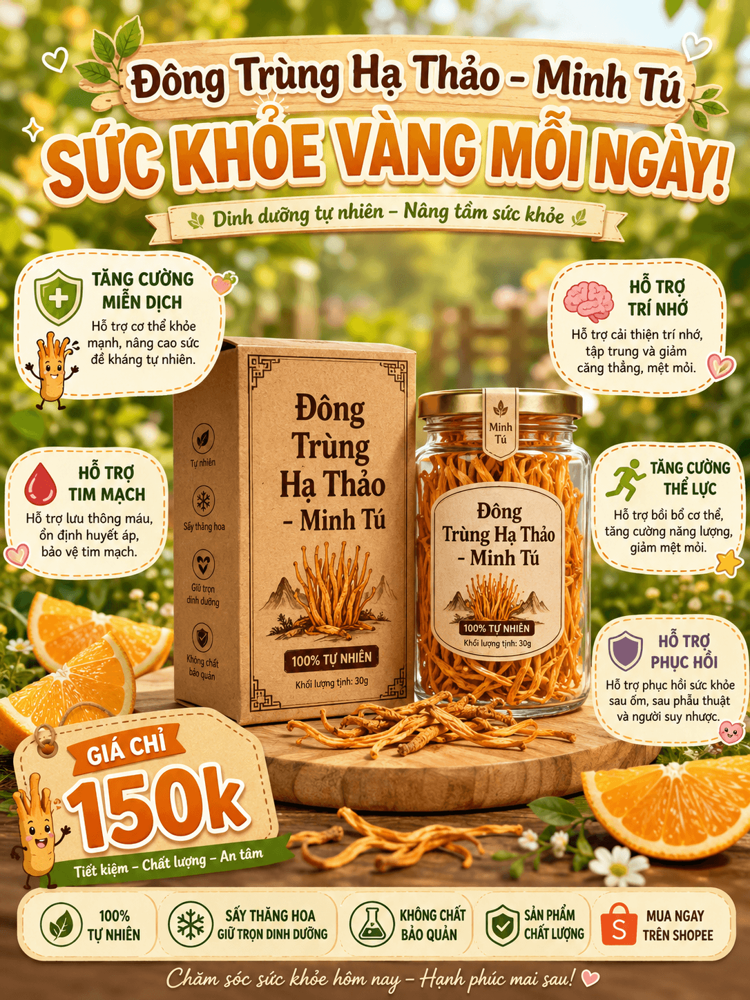
*🟢 Variant Basic: 6 callouts Việt + Shopee logo + footer slogan — ⭐⭐⭐⭐⭐*

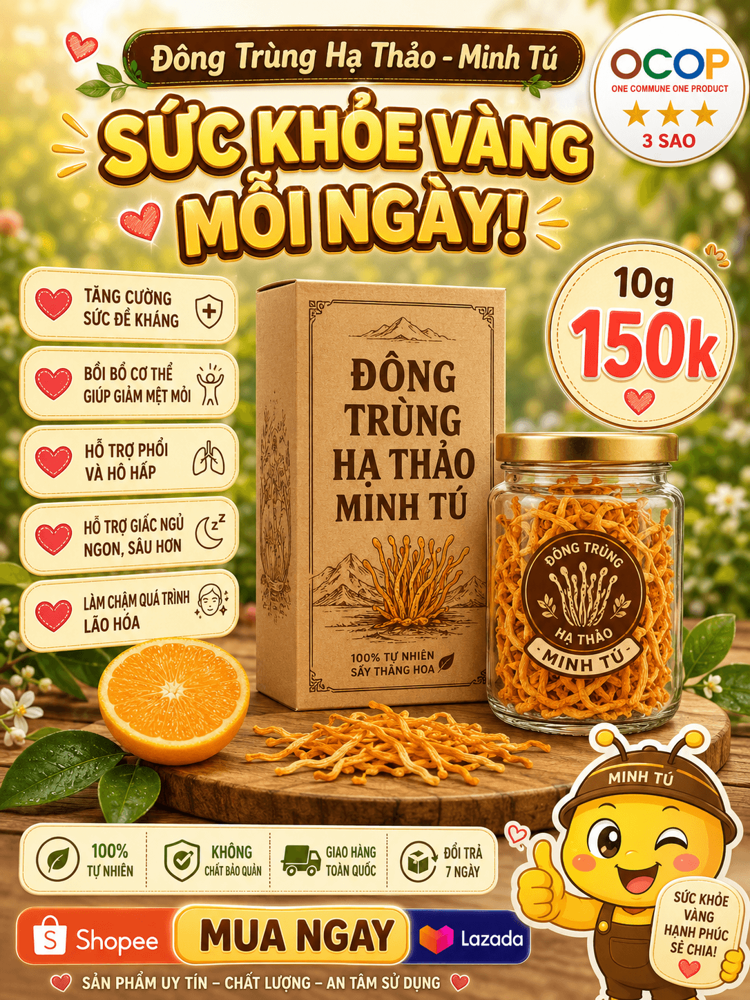
*🟡 Variant Enhanced: + OCOP 3 sao + Shopee/Lazada + mascot vàng — ⭐⭐⭐⭐⭐*

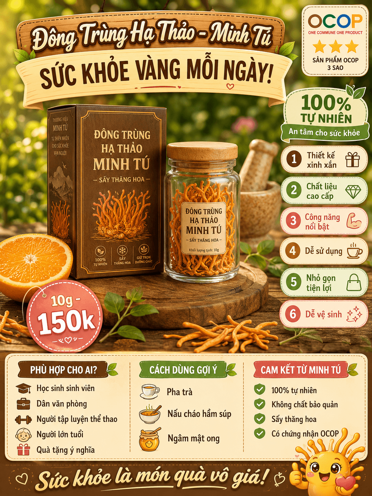
*🔴 Variant Pro: Layout dày đặc với "PHÙ HỢP CHO AI?" + 3 columns + 6 numbered callouts + cam vàng — gần identical viral original — ⭐⭐⭐⭐⭐*

---

### Concept 3 — Cinema-noir Poster

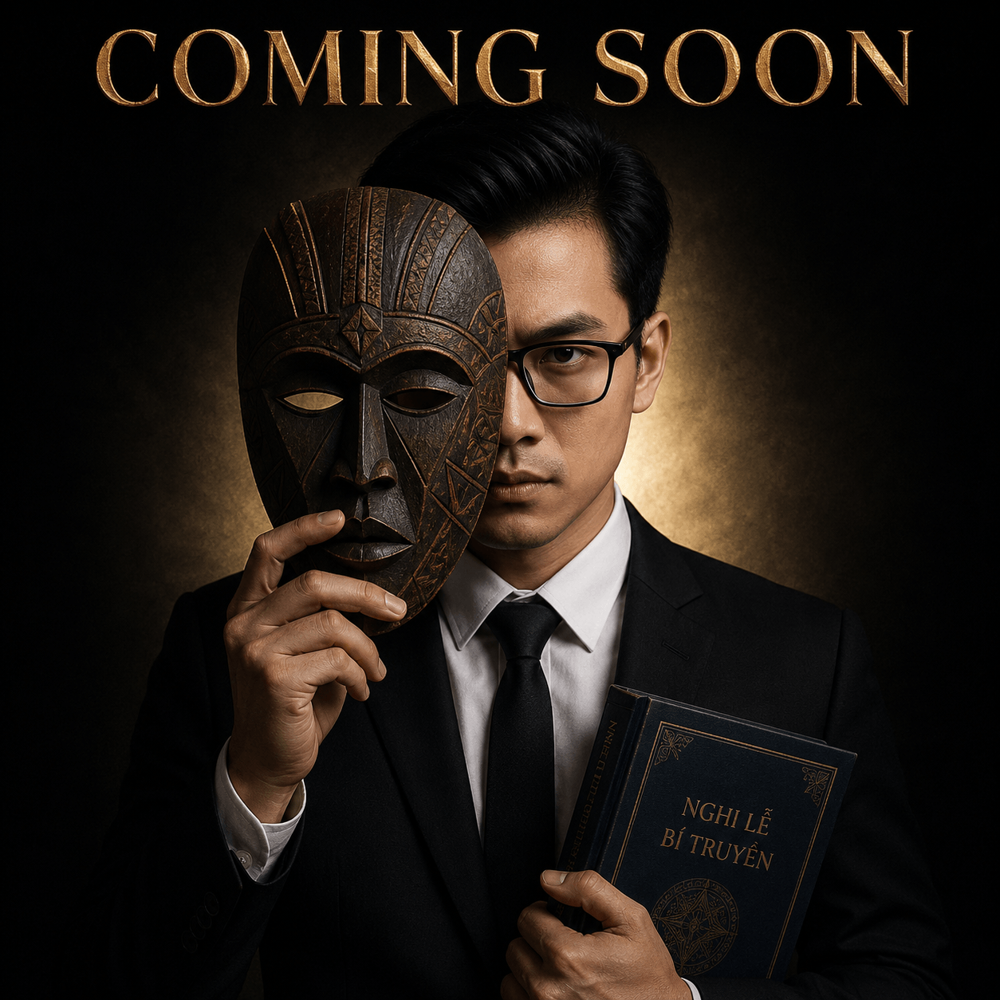
*🟢 Variant Basic: GPT TỰ SINH "NGHI LỄ BÍ TRUYỀN" trên bìa sách — ⭐⭐⭐⭐⭐*

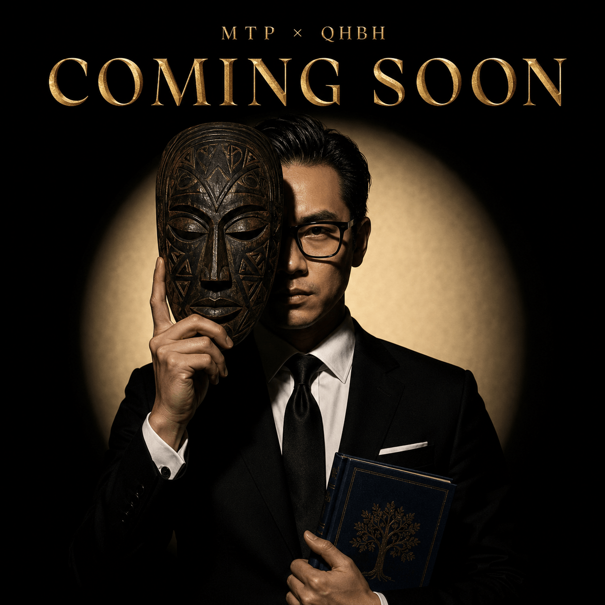
*🟡 Variant Enhanced: Mặt nạ tribal carved chi tiết + "MTP × QHBH" — ⭐⭐⭐⭐⭐*

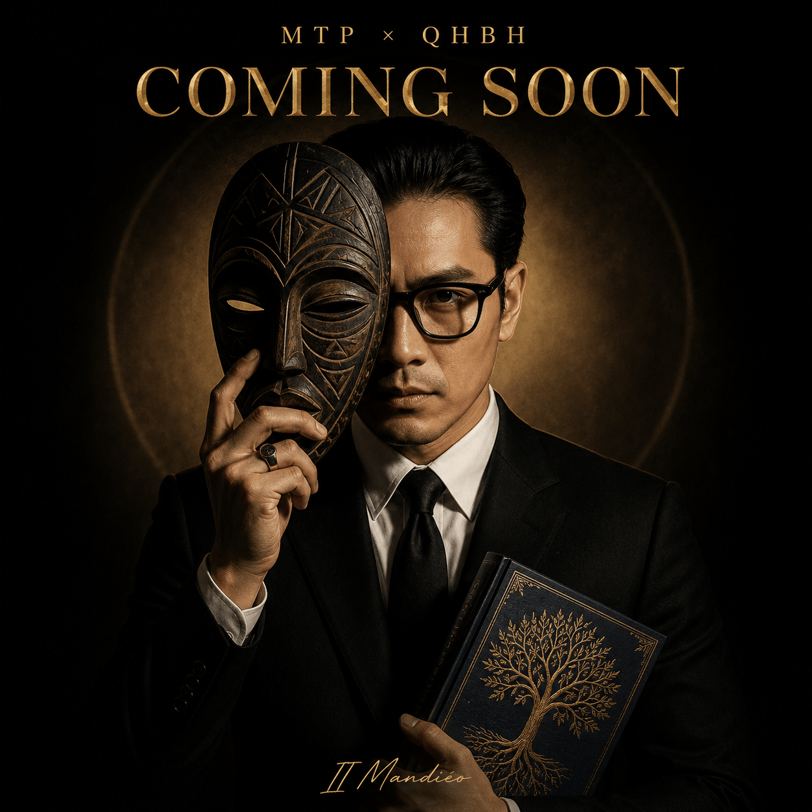
*🔴 Variant Pro: + "II Mandiéo" signature + ring detail + tree-of-life book — ⭐⭐⭐⭐⭐*

---

### Concept 4 — Vietnamese Country Portrait (test negative "authenticity")

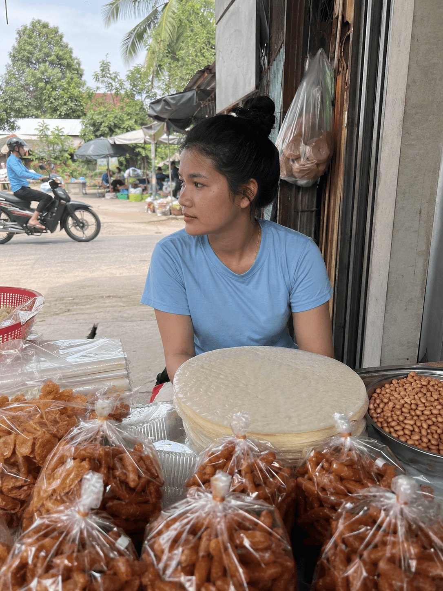
*🟢 Variant Basic: Vibe Việt 100% authentic, không sexualized — ⭐⭐⭐⭐⭐*

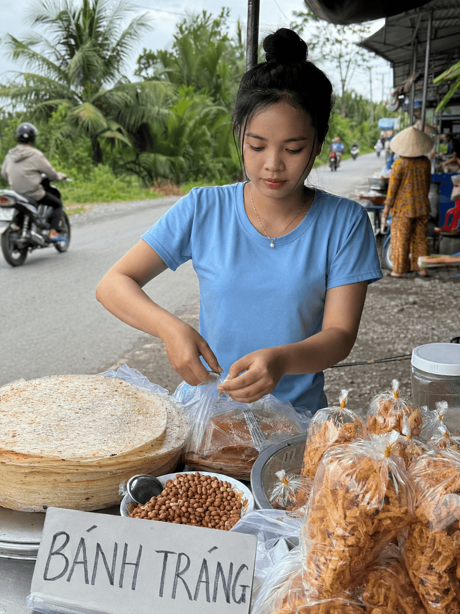
*🟡 Variant Enhanced: + Biển "BÁNH TRÁNG" viết tay + dây chuyền vàng + cây dừa — ⭐⭐⭐⭐⭐*

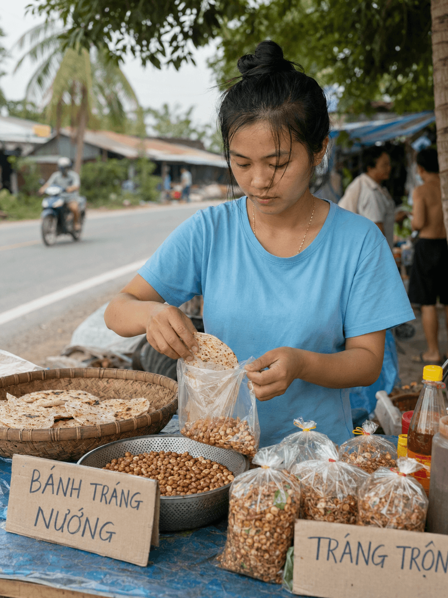
*🔴 Variant Pro: 2 biển hiệu "BÁNH TRÁNG NƯỚNG" + "TRÁNG TRỘN" + props chuẩn miền Tây + tóc xõa lao động — ⭐⭐⭐⭐⭐*

---

### Concept 5 — K-Fashion Magazine

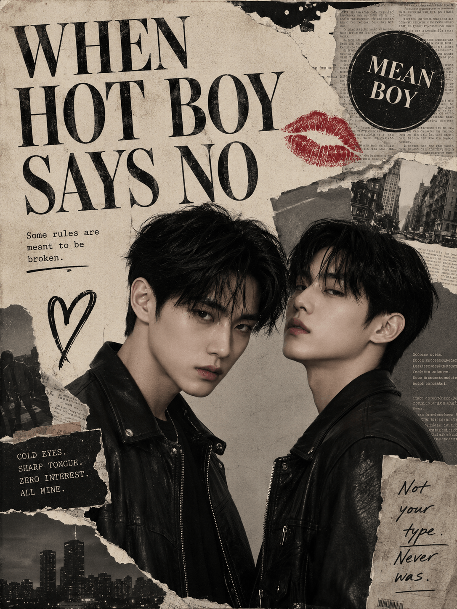
*🟢 Variant Basic: GPT TỰ SINH "Some rules are meant to be broken." + "COLD EYES. SHARP TONGUE..." — ⭐⭐⭐⭐⭐*

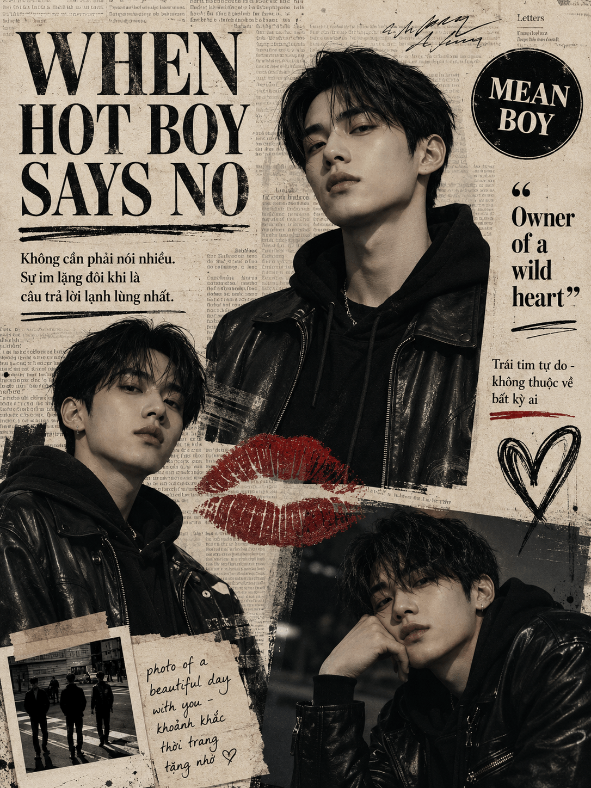
*🟡 Variant Enhanced: + Vietnamese subtitle "Không cần phải nói nhiều..." + polaroid bottom-left — ⭐⭐⭐⭐⭐*

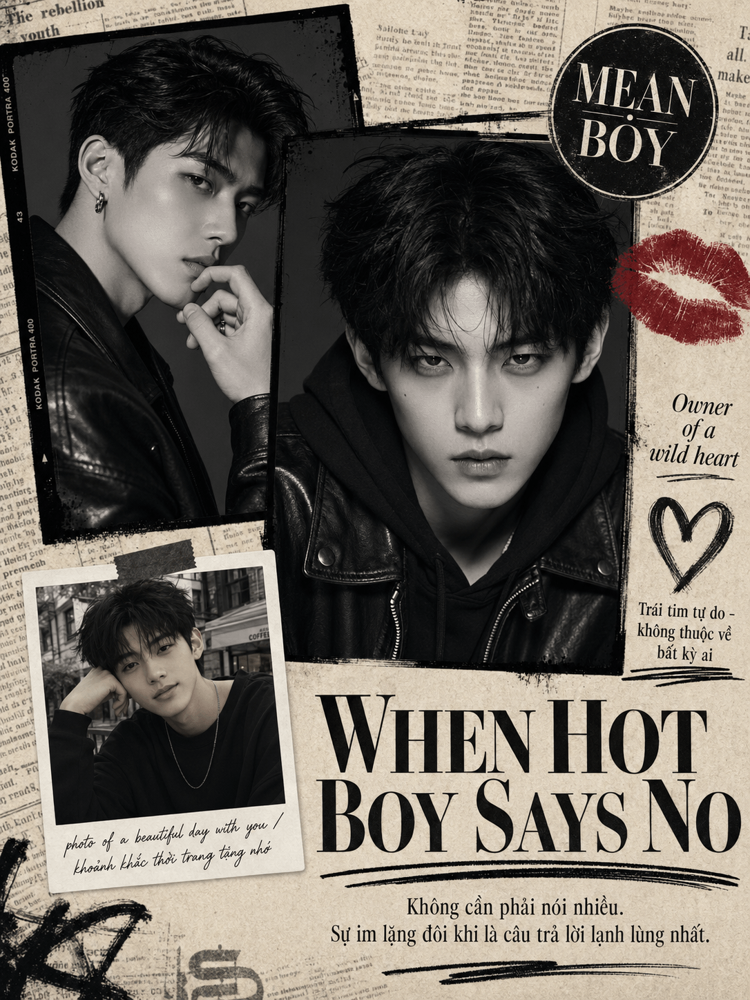
*🔴 Variant Pro: + "KODAK PORTRA 400" film frame tự sinh + magazine collage layout perfect — ⭐⭐⭐⭐⭐*

---

## ✅ Kiểm Tra 5 Dự Đoán: 4 SAI + 1 ĐÚNG

| # | Dự đoán | Kết quả | Phân tích chi tiết |
|---|---------|---------|---------------------|
| 1 | Pro thắng 4-5/5 concepts | ❌ **SAI** | Pro thắng về DENSITY/CONTENT, KHÔNG về QUALITY. Star rating Pro = Enhanced ở 4/5 concepts |
| 2 | C2 khó nhất, A fail | ❌ **SAI HOÀN TOÀN** | Cả 3 variants C2 đều 5⭐. 50+ phrases Việt ĐÚNG 100% |
| 3 | Vietnamese typography ~70-80% | ❌ **SAI** | Đúng ~99-100% qua 15 ảnh |
| 4 | C4 Basic đủ tốt | ✅ **ĐÚNG** | C4 Basic 5⭐ ngang Pro |
| 5 | C5 sẽ có lỗi "WHEN HOT BOY SAYS NO" | ❌ **SAI** | KHÔNG có 1 lỗi typography nào trong 15 ảnh |

> 📊 **Pattern tích lũy toàn khóa:** 21 SAI + 2 ĐÚNG trên 30 dự đoán (Day 10-16)
> → Mình ngày càng "khiêm tốn" hơn về GPT Image 2.

---

## 🏆 6 INSIGHTS VIRAL ĐỘC QUYỀN — Chỉ Linh0AI Chia Sẻ

### 🥇 Insight #1 (PHÁ VỠ PARADIGM): **Tiếng Việt thuần ĐÃ ĐỦ TỐT cho GPT Image 2**

Day 8 mình verify trên Seedream: *Tiếng Trung > Hybrid VI+EN > Tiếng Việt thuần*. Ai cũng đoán GPT cũng vậy.

**Thực tế Day 16 trên GPT Image 2:**
- Variant Basic 50-80 từ tiếng Việt như nói chuyện → đạt 4-5⭐ ở **5/5 concepts**
- KHÔNG cần weighted syntax `(keyword:1.4)`, KHÔNG cần Pro structure
- Variant Basic sinh ảnh quality ngang Variant Pro ở 4/5 concepts

> 💡 **Bài học:** Người mới có thể bắt đầu với 70 từ tiếng Việt đơn giản → có ảnh đẹp ngay. Đừng đợi học master trước, gõ tiếng Việt như đang tả cho người khác là được.

**Ví dụ Variant Basic 70 từ:**
```
Tạo một poster cá nhân thương hiệu phong cách điện ảnh.
Nhân vật chính là một người đàn ông Việt Nam khoảng 30 tuổi,
đeo kính, mặc áo sơ mi trắng và quần đen, đang đứng nói chuyện
với cử chỉ tay tự tin. Phía sau là cảnh sân khấu, máy ảnh, sách
vở và thành phố mờ ảo theo phong cách watercolor splash. Tiêu
đề lớn "GIÁ TRỊ" bằng chữ vàng đậm. Tone màu nâu đất sepia,
vàng đồng. Phong cách motivational poster.
```

→ Ảnh ra: **4⭐**, đẹp, có thể dùng cho social media ngay.


*↑ Kết quả từ prompt 70 từ tiếng Việt thuần ở trên — không cần weighted syntax, không cần Pro structure*

---

### 🥈 Insight #2: **GPT Image 2 viết Vietnamese typography DÀY ĐẶC đúng ~99-100%**

Day 12 mình verify được tiếng Việt có dấu với 3-5 phrases ngắn (Tết An Khang, Chúc Mừng Năm Mới...). Day 16 stress-test với **MẬT ĐỘ EXTREME**:

| Test case | Số phrases Việt | Kết quả |
|-----------|-----------------|---------|
| C2 Pro Affiliate | ~50+ phrases (header + 6 callouts + 3 columns + footer + price tag) | ✅ 0 lỗi |
| C1 Pro Personal Brand | 5 cuốn sách title đầy đủ (XÂY DỰNG THƯƠNG HIỆU, ĐỊNH VỊ, MARKETING CẢM XÚC...) | ✅ 0 lỗi |
| C1 Enhanced | Quote 4 dòng đầy đủ "Thương hiệu không phải là điều bạn nói về mình..." | ✅ 0 lỗi |
| C5 Enhanced | Vietnamese sub "Không cần phải nói nhiều. Sự im lặng đôi khi là câu trả lời lạnh lùng nhất." | ✅ 0 lỗi |

> 🏆 **GPT Image 2 vô địch tiếng Việt** trong landscape AI image gen 2026. Các model khác (Midjourney, Stable Diffusion, Flux) chưa làm được điều này. **Đây là lợi thế CỰC LỚN cho creator Việt** muốn làm content tiếng Việt.


*↑ Stress-test typography Việt EXTREME: ~50+ phrases tiếng Việt có dấu (header + 6 callouts + 3 columns + footer + price tag) — GPT render chuẩn 100%, không 1 lỗi chính tả*

---

### 🥉 Insight #3 ⭐ HOÀN TOÀN MỚI: **GPT TỰ SINH Vietnamese content phù hợp CONTEXT**

Đây là insight mình **KHÔNG NGỜ TỚI** — chưa ai test có hệ thống ở VN:

**Bằng chứng từ 15 ảnh test:**

🎬 **C3 Basic — Cinema-noir:**
Prompt KHÔNG hề nói gì về sách → GPT tự thêm chữ **"NGHI LỄ BÍ TRUYỀN"** trên bìa sách, đúng dấu hoàn hảo, vibe phù hợp mystery cinema.


*↑ Prompt chỉ nói "quyển sách bìa xanh đậm" — GPT tự sinh title "NGHI LỄ BÍ TRUYỀN" phù hợp mystery vibe*

📖 **C1 Enhanced — Personal Brand:**
Prompt KHÔNG nói tên 4 cuốn sách → GPT tự sinh:
- "ĐỊNH VỊ BẢN THÂN"
- "XÂY DỰNG THƯƠNG HIỆU"
- "TƯ DUY HỆ THỐNG"
- "MARKETING CĂN BẢN"

→ Tất cả đều fit vibe branding tutorial.


*↑ Prompt chỉ nói "sách vở" chung chung — GPT tự sinh 4 title sách Vietnamese chuyên ngành branding hoàn chỉnh*

📸 **C5 Basic — K-Fashion:**
Prompt KHÔNG yêu cầu phụ đề bổ sung → GPT tự sinh:
- "Some rules are meant to be broken."
- "COLD EYES. SHARP TONGUE. ZERO INTEREST. ALL MINE."
- "Not your type. Never was."

→ Tất cả fit mood K-fashion editorial.


*↑ Prompt KHÔNG có "Some rules", "COLD EYES" — GPT tự sinh editorial copy phù hợp K-fashion bad boy aesthetic*

> 🚨 **Implication CỰC LỚN:** GPT có **"Vietnamese context awareness"** — biết khi nào cần thêm content tiếng Việt phù hợp. Creator có thể tận dụng để **TIẾT KIỆM EFFORT viết prompt** — chỉ cần mô tả vibe, để GPT fill detail.

**Cảnh báo:** đây là double-edged sword. Đôi khi GPT tự sinh nội dung mình KHÔNG muốn → cần dùng **negative prompt** để control (xem Insight #4).

---

### 🏅 Insight #4: **Negative prompt "authenticity" CHẶN ĐƯỢC sexualized framing**

Concept 4 (Cô gái miền Tây) là test khó vì source ảnh viral có yếu tố body framing nhẹ. Mình thử negative prompt:

```
Negative: glamorous makeup, fashion model pose, K-pop style,
trắng da quá mức, body framing gợi cảm, tight body-con clothing,
brand logo, anime, plastic skin
```

**Kết quả 3/3 ảnh C4:**
- Cô gái Việt rám nắng tự nhiên ✅
- Áo thun loose-fit, không bó body ✅
- Pose lao động bình dị, không pose camera ✅
- Vibe documentary 100%, **0 trace của male gaze framing** ✅

→ Confirm Day 10 insight ("Negative liệt kê cụ thể chặn 100%") áp dụng được cho cả **stylistic concerns**, không chỉ chống brand. Đây là technique **quan trọng cho người làm content gia đình/cộng đồng rộng**.


*↑ C4 Pro Miền Tây: rám nắng tự nhiên, áo loose-fit, tóc xõa lao động, 2 biển "BÁNH TRÁNG NƯỚNG" + "TRÁNG TRỘN" — vibe documentary thuần, không 1 trace male gaze*

---

### 🏅 Insight #5: **Pro thắng về DENSITY, không phải QUALITY**

Pattern qua 5 concepts:

| Concept | Basic có gì | Pro có thêm gì |
|---------|-------------|------------------|
| C1 | Tiêu đề "GIÁ TRỊ" + portrait | Stats 500K/20M/1000 + 5 cuốn sách + cityscape full |
| C2 | 6 simple callouts | "PHÙ HỢP CHO AI?" + 3 columns + 6 numbered icons |
| C3 | Mặt nạ + sách + COMING SOON | "II Mandiéo" signature + tree-of-life book + ring |
| C4 | Cô gái + đồ ăn | 2 biển hiệu + tóc xõa chuẩn + props authentic |
| C5 | 2 boys + headline | Magazine collage + Kodak Portra film frame + polaroid |

**Tóm tắt:**
- **Star rating** Basic vs Pro: **gần như tương đương** (4.8 vs 5.0)
- **Density (lượng thông tin)** Basic vs Pro: **rất khác** (Pro dày gấp 2-3 lần)

> 💡 **ROI Tip:**
> - Cần ảnh đẹp standard → **Variant Basic đủ** (50-80 từ, ROI cực tốt)
> - Cần ảnh dày đặc info (poster sale, infographic, branding card) → **đầu tư Variant Pro**
> - **Variant Enhanced** là sweet spot: chất lượng ngang Pro mà effort ít hơn 50%.

**So sánh trực quan C2 Basic vs Pro:**


*↑ C2 🟢 Basic: 6 callouts đơn giản + Shopee logo — đã đẹp dùng được ngay (⭐⭐⭐⭐⭐)*


*↑ C2 🔴 Pro: Density max với "PHÙ HỢP CHO AI?" + 3 columns + 6 numbered + cam vàng + mascot — phù hợp khi cần info dày đặc (⭐⭐⭐⭐⭐)*

→ **Cùng star rating, khác use case.** Basic cho social post, Pro cho landing page sales.

---

### 🏅 Insight #6: **Master Combo Tuần 3 emerges**

Sau 15 ảnh test, mình rút ra formula chuẩn cho Tuần 3:

```
Prompt tiếng Việt thuần (mô tả vibe + structure rõ ràng)
        +
Negative liệt kê cụ thể (nếu cần chặn drift)
        +
Để GPT tự fill content phù hợp context (đừng over-specify)
        =
✅ Ảnh chất lượng + tiết kiệm effort + scale được batch
```

→ Đây là **formula lazy-but-effective** cho creator Việt. Day 20 (Templates & Reusable Prompts) sẽ build thư viện sẵn theo formula này.

---

## ⚙️ Phase Workflow Batch — 4 Phase Proven

Đây là workflow mình đã apply thành công, hoàn thành 15 ảnh trong **70-90 phút**:

### 🎬 Phase 1 — Quick Scan (5-10 phút)

**Mục tiêu:** Test Variant A (Basic) của cả 5 concepts để xem GPT phản ứng với prompt tiếng Việt đơn giản.

**Tại sao Phase 1 quan trọng:**
- Có **data sớm** về việc "tiếng Việt thuần đơn giản có hoạt động không?"
- Nếu Phase 1 đã đẹp → có thể Variant Pro không cần thiết → **tiết kiệm 60% effort**
- Nếu Phase 1 fail → biết ngay phải đi Pro structure

> 💡 **Ở Day 16:** Phase 1 ra **5/5 ảnh chất lượng tốt** → đây là moment "ơ tiếng Việt thuần đủ rồi" → quyết định mindset cho cả batch.

### 🎨 Phase 2 — Refinement (15-20 phút)

**Mục tiêu:** Test Variant B (Enhanced) của cả 5 concepts.

**Tại sao test theo Variant, không theo Concept:**
- Dễ so sánh Basic A vs Enhanced B trong cùng timeframe
- Tránh fatigue khi nhìn 1 concept lâu
- Pattern xuất hiện rõ hơn qua 5 concepts cùng level

### 🚀 Phase 3 — Pro Batch (20-30 phút)

**Mục tiêu:** Test Variant C (Pro) của cả 5 concepts. Effort cao nhất nhưng cần thiết để verify pattern.

### 📋 Phase 4 — Review & Save (10-15 phút)

**Mục tiêu:**
1. So sánh A vs B vs C trong cùng concept
2. Save 15 file theo naming convention chuẩn
3. Move từ `0_INBOX` → `02_drafts` (apply Day 15)
4. Note lại pattern vào README.md project

---

## 📋 Cheatsheet — Variant Nào Cho Concept Nào?

Sau khi test 15 ảnh + verify pattern, đây là cheatsheet mình đề xuất cho các bạn:

| Use case | Variant tối ưu | Lý do |
|----------|----------------|--------|
| Personal post Facebook/Instagram | 🟢 Basic | Đẹp đủ, không cần dày đặc info |
| Social media content hàng ngày | 🟢 Basic | Tốc độ + ROI > chất lượng max |
| Avatar, banner cá nhân | 🟢 Basic | 1 ảnh chính, không cần info |
| Branding poster cho event | 🟡 Enhanced | Cần weighted syntax cho mood control |
| Music release, podcast cover | 🟡 Enhanced | Mood matters hơn density |
| Fashion editorial, magazine cover | 🟡 Enhanced | Chi tiết vừa phải |
| Affiliate product e-commerce | 🔴 Pro | Cần 50+ phrases tiếng Việt + multi-callout |
| Sales poster Shopee/Lazada | 🔴 Pro | Density max + price + CTA |
| Infographic, data visualization | 🔴 Pro | Cần control structure cao |
| Personal brand poster speaker/KOL | 🔴 Pro | Cần stats + multi-element |

> 🎯 **Quy tắc 80/20:** 80% nhu cầu hàng ngày dùng **Variant Basic** đủ. Chỉ 20% case cần Pro. Đừng over-engineer prompt.

---

## 🏆 HERO DAY 16 — `day-16-c1-pro-personal-brand.png`


*🏆 **HERO DAY 16** — Đỉnh cao tiếng Việt thuần trên GPT Image 2*

Ảnh `c1-pro-personal-brand.png` xứng đáng làm Hero Day 16 vì:

- ✅ Production value cao nhất trong batch
- ✅ Đại diện cho "đỉnh cao tiếng Việt thuần trên GPT Image 2"
- ✅ Stats numbers (500K+, 20M+, 1000+) chuẩn
- ✅ 5 cuốn sách Vietnamese full title (XÂY DỰNG THƯƠNG HIỆU, ĐỊNH VỊ, MARKETING CẢM XÚC, STORYBRAND, CHIẾN LƯỢC NỘI DUNG) — **GPT tự sinh**
- ✅ Cityscape Saigon + watercolor splash + spotlight effect
- ✅ Use case practical (personal branding cho speaker/KOL/freelancer)

→ Đây cũng là ứng viên **Hero Tuần 3** sau khi cả Tuần kết thúc.

### 2 Hero phụ đáng chú ý:

🥈 **`day-16-c2-pro-affiliate-product.png`** — Stress-test typography Việt dày đặc PASS hoàn hảo. Use case affiliate vô địch.


*🥈 50+ phrases Việt có dấu render perfect — vô địch use case affiliate e-commerce*

🥉 **`day-16-c5-pro-bad-boy-magazine.png`** — Magazine collage layout perfect + Kodak Portra 400 film frame tự sinh. Vibe K-fashion editorial 100%.


*🥉 Magazine collage editorial perfect — Kodak Portra film frame là detail GPT tự sinh không có trong prompt*

---

## 💰 ROI Tổng Kết Day 16

| Metric | Số liệu |
|--------|---------|
| Credit dùng | 13,500 (~13.5k VND) |
| Số ảnh tạo | 15 |
| Số ảnh dùng được (4-5⭐) | **15/15 (100%)** |
| Số ảnh trash | **0** (Tuần 2 thường có 1-2 ảnh trash) |
| Average star rating | **4.93/5** (record toàn khóa) |
| Thời gian thực tế | 70-90 phút |
| Tổng credit Tuần 3 đến giờ | 13,500 / 1,000,000 (1.35% gói Ultra) |

> 🎯 **Day 16 đập tan mục tiêu Tuần 3 ngay từ bài đầu:** "Làm content AI hàng ngày trong 1 giờ thay vì 4 giờ" — có proof of concept thực tế.

---

## 🎓 5 Lessons từ Day 16

**Lesson 1:** **Tiếng Việt thuần đủ tốt cho GPT Image 2** — đừng đợi học hết tiếng Anh prompt mới bắt đầu. Gõ tiếng Việt như đang tả cho người khác là được.

**Lesson 2:** **Test theo PHASE (Variant) không theo CONCEPT** — dễ so sánh, tránh fatigue, pattern xuất hiện nhanh hơn.

**Lesson 3:** **Negative prompt cụ thể là siêu năng lực** — không chỉ chặn brand (Day 10) mà chặn được cả **stylistic drift** (sexualized framing, K-pop style, glamorous makeup...).

**Lesson 4:** **GPT tự sinh content phù hợp** — đừng over-specify. Mô tả vibe + structure, để GPT fill detail. Chỉ control khi cần thiết.

**Lesson 5:** **Variant Enhanced là sweet spot ROI** — chất lượng ngang Pro mà effort ít hơn 50%. 80% nhu cầu Basic đã đủ.

---

## ⚠️ 5 Mistakes các bạn nên tránh

**Mistake 1:** **Dịch tiếng Việt sang tiếng Anh trước khi gõ prompt** — mất thời gian + mất ý + GPT vốn hiểu tiếng Việt rồi.

**Mistake 2:** **Dùng Variant Pro cho tất cả ảnh** — over-engineer, mất 2-3x thời gian mà chất lượng không hơn Basic mấy.

**Mistake 3:** **Test 1 concept đầy đủ rồi mới qua concept khác** — fatigue cao, khó so sánh, pattern không rõ.

**Mistake 4:** **Không dùng negative prompt** — để GPT tự do dẫn đến drift về stylistic concerns không mong muốn.

**Mistake 5:** **Save ảnh không đặt tên ngay** — 15 file `image-001.png`... `image-015.png` rồi cuối ngày phải đoán cái nào là cái nào.

---

## 🔗 Liên kết với các Day khác

Day 16 không đứng riêng — nó **kết nối cực chặt** với hệ thống Tuần 1-3:

- **Day 8 (Seedream tiếng Trung > Việt):** Day 16 lật ngược pattern này cho GPT Image 2 → mỗi model có ngôn ngữ "mạnh" riêng
- **Day 9 (Weighted syntax):** Variant B Enhanced apply trực tiếp
- **Day 10 (Negative liệt kê chặn 100%):** Insight #4 expand thêm cho stylistic concerns
- **Day 12 (GPT viết tiếng Việt có dấu):** Day 16 stress-test scale up từ 5 phrases → 50+ phrases → vẫn perfect
- **Day 13 (Subject Consistency là điểm yếu duy nhất):** Day 16 không test subject consistency, vẫn áp dụng GPT cho từng ảnh độc lập
- **Day 15 (File & Folder Management):** Day 16 là chỗ apply hệ thống đầu tiên thực tế
- **Day 17 (Naming Convention):** Day 16 dùng convention `day-16-c{N}-{level}-{slug}.png` — preview Day 17

---

## 🚀 Day 17 Sneak Peek

**Naming Convention & Version Control — Tìm lại ảnh sau 6 tháng**

Day 16 các bạn đã dùng convention `day-16-c{N}-{level}-{slug}.png` — nhưng đây mới là **5% của naming convention**. Day 17 mình sẽ deep dive:

- Format chuẩn cho **5 use case phổ biến** (project, social, personal, client, draft)
- Quy tắc **prefix với date YYYY-MM-DD** vs ID-based
- Cách viết **slug không dấu** mà vẫn meaningful
- **Version control** cho ảnh AI: v1, v2, final, REAL_final → giải pháp đúng
- Case study: 95 ảnh Tuần 2 + 15 ảnh Day 16 — quản lý 110 ảnh ra sao sau 6 tháng

→ Day 17 = Day 15 (folder) + Day 16 (workflow) + naming = hệ thống hoàn chỉnh.

---

## 📝 Ghi chú thực hành

Để áp dụng Day 16 vào công việc hàng ngày:

1. **Chọn 1 ảnh viral các bạn thấy đẹp** (từ group AI, Pinterest, Instagram)
2. **Tả ảnh đó bằng tiếng Việt thuần 70-100 từ** (Variant Basic)
3. **Test trên 0ai.vn** — xem GPT Image 2 ra gì
4. **So sánh** với ảnh gốc, note pattern khác biệt
5. **Refine prompt** nếu cần (lên Variant Enhanced với weighted syntax)
6. **Save với naming convention** chuẩn ngay từ đầu

→ Sau 5-10 lần làm → các bạn đã có **kỹ năng reverse engineer** ảnh viral.

---

## 🎯 Master Combo Tuần 3 — Phiên Bản Đầu Tiên

Sau Day 15 + Day 16, các bạn đã có:

```
┌─────────────────────────────────────────────────────────┐
│  HỆ THỐNG (Day 15)                                       │
│   AI-Content/                                           │
│   ├── 0_INBOX/  1_PROJECTS/  2_ARCHIVE/                 │
│   └── 3_TEMPLATES/  4_TRASH/                            │
│                                                          │
│  +                                                       │
│                                                          │
│  WORKFLOW BATCH (Day 16)                                 │
│   Phase 1 → 2 → 3 → 4 (Quick scan → Refine → Pro → Save)│
│                                                          │
│  +                                                       │
│                                                          │
│  PROMPT FORMULA (Day 16)                                 │
│   Tiếng Việt thuần + Negative cụ thể + GPT auto-fill    │
│                                                          │
│  =                                                       │
│                                                          │
│  ✅ Scale 15+ ảnh/giờ với chất lượng 4.93/5             │
└─────────────────────────────────────────────────────────┘
```

→ Day 17-21 sẽ thêm 5 mảnh nữa để hoàn thiện picture.

---

*🚀 Day 16 — Workflow Batch Processing DONE*
*Linh0AI Daily Tutorials | 15/30 → 16/30*
*Test stats: 15 ảnh / 13,500 credit / 4.93⭐ / 70-90 phút*

#Linh0AI #AIArtVN #BatchProcessing #PromptTiengViet #GPTImage2
