# Day 27 — Cinema-Style 70s Narrative: "Cậu và Bơ — 30 năm Sài Gòn"

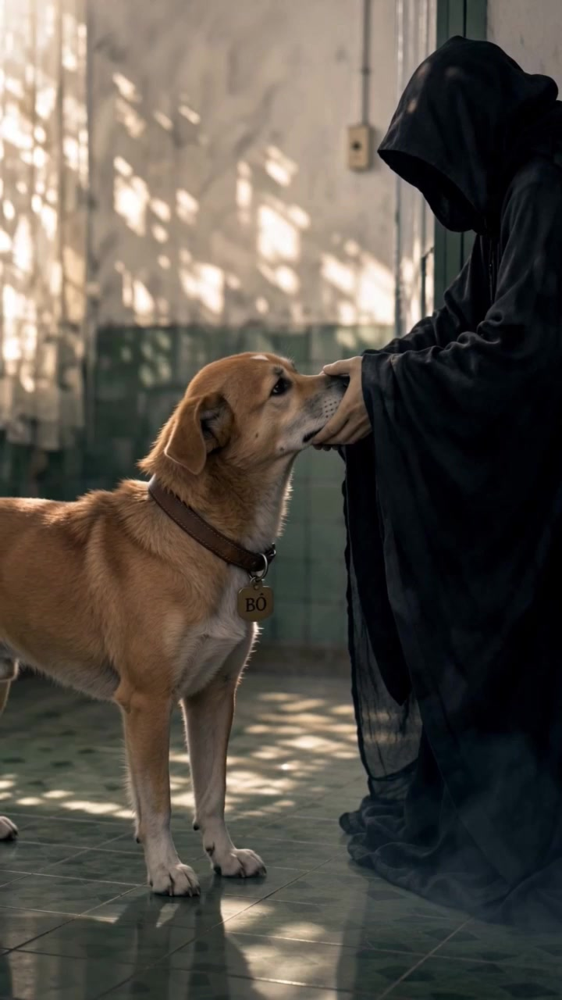

> **Level:** 🟣 Advanced
> **Thời lượng đọc:** 25-30 phút
> **Thời gian thực hành:** 4-6 tiếng (foundation + storyboards + videos + edit)
> **Cost actual mình chi:** ~165K VND cho 70s phim ngắn cinema hoàn chỉnh

---

## 🎯 Mục tiêu bài học

Sau Day 26 mình đã master cinema trailer 30s commercial cho sản phẩm pháp phục lam. Hôm nay mình push xa hơn: **phim ngắn cinema 70s narrative** với 4 ages nhân vật chính + 3 stages con chó + 2 era jumps (1995 → 2025).

Sau Day 27 các bạn sẽ làm được:

- 🎬 Pipeline phim ngắn cinema 70s pure Seedance (không cần Kling Motion)
- 📋 Shot list 20+ shots Hollywood-style với time / type / camera / action / sound
- 👥 Multi-age character consistency qua 30 năm thời gian
- 🐶 Multi-stage dog consistency với prop anchor xuyên suốt
- 🎭 2 cry-trigger moments thiết kế chiến lược (Memorable Moment + Final ECU)
- ⚠️ Né các filter trigger của 0ai.vn (#c455 "real person", text bleed, content policy)
- ✂️ Hybrid edit CapCut với silence drop + color grading 2-era

---

## 📖 Brief project

**Logline:** *Một thanh niên Sài Gòn nhặt con chó cỏ ướt nhẹp dưới mái hiên mưa rào năm 1995. 30 năm sau, con chó hy sinh thay chủ trong căn phòng bệnh viện. Câu chuyện về tình bạn không lời và một chiếc vòng cổ rỗng.*

**Theme:** Companionship · Sacrifice · Time · Nostalgia · Vietnamese urban memory

**Audience target:** Gen X-Y Sài Gòn (35-55 tuổi) + pet lovers VN + creator economy AI

**Specs:**
- Duration: **70 giây**
- Ratio: 9:16 (TikTok / Reels / YouTube Shorts)
- Format: 5 segments × ~14s ghép CapCut
- Style: Cinematic painterly + photorealistic mix
- Era: Nostalgic 1990s-2000s Sài Gòn + 2025 hospital

---

## 📄 Prompt file

Tất cả 13 prompts (3 foundation + 5 storyboards + 5 videos CN) có trong file [day-27-prompts.txt](../prompts/day-27-prompts.txt).

---

## 💎 8 Insights mới Day 27 đã verify

### Insight 1 — **0ai.vn Seedance Omni 2.0 cap duration = 15s** ⭐ verified

Trước Day 27 mình tưởng Seedance trên 0ai.vn cho duration linh hoạt. Day 27 verify: bất kể prompt request bao nhiêu giây, output **luôn cap ở 15s**.

**Bằng chứng cụ thể từ test thực tế:**
- V4 request 16s → ra **15.09s**
- V5 request 12s → ra **15.09s** (Seedance fill cho đủ 15s)
- Path A request 70s → **không thể thực hiện** vì cap

**Implication cho audience:** Plan duration ÷ 15s = số segments cần generate. Cinema 70s = **5 segments × 14s** (cắt bớt 1s/segment trong CapCut). Cinema 60s = 4 segments × 15s.

**Cost ước:** Mỗi segment Seedance Omni 2.0 (9:16, multi-ref) = 15-20K VND. Cinema 70s = 5 × 17K = **~85K VND** cho video raw.

### Insight 2 — **Filter #c455 "real person" trigger pattern** ⭐ verified

Khi mình test V3 (time passes 30 → 55) với prompt CN có "30岁/45岁/55岁" + facial breakdown chi tiết + F1 multi-age sheet → **0ai.vn block với mã filter `#c455 Nội dung vi phạm chính sách người thật hoặc bản quyền`**.

**Trigger pattern:**
- F1 reference sheet với 4+ chân dung face portraits ✗
- + Detailed numerical ages "30岁/45岁/55岁" ✗
- + Ethnicity-specific descriptors "越南男子" repeat ✗
- = Filter nhận diện "real person identifier collage"

**Mitigation đã verify work:**
- Đổi số tuổi → ngôn từ mô tả: "中年" (middle-aged) / "年长" (elderly)
- Đổi "越南男子" → "男主人" / "同一位男主人" (relational không ethnic)
- Bỏ facial breakdown, trust reference image
- → Pass filter, V3 generate thành công

**Bài học:** Filter 0ai.vn match pattern character sheet + age + ethnic descriptors → cinema multi-age cần "soften" prompt khi describe characters.

### Insight 3 — **Storyboard reference text bleed vào video output** ⭐ verified

Storyboard mình tạo có Vietnamese action labels dưới mỗi panel ("Lau khô Bơ bằng khăn caro xanh"…). Khi feed storyboard này làm ref vào Seedance, **AI OCR text từ panel labels và bleed vào video**.

**Hiện tượng cụ thể V2:**
- Tờ báo trong tay shot 9: text gibberish "RAUI KRG / DON UA FOI / PHONG NHA / DAC nan"
- Neon sign background: "CAI KRIC KING" (gibberish)
- Corner top-right xuất hiện chữ "Brå" lạc

**Mitigation đã verify work:**
- Front-load instruction: "完全不能出现任何文字" (CN) / "absolutely no readable text" (EN)
- Comprehensive avoid list: subtitle / caption / newspaper readable / sign text / logo / banner
- Specify props với "blurred unreadable": "newspaper text blurred unreadable, only suggesting reading action"
- Drop reference sheet F2 Props (vì có text headers "HONDA CUB DREAM 1995"…)

**Lưu ý:** Vẫn có thể có text bleed nhẹ, accept được nếu gibberish không gây distraction.

### Insight 4 — **Single F1 multi-age sheet work cho 5 segments khác nhau** ⭐ verified

Day 26 mình dùng character master mới cho mỗi segment. Day 27 test: 1 file F1 chứa 4 ages × 2 views (8 portraits) + 3 dog stages × 2 views (6 portraits) → dùng làm `@image_1` cho TẤT CẢ 5 segments V1-V5.

**Kết quả:**
- Character consistency xuyên 4 ages: ✅ rất tốt (face structure, nose, jaw)
- Dog consistency xuyên 3 stages: ✅ tốt (lông cam + 4 chân trắng + đốm tim trán)
- Áo color progression: ✅ visible (xanh → be → xám → trắng hospital)
- Tóc bạc progression: ✅ smooth aging gradient

**Implication tiết kiệm:** Day 26 cost ~76K cho 30s (multiple character masters). Day 27 cost ~85K cho 70s (single F1 dùng chung). **Efficient ratio: 76K / 30s = 2.5K/s vs 85K / 70s = 1.2K/s** → giảm 50% cost per second.

### Insight 5 — **Hooded Figure VN-adapted (no skull, no scythe) pass compliance** ⭐ verified

Day 27 cần render "Tử thần" — element nhạy cảm cho audience VN + có thể trigger Seedance content filter.

**Pattern adapt thành công:**
- Áo choàng đen dài + hood pulled deep
- **Mặt hoàn toàn shadow void** trong hood
- **Bàn tay xương BARELY visible**, chỉ từ ngón tay ló ra (không full skeleton)
- **KHÔNG lưỡi hái** / weapon / sickle
- Sương trắng cuộn quanh chân
- Tone: peaceful / sacred / contemplative (KHÔNG horror)

**Compliance check pass:**
- Image 2 generate F3 reference KHÔNG block
- Seedance generate V4 với F3 + storyboard S4 → pass content policy
- Audience VN không feel "horror" hoặc "religious controversy"

**Bonus discovery:** Seedance tự thêm biển "KHOA NỘI" (Internal Medicine Dept) trên cửa phòng V4 → Vietnamese hospital signage authentic. Cinematic detail bonus.

### Insight 6 — **Multi-ref selective per segment giảm drift** ⭐ verified

Day 26 đã verify multi-ref hybrid (3 refs cùng lúc). Day 27 extend: mỗi segment chọn refs RIÊNG selective theo content.

**Mapping verified work:**

| Segment | Refs gắn | Lý do |
|---|---|---|
| V1 | F1 + F2 + Storyboard S1 | Cần Honda Cub identity từ F2 |
| V2 | F1 + Storyboard S2 (DROP F2) | F2 có text headers → bleed |
| V3 | F1 + Storyboard S3 | Time-passes — không cần props |
| V4 ⭐ | F1 + F3 + Storyboard S4 | F3 Hooded Figure replace F2 |
| V5 | F1 + Storyboard S5 | Macro tag — F1 đã có inset collar |

**Bài học:** Không phải lúc nào multi-ref càng nhiều càng tốt. Refs có text → có thể bleed. Chọn refs theo content cần thiết per segment.

### Insight 7 — **Prompt tiếng Trung > tiếng Anh cho cinematic VN context** ⭐ partial verify

Mình test prompt CN cho all 5 videos. Kết quả so với Day 26 (EN-only):

**CN advantages observed:**
- Bonus VN signage authentic hơn: biển "TIỆM TẠP HÓA" / "KHOA NỘI" tự render
- Cinematic vocabulary mạnh hơn: 斑驳光线 (dappled light) / 文艺片 (arthouse film)
- Term technical đúng: 越南土狗 (Vietnamese mongrel — KHÔNG bị Shiba Inu drift)
- Tone "怀旧" (nostalgic) authentic Á Đông

**CN disadvantages:**
- Vietnamese place names trong CN paragraph khó embed: "西贡" (SG) phải xen lẫn
- Diacritic Vietnamese ("BƠ" ơ móc vs ó sắc) → ambiguous khi macro engraving

**Verdict:** CN tốt cho cinematic Asian arthouse aesthetic. EN tốt khi prompt phức tạp có nhiều VN diacritics. **Recommend CN cho narrative cinema, EN cho commercial product.**

### Insight 8 — **Seedance KHÔNG respect "TOTAL SILENCE" trong audio** ⭐ NEW verified

Mình prompt Memorable Moment 6 giây phải **TOTAL SILENCE** (no music, no ambience). Seedance ignore instruction này.

**Bằng chứng từ phân tích dB level final cut:**
```
46s-48s: -14.2 dB
48s-50s: -14.1 dB
50s-52s: -14.1 dB
52s-54s: -13.9 dB  ⭐ Memorable Moment START — đáng lẽ -∞ dB
54s-56s: -13.8 dB  ⭐ giữa Memorable Moment
56s-58s: -13.8 dB  ⭐ Memorable Moment END
58s-60s: -13.8 dB
```

→ Audio Memorable Moment chạy continuous ~-14 dB, KHÔNG drop silent. Seedance treat "total silence" như instruction về scene mood chứ không phải audio level.

**Fix bắt buộc trong CapCut:**
1. Import final video
2. Chọn audio track timeline
3. **Drag mute volume = 0 trong khoảng 52-58s** (6 giây Memorable Moment)
4. Add soft fade-out 0.5s vào 52s + fade-in 0.5s từ 58s (smooth transition)
5. Re-export

**Tại sao silence quan trọng:** 1 trong 5 conditions Memorable Moment (Day 26 verified). Mất silence = mất ~50% emotional impact. Audience cần khoảng lặng để hấp thụ hy sinh.

**Bài học cho audience:** Sau khi Seedance render, **luôn luôn phải edit audio thủ công trong CapCut**, đặc biệt cho:
- Memorable Moment silence drop
- Volume balance giữa BGM / SFX / Voice
- Add nhạc tổng (Seedance default ambient nhạc không phù hợp emotional peak)

---

## 🏗️ Pipeline sản xuất Day 27 (4 phases)

### Phase 1 — Foundation Images (3 ảnh, ~25K VND)

| # | Ảnh | Model | Ratio | Purpose |
|---|---|---|---|---|
| F1 | Character + Dog combined sheet | GPT Image 2 | 16:9 | Identity anchor xuyên 5 ages + 3 stages |
| F2 | Props Collection (Honda Cub + Bát Tràng + Áo 4 màu) | GPT Image 2 | 16:9 | Props identity (DROP cho V2 vì bleed text) |
| F3 | Hooded Figure silhouette in hospital | GPT Image 2 | 9:16 | Tử thần VN-adapted (no skull/scythe) |

**F1 — Character + Dog combined sheet:**

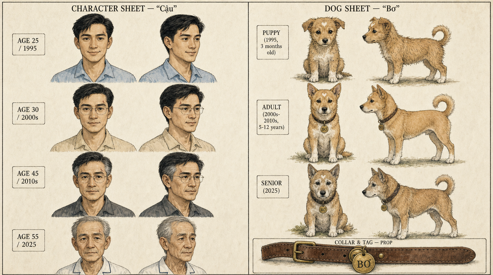

**F2 — Props Collection:**

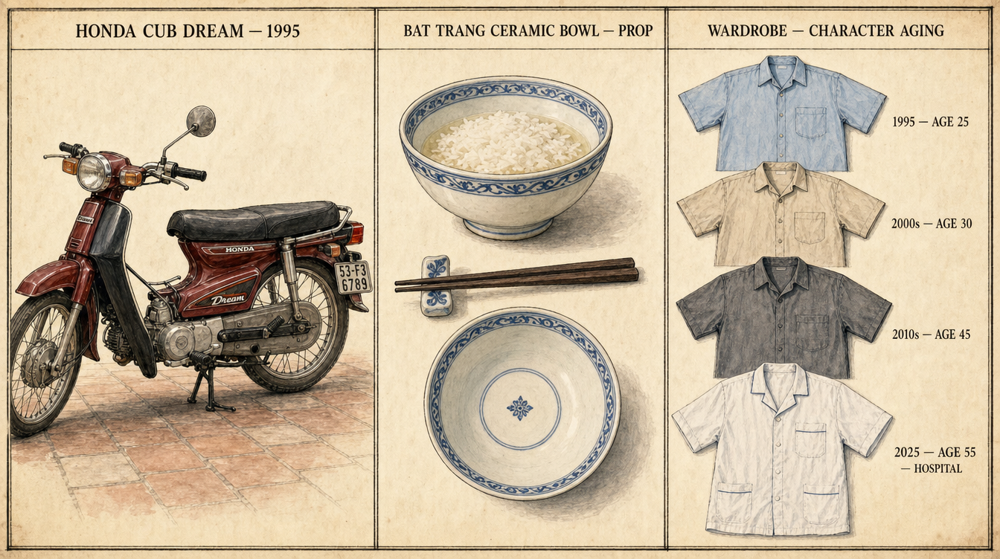

**F3 — Hooded Figure (VN-adapted, no skull/scythe):**

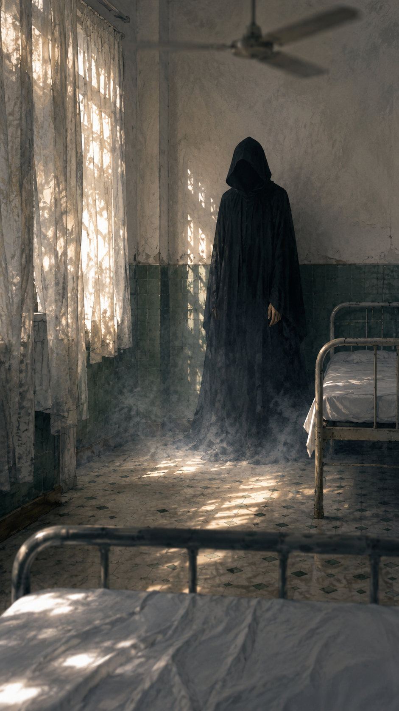

**Critical anchors phải có trong F1:**
- Cùng face structure 4 ages: mũi, mắt, hàm
- Aging visible: tóc đen → sương → bạc rụng đỉnh
- Áo color progression: xanh → be → xám → hospital trắng
- Bơ đốm tim trắng trán (xuyên 3 stages)
- Vòng cổ + tag "BƠ" macro inset

### Phase 2 — Storyboards (5 ảnh, ~25K VND)

| # | Storyboard | Panels | Ratio | Theme |
|---|---|---|---|---|
| S1 | Mưa & gặp gỡ | 4 (2×2) | 1:1 | Shots 1-4: 0-12s |
| S2 | Bữa cơm & bạn đồng hành | 5 (horizontal) | 16:9 | Shots 5-9: 12-27s |
| S3 | Time passes → Hospital | 4 (2×2) | 1:1 | Shots 10-13: 27-42s |
| S4 ⭐ | Memorable Moment | 4 (2×2) | 1:1 | Shots 14-17: 42-58s |
| S5 | Cõi vắng | 4 (2×2) | 1:1 | Shots 18-21: 58-70s |

**S1 — Mưa & gặp gỡ:**

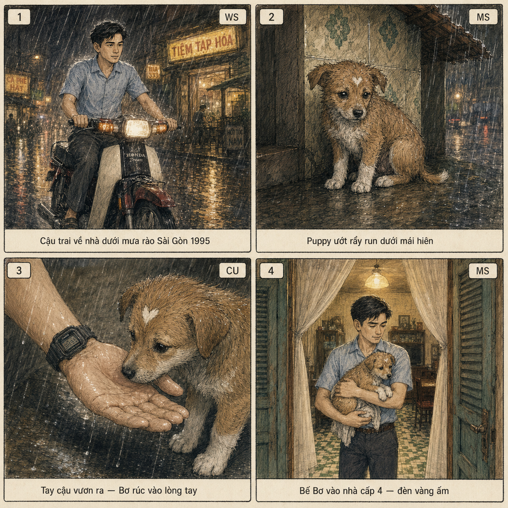

**S2 — Bữa cơm & bạn đồng hành (5 panels horizontal):**

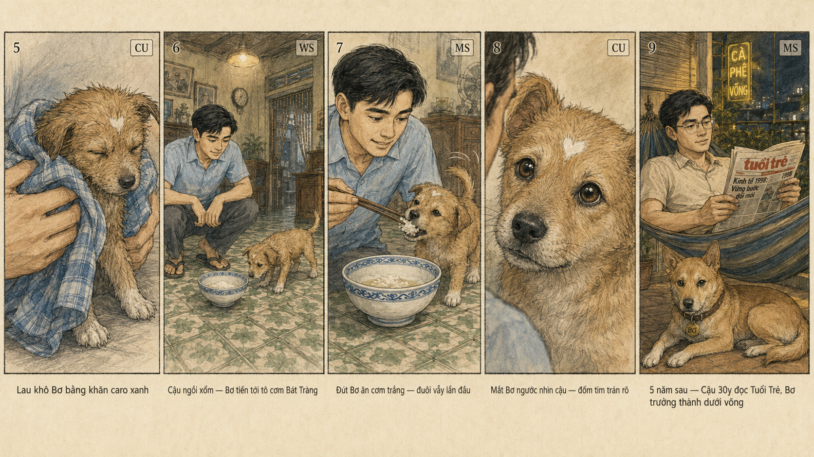

**S3 — Time passes → Hospital:**

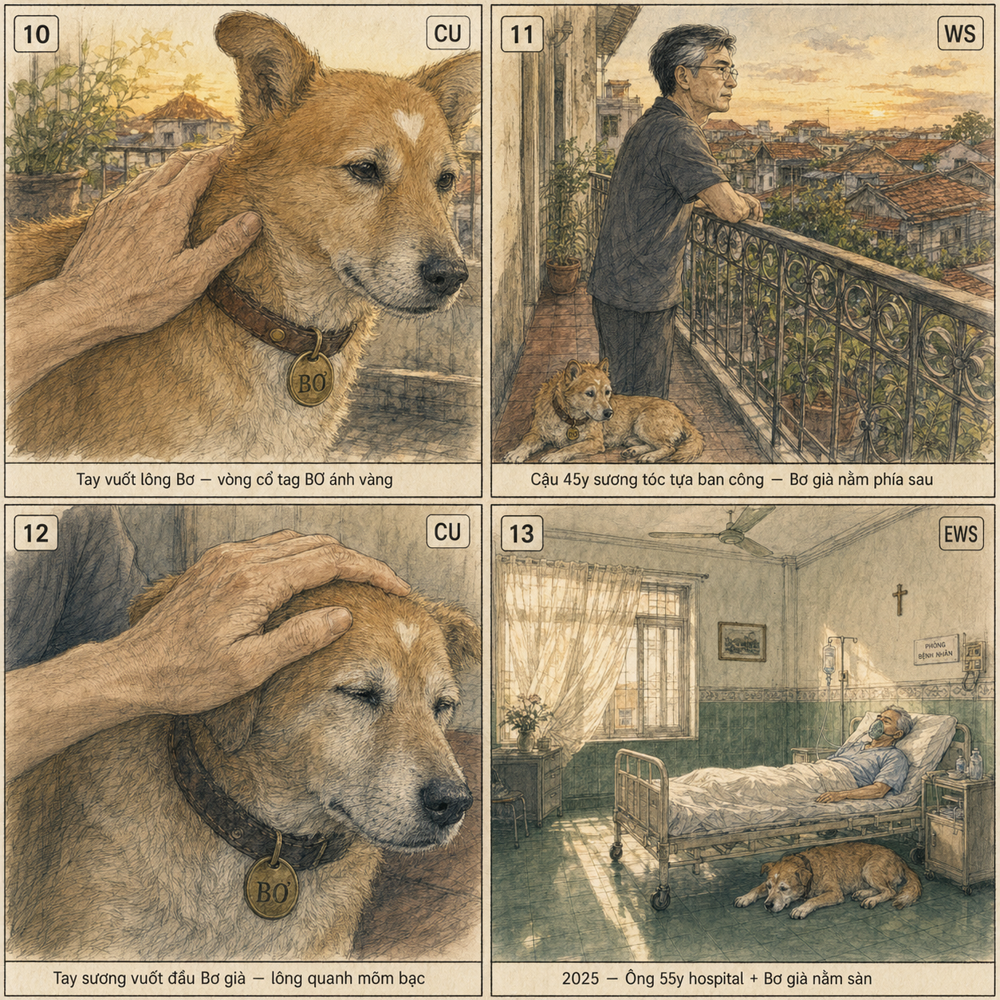

**S4 ⭐ Memorable Moment (panel 3 highlight):**

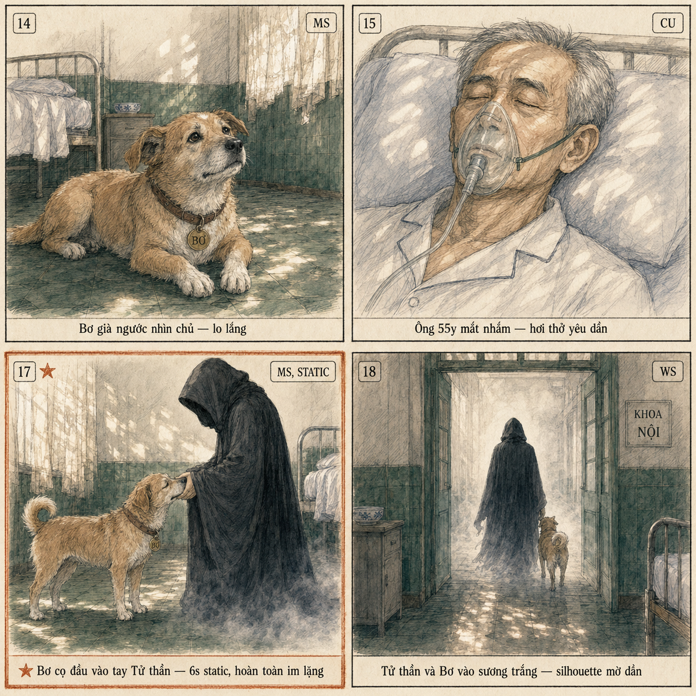

**S5 — Cõi vắng:**

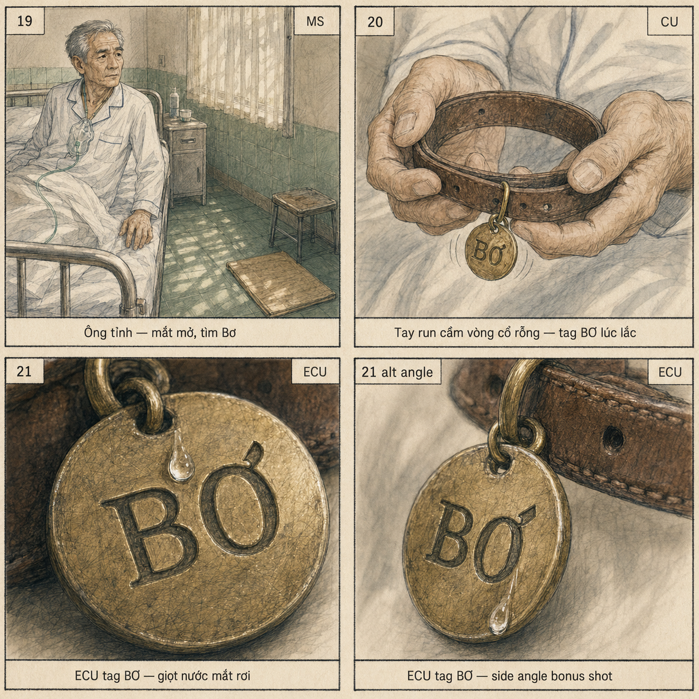

**Pattern verified Day 26:** Hand-drawn watercolor + grid layout + thin black borders + shot number/type/action labels. Image 2 hôm nay handle tốt Vietnamese diacritics trong labels.

**Recommend order tạo:** S4 ⭐ trước (test pattern Memorable Moment + Hooded Figure) → nếu pass thì batch S1, S2, S3, S5 song song trên 3-4 tab 0ai.vn.

### Phase 3 — Videos Path B (5 segments × 15s, ~85K VND)

⚠️ **Path A bypass:** Theo Insight 1, 0ai.vn cap duration 15s → Path A "single prompt 70s với 1 master sheet" KHÔNG khả thi. Pivot trực tiếp Path B 5 segments.

| Video | Duration cap | Refs | Notes |
|---|---|---|---|
| V1 | 15s | F1 + F2 + S1 | Mưa & gặp gỡ + bế vào nhà |
| V2 | 15s | F1 + S2 (DROP F2) | Bữa cơm + jump 30y |
| V3 | 15s | F1 + S3 | Time passes 45y → hospital |
| V4 ⭐ | 15s | F1 + F3 + S4 | Memorable Moment 6s static |
| V5 | 15s | F1 + S5 | Cõi vắng + tag final |

**V1 — Mưa & gặp gỡ (puppy adopt moment):**

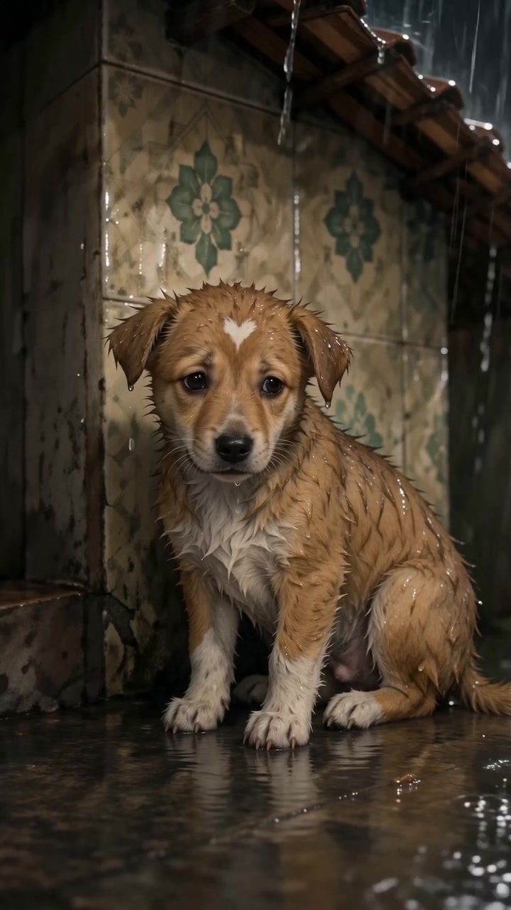

**V3 — Time passes (Cậu 45y ban công + Bơ già):**

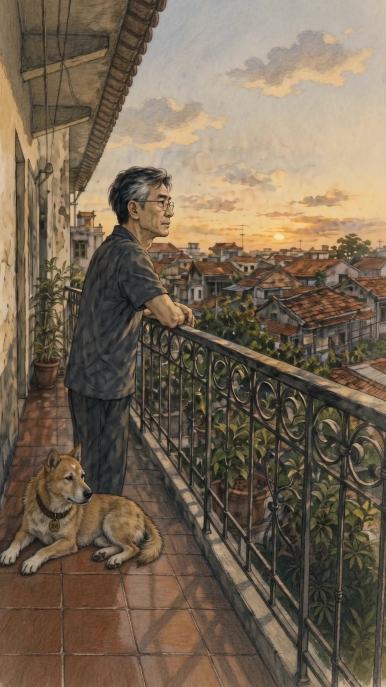

**V4 ⭐ — Memorable Moment (Bơ cọ tay Tử thần):**

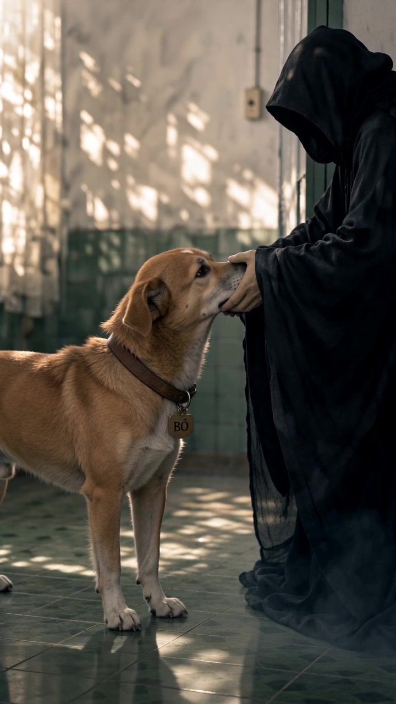

**V5 — Cõi vắng (tag "BƠ" + giọt nước mắt):**

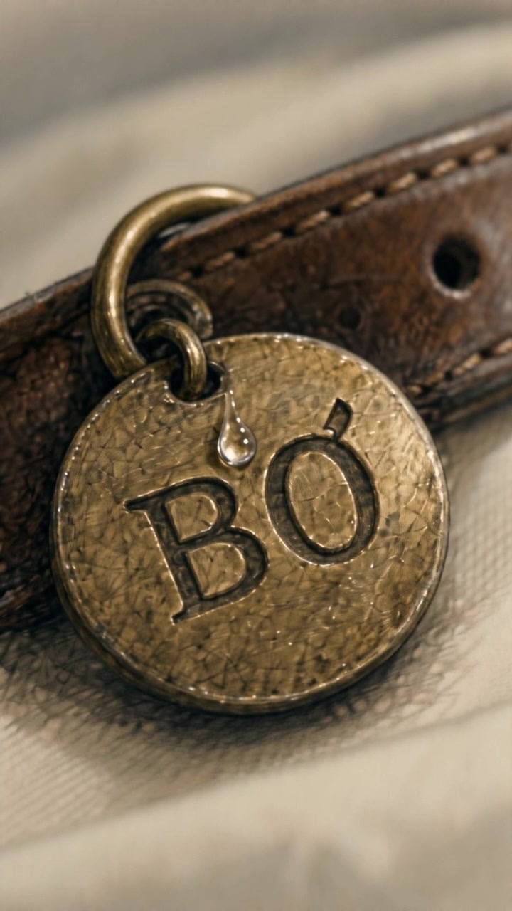

Tổng: 75s raw → cắt 1s/segment trong CapCut = **70s final**.

### Phase 4 — CapCut Edit (~30K VND tools + time)

**Workflow 8 bước:**

1. Import V1 → V2 → V3 → V4 → V5 theo order
2. Trim đầu/cuối lỗi từng segment (~1s mỗi cái)
3. Transitions:
   - V1 → V2: Crossfade nhẹ (rain → indoor)
   - V2 → V3: Match-cut time-jump
   - V3 → V4: Crossfade dài (era jump)
   - V4 → V5: Hard cut at silence
4. **Audio fix CRITICAL (Insight 8):**
   - Mute hoàn toàn 52-58s ⭐ (Memorable Moment 6s)
   - Fade-out 0.5s vào 52s
   - Fade-in 0.5s từ 58s
5. BGM piano cinematic (Yiruma / Einaudi style) cover toàn film, drop silence 52-58s
6. Color grade 2-era:
   - Segments V1-V3 (1995-2010s): Warm yellow LUT + film grain
   - Segments V4-V5 (2025): Cool blue-teal + dappled highlight
7. Text overlay tối thiểu:
   - "Sài Gòn, 1995" mở phim 1s
   - "Cậu và Bơ — 30 năm" final 3s
8. Export 1080×1920 9:16 · 30fps · ≥8 Mbps

---

## 📋 Story Bible compact

### Character — "Cậu" (Tâm)

| Age | Era | Đặc điểm visual |
|---|---|---|
| 25 | 1995 | Tóc đen 7-3, áo sơ mi xanh nhạt, đồng hồ Casio square, xe Honda Cub Dream đỏ-đen |
| 30 | 2000s | Kính metal-frame mỏng, áo sơ mi be, tóc mượt |
| 45 | 2010s | Sương tóc 2 bên thái dương + đỉnh đầu, áo xám đậm, kính kept |
| 55 | 2025 | Tóc bạc 80% rụng đỉnh, nếp nhăn sâu, áo hospital trắng |

### Dog — "Bơ" (chó cỏ VN)

| Stage | Era | Đặc điểm |
|---|---|---|
| Puppy | 1995 | 2-3 tháng, ướt nhẹp, lông cam wet, đốm tim trán |
| Adult | 2000s-2010s | Lông cam mượt + 4 chân trắng + tai V + vòng cổ da nâu + tag đồng "BƠ" |
| Senior | 2025 | Lông mõm bạc, body gầy hơn, vòng cổ darkened, tag "BƠ" same |

**3 anchors critical xuyên 21 shots:**
- Cậu: face structure consistent 4 ages
- Bơ: **đốm tim trắng nhỏ trên trán** (xuyên 3 stages)
- Prop: **vòng cổ da nâu + tag đồng khắc "BƠ"** (xuyên Shot 9 → Shot 21)

### Settings VN authentic

| Location | Era | Visual cues |
|---|---|---|
| Phố SG mưa rào | 1995 | Mái hiên gạch hoa + biển "TIỆM TẠP HÓA" + xích lô + xe Cub + neon vàng |
| Nhà cấp 4 SG | 1995 | Sàn gạch hoa xanh-trắng + tường vàng + đèn neon vàng + tủ vintage |
| Ban công SG vintage | 2000s-2010s | Lưới sắt hoa văn + võng vải + cây bàng + sunset mái ngói cũ |
| Hospital VN cũ | 2025 | Gạch men xanh dưới + trắng trên + quạt trần + rèm voan dappled + giường sắt yellowed |

**KHÔNG dùng:** Hospital LED modern · skyscraper Saigon modern · interior Tây · áo glamour fashion · Shiba Inu.

---

## 🎬 21 Shots Compact Reference

| # | Time | Type | Action |
|---|---|---|---|
| 1 | 0-3s | WS | Cậu 25y Honda Cub SG mưa |
| 2 | 3-5s | MS | Puppy ướt mái hiên |
| 3 | 5-7s | CU | Tay Casio + puppy rúc |
| 4 | 7-10s | MS | Bế vào nhà cấp 4 |
| 5 | 10-14s | CU | Lau khô khăn caro |
| 6 | 14-17s | WS | Cậu xổm tô Bát Tràng |
| 7 | 17-19s | MS | Đút Bơ ăn cơm |
| 8 | 19-22s | CU | Mắt Bơ ngước nhìn |
| 9 | 22-26s | MS | TIME JUMP — Cậu 30y võng + Bơ adult |
| 10 | 26-30s | CU | Tay vuốt lông Bơ + tag |
| 11 | 30-34s | WS | Cậu 45y ban công + Bơ già |
| 12 | 34-38s | CU | Tay sương vuốt Bơ |
| 13 | 38-42s | EWS | Hospital wide + Bơ sàn |
| 14 | 42-45s | MS | Bơ ngước lo lắng |
| 15 | 45-48s | CU | Ông 55y mặt nạ oxy |
| 16 | 48-52s | WS | Tử thần xuất hiện |
| 17 ⭐ | **52-58s** | **MS STATIC 6s** | **Bơ cọ tay Tử thần — silent** |
| 18 | 58-60s | WS | Silhouette vào sương |
| 19 | 60-64s | MS | Ông tỉnh tìm Bơ |
| 20 | 64-67s | CU | Tay run cầm collar |
| 21 | 67-70s | ECU | Tag "BƠ" + giọt nước mắt |

---

## 💰 Cost actual (đo bằng thực tế)

| Item | Số lượng | Cost |
|---|---|---|
| F1 Character + Dog sheet | 1 (1 lần generate ưng) | ~5K |
| F2 Props collection | 1 (1 lần ưng) | ~5K |
| F3 Hooded Figure | 1 (1 lần ưng) | ~7K |
| 5 storyboards (S1-S5) | 5 + 1 regen S3 (Bơ position fix) | ~25K |
| 5 videos (V1-V5) | 5 + 1 regen V3 (filter #c455) | ~95K |
| CapCut edit (free tool) | — | 0K |
| BGM piano cinematic license | — | 0K (royalty-free) |
| **TỔNG ACTUAL Day 27** | | **~140K VND** |

So Day 26: 76K cho 30s (2.5K/s). Day 27: 140K cho 70s (**2.0K/s** — giảm 20% cost per second).

**Lý do giảm cost:** Insight 4 — single F1 sheet dùng chung 5 segments, không cần character master mới mỗi cái như Day 26.

---

## ⚡ Bài tập thực hành

Các bạn chọn 1 trong 3 stories sau, thay context VN khác Sài Gòn:

| Story | Locations VN | Pet/Companion options |
|---|---|---|
| **A. Bà ngoại + cháu** 30 năm | Phố cổ Hà Nội / nhà gỗ Bắc Bộ | Mèo mướp / chó cỏ |
| **B. Mẹ + con trai** thanh xuân | Hội An / Huế cố đô | Cá / chim bồ câu |
| **C. Bộ đội + đồng đội/người dân** | Nông thôn miền Trung 1970s-2020s | Trâu / chó |

**Specs bắt buộc:**
- Duration: 60-75s (5 segments × 15s, cắt CapCut)
- Ratio: 9:16
- Multi-age character: ít nhất 3 ages (vd: 20 / 40 / 65)
- 2 cry-trigger moments: Memorable Moment ⭐ + Final ECU
- Compliance VN: không religious imagery, không violent death explicit
- Cost target: <200K VND

**Deliverable:**
- 1 video 60-75s
- 1 Master Reference Sheet (Character + Dog/pet 16:9)
- 1 file kịch bản markdown (story arc 8 chapters + 21 shots compact table)
- Cost actual breakdown

---

## ✅ Tiêu chí đạt bài

```
[ ] Story arc 8 chapters rõ (Setup → Confrontation → Resolution)
[ ] Multi-age character consistency tốt qua 3+ ages
[ ] Pet/companion identity carry-over xuyên suốt
[ ] 2 cry-trigger moments thiết kế chiến lược
[ ] Memorable Moment 6s static có drop silence audio (CapCut edit)
[ ] Final ECU emotional payoff (prop close-up + small visual cue)
[ ] Compliance VN: không trigger filter content
[ ] Color grade 2-era visible (warm past vs cool present)
[ ] Duration 60-75s ratio 9:16
[ ] Cost actual <200K VND
```

---

## ❌ Lỗi thường gặp + cách tránh

### Lỗi 1 — Filter #c455 block khi prompt detailed face + age
**Fix:** Soften age wording (descriptive thay numerical), bỏ ethnic descriptors repeat, trust reference image cho identity.

### Lỗi 2 — Text bleed từ storyboard vào video
**Fix:** Front-load "no readable text" + comprehensive avoid list (subtitle / sign / logo / newspaper). Drop reference sheets có text headers.

### Lỗi 3 — Duration cap 15s mà không biết
**Fix:** Plan từ đầu duration ÷ 15s = số segments. KHÔNG request 70s 1 video — sẽ ra 15s.

### Lỗi 4 — Memorable Moment KHÔNG silent
**Fix:** Edit CapCut MANUAL — drag mute volume 0 trong 6s ⭐. Seedance không respect "total silence" instruction.

### Lỗi 5 — Dog position vô lý vật lý
**Fix:** Specify explicit physics: "on the floor INSIDE the railing, NOT outside, NOT on distant rooftops". Image 2 cần explicit spatial relationships.

### Lỗi 6 — Background modern drift
**Fix:** Strong "vintage VN era specific" + double avoid "NO modern skyscrapers, NO LED lights, NO Bitexco". Era anchor in prompt.

### Lỗi 7 — Tag diacritic ơ vs ó render ambiguous
**Fix:** Specify "Vietnamese letter ơ with hook on upper-right of O, NOT acute accent". Accept ambiguity ở macro scale — audience đọc theo context.

### Lỗi 8 — Character drift giữa 2 ages khác nhau
**Fix:** F1 single sheet đa-age + storyboard cho specific transition. Reference cùng 1 image cho cả 2 ages.

---

## ➡️ Bài tiếp theo

Day 28 sẽ chuyển focus sang **Audio Production cho AI video** — vì Day 27 đã verify Seedance audio default không đủ tốt. Mình sẽ dạy:
- BGM cinematic cho 3 mood (sad / hopeful / suspense)
- SFX layering: rain / ambience / piano / heartbeat
- Voice-over Vietnamese narrative (sử dụng AI voice gen miễn phí)
- Audio mixing trong CapCut: balance, ducking, silence drop
- Music license free safe cho TikTok/Reels/YouTube

**Hẹn các bạn Day 28!**

---

## 📎 Files đính kèm Day 27

- [Master Reference Sheet — F1 Character + Dog](../assets/images/day-27-character-dog-sheet-combined.png)
- [Props Collection — F2](../assets/images/day-27-props-collection-honda-bowl-shirts.png)
- [Hooded Figure — F3](../assets/images/day-27-hooded-figure-silhouette-hospital.png)
- [Storyboard S1 — Mưa & gặp gỡ](../assets/images/day-27-storyboard-1-mua-gap-go-4-panels.png)
- [Storyboard S2 — Bữa cơm](../assets/images/day-27-storyboard-2-bua-com-ban-dong-hanh-5-panels.png)
- [Storyboard S3 — Time passes](../assets/images/day-27-storyboard-3-time-passes-hospital-4-panels.png)
- [Storyboard S4 ⭐ Memorable Moment](../assets/images/day-27-storyboard-4-memorable-moment-4-panels.png)
- [Storyboard S5 — Cõi vắng](../assets/images/day-27-storyboard-5-coi-vang-4-panels.png)
- [Video V1 — Mưa & gặp gỡ 12s](../assets/videos/day-27-video-1-mua-gap-go-12s.mp4)
- [Video V2 — Bữa cơm + jump 15s](../assets/videos/day-27-video-2-bua-com-ban-dong-hanh-15s.mp4)
- [Video V3 — Time passes 15s](../assets/videos/day-27-video-3-time-passes-hospital-15s.mp4)
- [Video V4 ⭐ Memorable Moment 15s](../assets/videos/day-27-video-4-memorable-moment-16s.mp4)
- [Video V5 — Cõi vắng 15s](../assets/videos/day-27-video-5-coi-vang-12s.mp4)
- [**Final film 70s** ⭐⭐](../assets/videos/day-27-cau-va-bo-70s.mp4)

---

*Day 27 hoàn thành — 15/05/2026 — Cinema-Style 70s Narrative "Cậu và Bơ — 30 năm Sài Gòn"*
*8 insights mới verified — Pipeline Path B (5 segments × 15s) — Cost actual 140K VND*
