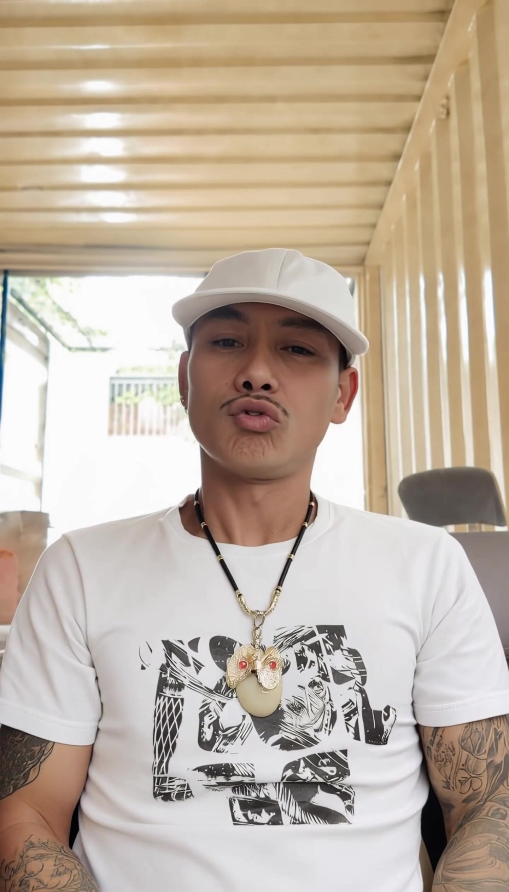
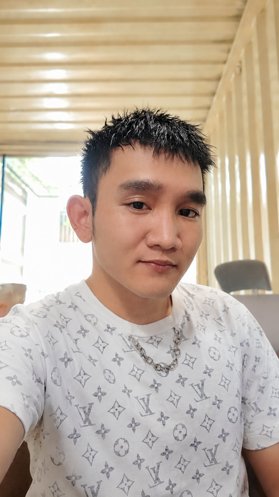
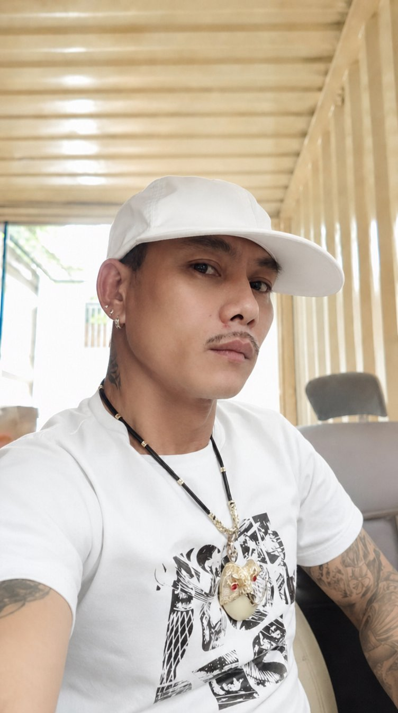
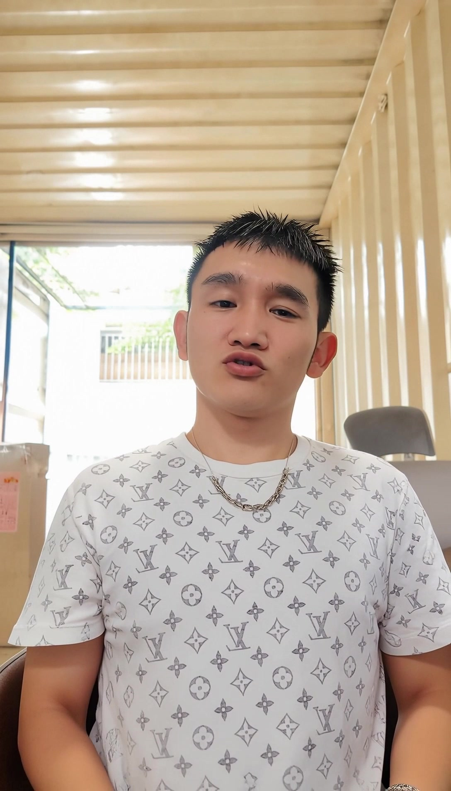
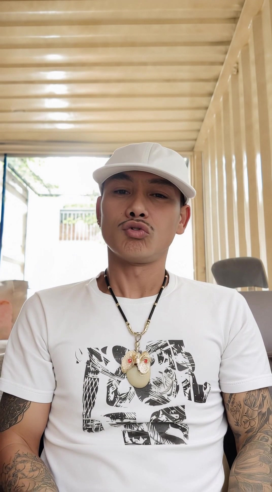

# Day 29 — Kling Motion 3.0: Thay nhân vật + sao chép chuyển động

[](https://github.com/linhai-creator/linh0ai-daily-tutorials/raw/main/assets/videos/day-29-video-3-capcut-final.mp4)

🎬 **[Tải video demo Day 29 — Kling Motion Character Replace (final 10s)](https://github.com/linhai-creator/linh0ai-daily-tutorials/raw/main/assets/videos/day-29-video-3-capcut-final.mp4)**

---

**[← Day 28: Tổng kết Tuần 4 + Mini Challenge "Video VN"](./day-28.md)** · **[📚 Mục lục](../README.md)** · **[Day 30: Kling Motion 3.0 Pet Content →](./day-30.md)**

> **Level:** 🟣 Advanced
> **Thời lượng đọc:** 15-20 phút
> **Thực hành:** 60-120 phút
> **Cost actual ước:** ~30-60K VND (1 ảnh + 1 video Kling Motion)

---

## 🎯 Mục tiêu bài học

Sau Day 29, các bạn sẽ biết cách:

- Dùng **Ảnh 1** làm bối cảnh, tư thế, ánh sáng và góc máy gốc
- Dùng **Ảnh 2** làm nhân vật cần thay vào ảnh mẫu
- Tạo **Ảnh 3**: nhân vật mới xuất hiện trong đúng bối cảnh và tư thế của ảnh mẫu
- Dùng **Video 1** làm video chuyển động gốc
- Dùng **Kling Motion 3.0** để tạo **Video 2**: nhân vật mới sao chép chuyển động từ video gốc
- Ghép/chỉnh lại bằng **CapCut** để tạo **Video 3** hoàn chỉnh

→ Workflow này cực kỳ valuable cho **UGC content · KOL AI · fashion · cosplay · viral re-creation**.

---

## 📖 Brief project

Mình demo workflow thay nhân vật A trong video gốc bằng nhân vật B — giữ nguyên identity nhân vật B (mặt, tóc, trang phục, phụ kiện) và sao chép motion (chuyển động, camera, tư thế) từ video gốc.

**Stack tools dùng:**

- 🎨 Image AI: **GPT Image 2** hoặc **NBN2** (trên 0ai.vn)
- 🎬 Video AI motion: **Kling Motion 3.0** (trên 0ai.vn)
- ✂️ Edit: **CapCut** (miễn phí)

---

## 📄 Prompt file

Prompt tạo ảnh tiếng Việt cho Bước 1 có trong file [day-29-prompts.txt](../prompts/day-29-prompts.txt).

> 💡 **Lưu ý:** Bước 3 (Kling Motion 3.0) **không cần prompt** — chỉ upload Ảnh 3 + Video motion gốc là chạy được.

---

## 🧠 Tư duy workflow

```text
Ảnh 1: Bối cảnh + tư thế gốc
+
Ảnh 2: Nhân vật cần thay
↓
[Step 1: GPT Image 2 / NBN2]
↓
Ảnh 3: Nhân vật mới khớp bối cảnh/tư thế ảnh mẫu

Ảnh 3
+
Video 1: Video chuyển động gốc
↓
[Step 2: Kling Motion 3.0]
↓
Video 2: Nhân vật mới sao chép chuyển động

Video 2
↓
[Step 3: CapCut edit]
↓
Video 3: Video hoàn thiện
```

---

## 📦 Tài nguyên bài học

| Tài nguyên | Vai trò |
|---|---|
| **Ảnh 1** | Ảnh mẫu gốc: bối cảnh, góc máy, ánh sáng, tư thế |
| **Ảnh 2** | Nhân vật cần thay vào ảnh mẫu |
| **Ảnh 3** | Ảnh kết quả sau khi thay nhân vật |
| **Video 1** | Video gốc có chuyển động cần sao chép |
| **Video 2** | Video tạo từ Kling Motion 3.0 |
| **Video 3** | Video hoàn thiện sau khi ghép/chỉnh trong CapCut |

---

## 🛠️ Bước 1 — Tạo ảnh nhân vật mới trên 0ai.vn

**Model khuyên dùng:**

- 🟪 **GPT Image 2** — ổn định, ít miss prompt
- 🟨 **Nano Banana 2** — đa dụng, hiểu tiếng Việt tốt

Mục tiêu của bước này là tạo một ảnh mới trong đó **nhân vật ở Ảnh 2 được thay vào bối cảnh Ảnh 1**, đồng thời **bắt chước tư thế của nhân vật trong Ảnh 1**.

### Ví dụ thực tế của mình

**Ảnh 1 — Bối cảnh + tư thế gốc (mình selfie trong quán container):**



**Ảnh 2 — Nhân vật cần thay vào (giữ identity: mặt, mũ, áo, dây chuyền, tattoo):**


**Ảnh 3 — Kết quả ghép (nhân vật Ảnh 2 vào bối cảnh Ảnh 1, tư thế selfie):**



→ Identity Ảnh 2 giữ được rất tốt: **mặt · mũ trắng · áo trắng có hoạ tiết · dây chuyền pendant · tattoo tay**. Bối cảnh chuyển từ trong xe (Ảnh 2) sang container quán (Ảnh 1). Ánh sáng đồng bộ tự nhiên.

### Prompt tạo ảnh (Tiếng Việt)

```text
Dùng Ảnh 1 làm bối cảnh chính, giữ nguyên background, ánh sáng, góc máy, màu sắc và bố cục. Dùng nhân vật ở Ảnh 2 để thay vào vị trí nhân vật trong Ảnh 1.

Giữ đúng khuôn mặt, tóc, thần thái, đặc điểm nhận dạng và trang phục gốc của nhân vật Ảnh 2. Không thay đổi kiểu quần áo, màu sắc chính, phụ kiện hoặc phong cách trang phục của nhân vật Ảnh 2.

Cho nhân vật Ảnh 2 bắt chước đúng tư thế nhân vật trong Ảnh 1: dáng đứng/ngồi, hướng mặt, vị trí tay chân, trọng tâm cơ thể, hướng nhìn và tỷ lệ trong khung hình.

Hòa trộn nhân vật thật tự nhiên với bối cảnh Ảnh 1: ánh sáng, bóng đổ, màu da, độ nét và phối cảnh phải đồng bộ. Chỉ điều chỉnh ánh sáng và màu tổng thể trên trang phục để phù hợp môi trường, không đổi thiết kế trang phục.

Kết quả giống ảnh thật chụp cùng lúc, cùng địa điểm, không có cảm giác cắt ghép.

Negative: không đổi background, không thêm người lạ, không đổi mặt, không đổi trang phục nhân vật Ảnh 2, không đổi phụ kiện, không méo tay, không méo mặt, không sai tỷ lệ, không viền cắt ghép, không ánh sáng lệch, không chữ, không logo, không watermark.
```

---

## ✅ Bước 2 — Kiểm tra ảnh trước khi đưa vào Kling Motion 3.0

Ảnh đạt yêu cầu khi:

- ✅ Nhân vật mới giống nhân vật ở Ảnh 2
- ✅ Bối cảnh giữ đúng tinh thần của Ảnh 1
- ✅ Tư thế gần giống nhân vật trong Ảnh 1
- ✅ Ánh sáng, màu da, bóng đổ và độ nét hòa hợp
- ✅ Trang phục/phụ kiện của nhân vật Ảnh 2 được giữ nguyên
- ✅ Không có cảm giác cắt ghép
- ✅ Tay, mặt, mắt, cổ, vai không bị méo

Nếu ảnh chưa đạt, nên tạo lại trước khi đưa sang Kling Motion. **Ảnh đầu vào càng sạch thì video đầu ra càng ổn** — đây là rule #1 của workflow này.

---

## 🎬 Bước 3 — Tạo video bằng Kling Motion 3.0

Trong Kling Motion 3.0, dùng:

- **Ảnh đầu vào:** Ảnh 3 vừa tạo
- **Video tham chiếu:** Video 1 có chuyển động gốc

### Ví dụ thực tế

**Video 1 — Motion reference (mình quay thật, nói chuyện 10s):**

[](https://github.com/linhai-creator/linh0ai-daily-tutorials/raw/main/assets/videos/day-29-video-1-motion-goc.mp4)

🎬 [Tải Video 1 — Motion gốc (10s)](https://github.com/linhai-creator/linh0ai-daily-tutorials/raw/main/assets/videos/day-29-video-1-motion-goc.mp4)

**Video 2 — Kling Motion 3.0 output (nhân vật Ảnh 3 sao chép motion + lipsync từ Video 1):**

[](https://github.com/linhai-creator/linh0ai-daily-tutorials/raw/main/assets/videos/day-29-video-2-kling-motion-output.mp4)

🎬 [Tải Video 2 — Kling Motion output (10s)](https://github.com/linhai-creator/linh0ai-daily-tutorials/raw/main/assets/videos/day-29-video-2-kling-motion-output.mp4)

→ Identity nhân vật Ảnh 2 giữ được: **mặt · mũ · áo · pendant · tattoo**. Motion + biểu cảm miệng (lipsync) copy từ Video 1 rất tự nhiên.

> 💡 **Kling Motion 3.0 không cần viết prompt** — chỉ cần upload Ảnh đầu vào + Video tham chiếu, model sẽ tự động sao chép motion. Đây là điểm khác biệt lớn so với Seedance (cần prompt chi tiết).

---

## 🔧 Bước 4 — Tips khi video bị lỗi

Vì Kling Motion 3.0 không có ô prompt, khi video output bị lỗi thì cách fix là **chọn lại input** chứ không phải tinh chỉnh text. Đây là 5 tình huống thường gặp:

### ❌ Nếu mặt bị méo hoặc không giống

- Tạo lại **Ảnh 3** với chất lượng cao hơn — mặt sharp, không blur
- Chọn motion video nhẹ hơn (ít nghiêng đầu, ít biểu cảm cường điệu)
- Đảm bảo Ảnh 2 có mặt rõ ràng, đủ ánh sáng, góc thẳng

### ❌ Nếu chuyển động quá mạnh

- Chọn motion video có chuyển động **nhẹ, chậm hơn**
- Tránh video dance / action — chọn video nói chuyện, đi đứng chậm

### ❌ Nếu nhân vật bị đổi trang phục

- Kiểm tra lại **Ảnh 3** — trang phục có rõ ràng, đầy đủ chi tiết không
- Tạo lại Ảnh 3 với prompt nhấn mạnh giữ outfit, accessories, hairstyle
- Tránh motion video có nhân vật mặc trang phục quá khác Ảnh 3 (vd: Ảnh 3 áo trắng nhưng motion video nhân vật áo đen)

### ❌ Nếu tay bị lỗi

- Chọn motion video có **tay đơn giản** — không vẫy tay phức tạp, không có gesture nhanh
- Tránh video có tay ra khỏi frame rồi vào lại

### ❌ Nếu camera bị lệch quá nhiều

- Chọn motion video có **composition giống Ảnh 3** — cùng góc máy (selfie/portrait/landscape), cùng khoảng cách shot
- Tránh motion video có camera movement mạnh (zoom in/out, pan/tilt) — Kling sẽ cố sao chép nhưng có thể làm méo nhân vật

---

## ✂️ Bước 5 — Hoàn thiện bằng CapCut

Sau khi có Video 2 từ Kling Motion 3.0:

1. Mở CapCut
2. Import Video 1, Video 2 và các file âm thanh nếu có
3. Cắt bỏ đoạn lỗi ở đầu/cuối video
4. Giữ đoạn chuyển động đẹp nhất
5. Chỉnh màu nhẹ để video đồng bộ hơn
6. Ghép thêm nhạc, hiệu ứng hoặc text nếu cần
7. Xuất video 1080p hoặc 2K

---

## 💎 5 Insights cho audience

| # | Insight | Detail |
|---|---|---|
| 1 | **Identity vs Motion trade-off** | Kling Motion 3.0 priority motion theo prompt. Khi motion mạnh → identity drift. Thêm "prioritize facial consistency" cứu được |
| 2 | **Ảnh đầu vào quyết định 70% chất lượng** | Ảnh 3 lỗi (mặt méo, ánh sáng lệch) → video output kém. Đầu tư time tạo Ảnh 3 chuẩn trước khi sang Kling |
| 3 | **Trang phục giữ nguyên cần explicit** | Default Kling tendency đổi trang phục khi motion phức tạp. Phải repeat "do not change outfit" trong prompt |
| 4 | **Motion reference video chọn thông minh** | Chọn video có motion vừa phải (không quá nhanh, không quá phức tạp tay). Video dance phức tạp → tay/mặt lỗi cao |
| 5 | **CapCut là final 20%** | Trim đầu/cuối + color grade + audio = critical. Đừng xuất bản video Kling raw |

---

## 💰 Cost actual ước tính

| Item | Quantity | Cost |
|---|---|---|
| Ảnh 3 generate (GPT Image 2 hoặc NBN2) | 1 + 1-2 regen | ~5-15K |
| Video Kling Motion 3.0 | 1 + 1-2 regen | ~25-50K |
| CapCut edit (free tool) | — | 0K |
| **TỔNG ƯỚC TÍNH** | | **~30-65K VND** |

→ Đây là pipeline **cost-efficient** cho UGC content creator — 1 video character-replace 5-10s chỉ ~50K VND.

---

## ⚡ Bài tập thực hành

| Level | Thử thách |
|---|---|
| 🟢 **Newbie** | Thay 1 nhân vật vào ảnh có sẵn, KHÔNG cần motion (chỉ làm Bước 1-2). Output: 1 ảnh nhân vật mới giống ảnh mẫu |
| 🔵 **Trung cấp** | Full workflow với 1 nhân vật + 1 motion video. Output: 1 clip 5-10s nhân vật mới sao chép motion |
| 🟣 **Pro** | Batch — thay **3 nhân vật khác nhau** vào cùng 1 motion video, ghép CapCut so sánh side-by-side. Output: 1 video 15-20s comparison |

---

## ⚠️ Lỗi thường gặp

| Lỗi | Nguyên nhân | Cách xử lý |
|---|---|---|
| Nhân vật không giống Ảnh 2 | Prompt chưa khóa identity đủ mạnh | Nhấn mạnh giữ mặt, tóc, trang phục, phụ kiện |
| Tư thế chưa giống Ảnh 1 | Model hiểu sai vai trò ảnh mẫu | Ghi rõ Ảnh 1 là pose/background reference |
| Video bị méo mặt | Motion quá mạnh | Thêm dòng ưu tiên facial consistency |
| Tay bị lỗi | Tay trong ảnh/video tham chiếu khó | Giảm chuyển động, chọn đoạn video tay ít phức tạp |
| Ánh sáng lệch | Ảnh 2 khác môi trường ảnh 1 quá nhiều | Tạo lại ảnh với yêu cầu đồng bộ ánh sáng mạnh hơn |
| Trang phục bị đổi | Kling default tendency đổi outfit | Repeat "do not change outfit" 2 lần trong prompt |
| Camera lệch quá | Motion video reference khác composition Ảnh 3 | Chọn motion video có framing similar |

---

## ✅ Checklist trước khi xuất bản

- [ ] Ảnh mới giữ đúng nhân vật ở Ảnh 2
- [ ] Bối cảnh vẫn giống Ảnh 1
- [ ] Tư thế nhân vật gần giống Ảnh 1
- [ ] Trang phục nhân vật Ảnh 2 không bị đổi
- [ ] Video Kling sao chép được chuyển động chính từ video gốc
- [ ] Mặt, tay, cơ thể không bị lỗi nặng
- [ ] Video cuối đã được cắt/chỉnh lại bằng CapCut
- [ ] Audio đã được mix balance (BGM + SFX nếu có)
- [ ] Export 1080p hoặc 2K, ratio phù hợp platform target

---

## 💡 Ứng dụng thực tế

Workflow này có thể dùng để:

- 🎬 Tạo video nhân vật mới từ video mẫu
- 📱 Làm content TikTok / Reels viral
- 🎭 Thay nhân vật vào bối cảnh có sẵn
- 👗 Làm video cosplay / fashion / lifestyle
- 💼 Tạo video quảng cáo cá nhân hoặc KOL AI
- 🔄 Tái sử dụng chuyển động từ video cũ để tạo nhân vật mới
- 📊 Re-create viral content với nhân vật riêng (vd: viral dance → nhân vật shop bạn)

---

## ⚖️ Lưu ý đạo đức và quyền sử dụng

Chỉ nên dùng workflow này với hình ảnh/video bạn có quyền sử dụng hoặc đã được sự đồng ý của nhân vật trong ảnh/video.

❌ **Không dùng để:**
- Mạo danh người khác
- Tạo nội dung lừa đảo
- Gây hiểu nhầm về danh tính
- Làm ảnh hưởng đến uy tín / hình ảnh người khác
- Tạo nội dung 18+ không có sự đồng ý

✅ **Use cases an toàn:**
- Tự thay mình vào video viral
- Thay nhân vật avatar tự tạo (không tồn tại thật)
- Thay mẫu shop của bạn (đã có sự đồng ý) vào content
- Cosplay nhân vật fictional (không phải celebrity thật)

---

## ➡️ Bài tiếp theo

Day 30 sẽ là **Kling Motion 3.0: Ghép động vật vào bối cảnh + Đổi dáng động vật theo người** — bài cuối khóa 30 ngày:

- **Dạng 1 — Giữ nguyên bối cảnh, thay động vật giống dáng người:** Thay nhân vật mẫu bằng động vật, giữ nguyên bối cảnh + góc máy + bố cục
- **Dạng 2 — Giữ nguyên bối cảnh động vật, đổi dáng theo người:** Động vật bắt chước pose nhân vật, giữ nguyên bối cảnh động vật
- Cùng stack Image 2 + Kling Motion 3.0 nhưng output khác hoàn toàn Day 29
- Use cases: pet shop ad · meme viral · TikTok pet content · pet portrait
- Wrap-up khóa 30 ngày + chấm Mini Challenge "Video VN" + roadmap khóa 31+

**Hẹn các bạn Day 30 — bài cuối của hành trình!**

---

**[← Day 28: Tổng kết Tuần 4 + Mini Challenge "Video VN"](./day-28.md)** · **[📚 Mục lục 30 ngày](../README.md)** · **[Day 30: Kling Motion 3.0 Pet Content →](./day-30.md)**

---

*Day 29 hoàn thành — Kling Motion 3.0 Character Replace · 16/05/2026*
