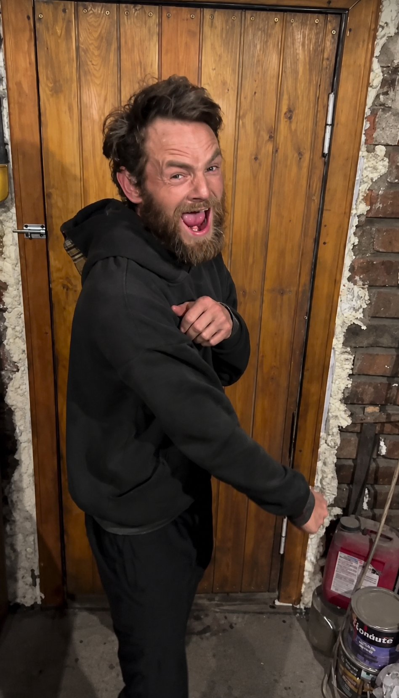
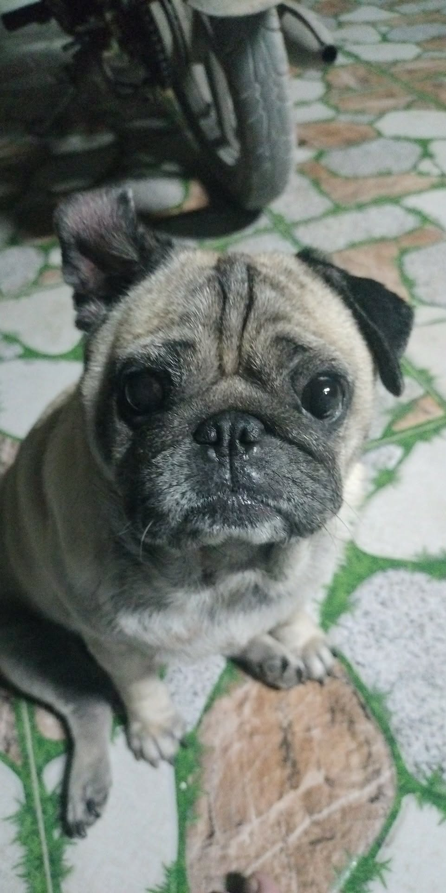
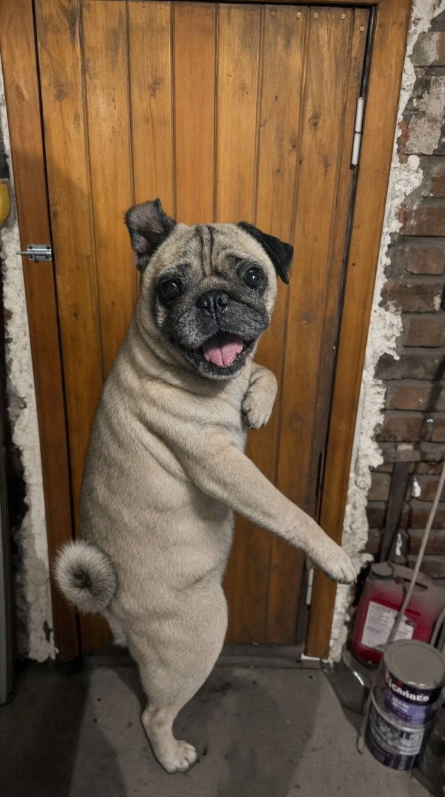
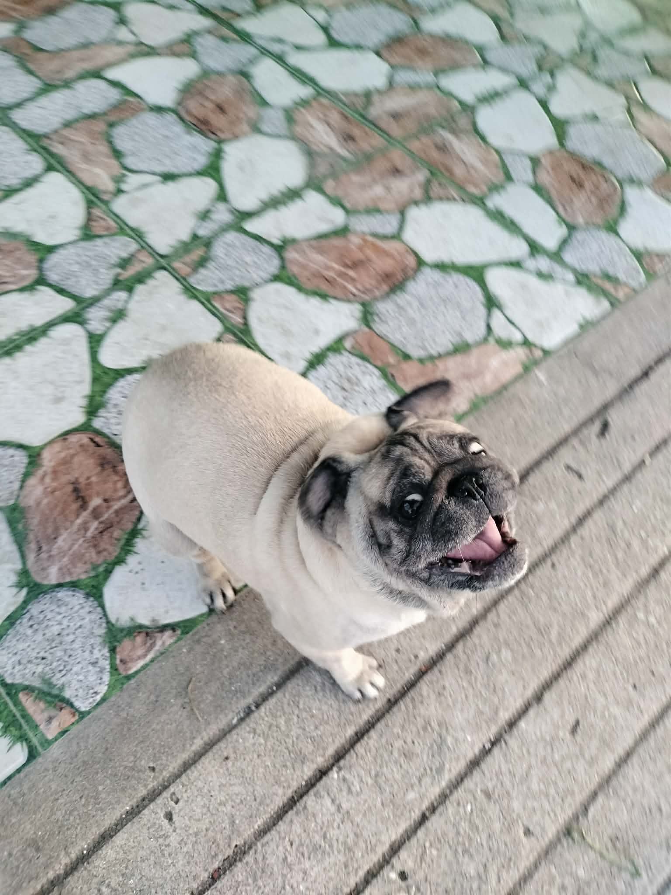
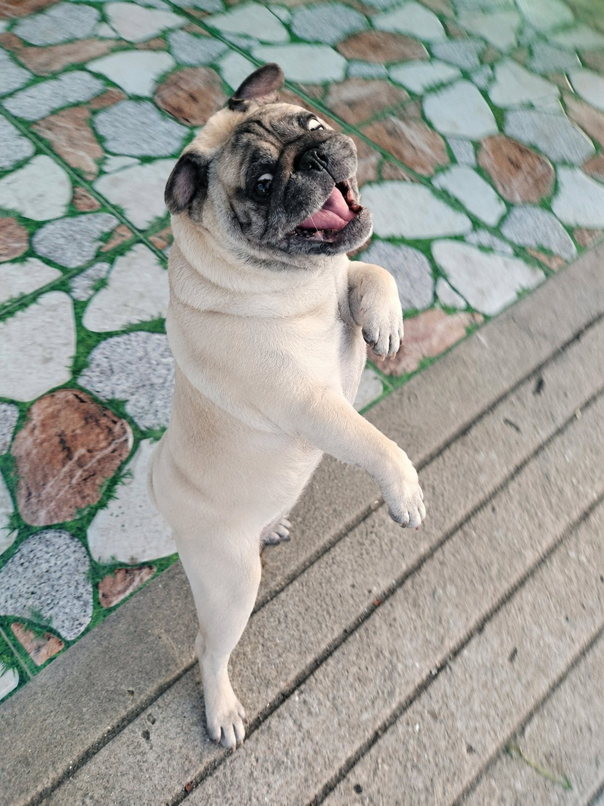
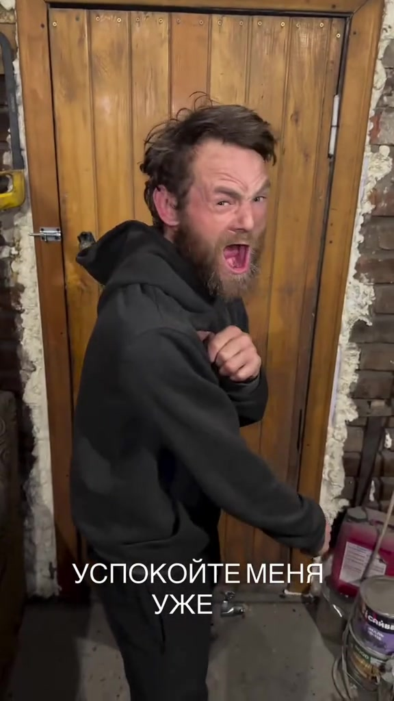
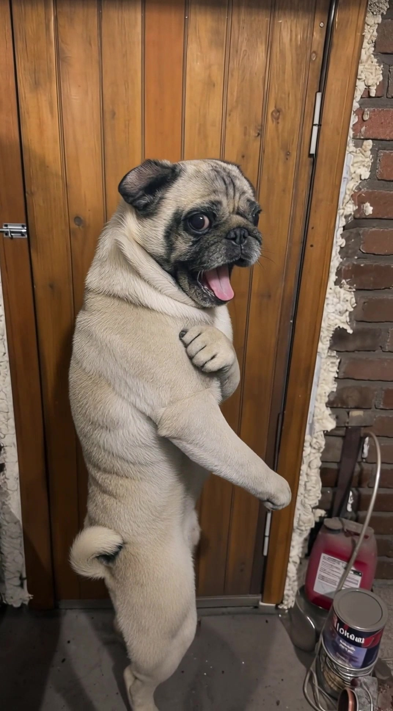

# Day 30 — Kling Motion 3.0: Ghép động vật vào bối cảnh + Đổi dáng động vật theo người (2 dạng workflow)

---

**[← Day 29: Kling Motion 3.0 Character Replace](./day-29.md)** · **[📚 Mục lục](../README.md)** · **🎉 Day 30 — Bài cuối khóa 30 ngày**

> **Level:** 🟣 Advanced
> **Thời lượng đọc:** 20 phút
> **Thực hành:** 90-180 phút (2 dạng workflow × 2 videos)
> **Cost actual ước:** ~60-130K VND (2 ảnh ghép + 2 video Kling Motion)

---

## 🎯 Mục tiêu bài học

Sau Day 30 — bài cuối của khóa 30 ngày — các bạn sẽ biết **2 dạng workflow ghép động vật** với cùng stack Image 2 + Kling Motion 3.0:

- **Dạng 1 — Giữ nguyên bối cảnh, thay động vật giống dáng người:** Thay nhân vật trong bối cảnh mẫu bằng động vật (giữ nguyên bối cảnh, góc máy, bố cục)
- **Dạng 2 — Giữ nguyên bối cảnh động vật, đổi dáng theo người:** Động vật trong ảnh của các bạn bắt chước pose của nhân vật mẫu (giữ nguyên bối cảnh động vật, chỉ đổi pose)

→ Workflow này **siêu valuable** cho creator pet content · pet shop ad · meme viral · TikTok shorts · story pet adoption.

---

## 📖 Brief project

Mình demo cùng stack Day 29 nhưng output khác hoàn toàn — thay vì character replace, hôm nay tập trung vào **pet content** với 2 dạng song song. Lý do tách 2 dạng: mỗi dạng có use case riêng và prompt khác nhau, audience cần biết cả 2 để pick đúng cho project của mình.

**Stack tools dùng:**

- 🎨 Image AI: **GPT Image 2** hoặc **Nano Banana 2** (trên 0ai.vn)
- 🎬 Video AI motion: **Kling Motion 3.0** (trên 0ai.vn)
- ✂️ Edit: **CapCut** (miễn phí)

---

## 📄 Prompt file

2 prompts tiếng Việt (Dạng 1 + Dạng 2) có trong file [day-30-prompts.txt](../prompts/day-30-prompts.txt).

> 💡 **Lưu ý:** Bước 3 (Kling Motion 3.0) **không cần prompt** — chỉ upload ảnh ghép + video motion là chạy được. Đây là pattern verified từ Day 29.

---

## 🧠 Tư duy workflow

### Dạng 1 — Giữ nguyên bối cảnh, thay động vật giống dáng người

```text
Ảnh 1: Bối cảnh + pose nhân vật mẫu
+
Ảnh 2: Động vật cần thay vào
↓
[Image 2 / NBN2 — Prompt Dạng 1]
↓
Ảnh ghép 1: Động vật xuất hiện trong bối cảnh Ảnh 1
                bắt chước pose nhân vật Ảnh 1
↓
[Kling Motion 3.0 + Video motion ref]
↓
Video 1: Động vật chuyển động trong bối cảnh người
```

### Dạng 2 — Giữ nguyên bối cảnh động vật, đổi dáng theo người

```text
Ảnh 1: Chỉ lấy POSE/DÁNG nhân vật (không lấy bối cảnh)
+
Ảnh 2: Động vật trong bối cảnh gốc của nó
↓
[Image 2 / NBN2 — Prompt Dạng 2]
↓
Ảnh ghép 2: Động vật giữ nguyên bối cảnh + identity của Ảnh 2
                nhưng đổi pose theo Ảnh 1
↓
[Kling Motion 3.0 + Video motion ref]
↓
Video 2: Động vật chuyển động trong bối cảnh động vật
```

---

## 📦 Tài nguyên bài học

| Tài nguyên | Vai trò |
|---|---|
| **Ảnh 1** | Ảnh người mẫu — cung cấp pose/dáng (và bối cảnh nếu Dạng 1) |
| **Ảnh 2** | Động vật cần ghép — cung cấp identity (loài, lông, mặt) |
| **Ảnh ghép 1** | Output Dạng 1 — động vật trong bối cảnh Ảnh 1 |
| **Ảnh ghép 2** | Output Dạng 2 — động vật giữ bối cảnh Ảnh 2 với pose mới |
| **Video motion** | Video reference cung cấp chuyển động cho Kling Motion |
| **Video 1** | Output Dạng 1 — Kling Motion từ Ảnh ghép 1 |
| **Video 2** | Output Dạng 2 — Kling Motion từ Ảnh ghép 2 |
| **Video final** | CapCut ghép 2 videos so sánh side-by-side |

---

## 🛠️ Bước 1A — Dạng 1: Giữ nguyên bối cảnh, thay động vật giống dáng người

**Model khuyên dùng:**

- 🟪 **GPT Image 2** — ổn định, ít miss prompt
- 🟨 **Nano Banana 2** — đa dụng, hiểu tiếng Việt tốt

### Mục đích Dạng 1

Tạo ảnh mới trong đó **động vật ở Ảnh 2 được đặt vào bối cảnh Ảnh 1**, bắt chước pose của nhân vật, có nhân hóa nhẹ.

**Use cases:**
- Pet shop ad: chó/mèo trong shop coffee
- Meme viral: chó "đi làm văn phòng"
- Story pet adoption: pet trong nhà mới
- Vlog pet creator: cùng pet, nhiều bối cảnh

### Ví dụ thực tế của mình ✅ Verified

**Ảnh 1 — Pose & bối cảnh tham chiếu** (anh tóc xù tạo dáng trước cửa gỗ + tường gạch):



**Ảnh 2 — Pet nguồn** (pug nhà mình, đang ngồi trên sàn đá cạnh xe máy — pose tự nhiên):



**Ảnh kết quả Dạng 1** (pug bắt chước pose anh tóc xù, đứng cùng cửa gỗ + paint cans):



→ Pug đã thay anh tóc xù vào **đúng bối cảnh cửa gỗ + tường gạch + paint cans**. Pose nhân hóa nhẹ (đứng 2 chân, há miệng cười, tai flop, chân trước reaching giống tay anh tóc xù). Identity pug giữ nguyên từ Ảnh 2: lông fawn, mặt đen, đuôi cuộn, mắt to.

### Prompt Dạng 1 (Tiếng Việt)

```text
Dùng Ảnh 1 làm bối cảnh, góc máy, bố cục và tư thế tham chiếu.
Dùng Ảnh 2 làm động vật cần thay vào.
Giữ nguyên bối cảnh, ánh sáng, màu sắc, góc máy, phối cảnh, bố cục và không gian của Ảnh 1.
Thay nhân vật/chủ thể trong Ảnh 1 bằng con vật trong Ảnh 2.
Giữ đúng nhận diện con vật ở Ảnh 2: loài, khuôn mặt, màu lông, pattern lông, tai, mắt, mũi, miệng, đuôi, vóc dáng và đặc điểm nổi bật riêng.
Tư thế của con vật phải bám theo tinh thần pose của nhân vật trong Ảnh 1: vị trí trong khung hình, hướng cơ thể, góc đầu, hướng nhìn, trọng tâm, biểu cảm và dáng tổng thể.
Cho phép nhân hoá nhẹ để con vật gần giống dáng nhân vật trong Ảnh 1 hơn, nhưng vẫn phải giữ hình thể động vật tự nhiên, hợp giải phẫu, không biến thành người hoàn toàn.

Trang phục:
Không lấy trang phục, phụ kiện, dây chuyền, áo, quần, mũ hoặc bất kỳ vật dụng nào của nhân vật trong Ảnh 1. Con vật trong Ảnh 2 phải giữ trạng thái gốc của nó. Nếu Ảnh 2 không có trang phục/phụ kiện thì con vật không mặc trang phục/phụ kiện. Nếu Ảnh 2 có phụ kiện thì chỉ giữ phụ kiện gốc của Ảnh 2.

Hòa trộn con vật tự nhiên với bối cảnh Ảnh 1: ánh sáng, bóng đổ, độ nét, màu sắc, tiếp xúc mặt đất/bề mặt và tỷ lệ kích thước phải khớp môi trường.

Negative:
không lấy áo/quần/phụ kiện từ Ảnh 1, không mặc trang phục của nhân vật Ảnh 1 cho con vật, không thêm dây chuyền, không thêm mũ, không thêm phụ kiện lạ, không đổi bối cảnh, không đổi loài, không đổi màu lông, không đổi pattern lông, không biến thành người, không lai người-thú quá mức, không thừa chân, không thiếu chân, không méo mặt, không méo thân, không pose gượng ép, không viền cắt ghép, không chữ, không logo, không watermark.
```

---

## 🛠️ Bước 1B — Dạng 2: Giữ nguyên bối cảnh động vật, đổi dáng theo người

### Mục đích Dạng 2

Tạo ảnh mới trong đó **động vật ở Ảnh 2 vẫn ở trong bối cảnh gốc của nó**, nhưng **đổi pose theo nhân vật Ảnh 1**. Chỉ lấy pose từ Ảnh 1, không lấy gì khác.

**Use cases:**
- Pet meme: chó nhà mình bắt chước pose Iron Man / CEO
- Pet portrait: mèo mình tạo dáng kiểu fashion
- Viral content: pet bắt chước nhân vật nổi tiếng
- Creative pet photoshoot: cùng pet, nhiều poses sáng tạo

### Ví dụ thực tế của mình ✅ Verified

Dùng **cùng pose reference** (anh tóc xù) như Dạng 1 → Ảnh 1 nhưng **Ảnh 2 khác**: lần này là pug đang **đứng 4 chân outdoor**:

**Ảnh 2 — Pet nguồn** (cùng pug nhà mình, nhưng đứng 4 chân trên sàn đá + sàn gỗ — bối cảnh outdoor):



**Ảnh kết quả Dạng 2** (pug đổi pose theo anh tóc xù nhưng vẫn ở bối cảnh outdoor của nó):



→ Pug đã đứng 2 chân, ngước lên, há miệng cười, 1 chân trước reaching ra — **đúng pose anh tóc xù từ Ảnh 1**. Nhưng bối cảnh là **sàn đá + sàn gỗ** (bối cảnh gốc của Ảnh 2, KHÔNG phải cửa gỗ). Identity pug giữ nguyên.

→ **Khác biệt với Dạng 1:** Dạng 1 = pet vào nhà người (bối cảnh Ảnh 1). Dạng 2 = pet vẫn ở nhà nó (bối cảnh Ảnh 2), chỉ đổi tư thế.

### Prompt Dạng 2 (Tiếng Việt)

```text
Dùng Ảnh 1 chỉ để tham chiếu pose/dáng đứng. Không lấy bối cảnh, khuôn mặt, trang phục, màu sắc hay ánh sáng từ Ảnh 1.
Dùng Ảnh 2 làm ảnh chính. Giữ nguyên bối cảnh, góc máy, ánh sáng, màu sắc, phối cảnh và không gian của Ảnh 2. Giữ đúng nhận diện con vật trong Ảnh 2 gồm: loài, khuôn mặt, màu lông, pattern lông, tai, mắt, mũi, thân hình và đuôi.

Yêu cầu quan trọng:
BẮT BUỘC thay đổi pose hiện tại của con vật trong Ảnh 2 để giống pose/dáng của nhân vật trong Ảnh 1. Không giữ pose cũ của con vật trong Ảnh 2.

Con vật phải bắt chước:
- hướng cơ thể
- góc đầu
- hướng nhìn
- trọng tâm cơ thể
- độ nghiêng thân
- vị trí chân trước/chân sau
- cảm giác biểu cảm
- framing trong khung hình

Cho phép nhân hoá nhẹ để pose giống hơn, nhưng vẫn phải giữ giải phẫu động vật tự nhiên, không biến thành người hoàn toàn.

Con vật vẫn phải hòa tự nhiên với bối cảnh của Ảnh 2:
- bóng đổ đúng hướng
- tỷ lệ cơ thể hợp lý
- tiếp xúc mặt đất tự nhiên
- ánh sáng đồng bộ
- lông rõ nét
- không cảm giác cắt ghép

Kết quả cuối cùng:
Giữ nguyên bối cảnh của Ảnh 2 nhưng con vật có pose mới giống rõ ràng với pose của nhân vật trong Ảnh 1.

Negative:
không giữ pose cũ của Ảnh 2, không lấy bối cảnh Ảnh 1, không đổi loài, không đổi màu lông, không sai pattern lông, không thừa chân, không thiếu chân, không méo mặt, không méo thân, không giải phẫu lỗi, không biến thành người hoàn toàn, không lai người-thú quá mức, không chữ, logo, watermark.
```

---

## 🔑 So sánh nhanh 2 dạng

| | **Dạng 1 — Giữ bối cảnh người, thay pet** | **Dạng 2 — Giữ bối cảnh pet, đổi pose** |
|---|---|---|
| **Ảnh chính** | Ảnh 1 (bối cảnh người) | Ảnh 2 (bối cảnh động vật) |
| **Ảnh phụ vai trò** | Ảnh 2 cung cấp identity con vật | Ảnh 1 chỉ cung cấp pose |
| **Background output** | Bối cảnh Ảnh 1 (người) | Bối cảnh Ảnh 2 (động vật) |
| **Pose con vật** | Bám theo nhân vật Ảnh 1 | Đổi theo nhân vật Ảnh 1 |
| **Trang phục** | KHÔNG lấy từ Ảnh 1 | Giữ gốc của con vật |
| **Use case chính** | Pet ad · pet shop · meme "chó đi làm" | Pet portrait · meme "chó bắt chước CEO" · viral content |

---

## ✅ Bước 2 — Kiểm tra ảnh ghép trước khi đưa vào Kling Motion 3.0

Ảnh đạt yêu cầu khi:

- ✅ Con vật giữ đúng identity Ảnh 2 (loài, mặt, lông, pattern)
- ✅ Pose đúng yêu cầu (Dạng 1 = pose Ảnh 1, Dạng 2 = pose Ảnh 1 trong bối cảnh Ảnh 2)
- ✅ Bối cảnh đúng (Dạng 1 = Ảnh 1, Dạng 2 = Ảnh 2)
- ✅ Ánh sáng, bóng đổ, độ nét tự nhiên hòa với môi trường
- ✅ Giải phẫu động vật natural — không thừa/thiếu chân, không biến thành người hoàn toàn
- ✅ Không lấy trang phục/phụ kiện sai vai trò
- ✅ Không có viền cắt ghép, watermark, text lạ

Nếu ảnh chưa đạt, tạo lại trước khi đưa sang Kling Motion. **Ảnh đầu vào càng sạch thì video đầu ra càng ổn**.

---

## 🎬 Bước 3 — Tạo video bằng Kling Motion 3.0

Kling Motion 3.0 **không cần prompt** — chỉ upload 2 input:

- **Ảnh đầu vào:** Ảnh ghép 1 (cho Dạng 1) hoặc Ảnh ghép 2 (cho Dạng 2)
- **Video tham chiếu:** Video có chuyển động muốn copy

→ Kling Motion 3.0 tự generate Video output.

### Ví dụ thực tế Dạng 1 ✅ Verified

**Video tham chiếu motion** (anh tóc xù nhảy/tạo dáng — video viral TikTok, mình chỉ dùng làm motion ref):

[](https://github.com/linhai-creator/linh0ai-daily-tutorials/raw/main/assets/videos/day-30-video-motion-ref.mp4)

🎬 [Tải Video tham chiếu motion gốc (8s)](https://github.com/linhai-creator/linh0ai-daily-tutorials/raw/main/assets/videos/day-30-video-motion-ref.mp4)

> 💡 Text Russian trên video là caption gốc từ TikTok — Kling Motion **chỉ copy motion**, không lấy text. Các bạn có thể dùng motion video bất kỳ ngôn ngữ nào.

**Video kết quả Dạng 1 — Kling Motion output** (pug từ Ảnh ghép 1 sao chép motion từ Video tham chiếu):

[](https://github.com/linhai-creator/linh0ai-daily-tutorials/raw/main/assets/videos/day-30-dang-1-video-kling-output.mp4)

🎬 [Tải Video Kling output Dạng 1 (8s)](https://github.com/linhai-creator/linh0ai-daily-tutorials/raw/main/assets/videos/day-30-dang-1-video-kling-output.mp4)

→ Pug đã copy đúng motion từ anh tóc xù: **đứng 2 chân, há miệng cười, vẫy chân trước, xoay người nhẹ**. Identity pug giữ nguyên (lông fawn, mặt đen, đuôi cuộn). Bối cảnh cửa gỗ + paint cans + tường gạch intact. Nhân hóa tự nhiên, không gượng ép.

### Lưu ý chọn motion video cho pet content

- ✅ Chọn motion **vừa phải** — đi đứng nhẹ, nhìn xung quanh, xoay đầu
- ✅ Motion video người **đi bộ chậm / ngồi nói chuyện / tạo dáng** work tốt nhất
- ❌ Tránh motion video **dance / action fast** — pet sẽ chuyển động unnatural
- ❌ Tránh motion video **tay vẫy nhiều** — pet không có tay đúng kiểu người

→ Mục tiêu: pet trông tự nhiên, không over-humanized.

---

## 🔧 Bước 4 — Tips khi video bị lỗi (không cần prompt)

Vì Kling Motion 3.0 không có ô prompt, fix lỗi = chọn lại input. 5 tình huống thường gặp với pet content:

### ❌ Pet trông over-humanized (đi 2 chân, vẫy tay người)

- Chọn motion video **đơn giản hơn** (ngồi, đứng, xoay đầu)
- Tạo lại Ảnh ghép với prompt nhấn mạnh "giải phẫu động vật tự nhiên"
- Tránh motion video người dance / action

### ❌ Identity con vật bị drift (mặt đổi, lông sai pattern)

- Tạo lại Ảnh ghép với chất lượng cao hơn
- Đảm bảo Ảnh 2 có mặt con vật rõ ràng, đủ sáng
- Chọn loài đơn giản trước (chó, mèo) — exotic species (vẹt, kỳ nhông) dễ lỗi

### ❌ Pet bị mất chân / thừa chân

- Chọn motion video có khung hình **rộng** — thấy đủ 4 chân
- Tránh motion video crop tight close-up
- Pet trong Ảnh ghép phải đủ thân hình visible

### ❌ Background bị méo / mất chi tiết

- Chọn motion video có background **đơn giản** hoặc gần giống Ảnh ghép
- Tránh motion video có camera movement mạnh (zoom in/out, pan)

### ❌ Pet sai loài (chó thành sói, mèo thành báo)

- Tạo lại Ảnh ghép với prompt nhấn mạnh "loài [chó nhà / mèo nhà]" specific
- Đảm bảo Ảnh 2 có pet rõ ràng — tránh ảnh blur/low-res

---

## ✂️ Bước 5 — Hoàn thiện bằng CapCut

Sau khi có Video 1 (Dạng 1) + Video 2 (Dạng 2) từ Kling Motion 3.0:

1. Mở CapCut
2. Import Video 1 + Video 2 + audio (BGM, SFX pet sound nếu có)
3. Cắt bỏ đoạn lỗi đầu/cuối từng video
4. **Layout split-screen** (tùy chọn): ghép Video 1 + Video 2 song song để audience so sánh 2 dạng
5. Color grade nhẹ để 2 videos đồng bộ tone
6. Add BGM upbeat / cute (free royalty cho pet content)
7. Add text overlay: "Dạng 1 — Giữ bối cảnh, thay động vật" + "Dạng 2 — Giữ bối cảnh động vật, đổi dáng"
8. Export 1080p ratio 9:16 (TikTok/Reels) hoặc 16:9 (YouTube)

---

## 💎 5 Insights cho audience

| # | Insight | Detail |
|---|---|---|
| 1 | **Anatomy vs Pose trade-off** | Pet bắt chước pose người dễ over-humanized (đi 2 chân không tự nhiên). Prompt phải explicit "giải phẫu động vật tự nhiên" + chọn motion video phù hợp loài |
| 2 | **Dạng 1 vs Dạng 2: ai là Ảnh chính quyết định output** | Dạng 1 = Ảnh 1 chính → background người · Dạng 2 = Ảnh 2 chính → background pet. Hiểu sai vai trò → output sai hoàn toàn |
| 3 | **KHÔNG lấy trang phục từ ảnh người** | Default model tendency: chó/mèo mặc áo người. Phải explicit "không lấy trang phục/phụ kiện Ảnh 1" trong negative prompt |
| 4 | **Pattern lông là identity marker quan trọng** | Mèo tabby vs solid · chó đốm vs trơn — pattern dễ bị drift khi pose nhân hóa. Prompt phải repeat "giữ pattern lông" |
| 5 | **Motion video chọn theo loài** | Chó motion `đi bộ + vẫy đuôi` natural · mèo motion `ngồi + xoay đầu` natural · Tránh dance video cho pet → unnatural |

---

## 💰 Cost actual ước tính

| Item | Quantity | Cost |
|---|---|---|
| Ảnh ghép 1 (Dạng 1) — GPT Image 2 / NBN2 | 1 + 1-2 regen | ~5-15K |
| Ảnh ghép 2 (Dạng 2) — GPT Image 2 / NBN2 | 1 + 1-2 regen | ~5-15K |
| Video 1 Kling Motion (Dạng 1) | 1 + 1-2 regen | ~25-50K |
| Video 2 Kling Motion (Dạng 2) | 1 + 1-2 regen | ~25-50K |
| CapCut edit | — | 0K |
| **TỔNG ƯỚC TÍNH** | | **~60-130K VND** |

→ Cost cao hơn Day 29 (~2x) vì làm 2 dạng song song. Nếu chỉ làm 1 dạng, cost = Day 29.

---

## ⚡ Bài tập thực hành

| Level | Thử thách |
|---|---|
| 🟢 **Newbie** | Chỉ làm **Dạng 1**: ghép 1 con vật vào bối cảnh người (chỉ Bước 1A — không cần Kling). Output: 1 ảnh ghép tự nhiên |
| 🔵 **Trung cấp** | Full Dạng 1: Ảnh ghép 1 + Kling Motion = Video 1 (5-10s). Use case ví dụ: chó đi cà phê |
| 🟣 **Pro** | **Cả 2 dạng** + CapCut split-screen so sánh. Output: 1 video 10-20s show cả 2 workflows pet content |

→ Submit lên Zalo group với hashtag `#Day30PetContent` để được mention trong recap cộng đồng.

---

## ⚠️ Lỗi thường gặp

| Lỗi | Nguyên nhân | Cách xử lý |
|---|---|---|
| Pet mặc áo người | Prompt chưa khóa "không lấy trang phục Ảnh 1" | Repeat 2 lần trong prompt + negative cụ thể |
| Pet đi 2 chân (over-humanized) | Pose Ảnh 1 quá "human-only" (đứng thẳng tay vẫy) | Chọn pose Ảnh 1 mà chó/mèo có thể bắt chước (ngồi, nằm, nhìn lên) |
| Lông sai pattern | Prompt thiếu nhấn mạnh pattern | Add "giữ pattern lông [đốm/sọc/solid]" cụ thể |
| Sai loài (chó → sói) | Ảnh 2 blur hoặc loài hiếm | Dùng ảnh pet sharp, loài phổ biến (chó nhà, mèo nhà) |
| Background Dạng 2 bị méo | Motion video có background phức tạp khác Ảnh 2 | Chọn motion video background đơn giản |
| Tỷ lệ pet không khớp bối cảnh | Pet quá to/quá nhỏ so với bối cảnh người | Add "tỷ lệ kích thước khớp môi trường" trong prompt |
| Tay/chân pet bị lỗi | Motion video phức tạp tay | Chọn motion ít gesture tay |

---

## ✅ Checklist trước khi xuất bản

- [ ] Ảnh ghép 1 (Dạng 1): pet trong bối cảnh Ảnh 1, pose nhân vật, giữ identity Ảnh 2
- [ ] Ảnh ghép 2 (Dạng 2): pet giữ bối cảnh Ảnh 2, pose mới theo Ảnh 1
- [ ] Pet không mặc trang phục người (trừ phụ kiện gốc Ảnh 2)
- [ ] Giải phẫu pet tự nhiên — không thừa/thiếu chân, không biến thành người
- [ ] Pattern lông + màu lông đúng Ảnh 2
- [ ] Video 1 + Video 2 motion smooth, identity ổn định
- [ ] CapCut edit: trim · color grade · BGM · text overlay
- [ ] Export 1080p hoặc 2K, ratio phù hợp platform

---

## 💡 Use cases pet content viral

Workflow Day 30 áp dụng cho:

- 🐕 **Pet shop ad** — chó/mèo trong shop/coffee shop (Dạng 1)
- 🎬 **Meme viral** — pet bắt chước CEO/idol pose (Dạng 2)
- 📸 **Pet portrait nghệ thuật** — pet tạo dáng fashion magazine (Dạng 2)
- 📱 **TikTok pet content** — split-screen show cả 2 dạng (combo)
- ❤️ **Pet adoption story** — pet từ shelter (Ảnh 2) đến nhà mới (Dạng 1)
- 🎁 **Pet gift cho khách** — pet shop nhận order custom portrait
- 🛍️ **Pet accessories e-commerce** — show pet wearing pet products (Dạng 1)
- 🎉 **Birthday card pet** — pet tạo dáng cute cho ảnh thiệp (Dạng 2)

---

## ⚖️ Lưu ý đạo đức và quyền sử dụng

Pet content ít concern hơn character replace, nhưng vẫn có một số rule:

✅ **OK:**
- Pet của các bạn / pet bạn có quyền dùng ảnh
- Animal stock photos (royalty-free từ Pixabay, Unsplash)
- Pet shop với sự đồng ý của chủ
- Pet meme từ celebrity pets (verify quyền chia sẻ)

❌ **KHÔNG nên:**
- Lấy ảnh pet người khác mà không có sự đồng ý
- Tạo content phỉ báng / chế nhạo pet
- Lạm dụng pet image để lừa đảo (vd: fake pet adoption)
- Tạo cảnh động vật bị tổn thương / bị bạo lực

---

## 🎉 Cảm ơn các bạn — kết thúc khóa 30 ngày

Day 30 là **bài cuối** của khóa **Linh0AI — 30 ngày làm chủ AI tạo ảnh & video trên 0ai.vn**.

### 📊 Stats khóa học 30 ngày

- **250+ ảnh** AI tạo (chân dung · phong cảnh · sản phẩm · áo dài VN · character sheets · storyboards)
- **10+ video** AI (commercial trailer · cinema narrative · character replace · pet content)
- **35+ insights verified** — bí kíp từ test thực tế bằng tiền túi
- **Cost actual:** ~250-500K VND tổng khóa
- **3 Mini Challenges:** Phong cảnh VN · Cảnh phim VN · Video VN

### 🏆 Mini Challenge #3 "Video Việt Nam" — chấm hôm nay

Deadline submit Mini Challenge "Video Việt Nam" từ Day 28 đã đến — hôm nay mình sẽ review và pick **Top 3 work** mention spotlight trên Facebook Linh0AI + nhóm Zalo cộng đồng.

→ Xem brief đầy đủ trong [Day 28](./day-28.md).

### 💎 Top 5 tips không có ở tutorial nào khác (bí kíp pro)

1. **0ai.vn Seedance cap = 15s/segment** — plan duration ÷ 15 = số segments cần
2. **Filter #c455 trigger pattern** — multi-age + ethnic descriptors block. Mitigation: descriptive aging words
3. **Single character sheet multi-age** — 1 ảnh cho 5 segments, giảm 50% cost
4. **Kling Motion 3.0 không cần prompt** — chỉ 2 input (ảnh + video ref), khác Seedance hoàn toàn
5. **CapCut là final 20%** — silence drops, color grade 2-era, BGM mix = critical cho cinema feel

### 🚀 Sau khóa 30 ngày — Khóa 31+ tiềm năng

Nếu cộng đồng vote tiếp, mình sẽ làm khóa 31-60 với 3 modules nâng cao:

| Module | Topic chính |
|---|---|
| 🎵 **Audio Production** | BGM cinematic · SFX layering · Voice-over Việt · Silence drops cho cry-trigger |
| 📱 **Distribution & Multi-Platform** | Adapt 9:16 / 16:9 / 1:1 · Hook A/B testing · Platform-specific algorithms |
| 💰 **Monetization & Creator Economy** | Freelance gig AI content · Build agency · Brand partnership · Creator fund |

→ **Comment vào nhóm Zalo / Facebook Linh0AI nếu muốn khóa 31+** — mình quyết định dựa vào demand thực tế.

### 🎁 Lời cảm ơn

Cảm ơn các bạn đã đồng hành cùng mình suốt 30 ngày. Mỗi insight, mỗi bài học, mỗi đồng credit mình chi đều là **tiền túi thật** — không sponsor, không quảng cáo trá hình.

Hành trình AI của các bạn mới chỉ bắt đầu. Mình mong gặp lại các bạn ở khóa tiếp theo, hoặc đơn giản là thấy work của các bạn lên trend! 🚀

---

**[← Day 29: Kling Motion 3.0 Character Replace](./day-29.md)** · **[📚 Mục lục 30 ngày](../README.md)** · **🎉 Day 30 — Bài cuối khóa**

---

*Day 30 hoàn thành — Kling Motion 3.0 Pet Content (2 dạng workflow) · 16/05/2026*
*Khóa Linh0AI 30 ngày — Hành trình hoàn thành 🎉*
